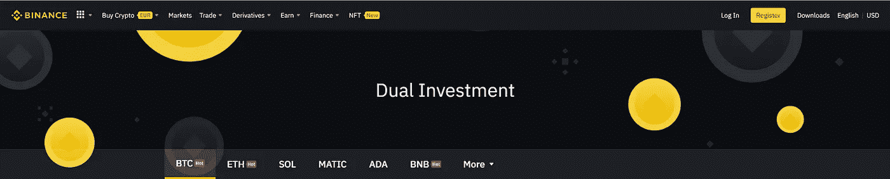

# 币安的双重投资:高达 100%的复利解决方案

> 原文：<https://medium.com/coinmonks/dual-investment-in-binance-compound-interest-solution-up-to-100-b2ede8640a2e?source=collection_archive---------19----------------------->

在加密市场有一个横向趋势，投资者通常在寻找机会优化他们的钱，并有现金流来兑现他们的硬币。所以，今天，我将介绍一个新的解决方案，当比特币在币安横向波动时，你可以使用它。这叫做双重投资。具体是怎样的？来看看这个帖子吧。

Dual Investment

# 币安的双重投资是什么？

## 概念

[双重投资](https://www.binance.com/en/dual-investment)几乎类似于期权合约。感谢对币安的双重投资，无论我们处于上升趋势还是下降趋势，你仍然可以在加密市场获利。

特别是:

币安的双重投资将有两种类型的产品:(1)高卖和(2)低买。

## 需要了解的术语

*   **交付日期:**您收到您的密码及利息的日期。
*   **执行价格:**固定价格决定了你将被支付的货币。
*   **结算价:**到期日上午 08:00(UTC)基础资产的现货价格
*   **%**

# 加盟策略

在这种投资方法中，我们将有两种选择。高卖低买。

*   “高卖”策略:投资者要有 BTC、ETH、SOL、AVAX、 [BNB](https://thelayer.xyz/what-is-binance-coin-bnb-all-you-need-to-know/) 等。
*   “低买”策略:投资者应该有稳定的硬币，如 USDT，BUSD。

1.  **关于“高价销售”策略:**

*   如果支付价格≥执行价格，你的产品将继续。
*   如果付款价格< the Exercise price.

2\. **与“低买”策略有关:**，您的产品将无法继续销售

*   如果支付价格≤执行价格，你的产品将继续销售。
*   如果支付价格高于执行价格，你的产品将无法继续销售。

## 例如

**例 1:**

A 先生以“高卖”策略将 1 BTC 投入双重投资。

*   **BTC**价格:30.000 美元；
*   **期限** : 30 天；
*   **APY%** : 40%
*   行使价格:40.000 美元

**到期时，A 先生会有两个结果:**

> 计算公式:(认购金额+执行价格)* [1 + (APY% *存款天数/365)]

*   **案例 1:BTC 的价格高于 40.000 美元**

BUSD 估计 A 先生将收到 1 BTC + 40% APY = 41.435 BUSD。

> 公式:1 * 40.000 *[1+(40% * 30/365)]= 41.435(BUSD)

*   **案例 2:BTC 的价格低于 40.000 美元**

A 先生将得到 1 BTC + 40% APY = 1.03288 BTC

> 公式:1 BTC *[1+(40% * 30/365)]= 1.03288(BTC)

*   **风险**

**例二:**

A 先生以“低买”策略投入 100 BUSD 进行双重投资。

*   **BTC**价格:30.000 美元；
*   **期限** : 30 天；
*   **APY%** : 40%
*   **行权价格** : 20.000 美元

**到期时，A 先生会有两个结果:**

> 计算公式:(认购金额+执行价格)* [1 + (APY% *存款天数/365)]

*   **案例 1:BTC 的价格高于 20.000 美元**

A 先生将获得 100 BUSD + 40% APY = 104 (BUSD)

> 公式:1 * 100 *[1+(40% * 30/365)]= 104(BUSD)

*   **案例 2:BTC 的价格低于 20.000 美元**

A 先生将获得 100 BUSD+ 40% APY = 0.0052 BTC

> 公式:100/20.000 *[1+(40% * 30/365)]= 0.0052(BTC)

*   **风险**

## **结果**

*   如果你的指令被执行= >，如果价格强劲快速地上涨，你会亏损，但你仍然有一点利益，可能来自赌注等。
*   你的命令不执行= >，你的资金就有保证，你就有收益。

# 热门问题

*   执行价格和 APY 是固定的吗？

执行价格是固定的。

APY 根据执行的价格不断变化；剩下的日子。

*   **注册后可以取消或撤回吗？**

不，你不能。

# **结论**

双重投资是优化资本的绝佳策略。然而，只有当市场处于横盘趋势时，才最好使用这种策略。

以上就是**币安双投:复利解高达 100%** 。如果你对我有任何问题，请在本帖下方评论；我会为你写下他们。别忘了跟随我的媒介。祝你投资之旅成功。

> *加入 Coinmonks* [*电报频道*](https://t.me/coincodecap) *和* [*Youtube 频道*](https://www.youtube.com/c/coinmonks/videos) *了解加密交易和投资*

# 另外，阅读

*   [有哪些交易信号？](https://coincodecap.com/trading-signal) | [Bitstamp vs 比特币基地](https://coincodecap.com/bitstamp-coinbase) | [买索拉纳](https://coincodecap.com/buy-solana)
*   [ProfitFarmers 回顾](https://coincodecap.com/profitfarmers-review) | [如何使用 Cornix 交易机器人](https://coincodecap.com/cornix-trading-bot)
*   [十大最佳加密货币博客](https://coincodecap.com/best-cryptocurrency-blogs) | [YouHodler 评论](https://coincodecap.com/youhodler-review)
*   [MyConstant Review](https://coincodecap.com/myconstant-review) | [8 款最佳摇摆交易机器人](https://coincodecap.com/best-swing-trading-bots)
*   [MXC 交易所评论](/coinmonks/mxc-exchange-review-3af0ec1cba8c) | [Pionex vs 币安](https://coincodecap.com/pionex-vs-binance) | [Pionex 套利机器人](https://coincodecap.com/pionex-arbitrage-bot)