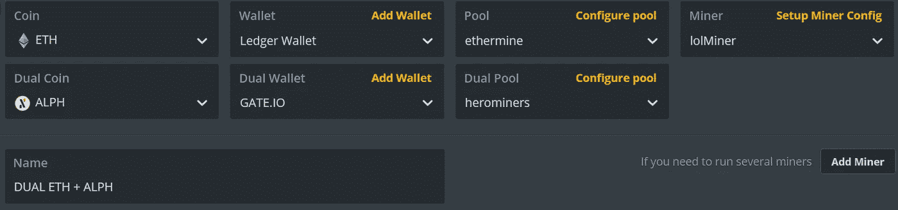
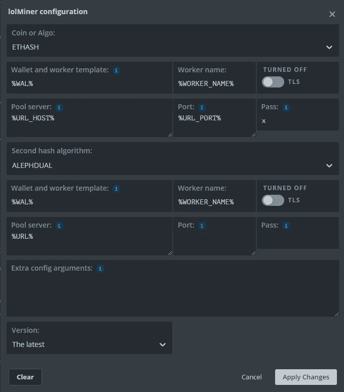
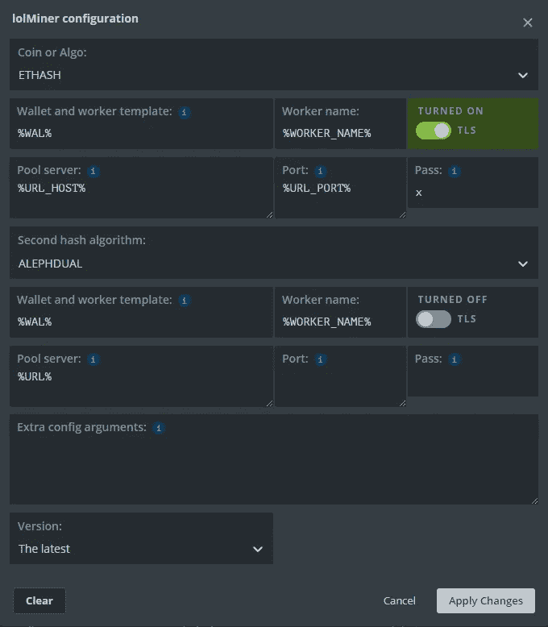

# 双重采矿 ETH/ETC + ALPH

> 原文：<https://medium.com/coinmonks/dual-mining-eth-etc-alph-96cd2fa1a262?source=collection_archive---------3----------------------->

TON 已经走到了生命的尽头，所以我们需要寻找另一个双重采矿选项来继续为我们的 GPU 获取最大利润。

我们有另一个硬币来做双重挖掘，它被命名为 [Alephium，你可以在他的网页上阅读所有白皮书:Alephium:一个新的范例](https://alephium.org/)

要有钱包你可以用自己的钱包或者用 exchange Gate.io 在那里你就可以直接挖矿了。

阿尔卑斯山的水池:

herominers.com 0.9%
woolypooly.com 1.9%
alph-pool.com 0.9%
alephium-pool.com 0%
meta pool . tech 0.75%
coin hunters . space 0.4%
enigmapool.com 0%
SOLO pool . org【SOLO】1.5%
SOLO blocks . org【SOLO】1%
picopool.org 1%

AMD 和 Nvidia 的 ETH + ALPH 使用的矿工是 [lolMiner](https://github.com/Lolliedieb/lolMiner-releases) ，所以我们将能够在 Nvidia/AMD 钻机和混合钻机中采矿。

我们应该在 HiveOS 中选择 flighsheet:

并进入 Setup Miner Config，使用非 ETH SSL 服务器对其进行配置:

You can change %URL% for the previous pools or use the pool giving from HiveOS

对于 ETH SSL 服务器:

You can change %URL% for the previous pools or use the pool giving from HiveOS

OC 配置可用于配置或离开 ETH 配置以获得额外的配置。请记住，ALPH 中的 Mhs 与 TON Mhs 是不同的，因为它是不同的算法。

> 加入 Coinmonks [电报频道](https://t.me/coincodecap)和 [Youtube 频道](https://www.youtube.com/c/coinmonks/videos)了解加密交易和投资

# 另外，阅读

*   [Bookmap 评论](https://coincodecap.com/bookmap-review-2021-best-trading-software) | [美国 5 大最佳加密交易所](https://coincodecap.com/crypto-exchange-usa)
*   [如何在 FTX 交易所交易期货](https://coincodecap.com/ftx-futures-trading) | [OKEx vs 币安](https://coincodecap.com/okex-vs-binance)
*   [CoinLoan 评论](https://coincodecap.com/coinloan-review) | [YouHodler 评论](/coinmonks/youhodler-4-easy-ways-to-make-money-98969b9689f2) | [BlockFi 评论](https://coincodecap.com/blockfi-review)
*   [XT.COM 评论](https://coincodecap.com/profittradingapp-for-binance)币安评论 |
*   [SmithBot 评论](https://coincodecap.com/smithbot-review) | [4 款最佳免费开源交易机器人](https://coincodecap.com/free-open-source-trading-bots)
*   [比特币基地僵尸程序](/coinmonks/coinbase-bots-ac6359e897f3) | [AscendEX 审查](/coinmonks/ascendex-review-53e829cf75fa) | [OKEx 交易僵尸程序](/coinmonks/okex-trading-bots-234920f61e60)