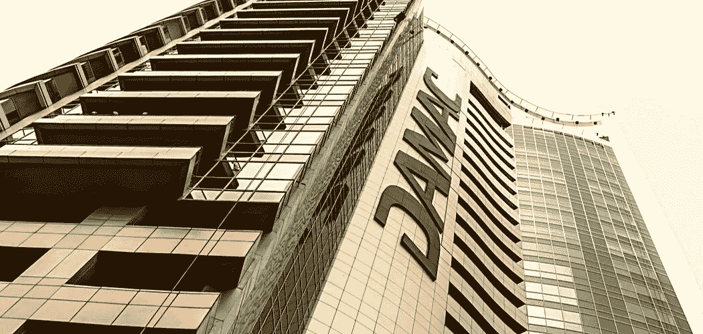

# 迪拜的房地产开发商将接受加密支付

> 原文：<https://medium.com/coinmonks/dubai-based-real-estate-developer-to-accept-crypto-payments-ce77eef8f8a9?source=collection_archive---------51----------------------->

总部位于迪拜的房地产开发商 Damac Properties 透露，它将接受 BTC 和 ETH 支付的财产销售。

最近，迪拜的 Damac Properties 宣布，个人将能够使用 BTC 和 ETH 购买房产。据该公司称，这样做的主要原因是为买家提供一种额外的支付方式，特别是那些已经参与 crypto 的买家。另一个原因是为了改造该市的房地产业，该行业目前正在经历一场加密改造。

以下是公司总经理对他们的决定的评论。

*“面向持有加密货币的客户的这一举措是我们为新一代人以及我们行业的未来加速新经济的举措之一。对于像我们这样的全球企业来说，站在进化的顶端是至关重要的。提供另一种交易模式令人兴奋，我们很高兴认识到这项技术为我们的客户带来的价值。”*

**Damac 计划进军元宇宙**

不仅进入加密支付领域，Damac 集团(Damac Properties 的母公司)也计划进军科技领域的最新元素——元宇宙。他们承诺将资助 1 亿美元。D-labs 是 Damac 的元宇宙，将成为数字城市。

**迪拜的加密冒险**

除了 Damac 之外，另一家迪拜房地产公司 Paradise Hills Property Development 报告称，它与三重区块链组织合作，在 2022 年 3 月之前将世界上最大的去中心化互联网云引入迪拜房地产。在这种驱动下，财产所有者可以选择使用专用服务器来帮助他们创建分散式应用程序(dApps)。

迪拜最近与加密权威的关系始于该市设立虚拟资产监管机构，专注于培养加密领域。在此之后，很少有组织和协会向加密分期付款渠道开放。一个这样的协会是公民学校，它已经宣布，当 2022 年 9 月开始上课时，它将容忍 crypto 中的教育费用分期付款。

> 加入 Coinmonks [电报频道](https://t.me/coincodecap)和 [Youtube 频道](https://www.youtube.com/c/coinmonks/videos)了解加密交易和投资

# 另外，阅读

*   [如何在 FTX 交易所交易期货](https://coincodecap.com/ftx-futures-trading) | [OKEx vs 币安](https://coincodecap.com/okex-vs-binance)
*   [CoinLoan 评论](https://coincodecap.com/coinloan-review) | [YouHodler 评论](/coinmonks/youhodler-4-easy-ways-to-make-money-98969b9689f2) | [BlockFi 评论](https://coincodecap.com/blockfi-review)
*   [XT.COM 评论](https://coincodecap.com/profittradingapp-for-binance) | [币安评论](https://coincodecap.com/xt-com-review)
*   [SmithBot 评论](https://coincodecap.com/smithbot-review) | [4 款最佳免费开源交易机器人](https://coincodecap.com/free-open-source-trading-bots)
*   [比特币基地僵尸工具](/coinmonks/coinbase-bots-ac6359e897f3) | [AscendEX 审查](/coinmonks/ascendex-review-53e829cf75fa) | [OKEx 交易僵尸工具](/coinmonks/okex-trading-bots-234920f61e60)