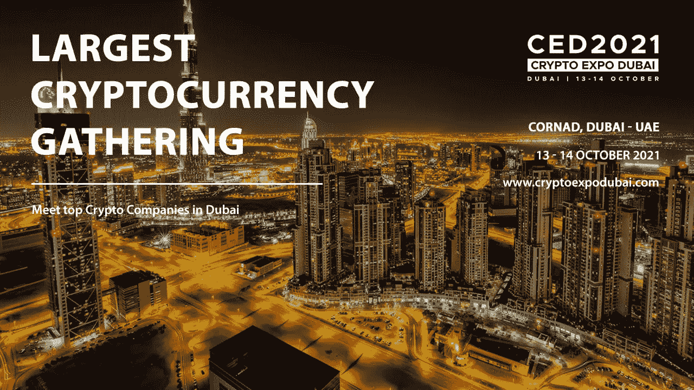

# 迪拜加密活动要求参与者创建数字令牌

> 原文：<https://medium.com/coinmonks/dubai-crypto-event-asks-participants-to-create-digital-tokens-a53f10997347?source=collection_archive---------77----------------------->

**Visit our website:-** [**https://bitcoinsupports.com/**](https://bitcoinsupports.com/)

由于区块链交流的复杂性，相当于学习一门新的语言，沉浸式学习经常被认为是最好的行动方案。区块链、加密货币和元宇宙正在改变世界理解货币、金融和价值交易的方式。虽然证明世界运行的基本方式发生了巨大变化是一回事，但认识到这项技术在个人层面的有用性是另一回事。

由于行业的持续发展，了解技术的基本原理导致了很高的学习曲线。随着不断的发展，区块链代表了多种概念，考虑了来自其他专业的多种信息，模拟了学习一种全新语言的体验。此外，尽管没有一个国家使用“区块链”一词，但彰显该技术可能性的活动已经成功达到了所需的沉浸水平。

博览会加密峰会旨在教育新认识的加密货币爱好者。随着迪拜世博会的临近，项目负责人开始考虑举办一场由 200 名区块链和元宇宙爱好者参加的专属加密货币活动的可能性。因此，他们在一个高度发达的国家设计了一场技术活动，面向对该行业有所了解但希望在加密货币领域迈出下一步的个人。这项活动将从 3 月 17 日星期四开始，持续四天。有关于区块链 1.0 和 2.0、不可伪造代币(NFT)、分散金融(DeFi)游戏和元宇宙的讲座，以及夜间研讨会。此外，用户将能够参与协作令牌发布活动。

**由加密爱好者发起**

Expo 加密峰会的主要目标是通过社区建设提供沉浸感。这个网络被认为是由经验丰富的演讲者、主题专家和普通爱好者组成的。

“Expo Crypto Summit 是一项活动，旨在通过与一群将在其发展中发挥重要作用的加密爱好者一起从头开始创建一种全新的加密货币！”项目团队的一名成员做出了贡献。世博会加密峰会可在线或亲自参加，由 NFTs 授予入场券。为获得门票，与会者必须使用与 MetaMask 钱包兼容的 Nex exchange 购买世博会令牌。有了令牌，顾客可以在 NFT 世博会官方网站上购买他们喜欢的门票。

随着展览倒计时的继续，团队对 Nex exchange 的建设和实施以及其他白标项目表示敬意。在 NEX 的帮助下，博览会加密峰会可以简单地将分散令牌技术集成到活动的结果中。交易平台分散在币安智能链(BSC)网络上，投资者之间可以直接进行代币交易。

与传统的分散交易所(DEX)不同，NEX 协议将允许企业建立自己的代币，每个代币都有独特的功能，并有可能在 NEX 交易。这个项目的基石进一步展示了这些能力，包括企业和证券交易所的虚拟化。

**全球认可为目标**

自巴西团队开始实施以来，该项目已经获得了 Caucau Digital、Expo 和 NEX 等加密货币计划的资助。

该团队认为，通过举办全球性的包容性活动，他们可以为巴西国内外的人们提供更多的机会，在活动期间制作的代币是他们工作的重要组成部分。

**访问我们的网站:-**[**【https://bitcoinsupports.com/】**](https://bitcoinsupports.com/)

**免责声明:这些是作者的观点，不应被视为投资建议。读者应该自己做研究。**