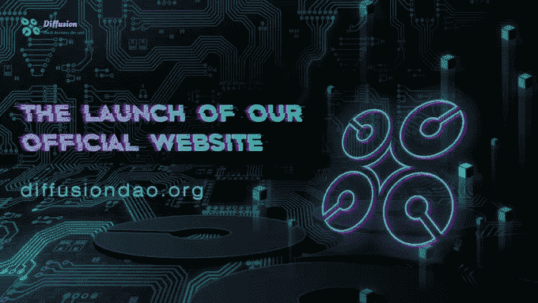
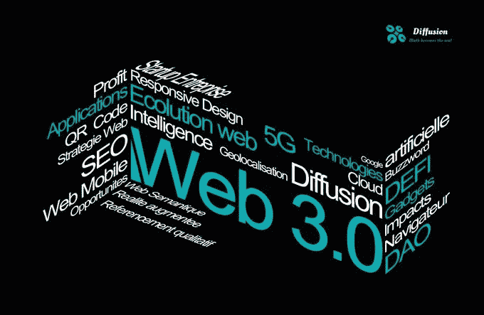

# 由于意识形态冲突导致的文明被迫升级，web 3.0 的到来是历史的必然

> 原文：<https://medium.com/coinmonks/due-to-the-forced-escalation-of-civilization-due-to-ideological-conflict-the-arrival-of-web-3-0-1482945ef385?source=collection_archive---------31----------------------->

在进行扩散道的整体设计之前，我们需要对手头的东西进行全面的分析。我们需要清楚地了解我们面对的是什么，未来会发生什么。由于地缘政治和意识形态的冲突，我们会发现，主流的以技术为基础的主体，或国家，正在尽量减少对其经济的能源约束。

简单来说，由于俄乌冲突对俄罗斯的能源出口起到了很大的制衡欧洲的作用，而且由于意识形态的冲突不会在短期内结束所以西方世界必然会加大力度推动新能源的布局，那么电力将成为西方世界所有国家都希望尽快解决的重要问题。电力获取新能源目前已知的是太阳能，风能，潮汐能和核能，电力驱动的运输设备也将得到广泛推广，并有效地调度全球新能源，信息技术，数字化是不可或缺的一部分。

对于世界上最大的经济体和国家来说，美利坚合众国随着美元石油理念的发展也即将结束，里根周期即将结束，在 20 世纪 60 年代和 70 年代，美国深陷贸易赤字问题，美元有很大的贬值压力。为了分担美元的压力，沃尔克也曾参与 SDR(特别提款权)的设计，试图以 SDR 作为世界货币来分担美元的压力，但最终无济于事。1971 年，美元与黄金脱钩。在 20 世纪 80 年代，时任美国总统里根试图在进行大投资(大量投资于星球大战计划)的同时减税，显然这两个目标无法在平衡的预算框架内实现。但前美联储董事会主席沃克尔的反通货膨胀政策出人意料地实现了里根的计划，美元的短期利率一度达到 20%，大大刺激了美元从海外回流。美国贸易逆差出口的美元以资本投机的形式回流。这个过程被索罗斯称为“里根周期”。在这个周期中，美国尽可能地将其金融体系与自己的技术力量、经济体系和军事力量结合起来，以避免信贷崩溃。

最近美联储密集的加息和缩减行动直接反映出美元正在试图规避风险，其中有一个很重要的原因是全球化格局引发的意识形态冲突导致全面衰退，重要经济体的对立情绪加剧，原有的经济格局迅速改变。

多年的持续通缩使得美元无法主要集中于投资，而是更多地集中于投机市场、无风险套利市场。这些资金在不断地挤压美元产生的金融市场利润的空间，而一旦原有的套利空间随着全球化格局的变化而发生巨变或部分消失，系统性风险随时可能爆发，进而迫使以美国为首的经济体加快文明经济体系的升级。

当然，如果在重大意识形态冲突之前没有完成文明的升级，人类社会必然会崩溃。

我们在推论中发现，美元正经历一个从布林顿森林体系到石油美元再到科技美元的过程。无论是经济学还是技术，从群体进化的角度来看，最终都是服务于降低熵的工作，也就是最大程度地避免混沌。当美元与新能源挂钩，人类将进入数字文明时代，能源的每一项产出都将被明确标注，并在一定程度上与美元挂钩。能量纯净，伪造的可能性越低，铆接其上的货币越不偏离其实际价值，货币本身的内在购买力就越坚实。这是人类文明经济的一次重要升级，并将在一定的时间轴上作为人类社会重要的经济制度建设基础。在这个过程中，散布在太空中的数万颗 Starlink 卫星将承担数据整理和传输的重要功能。它将服务于整个人类世界。当然，中央集权政府拥有它。说得更直白一点，就是美国政府。那么这就是美元演变的另一个物理基础。升级后，美元将以数字化的形式重新出现在人类世界，也就是数字美元，而这种美元的背后是一系列被包装成数字资产的能量。换一种形式说，能源形成数字资产，数字资产支撑美元。

当然，这里的数字资产和美元是一种更为集中的资产形式，会受到集中机构的强力控制。然而，在数字世界来袭的同时，个体也将在这个空间中觉醒。这是文明发展到今天的必然结果。个人和公共权利的诉求也会投射到数字空间，数字空间和物理世界的融合。个体越深入，个体在数字世界中存在的时间就越长，个体的注意力投射到数字空间的程度就越高。

笛卡尔曾经说过，我思故我在，所以我们也可以认为个体的灵魂也会存在于未来的数字空间中。灵魂有这样一种天然的自由意志，对个人权利和公共权利的追求就会浮出水面。去中心化的力量就会出现，与数字空间的中心化形成相互平衡。如果说集中的数字资产是太阳，给予了世界文明前进的动力，那么分散的数字资产就是月亮，呵护和呵护着个人的权利和自由意志。所以未来数字世界的去中心化力量会崛起，顺应时代发展，满足人性需求。去中心化的数字资产将以去中心化的加密资产的形式出现。这种力量和集中的数字资产是平衡的动态提升，具有巨大的力量。从推特上可以看出，NFT 是可以使用的。当然，现在就像数字美元才刚刚起步，去中心化数字资产的体系完善还需要时间。《漫道》就是在这样的时代背景下诞生的。

> 加入 Coinmonks [电报频道](https://t.me/coincodecap)和 [Youtube 频道](https://www.youtube.com/c/coinmonks/videos)了解加密交易和投资

# 另外，阅读

*   [最佳加密分析或链上数据](https://coincodecap.com/blockchain-analytics) | [Bexplus 评论](https://coincodecap.com/bexplus-review)
*   [NFT 十大市场造币集锦](https://coincodecap.com/nft-marketplaces)
*   [AscendEx Staking](https://coincodecap.com/ascendex-staking)|[Bot Ocean Review](https://coincodecap.com/bot-ocean-review)|[最佳比特币钱包](https://coincodecap.com/bitcoin-wallets-india)
*   [Bitget 回顾](https://coincodecap.com/bitget-review) | [双子星 vs BlockFi](https://coincodecap.com/gemini-vs-blockfi) | [OKEx 期货交易](https://coincodecap.com/okex-futures-trading)
*   [美国最佳加密交易机器人](https://coincodecap.com/crypto-trading-bots-in-the-us) | [经常性回顾](https://coincodecap.com/changelly-review)