# dYdX 洞察

> 原文：<https://medium.com/coinmonks/dydx-insights-601dc4501ee3?source=collection_archive---------1----------------------->

## **不受阻碍地进入分散、无信任和高流动性的永久合约市场、贷款、借款和保证金交易**

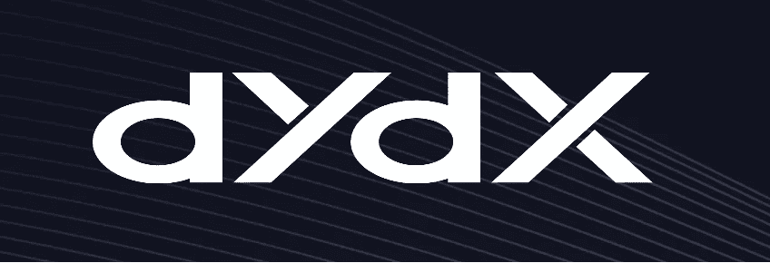

## 关键要点

*   dYdX 的永久智能合约和 StarkWare 的 StarkEx 可伸缩性引擎已经协同工作，结果是一个强大的跨边界 L2 永久协议，充满了流动性，正在走向完全去中心化。
*   永久掉期是加密衍生品市场中的佼佼者，其交易量比现货市场高出一个数量级。dYdX 协议旨在打破金融壁垒，传播流动性，保护隐私——所有这些都是在一个最终将由其交易员管理的交易所进行的。
*   在目前的状态下，该平台将分散交易所的保证与集中交易所的运作能力结合在一起。移动 Dapp 优化的艺术经常被忽视，但 dYdX 集成了自保管钱包，如比特币基地钱包，它有一个内置的 Dapp 浏览器。或者，用户可以扫描二维码，将自保管钱包连接到 dYdX 桌面版，从而实现移动交易签名。

## 背景

数字资产创新通过让金融系统更具活力、障碍更少来培养机会平等。由于没有中介，DeFi 正在激励个人利用加密技术的力量来收回他们的金融主权。愿意围绕这些技术整合并提供关键基础设施的机构将在未来的金融生态系统中茁壮成长，而继续忽视这些技术的机构最终将被自由市场力量所解散。

区块链是金融产品和服务的最佳基地。在传统系统中，进入壁垒往往只对最需要他们服务的个人开放。繁重的文书工作限制了个人获得金融资源的途径，如借贷资本。相反，DeFi 利用密码术和基于区块链的具有预定义条款的自动执行程序——消除了多余的拖延，并为用户提供了有吸引力的保证组合。这些保证包括无需许可即可获得金融产品、即时结算、深度流动性、可组合性和降低交易对手风险。

## 开始

dYdX 是前比特币基地、MongoDB 和优步软件工程师安东尼奥·尤利亚诺的创意。以前，它作为以太坊基础层上的 L1 协议运行。L1 版本于 2021 年 11 月 1 日到期，目前以仅限平仓模式存在(即唯一的功能是允许客户平仓和提取资金)。当前的 L2 协议完全脱离了 L1 协议，提供了显著不同的交易体验，降低了天然气成本，增加了吞吐量。全球衍生品市场的名义价值约为 1000 亿美元，随着衍生品被数字化并移植到区块链协议，使任何有互联网连接的人都可以访问它们，这个数字在未来十年可能会像滚雪球一样越滚越大。dYdX 处于有利地位，可以获得更大的份额，因为他们利用了客户的偏好，如功能性、可选性和可访问性。拥有衍生品的市场参与者能够更好地管理风险，表达自己的信念。

## **技术**

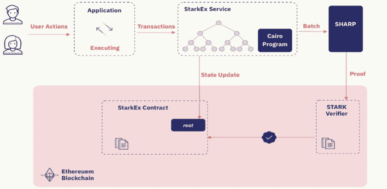

Figure 1: StarkEx Scalability Engine Visualization

以太坊基础层的拥塞阻碍了交易操作的性能和规模，因此 dYdX 与 StarkWare 整合，在以太坊上构建了一个 L2 系统。dYdX 智能合约和 StarkEx 可扩展性引擎共同降低了最小订单规模，减少了交易费用，提高了吞吐量。该平台目前作为一个混合交易所运行，其大部分基础设施是分散的(即核心交易所)，但一些组件(即订单簿和匹配引擎)仍然是集中的。结算发生在 L2 系统上。零知识证明以密码方式验证交易，而不会泄露交易中涉及的任何一方，从而确保隐私。ZK 汇总是被用作 L2 扩展解决方案的有效性证明，其名称来源于一个过程，在该过程中，一组交易被离线路由以生成加密证明。恢复平衡状态所需的数据存储在基链上，确保了安全性和分散性。StarkWare 的鲜明证明是后量子 ZK 卷，以一种私密和安全的方式实现可扩展性。STARK 证明通过向以太坊智能合约发布 ZK 证明来提高结算能力并验证第 2 层平衡状态。STARK 是可扩展透明知识论证的首字母缩写。StarkEx 只在链上发布 delta 状态(即平衡的变化)，通过颠覆自营交易者策略的模仿来保护他们。保密性、速度和终结性是 STARK-proof 提供的核心特性，使它们适用于传输大量数据和价值的协议。dYdX 的当前版本——V3 API——通过集中的订单簿和匹配的引擎处理贸易结算和清算，就像 V1 和 V2 所做的那样。也许部分是由于他在比特币基地的经历，Antonio 理解了制造顾客喜爱的无摩擦、功能丰富的产品的重要性。集中式订单簿实现了大规模扩展，日交易量经常超过 1B 美元——延迟不到 1 秒，伴随着不可信的结算交易和清算。dYdX 的智能合同由行业领先的区块链安全和分析平台 PeckShield 独立审计，该平台以识别 2018 年影响少量 ERC-20 令牌的 batchOverflow 漏洞而闻名。截至 1 月 18 日，dYdX 的交易费用降低了 66%，使该平台的费用与其他主要交易所相比具有竞争力。

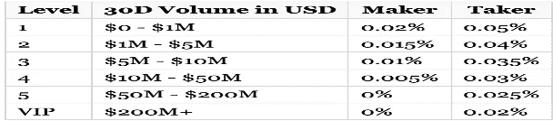

dYdX Trading Fees

## **永久互换基础**

在合约即将到期的衍生品市场，如期货和期权市场，随着到期日的临近，合约价格自然会向现货价格靠拢。顾名思义，永久互换不会过期，因此必须存在一种替代机制来激励对基础资产的跟踪。融资费用由融资利率的正值或负值决定，每小时在多头和空头合约持有人之间以编程方式交换，尽管融资利率本身被外推至 8 小时实现期(即，费用交易者可以预期每 8 小时被借记或贷记)。这种每小时一次的交易直接发生在多头和空头之间，没有中介，这解释了永久互换的说法。资金支付是使用三个变量计算的——头寸规模(S)、交易对的 oracle 价格(P)和 1 小时资金利率(R)。

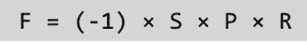

Funding Payment Calculation

## **融资利率**

融资利率是激励永久合约跟踪其基础资产价格的力量。它们是使用即期价格和期内永久掉期报价的外推通过算法计算出来的。当融资利率为正时，多头合约溢价交易，因此空头从多头合约中抽取融资费。当融资利率为负时，空头合约溢价交易，因此多头从空头那里吸取融资费用。这种激励机制促进了永久合约在现货价格上的趋同，因为融资费刺激了持有溢价合约的交易对手。融资利率的主要决定因素是溢价部分，它反映了给定永久合同的市场活动，并因交易对而异。融资利率等于一小时的保费，加上利率部分。所有交易对的利率部分每 8 小时等于 0.01%。

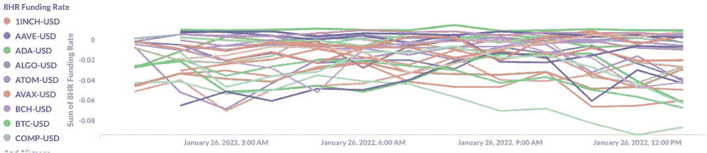

Figure 2: Funding Rate (8hr)

## **未平仓利息**

未平仓合约是指未平仓合约的总数。每个合同都有一个买方和一个卖方；因此，可以存在的合同数量不受限制。与成交量不同，合同的转让不会改变 OI。OI 仅在创建以前不存在的合同或关闭现有合同时更改。其他投资模式揭示了资本流动。一般来说，投资回报率的上升表明有新的资本流入市场，而投资回报率的下降表明资本流出市场。较高的投资回报率自然与较高的流动性相关。

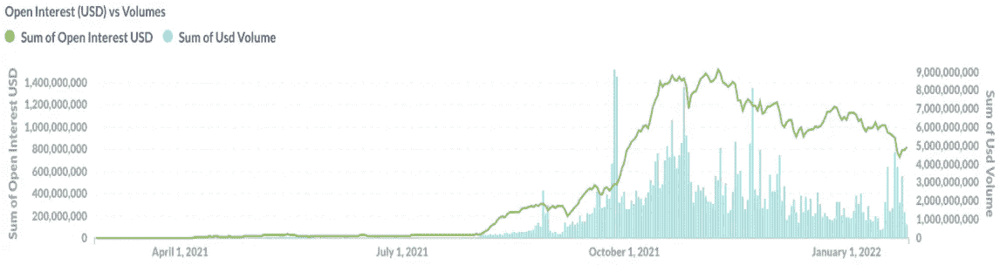

Figure 3: Sum of Open Interest USD vs. Volumes Over Time

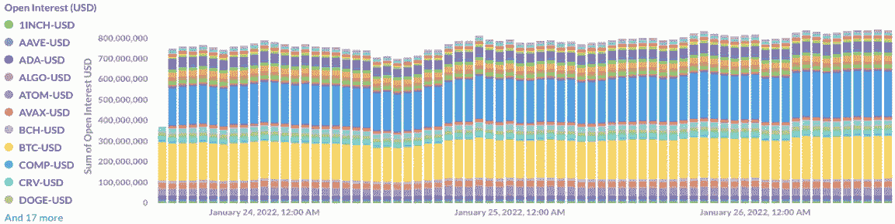

Figure 4: Open Interest by Trading Pair Over Time

## 边缘

交叉保证金，也称为差价保证金，描述了用你的账户余额作为抵押品的交易。你投资组合中的任何资产都不能作为其他资产的抵押品。在交叉保证金投资组合中，保证金维持水平较低，从而降低了清算事件的可能性，但没有降低其规模。所有资产的 dYdX 永久合同在 USDC 报价。交叉保证金通常是更适合长期投资者的杠杆形式，在交易所默认使用。考虑到清算风险与相对于账户总值的头寸规模成比例，在使用交叉保证金时保持适当的头寸规模很重要。给定交易对的最大杠杆报价基于三个风险参数——初始保证金比例、维持保证金比例和增量初始保证金比例。单个头寸的保证金要求基于四个变量:头寸规模、交易对的 oracle 价格、交易对的初始保证金比例以及交易对的维持保证金比例。整个投资组合的保证金要求等于账户持有头寸的所有交易对的保证金要求的总和。账户总价值(即权益)包括报价资产(USDC)余额加上账户中所有头寸的价值。具有短期方向性倾向的黄牛党和交易者希望使用大量杠杆，他们可能更喜欢隔离保证金，以精确定义他们的最大损失，更容易监控单个交易的 P&L。隔离保证金可以通过开立多个账户来实现。

## **清算**

当账户中的权益低于保证金维持要求时，清算引擎自动平仓。dYdX 的保险基金吸收清算产生的利润和损失。清算的收盘价使用四个变量计算，即交易对的 oracle 价格(P)、交易对的维持保证金比例(M)、权益(V)和总保证金维持要求(W)。1 月 14 日，BTC 和 ETH 市场的最大杠杆比率从 25 倍降至 20 倍，导致保证金要求下降 1%，从 5%降至 4%。当然，持有 25 倍保证金头寸的交易者可以看到他们的交易进行到战略退出或清算。每个交易对的 oracle 价格有两个用途——确保适当的交易后抵押，以及作为清算触发器。Oracle 价格相当于 15 个独立链节节点的中间报告价格。每个交易对的指数价格用于计算融资利率和可触发的订单类型，如止损单和止盈单。指数价格相当于几个交易所的现货价格中值。

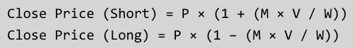

Liquidation Close Price Calculation

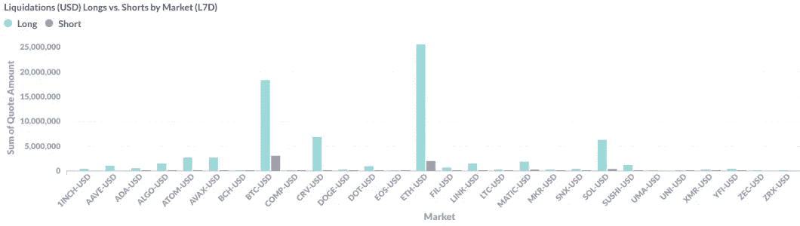

Figure 5: Liquidations (USD) Longs vs. Shorts by Trading Pair Over Time

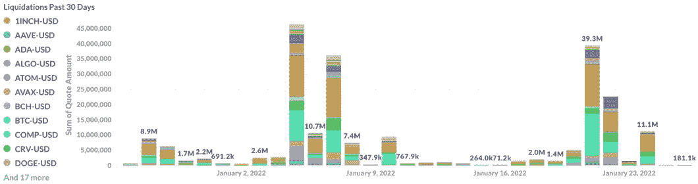

Figure 6: Liquidations by Trading Pair Over Time

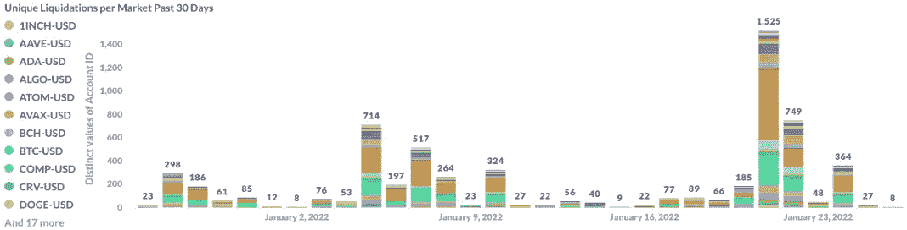

Figure 7: Distinct Account Liquidations by Trading Pair Over Time

## 交易策略

术语“基差”是指衍生产品的价格与其基础资产之间的差异。基差交易是一种策略，旨在利用这个三角洲。永久掉期市场是寻求利用这一套利机会的探矿者的沃土。在传统金融市场中，现购自运交易涉及购买一种资产(通常是一种商品)，并在期货合约溢价交易时做空其期货合约。这样做给了交易者 delta 中性，保护他们不受基础价格波动的影响，同时他们获得了等于基差减去持有成本的套利利润。在加密市场的背景下，这种套利被(或至少应该被)称为“先抛后买”(coin-and-carry)交易，涉及在现货市场购买一种资产，并做空其永久掉期，同时从溢价持有合约交易的交易对手那里获得资金支付。当永久合约折价交易时，可以通过买入永久合约并在保证金交易中做空现货来进行反向套利交易。

dYdX V4 预计将于 2022 年底问世，届时 V3 API 将被弃用，届时将不再收取中介或交易费用。当 dYdX 的全去中心化永续合约市场 API 出货后，一个全去中心化的 dYdX 就诞生了，交易所将属于它的用户。V4 的优势将包括集中式服务器风险缓解，以及对流动资产的非托管暴露。dYdX 的目标是成为该行业的巨头。

## **记号组学**

铸造了 10 亿枚 DYDX 代币，五年解锁期从 2021 年 8 月 3 日开始。交易奖励通过 L2 协议交易获得(基于 OI 和支付的费用)。交易里程碑完成后，将向过去的用户发放追溯采矿奖励。流动性提供商的奖励基于四个变量——利差、深度、支持的合同数量和正常运行时间。5000 万 DYDX 将通过社区赠款、倡议、流动性挖掘和其他计划定期分配给社区国库。财政部的任务是利用促进 dYdX 协议发展的项目，为各种项目(例如，社区 NFT、黑客马拉松、分析、仪表板、memes、第三方工具等)开发资助项目。)，并开发具有强大激励机制的一流治理系统。流动性模块分配奖励将 USDC 下注到安全赌注池的用户。自初始启动之日起 5 年后，政府可启动 2%的永久通胀率，以支持新资源流入社区；如果提议的话，治理可能批准也可能不批准，但是上限是 2%。

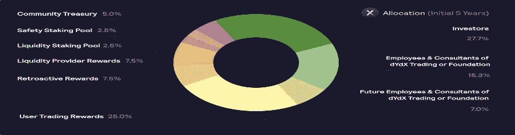

Figure 8: Token Allocation Initial 5-Years

dYdX 令牌是用于管理 DYDX 协议的 ERC-20 令牌。它赋予持有者投票权和提案权。令牌的功能旨在协调《L2 议定书》社区的激励措施，分散流动性提供商、合作伙伴和交易商之间的控制权。流动性挖掘奖励发放给流动性提供者，刺激网络增长。安全赌注池向 dYdX 令牌持有者发放赌注和保护网络的奖励。交易费折扣随着 DYDX token holdings **的增加而增加。** DYDX 代币在预定日期解锁，参考日期为发行日期。30%的代币在 18 个月后解锁。40%的代币在第 19-24 个月解锁。20%的代币在第 25-36 个月解锁。10%的代币在第 37-48 个月解锁。

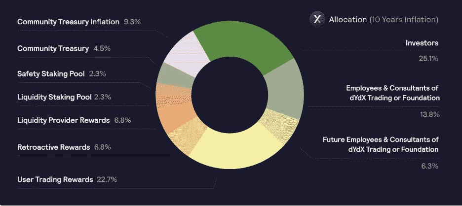

Figure 9: Token Allocation 10-Year Inflation

Figure 10: Liquid Supply as % of Total Initial Issuance

## **治理**

dYdX 基金会是一个独立的非营利基金会，总部设在瑞士楚格。该基金会成立于 2021 年 8 月，旨在培育该协议，使其走上社区主导的增长、发展和自治之路。如果基金会的目标得以实现，dYdX 将成为加密衍生品交易所的巨头。

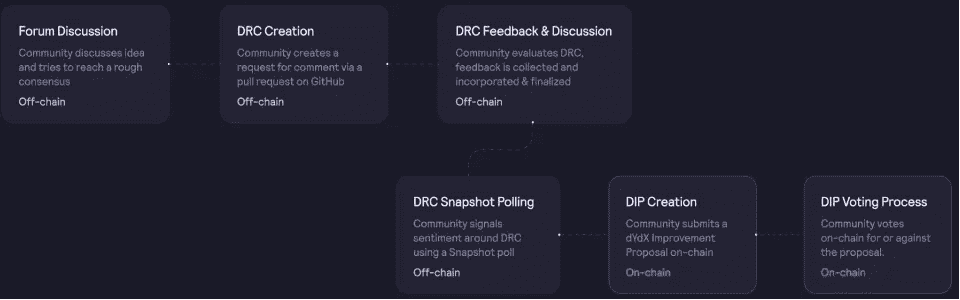

Figure 11: dYdX Governance Snapshot

该基金会履行的其他职责包括发放 DYDX 治理令牌、开展研究以及继续专注于实现《L2 议定书》的完全分权化使命。dYdX 治理采用两种方法；直接链上投票和委托链上投票。治理流程始于 forums.dydx.community，必须通过 dydx 改进提案(DIPs)批准。提案生命周期由六个阶段组成，还有可选的第七个阶段(提案取消)，如果提案人在当前区块没有足够的提案权，则可以取消 DIP。所有 dYdX 治理和赌注都建立在智能合约的基础上。截至今天，DYDX 的 133，602，965 美元已被下注。

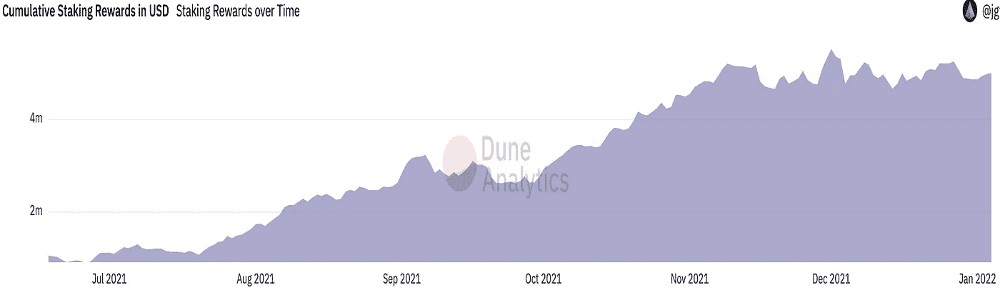

Figure 12: Cumulative Staking Reward Over Time (in USD)

## **纪元**

赌注和奖励合同假设 28 天滚动周期(即纪元)。一个新的纪元开始于每个先前纪元的末端。交易奖励和流动性提供者奖励可在每个纪元结束后约 7 天内兑现。流动性赌注池和安全赌注池奖励可以在每个时期结束时提取。dYdX 治理可能会在 6–92 天的范围内修改纪元范围。中断窗口是指每个时期内可以请求提取已押资金的最后一个日期；建议的中断窗口是 14 天，但是治理可能会在 3-46 天的范围内修改它。通过三个奖励计划获得的代币可在每个纪元结束时转移。

## dYdX 网络稳定性

事件主要围绕订单的一小部分陷入待定状态，无法到达匹配引擎，其中一个事件涉及 dYdX 后端的宕机，这是由 AWS 中断引起的。随着时间的推移，网络的分散化将是维持正常运行时间的关键。

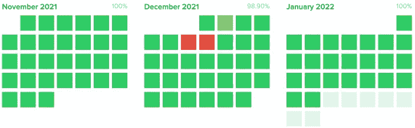

Figure 13: Uptime Past Three Months

11 月 27 日，存款处理代理智能合同暴露了一个严重的漏洞，使得 2M 的资金易受攻击。作为对发现漏洞的回应，dYdX 团队与他们最大的支持者之一 Paradigm 的萨姆尊和圣乔治一起进入了一个作战室。经过深思熟虑，他们执行了一次白帽黑客攻击，将易受攻击的用户资金转移到一个非托管的托管合同中，只有资金的合法所有者才能访问该合同。根据他们的漏洞披露政策，dYdX 向发现该漏洞的个人支付了 50 万美元 USDC。所有损失要么被白帽救援队阻止，要么被 dYdX 团队全额报销。为了应对这种情况，该团队大大加强了安全实践，现在保证所有智能合约的完整代码分支覆盖，并通过外部审计师进行验证。如果成功被盗，PoS 令牌为黑客提供了网络中的股份，该股份随着被盗令牌的价值增加而增加，假设他们参与了赌注。出于这个原因，白帽救援行动是谨慎的，成功地隔离了脆弱的资金，使其免受恶意网络参与者的潜在掠夺。Bison Trails 等关键基础设施提供商将通过将企业接入区块链协议和增强更广泛的加密生态系统的稳定性来间接服务于 dYdX，从而加速去中心化。Bison Trails 提供了四种产品来促进区块链协议和企业的接口；参与、查询和交易(QT)、委托、数据索引器和 API。随着运行安全、全球分布且完全受管的节点所需的流程得到简化，调配平台即服务将促使企业参与进来。他们的 QT 服务帮助企业接入区块链并构建适合其需求的 Dapps，从而提高商业智能洞察力。区块链的强度与其网络的参与程度直接相关。企业通常具有与给定区块链的稳定性相关联的大量经济利益，但是可能缺乏意愿或技术手段来独立地运行节点或将令牌委托给一个节点。为了补救这一点，这些公司可以将他们的代币押在 Bison Trails 上，从原本没有收益的数字资产上赚取被动收入。他们产品系列中的最终产品简化了数据查询过程，利用了原本需要创建和主动维护的索引工具。

## **网络增长指标**

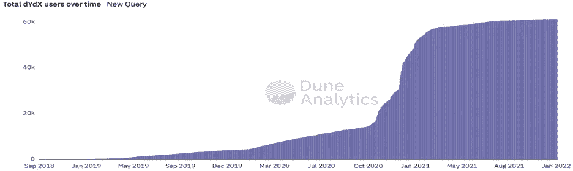

Figure 14: Total Users Over Time

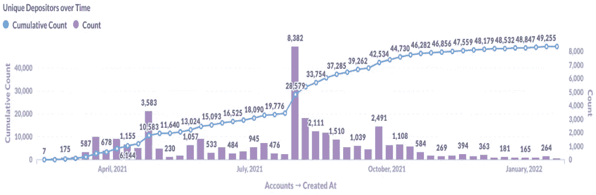

Figure 15: Distinct Depositors Over Time

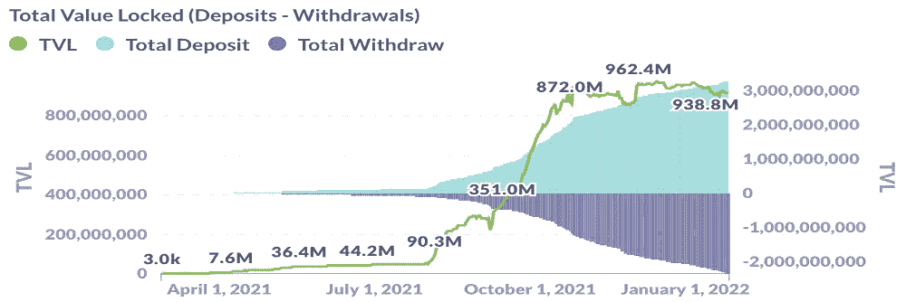

Figure 16: TVL (Net Deposits and Withdrawals)

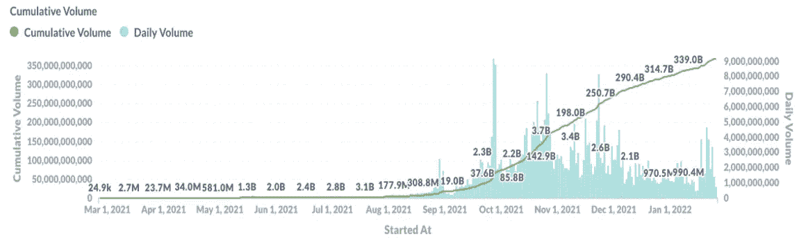

Figure 17: Cumulative vs. Daily Volume Over Time

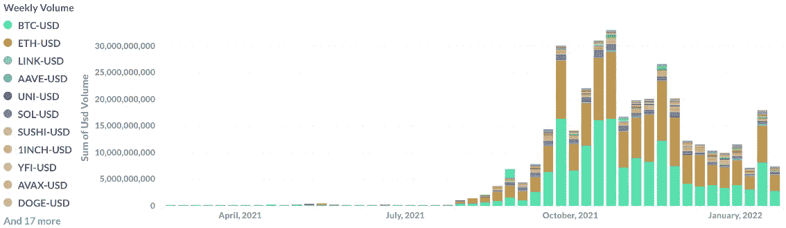

Figure 18: Weekly Volume by Trading Pair Over Time

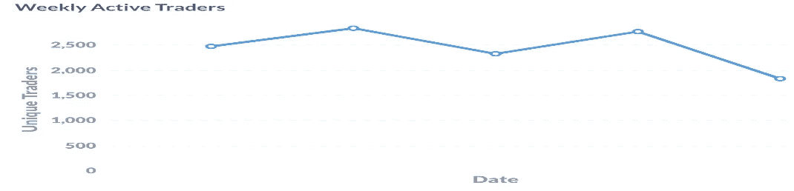

Figure 19: Distinct Weekly Active Traders

## **经济壕沟**

高辛烷值的创新是加密领域与生俱来的。两年前不为人知的产品和实现如今已经存在。经济护城河通常很窄；受到激励和无机网络效应的困扰。目前，十大主要衍生品交易所都是中央集权的，受司法法令管辖，因此，它们纷纷在加勒比海和其他监管制度宽松的国家注册。当 dYdX 的 V4 API 发布时，它们很可能是唯一一个真正去中心化的、社区管理的平台，提供永久交换而不跟踪缺陷。dYdX 的前景看起来很有希望，因为他们的销量已经进入前十名(目前 24H 销量为 2，058，022，696)。

Figure 20: Top 10 Derivatives Exchanges by 24H Volume

dYdX 的硬件整合、支持去中心化的精神以及打造高效产品的愿望，使其在吸引蓝筹交易所的永久掉期交易者加入其平台方面处于有利地位。

## **竞争格局**

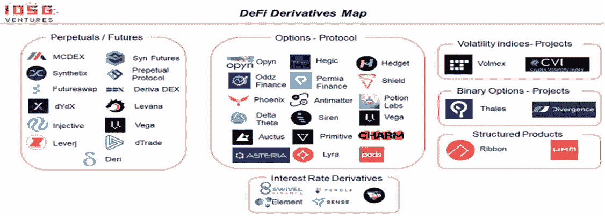

Figure 21: Infographic of Derivatives Exchange DEXes

市场上分散式永久平台的两个主要原型是具有中央限价订单簿(CLOB)的平台和具有自动做市商(AMMs)的平台。CLOB 平台使用的链外订单匹配提供了经过验证的功能和可伸缩性，同时在审查阻力方面进行了权衡；暂时在 dYdX 的情况下。相反，AMM 平台更加分散，但在功能方面落后。在波动性加剧期间，延迟和闪存崩溃问题很常见。流动性问题是由于相对于总体交易量而言，不同地址的数量很少。不成比例的低融资，即使在上涨趋势中也往往是负的，被当作一个机会来推销，以利用折价交易的永久合约。这种跟踪误差确实可以被利用，但是尽管如此，也应该考虑到跟踪机制是有缺陷的。内部套利机器人通常占据相当大的交易量，导致无机做市和有毒流动，加剧 OI 失衡。对许多交易者来说，依赖隔离保证金和稳定后货币抵押品的要求也可能令人不快。公平地说，最初为去中心化而优化自然会减慢产品优化过程。

## **永久掉期与差价合约**

本质上，没有到期的差价合约是永久互换的古老版本。与 dYdX 的永久掉期并列的差价合约工具是对加密创新及其委托笨重金融产品的倾向的赞颂。与永久掉期一样，差价合约为交易员提供资产的综合敞口，让他们了解持有资产的收益和风险，而不必担心资产的实物交割。另一个相似之处是差价合约提供了重要的杠杆。与永久掉期不同，差价合约通常在狭小的市场交易，巨大的差价使退出复杂化，侵蚀利润。差价合约通常用于软商品交易。一旦在美国合法化，象征性软商品永久掉期市场降级差价合约是合乎逻辑的。2010 年，曼氏金融在 AUM 的资产为 424.60 亿美元。今天，他们的[域名](http://www.mfglobal.com/)以 1878 美元出售。发生了什么事？他们中了一个空投钓鱼骗局吗？他们的区块链重组了吗？原来，MF Global 不是一个区块链协议，而是一个奇特衍生品(如差价合约和点差交易)的经纪人，这些衍生品没有像永久掉期那样的自动去杠杆化规定。本质上，MF Global 是拆东墙补西墙；高管们承认将 8.91 亿美元从客户账户转移到一个 MF Global 经纪自营商账户，以弥补交易损失。随着透明度和可审计性取代对诚信的盲目依赖，协议和区块链基础设施将减少未来此类惨败的频率。

## **规定**

dYdX 受美国证券交易委员会监管，其数据中心位于北弗吉尼亚(AWS US-EAST-1 区域)。根据 dYdX 的使用条款，严格禁止使用美国的 IP 在 dYdX 上进行交易。

## **结论**

如今，DeFi 阐明了可组合性的动态本质。Dapps 和区块链的移植通过提供新的用例为协议及其参与者提供了价值。可组合性孕育了功能，额外的功能创造了价值，因此可组合性可以抽象为协议以新的方式促进价值创造的能力。通常，区块链协议由三层组成；网络层、共识层和应用层都扮演着不同的角色，但却紧密协作。开源软件，如 Tendermint(和 Tendermint 产品套件)，使开发人员能够更快地构建更多可组合的区块链，而不是花时间从零开始构建所有三层。Tendermint IBC(区块链间协议)将支持跨分类账数字资产转移，这是可组合性方面的一项关键创新。也许这是一项创新，为 DeFi 新产品打开了一扇大门。当像 dYdX 这样的协议同时在链上和链外执行计算时，可组合性是有限的。因此，dYdX 无法插入其他网络来创造新的用例和新的价值。然而，Antonio 考虑到了这一点，并为 dYdX 不关心可组合性提供了一个坚实的理由，至少在近期和中期是如此。他描述了采用全栈方法来构建产品，其中他的团队构建了服务器、前端、智能合约以及整个九个方面。鉴于永久互换的新奇性(更不用说分散交易所的永久互换了)，他和他的团队似乎将成为构建 dYdX 产品的主要创新者。BitMEX 在 2016 年向市场推出了永久掉期，目前尚未接近市场饱和。dYdX 计划通过提供高质量的用户体验和将流动性集中在一条链上，而不是分散在多条链上，来满足这种不断增长的需求——这一战略应该保持利差紧密，交易员在出价时紧咬不放，而团队在幕后实现他们对完全分散的永久合约市场的愿景。

> 加入 Coinmonks [电报频道](https://t.me/coincodecap)和 [Youtube 频道](https://www.youtube.com/c/coinmonks/videos)了解加密交易和投资

# 另外，阅读

*   [如何在 FTX 交易所交易期货](https://coincodecap.com/ftx-futures-trading) | [OKEx vs 币安](https://coincodecap.com/okex-vs-binance)
*   [CoinLoan 评论](https://coincodecap.com/coinloan-review) | [YouHodler 评论](/coinmonks/youhodler-4-easy-ways-to-make-money-98969b9689f2) | [BlockFi 评论](https://coincodecap.com/blockfi-review)
*   [XT.COM 评论](https://coincodecap.com/profittradingapp-for-binance) | [币安评论](https://coincodecap.com/xt-com-review)
*   [SmithBot 评论](https://coincodecap.com/smithbot-review) | [4 款最佳免费开源交易机器人](https://coincodecap.com/free-open-source-trading-bots)
*   [比特币基地僵尸工具](/coinmonks/coinbase-bots-ac6359e897f3) | [AscendEX 审查](/coinmonks/ascendex-review-53e829cf75fa) | [OKEx 交易僵尸工具](/coinmonks/okex-trading-bots-234920f61e60)