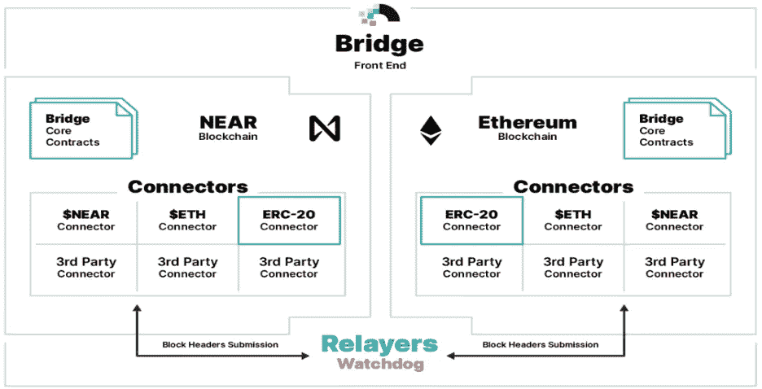
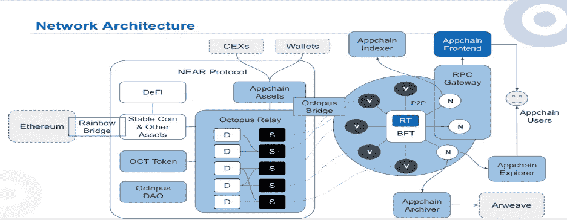
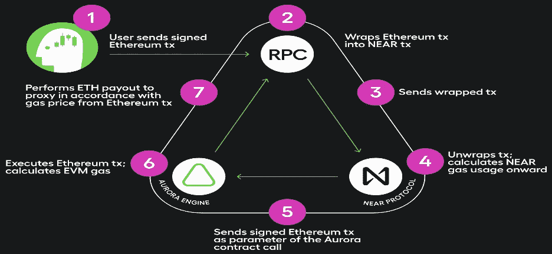
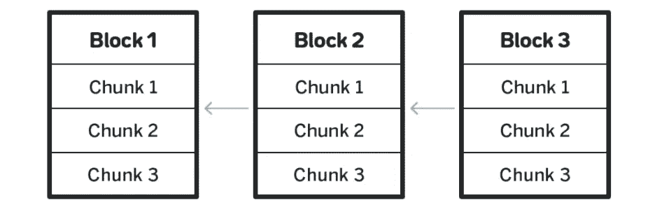
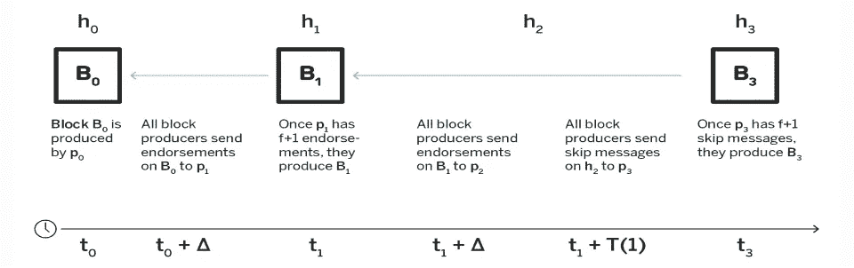
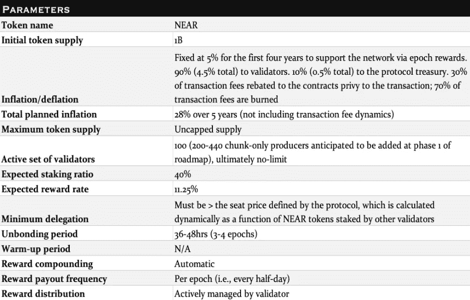
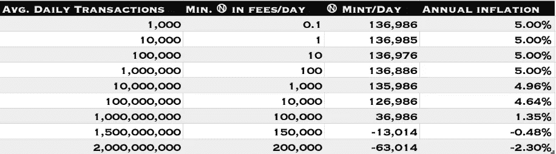
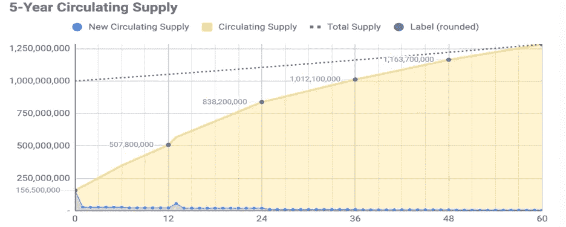
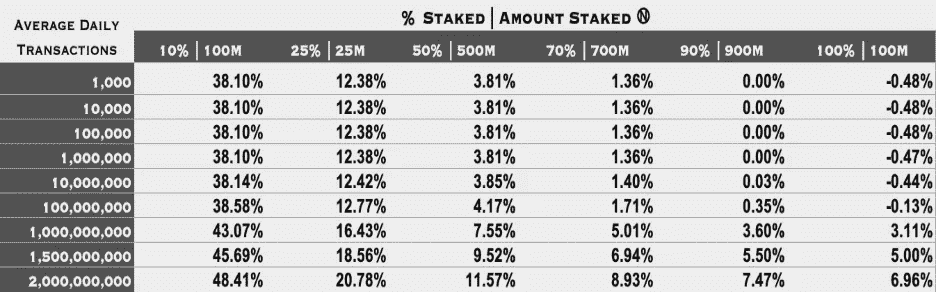

# 动态重散列即将到来:当区块链超越可伸缩性限制时

> 原文：<https://medium.com/coinmonks/dynamic-resharding-is-near-when-blockchains-transcend-scalability-constraints-2cccb5e01d50?source=collection_archive---------4----------------------->

## NEAR 是一个安全且具有独特可伸缩性的区块链，在一个经济高效的环境中为用户提供精致、直观的体验，旨在为开发人员提供简单、可持续地构建有价值的应用程序所需的工具。

## 关键要点

*   协议团队经常过度优化开发人员或最终用户的需求，牺牲一方的利益而让另一方受益。作为一个社区运营的云计算平台，NEAR 正在打造一个开发者和用户都可以繁荣发展的环境。简单是终极的复杂，NEAR 的低摩擦平台遵循这一理念，为所有生态系统参与者提供完美体验。
*   NEAR 对简化采用的偏好体现在一系列功能上，包括简化的赌注、人类可读的用户名以及与 Dapps 和智能合约的无钱包同步。NEAR 上的开发活动在 2021 年增长了 300%以上，部分是由与贡献网络相关的经济激励推动的——贡献开发者获得一小部分交易费。
*   正如 NEAR 白皮书的[设计原则](https://near.org/papers/the-official-near-white-paper/#design-principles) 部分所讨论的，协议的开发由四个关键原则指导——可用性、可伸缩性、简单性和可持续去中心化。NEAR 视觉的基础是其块生产和分片技术，分别被称为[末日钉](https://near.org/blog/doomslug-comparison/)和[茄影](https://near.org/papers/nightshade/)。

## 近的介绍

目前，以太坊等区块链的吞吐量主要受限于网络内所有节点处理所有事务的需求。存在许多旨在解决这个问题的对策。垂直扩展需要升级预先存在的硬件组件(即节点基础架构)，以增加它们的内存和能力，从而提高每秒事务处理量(TPS)。从逻辑上讲，采用这种方法的区块链(如 Algorand，Solana)提供的 TPS 高得多，费用却低得多。尽管这种方法性能良好，但它不利于最大程度的分散化，因为所有的计算都分配给了少数高性能节点。此外，可扩展性是由网络硬件的处理能力来划分的。

与以太坊 2.0 类似，NEAR 计划使用一种替代方法来解决可扩展性问题，这种方法被称为[分片](https://eth.wiki/sharding/Sharding-FAQs) —一种水平扩展机制，通过状态和处理的碎片化来实现负载分散。产生块、验证事务的网络参与者被称为验证者。分片需要将一个区块链划分成多个分片，每个分片都有自己的一组验证器。在没有随机性的情况下，区块链的安全性会随着它被划分成的碎片的数量而成比例地降低，这是因为验证器被划分在总共存在较少验证器的碎片中。在非分片 PoS 区块链中，验证者的总股份与他们对链施加影响的能力成正比。随机验证器赋值使得区块链在分片后仍能保持安全性。例如，如果一个实体控制了一个分片网络中 6%的验证器，那么如果所有的验证器都被分配到一个分片中，那么这个实体的风险将是巨大的，因为他们的全部影响力都集中在这个分片中。幸运的是，为了防止任何一个实体在给定的分片中变得过于强大，验证器被随机分配到多个分片中。越来越明显的是，基于[拓扑的](https://www.researchgate.net/figure/Examples-of-topology-based-blockchain-scaling-a-Example-of-the-off-chain-smart_fig5_352806851)扩展技术将是区块链在不牺牲分散性和安全性的情况下实现规模的主要手段。基于拓扑的技术的一些例子包括分片(例如 Polkadot)、链外路由(例如 StarkEx)、侧链(例如 Polygon)和模块化框架(例如 Tendermint)，所有这些技术都在快速发展，并且在许多情况下可以协同使用。

ETH2 [路线图](https://eth.wiki/sharding/sharding-roadmap)上的分片变体被称为二次分片，它将网络扩展到指数级，尽管只是到一个自然极限，这是由其共识层——[信标链](https://ethereum.org/en/upgrades/beacon-chain/)的处理能力建立的，它将使用一个被称为 [Casper](https://arxiv.org/abs/1710.09437) 的终结小工具。本质上，二次分片描述了这样一个过程，通过该过程，链的分片使得每个结果分片中的节点能够将它们的处理能力乘以等于所创建的分片数量的因子，从而将共识层的容量增加相同的因子。例如，如果创建了八个碎片，每个节点的处理能力增加了八倍，信标链维护碎片的能力也增加了八倍，导致系统吞吐量增加了 64 倍。尽管不关心这个二次分片路线图的实际能力，NEAR 正在采取一种不同的方法，旨在展示一个真正面向未来的分片区块链，其可扩展性没有自然限制。

NEAR 通过推出 [Simple Nightshade](https://near.org/blog/near-launches-nightshade-sharding-paving-the-way-for-mass-adoption/) (又名阶段 0)开始了其逐步实现完全分片区块链的方法，其中网络状态被分成四个分片，尽管验证器仍在每个分片中进行验证。此次发布为动态分片奠定了基础，这将允许现有分片基于逻辑的拆分和合并。自阶段 0 开始以来，网络性能大约增加了两倍，但安全保证保持不变，因为每个分片中的验证仍由所有节点执行。第一阶段即将到来，旨在通过引入[纯组块生产者](https://near.org/decentralize/)的角色来分散网络，其中将有 200-400 个生产者。顾名思义，只支持块的生产者将在给定的分片中产生块的片段——这是朝着完全分片处理方向迈出的有希望的一步。完成这个新角色所需的减少的计算需求减少了参与的先决条件，加快了验证器登记过程。第 2 阶段将从第 1 阶段停止的地方继续，解除验证者的多分片验证职责，反过来，完全分片网络处理。到那时，NEAR mainnet 将以完全分片的形式存在，运行一个节点的成本将会下降，同时所需的功率也会随之降低。第 3 阶段引入了动态重组——一种根据网络活动自适应重组分片的方法。

在区块链之外， [AWS](https://aws.amazon.com/) 利用类似的重新分级[方法](https://docs.aws.amazon.com/streams/latest/dev/kinesis-record-processor-scaling.html)来扩展其数据流，使客户不必担心容量问题。茄影将为附近的用户提供类似的实用程序，他们可能会忘记担心过度拥挤和相关的资源成本是什么感觉。从定义上来说，能够进行动态分片的系统必须维持正常运行时间，同时平衡其分区数据和处理以响应负载。有了动态分片，片内和跨片交易之间的价格差异将在时机成熟时消失，使开发者不必为不同的分片支付完全不同且不可预测的费用。在大规模参与这一受欢迎的事件中，没有一台机器有能力在保持足够分散的同时，以高效的方式验证单个链上的所有交易和数据。茄影将相应地将数据和处理存储在其碎片上，允许网络随着活动的增加而扩展，而不会牺牲分散性。

大多数公共区块链的自包含体系结构使得它们不能跨不同的网络传输价值和数据。因此，基于这些区块链构建的应用程序不能跨链移植来创建新产品和服务。对互操作性的追求有许多不同的形式，每种形式都有自己的权衡。

开发者可以通过在第一层区块链的基础上构建附加层或 Dapps 来利用第一层的安全性和网络效果，在这种情况下，新产品和服务可能会出现，但是可移植性仍然没有实现。另一种方法需要包装资产，并以合成的形式跨协议发送它们，但这改变了它们的完整性，并涉及第三方。第三种更具动态性的方法是构建特定于应用程序的区块链，这些应用程序在特定的位置(如 Cosmos 和 Polkadot 生态系统)内相互连接。[Cosmos 生态系统中特定于应用的区块链](https://docs.cosmos.network/master/intro/why-app-specific.html)可以使用 Tendermint 的区块链框架—[Cosmos SDK](https://docs.cosmos.network/)构建。类似地，Polkadot 生态系统中的[特定应用区块链，即所谓的副链，可以使用 Substrate 的区块链框架](https://polkadot.network/build/) [FRAME](https://docs.substrate.io/v3/runtime/frame/) 来构建。尽管有一些区别，但这两份蓝图都基于对未来的展望，即区块链将是团结的，而不是铁板一块的。在这两种实现的情况下，互操作性被限制在两个各自的生态系统的范围内。

互操作性创新为用户提供了更多的选择，从而加速了区块链协议网络的参与。分散化是参与的必然结果，因此任何吸引新参与者的可持续方式都是加强更广泛的加密生态系统的上游。因此，NEAR 通过在最前沿配备可用性平台来促进其网络的去中心化。NEAR 的互操作性奇迹[彩虹桥](https://near.org/bridge/)，以分散的方式实现了独立链之间的数据和资产的双向传输，为大量新的用例播下了种子。

[*Source*](https://near.org/bridge/)

该桥使 NEAR 生态系统能够在没有外部实体参与的情况下，从以太坊蓬勃发展的开发者社区中捕获流量，因为该桥仅依赖于两条通信链的安全性。无需委托两个协议之外的额外实体，这使得彩虹桥与众不同，并允许 ETH 开发人员获得 NEAR 简化环境的好处，而不会增加他们的交易对手风险。ERC-20 代币可以通过网桥发送到附近的钱包，而无需合成。无需在以太坊上发送交易，用户就可以使用他们附近钱包中的 ETH 余额在附近的 DAOs 项目(例如， [Astro](https://astrodao.com/) 、 [Sputnik Dao](https://www.sputnik.fund/#/) 和 [Guilds](https://near.org/guilds/) )中投票。Octopus Network 是一个多链互操作网络，建立在 NEAR 之上，以利用其吞吐量和可扩展性。开发者和企业家可以使用 Octopus Network 推出他们自己定制的“应用链”(app chains)——基于衬底的特定应用区块链，具有可定制的链上经济和治理模型。与 Dapps 不同，appchain 的整个技术栈都可以定制。该网络的本地令牌是 OCT。作为 NEAR 上的一组[智能合约](https://github.com/octopus-network/octopus-relay-contract)运行，Octopus Relay 是 Octopus 网络的支点，负责证券租赁市场的供应方。Appchains 位于这个安全租赁市场的需求端，他们通过向 OCT 持有者支付其本地令牌来租赁安全，OCT 持有者在其 appchain 上持有 OCT 以提供安全。这种安全成本解决方案是创新的催化剂，也是 Octopus Network 的核心属性——它通过为构建者提供可负担得起的、可按比例扩展的安全性，最大限度地减少了他们启动应用链所需的资本支出。NEAR 使 Octopus Relay 能够提供灵活且经济高效的安全性，并且对可以存在的应用链数量没有限制。所有 Octopus 应用链都可以与 NEAR、Ethereum、Polkadot、Cosmos 以及任何支持[区块链间协议(IBC)](https://www.coinbase.com/cloud/discover/dev-foundations/ibc-protocol) 的区块链进行互操作。

[*Source*](https://docs.oct.network/general/octopus-overview.html#octopus-network-overview)

> NEAR 的愿景是让人们控制他们的金钱、数据和治理能力。要做到这一点，就要为开发人员构建和资助各种工作，以构建具有此类属性的应用程序。Octopus 的多链网络架构允许开发人员以低廉的成本轻松构建自主应用链。解锁通常不太适合共享智能合约平台的用例。与 Octopus 团队密切合作令人兴奋，他们在过去几年中一直致力于多链互操作性，以实现这一目标。"
> 
> ——伊利亚·波洛苏欣，NEAR 的联合创始人

[Aurora](https://doc.aurora.dev/) 是一个以太坊虚拟机(EVM ),作为一个智能合约呈现在 NEAR 上，以提高性能，降低成本，并提供一系列符合开发者和用户最佳利益的功能。这些功能包括使用 ETH 作为基础货币，无汽油[元交易](https://arxiv.org/abs/2004.08094)，以及对其工具链的完全支持。极光有效地与以太坊和 NEAR 形成共生关系。也就是说，以太坊拥塞可以通过彩虹桥卸载到 NEAR，然后再次桥接到 Aurora，在那里 ETH 用于支付费用。这种正和过程同时增加了以太网的采用率，并使以太坊更加可用，而 NEAR 和 Aurora 通过吸收以太坊的开发者活动而受益。在 NEAR 上，极光 EVM 的功能类似于 L2 链，源于以太坊的应用程序可以以最小的阻力进行移植。

[*Source*](https://doc.aurora.dev/)

除了为用户提取天然气成本，Aurora 还配备了类似以太坊上的编程工具。开发人员在 Aurora 上使用 Solidity smart contracts 时会遇到最小的阻力。

[Flux Protocol](https://docs.fluxprotocol.org/docs/) 是 NEAR 的另一个用户友好的实现——一个分散的开放市场协议，它简化了开发者的做市过程，允许建立促进几乎任何可以想象的交易的市场。Flux SDK 可以使用三行代码在移动设备上连接到。

NFT 市场提供卓越、低成本、简单的 NFT 策展服务。Paras 的功能就像一个艺术画廊，激励质量，旨在提升和奖励有才华的创作者。Paras 上的空间很少，因此艺术家必须申请创建符合一组精确参数(如 64:89 纵横比)和一组标准化信息的新卡。超低的汽油费使得艺术家们能够切实可行地收集数字艺术品。画廊使艺术家能够在 NEAR 上建立收藏，包括关于艺术的背景信息，使他们更容易为观众提供亲密的体验。艺术家的参与往往被忽视，但 Paras 为艺术家提供了与他们的社区联系的指定空间。就像模拟世界中的艺术一样，作品从它们的细微差别中获得价值。在 Paras 中，艺术家将丰富的上下文信息添加到他们的作品中，产生一种身临其境的艺术观赏体验。

## **如何在**附近参与

如前所述，[茄](https://near.org/papers/nightshade/)被建模为所有碎片的所有事务都包含在每个块中，并且每个块影响所有碎片的状态。这种单链建模是龙葵的新颖之处。不是下载完整的状态或完整的逻辑块，网络参与者只需要维护他们正在验证的碎片的本地块(即，碎片块)。

[*Source*](https://near.org/downloads/Nightshade.pdf)

就用户而言，这显著增加了 TPS。最理想的情况是，每个块中每个分片有一个块，但是不可避免的网络延迟可能会妨碍包含一些块，在这种情况下，相应的块每个分片将包含零个块。为了确保在数据块丢失的情况下数据的可用性，NEAR 利用了一种称为[擦除编码](https://arxiv.org/pdf/1805.00860.pdf)的存储效率解决方案。当块由块生产者产生时，块生产者对其进行擦除编码，并将擦除编码的块(称为块部分)传播给其他块生产者。如果数据块丢失，即使只有一部分可用，也可以重新构建。该技术通过允许轻量级[客户端](https://www.coinbase.com/cloud/discover/dev-foundations/blockchain-client-types)参与数据存储来服务于协议，这促进了去中心化。擦除代码通过向轻客户端提供关于块有效性的关键保证，解决了[渔人困境](https://github.com/ethereum/research/wiki/A-note-on-data-availability-and-erasure-coding)。指定的“渔夫”节点将调查网络中由验证器显示的错误活动，例如双重签名和停机时间。与其他链上的砍杀机制不同，砍杀会影响潜在的奖励，而不会危及委托代币。在一个事务中涉及多个碎片的情况下，Nightshade 将依次执行整个事务，一次执行一个碎片，为碎片 A 生成一个“事务收据”,并将其转发给碎片 B，以便执行过程根据需要重复多次。

[*Source*](https://near.org/downloads/Nightshade.pdf)

运行硬件节点所需的唯一先决条件是拥有足够的近令牌。有兴趣推出自己的专用节点的企业、基金和机构可以通过安全的基础设施提供商，如比特币基地云，通过他们的[参与](https://www.coinbase.com/cloud/blockchain-infrastructure/participate)平台来实现。有兴趣采取不太复杂路线的组织可以选择[将其令牌委托给基础设施提供商。NEAR 蓝图的第一阶段实现后，将有可能在一个 4 核 CPU 上运行 8GB RAM 和 200 GB SSD 存储的纯块生产者节点。](https://docs.cloud.coinbase.com/delegation-guides/docs/near)

[末日终结](https://drive.google.com/file/d/1cKHLMnulYXc9Mv_AHAHbwNeMtrIUXSuk/view)是 NEAR 提出的一种新的区块生产技术，它通过区块生产者之间的交替验证来削减区块生产中的终结时间，从而在一轮传输后产生*末日终结*(即实际终结)，在下一轮传输后产生完全 BFT。末日杀手的[*活性*](https://coinmarketcap.com/alexandria/glossary/liveness) 等同于*末日杀手的终结性*，因为它保证了数字信息的持续流动，这是任何区块链协议的生命线。活性是一种加密证明，只要有故障的网络参与者的数量保持在特定限制以下，区块链客户端就能够继续产生数据块。[实用拜占庭容错(PBFT)](https://pmg.csail.mit.edu/papers/osdi99.pdf) 是一种拜占庭容错(BFT)算法，有效提供高性能拜占庭状态机复制。BFT，通常用于分布式计算的环境中，描述了网络在存在异议或空闲实体时的弹性。

[*Source*](https://near.org/blog/doomslug-comparison/)

要让 Doomslug 产生一个区块，参与者必须得到大多数参与者的支持和跳过代码。在部分同步网络假设下，这种动态保证了块的不可避免的产生，从而保证了活性。换句话说，参与者知道网络不会停止，并且知道延迟有一个最大持续时间，尽管他们不知道具体是什么。 [FLP 不可能性](https://groups.csail.mit.edu/tds/papers/Lynch/jacm85.pdf)排除了异步网络中的活性和安全性，因为传输延迟是无限的。末日杀手不会缩短占领 BFT 的时间，相反，它会在占领 BFT 的途中占领 PBFT。这样，相对于使用普通 BFT 的共识引擎，末日杀手提供了两倍的 TPS。

## **奖励和经济学上靠近**

NEAR 的全面激励框架通过向为网络提供最大价值的网络参与者提供奖励来优化可持续的网络增长。NEAR 上的验证者是任务关键型网络参与者，他们因所提供的服务而获得报酬，例如处理能力、存储和安全性。奖励每半天发放一次，以每个纪元为基础。

近期的年通货膨胀率固定在 5%,在未来几年不会有任何实质性的变化；它不受标桩率的影响。从上表可以看出，交易量和通货膨胀是反向相关的；事实上，预计在日均交易量达到约 13.7 亿笔的情况下，近东救济工程处将出现通货紧缩。

[*Source*](https://near.org/blog/near-token-supply-and-distribution/)

通货膨胀率的制定主要是为了支付验证者。验证者获得总供应量的 90%。剩下的 10%留给礼宾司。在 NEAR 上下注仍然是值得的，因为验证者可以根据 40%的预期下注比率预期 11.25%的回报。验证者根据他们的贡献按比例获得奖励，包括大块和小块生产，以及在线展示。保持大于或等于 90%的在线存在感可以获得线性增长的验证者奖励；100%的奖励给予那些保持在线存在感大于或等于 99%的人。验证者获得的席位数由拍卖决定。

NEAR 使用 WebAssembly 虚拟机( [WAVM](https://github.com/WAVM/WAVM) )来执行事务。交易费用以确定性气体单位计算，因此实物交易的成本在气体单位方面从不变化。然而，在确定向用户收取多少费用时，燃气单位乘以燃气价格，而燃气价格是基于网络活动逐块计算的。

## 管理

NEAR 的治理架构被设计为易于解释、高效、包容、以人为本，或许最重要的是具有弹性。为了加速治理过程，社区选择并监督一个完美的开发实体，称为“参考维护者”，他的任务是支持核心协议代码的参考实现。尽管如此，对网络的扩充必须得到保证网络安全的节点的批准，这对于实现真正的去中心化治理是很重要的。在提出技术升级提案后，将会有两周的质疑期，如果网络集体要求，可以推翻提案。考虑到该协议正处于开发的关键阶段，参考维护者已由基金会委员会选定。一旦协议到达巡航高度，参考维护者将由前述过程确定。

## 参与 NEAR 的风险

Slashing 目前不在 NEAR 上使用，但是，花费超过 1/10 时间离线的验证器将被认为是不可靠的，并因此放弃他们的奖励，以及他们在即将到来的纪元中进行验证的能力。

## 为什么要运行近节点？

验证器通过运行节点提供计算资源和安全性，提高网络的弹性和性能。由于 NEAR 的“阈值位置”配置，潜在验证者可以获得平等的机会。验证者可以参与的程度不是任意的，而是由他们相对于网络规模的累积股份数量决定的。NEAR 的大部分通货膨胀以纪元奖励的形式转移给了节点运营商。NEAR 上的 epoch 被设置为最小可行持续时间——半天——简化了验证者的参与过程。

> 加入 Coinmonks [电报频道](https://t.me/coincodecap)和 [Youtube 频道](https://www.youtube.com/c/coinmonks/videos)了解加密交易和投资

# 另外，阅读

*   【Capital.com】|[港加密借贷平台](https://coincodecap.com/crypto-lending-hong-kong)
*   [如何在 Uniswap 上交换加密？](https://coincodecap.com/swap-crypto-on-uniswap) | [A-Ads 评论](https://coincodecap.com/a-ads-review)
*   [WazirX vs CoinDCX vs bit bns](/coinmonks/wazirx-vs-coindcx-vs-bitbns-149f4f19a2f1)|[block fi vs coin loan vs Nexo](/coinmonks/blockfi-vs-coinloan-vs-nexo-cb624635230d)
*   [本地比特币审核](/coinmonks/localbitcoins-review-6cc001c6ed56) | [加密货币储蓄账户](https://coincodecap.com/cryptocurrency-savings-accounts)
*   [什么是保证金交易](https://coincodecap.com/margin-trading) | [美元成本平均法](https://coincodecap.com/dca)