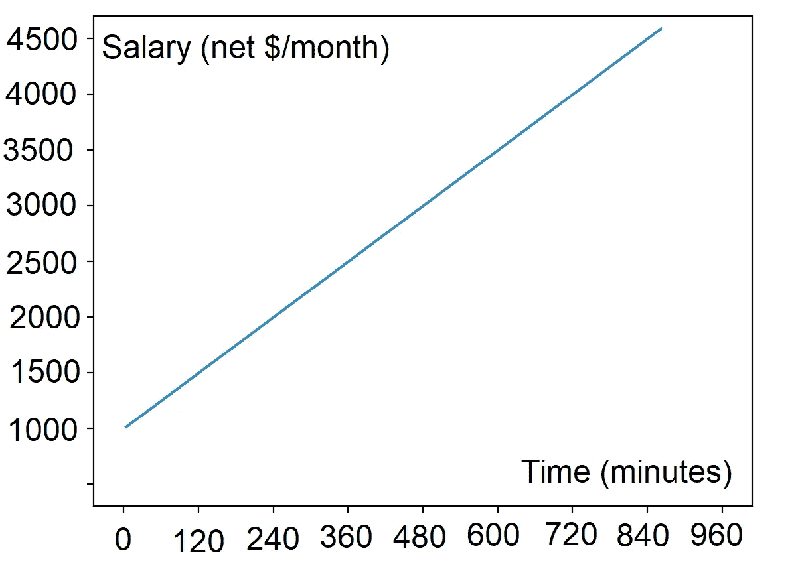

# 动态工资

> 原文：<https://medium.com/coinmonks/dynamic-salary-1d73415b3751?source=collection_archive---------33----------------------->

关于“公平工资”的概念，或者如何确保工人的工作得到公平的补偿，已经有很多笔墨。在一个理想的劳动力市场中，雇主和求职者之间的权力完全平衡，公平的工资应该采取“双赢”的形式，即雇主为工作支付工资的意愿应该符合求职者接受工作的意愿。不幸的是，在我们当前的体系中，工资被许多机制扭曲了，包括:

*   资本优先于劳动力(股息和投资者优先于工资和工人)；
*   就业勒索(将人们置于威胁生命的境地，他们几乎无法满足最基本的需求，这使他们不顾一切地寻找任何收入来源)；
*   性别主义和歧视(通过不透明的薪酬做法，雇主可以向女性、移民、少数族裔支付比其他具有类似背景/专业知识/资格的求职者更少的薪酬，而不受惩罚)。

一个透明的、动态的薪酬方案可以为这些问题提供解决方案，并确保雇主和求职者达成双赢协议。

提议的解决方案将按如下方式运行:

*   雇主会为一份工作或一项任务设定最低和最高工资，以及工作机会到期的最后期限。
*   雇主还将为一个职位设定候选人的最高人数。一旦该数字被填写，工作机会自动过期。
*   在发布工作待遇时，通过从设定的最低工资每分钟增加工资直到最后期限，工资达到雇主设定的最高工资，工资被动态调整。
*   求职者可以在任何时候提交他们的候选资格，直到达到候选资格的最大数量。

*公式:*

薪资=最低薪资+((最高薪资-最低薪资)。经过的时间/总时间)

薪金=提议薪金的动态变化。

最低工资(m) =你愿意提出的基本工资。

最高工资(M) =你愿意支付的最高工资。

经过时间(t) =当前时间和发布职务的时间之间经过的时间。

总时间=职务初始发布和职务待遇到期之间的总时间。

S = m + ((M-m)。电汇)

该算法可以以各种方式进行调整，例如使其指数化而不是线性化。

*举例:*

薪金= 1000€+((5000–1000€)。250 分钟/6000 分钟)= 1166€

一份工作的薪水在最初发布 250 分钟后从 1000€涨到了 1166€。总时间过去(6000 分钟)后，工资将为 5000€。

*优点:*

这种系统有几个优点:

*   它允许求职者等到工资达到主观认为公平的价值，考虑到他们对自己的优点、资历/经验/专业知识的个人评估。
*   它根据参与特定任务的意愿创造了更好的劳动力分配，确保雇主收到来自积极求职者而不是绝望求职者的申请，这反过来将提高生产率和工人的整体福利。
*   它是透明和开放的。
*   它提供了关于劳动力市场平衡和均衡状况的关键信息。如果工作邀请收到太多低工资的出价，这可能表明工人过剩和工作短缺。如果工作机会收到的出价太少，而且只是在较高的工资范围内，这可能表明工人短缺，提供的工作太多。这些数据可用于通过各种杠杆(培训、从社区外寻找劳动力、鼓励发布更多工作机会等)来重新平衡劳动力市场。)
*   它允许雇主在挑选候选人时做出明智的选择，将他们的预算限制与他们对合格和有能力的劳动力的需求相匹配。

> 加入 Coinmonks [电报频道](https://t.me/coincodecap)和 [Youtube 频道](https://www.youtube.com/c/coinmonks/videos)了解加密交易和投资

# 另外，阅读

*   [如何使用 Solidity 在以太坊上创建 DApp？](https://coincodecap.com/create-a-dapp-on-ethereum-using-solidity)
*   [最好的卡达诺钱包](https://coincodecap.com/best-cardano-wallets) | [Bingbon 副本交易](https://coincodecap.com/bingbon-copy-trading)
*   [氹欞侊贸易评论](https://coincodecap.com/anny-trade-review) | [Paybis 评论](https://coincodecap.com/paybis-review) | [Keevo 钱包评论](https://coincodecap.com/keevo-wallet-review)
*   [印度最佳 P2P 加密交易所](https://coincodecap.com/p2p-crypto-exchanges-in-india) | [柴犬钱包](https://coincodecap.com/baby-shiba-inu-wallets)
*   [八大加密附属计划](https://coincodecap.com/crypto-affiliate-programs) | [eToro vs 比特币基地](https://coincodecap.com/etoro-vs-coinbase)
*   [最佳以太坊钱包](https://coincodecap.com/best-ethereum-wallets) | [电报上的加密货币机器人](https://coincodecap.com/telegram-crypto-bots)