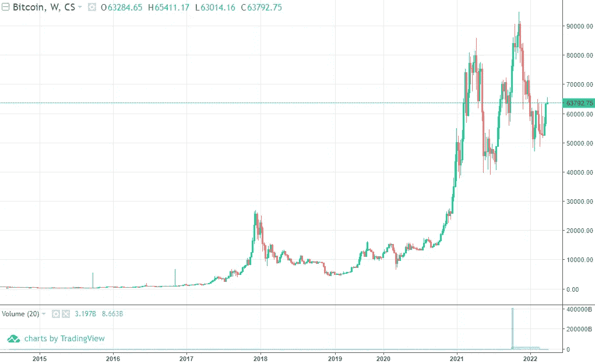
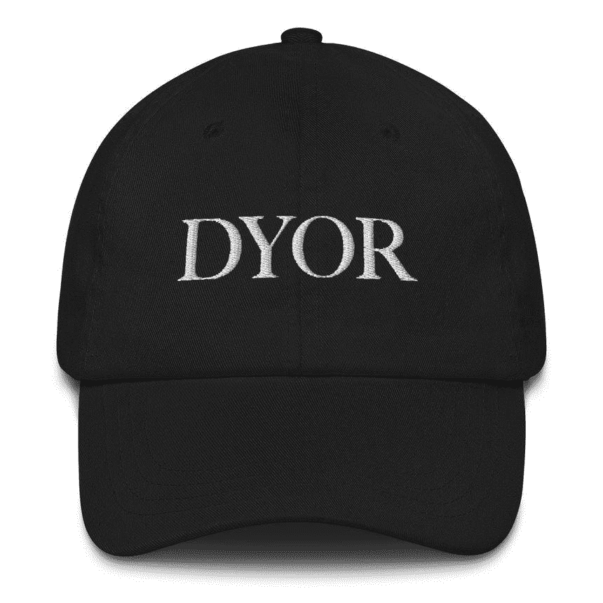

# DYOR

> 原文：<https://medium.com/coinmonks/dyor-da9a25b2510c?source=collection_archive---------69----------------------->

## 2022 年 4 月 1 日

## 最低限度的金融知识，up-only 和自己做研究

[Photo by Museums Victoria on Unsplash](https://unsplash.com/photos/bsiTsmQILog)

加密货币崛起为流行文化的一个真正令人鼓舞的方面是它作为一种推动金融文学的强制功能的作用。一个人要想参与其中，更不用说赢得胜利，就必须具备基本的金融知识。

我认为教育的这一方面与其他形式的金融投资类似，但没有人会像下一枚硬币被抛出时那样兴奋地谈论买入传统的低成本指数基金。

这种炒作一定只会导致负面后果吗？我希望不会。

在我自己的旅程中，我来自一个非常缺乏金融和经济知识的背景，学习更多密码的愿望迫使我学习并自学这些基本的货币动力学——其中的顺序很重要。动机第一，工具和技巧第二。

## '仅向上'

这是一个多产的说法在密码社区，它与历史价格表现至今。具体看比特币图表，不难看出这是如何发生的:

[Source](https://www.coinspot.com.au/chart/BTC)

但是这句话更多的是一种讽刺，而不是真实情况的反映。当然，从宏观角度来看，随着时间的推移，价格总体上一直在上涨，但这让我们太容易忽视令人反胃的价格下跌。

比特币(BTC)网络由 Satoshi Nakamato 于 2009 年[在](http://p2pfoundation.ning.com/forum/topics/bitcoin-open-source)推出，他是 Chaumian eCash、Hashcash、b-money 和 BitGold 在 20 世纪 90 年代至 21 世纪初开发的前[版本](https://nakamoto.com/the-cypherpunks/)的继承者。

我们今天所处的位置是长期形成的，它并不总是“唯一的”。事后回顾比特币迄今为止的价格表现，很容易得出这样的结论:对“[HODL](https://blog.keys.casa/what-does-hodl-mean-and-5-top-bitcoin-slang-terms-explained/)”来说，这是一件轻而易举的事情，但当你持有的资产升值 10 倍、100 倍甚至 1000 倍时，你会怎么做呢？这是近乎不可思议的、可能改变人生的回报率。想象一下价格从 50 美元涨到 500 美元，5000 美元，50000 美元。

如果我处在那个位置，我几乎肯定会早早卖出，抓住上涨的机会。早些年，比特币还是一项未经验证的技术，没有人有任何合理的方法知道这项技术是否能经受住时间的考验——看看 2017 年之前的图表数据。当然，也有一些铁杆少数族裔玩家，他们信心十足，坚持度过了所有令人胆战心惊的下跌和多年不活跃的横向价格波动，但仍然没有人能保证他们会成功。

话虽如此，crypto 现在出现在日常咖啡馆谈话中的很大一部分原因与其说是底层技术的新奇，不如说是“价格上涨”的可见性和兴奋感。除此之外，还存在“门户开放”的参与政策。任何有足够信念和资源的人都可以通过获得一定数量的 BTC 来选择加入并参与比特币网络——从最早的时候开始就是这样。

任何拥有足够强大显卡的人都可以选择用电费换 BTC，或者通过(不可靠的)外汇市场用现金换硬币。几乎可以认为 BTC 是一家任何人都可以选择加入并拥有一部分股份的技术“公司”，只是没有集中的“公司”或管理团队或员工。它通过互联网以完全信任最小化的方式在区块链上运行。

由于开放式参与和“只涨不跌”的心态，出现了一些自称比特币最大化主义者的玩家，他们向观众宣扬 BTC 的哲学(稳健的货币、财富的主权所有权、低时间偏好等等)。

“修复金钱，修复世界。”

他们讲得越大声，就越有可能接触到新的受众，并吸引更多的参与者加入他们自己已经参与其中的网络。

## 自己做研究

加密货币、不可替代代币(NFT)、去中心化金融(DeFi)和去中心化自治组织(Dao)——以上都是处于早期阶段和发展中的领域。

冒险进入未知领域的一部分，伴随着必然暴露于更大的风险表面。

“做你自己的研究”( [DYOR](https://academy.binance.com/en/glossary/do-your-own-research) )是另一个来自密码社区的口语术语。DYOR 的哲学是将在这些空间内进行的任何活动的责任推给个人，这对于一个诞生于主权财富所有权和分权国家信仰的文化来说，并不意外。

并非每个人都应该、或者必须亲自参与选择自己的投资选项，或者自行保管自己的资产，但 DYOR 也是一个指针，表明新兴体系仍处于早期和不发达状态。目前还没有，或者可能仍处于萌芽阶段的，以较低风险提供上行风险的中间媒介(如加密货币指数基金)。

Nassim Taleb 在他的书“抗脆弱性”中谈到了一个关于欠发达领域风险暴露的有趣观点。对于被视为“抗脆弱”的实体，它必须是在暴露于意外、负面事件或应激源后得到改善或变得更强大的实体。

当数以百万计的加密货币在中央交易所被盗，或者玩家错误地失去了访问[唯一种子短语](https://www.coinbase.com/learn/crypto-basics/what-is-a-seed-phrase#:~:text=A%20seed%20phrase%20is%20a,being%20like%20the%20master%20password.)的权限，该种子短语授予对加密货币资产的大量保险库的访问权限，这些所谓的“负面”事件对个人来说是坏的，但对加密货币生态系统整体来说是好的。坏消息往往像野火一样传播。

另一个类比是:让我们把企业家想象成一个探险者，他们冒险探索人类目前所知的边界，然后开始进一步探索未知。当年轻的企业家利用勇气和毅力来开创新的企业，并试图让它们起飞时，他们正在齐心协力地探索我们其他人不知道的部分。

如果他们在探险中取得了成功，并带回了他们回归人类的旅程的成果(以新技术、新见解等形式)，他们会因为愿意尝试和他们所带来的成果而得到应得的回报。如果企业家跳入火中，但失败了，生态系统(如其他企业家)作为一个整体学会在特定的时间点停止冒险进入特定的森林地带，因此以单个个体为代价改善其先前的状态。

认为个别、孤立的损失有可能给整个系统带来好处的想法，加上坏消息像野火一样蔓延的现象，可以带来对冒险进入未经探索的技术领域的体验的不同看法。

我喜欢 DYOR 的另一点是，它关注个人的能动性，并结合“边做边学”的观点，这两者共同形成了一条快速有效学习的有效途径。

[Source](https://visualizevalue.com/collections/merch/products/dyor-cap)

在我自己的旅程中，我仍在学习，并试图在前进中理解事物。本周:

*   由宇迦实验室筹集的[4 . 5 亿美元*种子*轮](https://www.businesswire.com/news/home/20220322006088/en/Yuga-Labs-Closes-450-Million-Seed-Round-of-Funding-Valuing-the-Company-at-4-Billion-Confirms-Plans-for-Metaverse-Project)(估值 40 亿美元)[无聊猿游艇俱乐部](https://opensea.io/collection/boredapeyachtclub) (BAYC)的创建者，以及幼虫实验室[creator 朋克](https://opensea.io/collection/cryptopunks)和 [Meebits](https://opensea.io/collection/meebits) 社区的最近[收购者](https://techcrunch.com/2022/03/11/bored-apes-maker-yuga-labs-acquires-cryptopunks-nft-collection/)——我与 BAYC、crypto 朋克或 Meebits 没有直接的关系，但有趣的是看到大量的金钱和目光被投向这些项目。

> 财富是根本。财富是我们想要的东西:食物、衣服、房子、汽车、小玩意、去有趣的地方旅游等等。**没有钱也可以拥有财富**。如果你有一台神奇的机器，可以根据命令给你造一辆车，给你做饭，洗衣服，或者做任何你想做的事情，你就不需要钱了。然而，如果你在南极洲中部，那里没有什么可买的，你有多少钱都没用。
> 
> **你想要的是财富，而不是金钱**。但是如果财富是重要的事情，为什么每个人都谈论赚钱？这是一种简写:**金钱是一种转移财富的方式**，实际上它们通常是可以互换的。但它们不是一回事，除非你打算靠造假致富，否则谈论赚钱会让你更难理解如何赚钱。
> 
> ——[保罗·格拉厄姆](http://www.paulgraham.com/wealth.html)

你有问题吗？反馈？让我们来谈谈 T21。

*不是中等会员？在*[*https://www.juliangoh.me/blog*](https://www.juliangoh.me/blog)*查看更多我的作品。*

> 加入 Coinmonks [电报频道](https://t.me/coincodecap)和 [Youtube 频道](https://www.youtube.com/c/coinmonks/videos)了解加密交易和投资

# 另外，阅读

*   [OKEx vs KuCoin](https://coincodecap.com/okex-kucoin) | [摄氏替代度](https://coincodecap.com/celsius-alternatives) | [如何购买 VeChain](https://coincodecap.com/buy-vechain)
*   [ProfitFarmers 回顾](https://coincodecap.com/profitfarmers-review) | [如何使用 Cornix 交易机器人](https://coincodecap.com/cornix-trading-bot)
*   [如何匿名购买比特币](https://coincodecap.com/buy-bitcoin-anonymously) | [比特币现金钱包](https://coincodecap.com/bitcoin-cash-wallets)
*   [瓦济里克斯 NFT 评论](https://coincodecap.com/wazirx-nft-review)|[Bitsgap vs Pionex](https://coincodecap.com/bitsgap-vs-pionex)|[Tangem 评论](https://coincodecap.com/tangem-wallet-review)
*   如何使用 Solidity 在以太坊上创建 DApp？