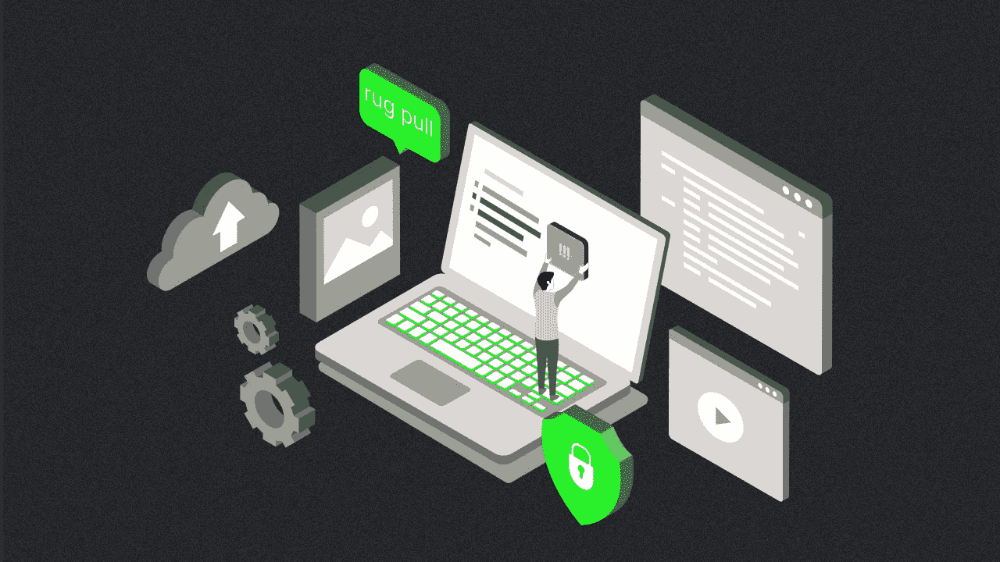
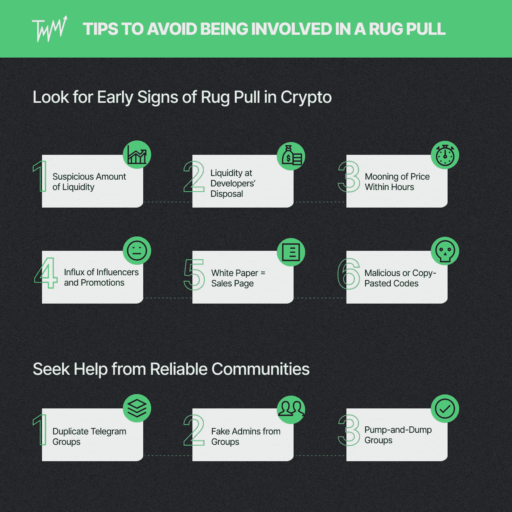

# DYOR:2022 年如何避免拉地毯骗局

> 原文：<https://medium.com/coinmonks/dyor-how-to-avoid-rug-pull-scams-in-2022-aa917de12ed?source=collection_archive---------43----------------------->

[提示&招数](https://tradermake.money/blog/tag/tips-tricks/)

*图这个:* *你是加密货币的新手。你决定将辛苦赚来的钱存入你在 Instagram、Twitter 或 YouTube 上看到的“下一个最大的”加密货币。* *你只是跟随你在社交媒体上看到的东西，而没有事先了解加密货币。另外，它只需要几块钱，似乎很多人都在追逐它。很明显，你需要一个 VIP 席位，然后你立刻买入。过一会儿，检查一下你的钱包，你的潜在利润会立即增加三倍。* *快进到第二天，大盘突然下跌。你的密码现在价值为零！他们拉你脚下的地毯，让你跌倒，所有的钱都没了。*

# 拉地毯是什么意思

这个秘密骗局非常简单。它始于开发者制造一个伪造的令牌，然后用它来交换有价值的密码。开发商有时会采取不择手段的策略，通过炒作项目来积累投资者的资金。一旦他们收集了大量有价值的密码，他们就会突然消失。

DeFi 系统通常用于实施加密诈骗，特别是 Dexes 或[分散交换协议](https://tradermake.money/blog/what-is-bybit/)。通常，加密骗局是由恶意开发者实施的。他们生产一种“狗屎硬币”,并以指数形式卖给不知情的投资者。然后，这枚狗屎硬币可以与排名第一的真正有价值的加密货币配对。一旦大量加密货币被替换为狗屎硬币，创造者就可以带着投资者的资金从流动性池中消失。

与集中式交换相比，Dexes 允许用户注册他们无用的令牌，无需任何审核就可以离开。另外，屎币相对来说更容易制造。这种令牌可以通过使用像以太坊这样的开源区块链协议来凭空产生。

加密骗局可能从最初的硬币发行(ICO)开始(甚至几个月后)就开始了。拉地毯的骗子甚至会制作难以置信的有效宣传材料来吸引 noob 投资者。狗屎硬币很容易被发现，因为它们通常在社交媒体上很响亮。

发生这种情况有三种主要方式:

每当开发人员创造一种加密货币时，他们也必须为新的加密投资者创造一种交易该令牌的方式。他们需要放一部分有价值的代币和一部分新铸造的没有价值的代币。这两者都进入交易池。这种方法允许新投资者存入法定货币来购买一些有价值的代币。然后，开发商将把他们新铸造的无价值代币交给新投资者，以换取他们的有价值代币。

随着越来越多的投资者将资金投入到系统中，这种不值钱的代币的价格就会上涨。然后，开发商可以通过提取其初始流动性来发起加密交易骗局。因此，他们最终会得到更有价值的代币(也就是你的钱)。此外，加密投资者将无法交易，因为流动性池中没有任何东西允许交易。

基本上，不诚实的开发商创造出毫无价值的代币，然后卖给投资者。任何了解区块链技术的开发人员都可以创建令牌。然而，代币从投资者的“信任”中获得其价值，如果代币实际上做了一些事情，就可以产生这种信任。否则，它被认为是一个秘密骗局。

问题是一些开发者可以让很多人相信他们的令牌有真正的价值。“这种新代币将很快发布，它将成为下一个比特币或以太坊！”他们卖给一群新的加密投资者。当代币的价格飞涨时，开发者会立即出售他们在发布会上赠送给自己的代币。最终，投资者将持有一张毫无价值的代币，它实际上什么也做不了。

一些代币创建者可以在代币中包含一段代码，不允许投资者出售他们的股份。但是，代码只允许开发者出售。因此，象征性的价格只会上升，因为人们似乎真的很紧张。

当象征性价格变得非常高时，就会出现拉地毯的情况。开发者将出售他们在发布会上赠送或购买的代币。

# 避免参与拉地毯的小贴士

新的硬币和代币到处涌现。

多种加密货币已经登上月球，让一些[投资者在几天或几周内成为百万富翁。然而，许多不幸的加密货币交易者和投资者因为拉地毯而损失了他们的钱。](https://tradermake.money/blog/best-indicators-for-crypto-trading/)

如果你想站在胜利的一边，这里有一些方法可以避免卷入一场争吵。

如果你知道如何识别危险信号，就可以避免卷入拉地毯的情况。以下是其中的一些:

在投资一个特定的代币之前，总是先检查它的流动性。任何具有少量流动性的代币都很容易被其开发者操纵。这也意味着它的开发者还没有为令牌筹集到足够的资金。另一方面，合法代币拥有数百万美元的流动性，如 [Uniswap](https://uniswap.org/) 、Kyber 和 Balancer。

一般来说，分散交易所的流动性应该是有时间限制的。开发商不应拥有流动性池。否则，在时机成熟时，他们很容易操纵或耗尽流动性池。不知情的密码交易员可能会成为这种经典的拉地毯骗局的受害者，尤其是在涉及一些营销的时候。所以，在把我们的钱放到协议上之前，总是要检查流动性状况。

Rug pulls 利用了加密交易者的 FOMO 心态。跟风陷阱可以很容易地抓住新手，而月光密码是最好的诱饵。因此，当一枚硬币在几个小时内暴涨，就有理由怀疑了。如果炒作只是 FOMO 推波助澜，远离这样的“机会”是一个好的决定。

不要让有影响力的人告诉你应该购买哪些特定的加密货币。当突然涌入推广某种加密货币的影响者时，地毯的拉力是显而易见的。名人不会看代币的代码或者白皮书。他们的受欢迎程度并不等同于良好的基本面。所以，不要让他们选择你会投资的代币。

加密白皮书应该解释硬币是如何工作的，包括它的目标、时间表、策略、令牌学和价值主张。因此，一份听起来像推销的白皮书清楚地表明，一场地毯拉力赛即将开始。通常，但不是所有时候，少于 20 页的白皮书可以表明该项目是一个加密交易骗局。

作为一个普通的加密投资者，你可能不知道如何检查一个令牌的代码。幸运的是，你可以去[地毯医生](https://rugdoc.io/)查看该项目的代码。该网站审查智能合同代码，并指出常见的地毯拉战术。您还可以检查 TokenSniffer.com 的[来比较令牌的代码和其他现有的密码。如果一个代币与另一个代币有 80%到 100%的相似度，按下拉毯按钮，带着钱跑。](https://tokensniffer.com/)

要发现这个特别的危险信号，你必须使用一个区块链浏览器，比如 [CoinMarketCap](https://coinmarketcap.com/) 、Blockchain.com 和 Tokenview。一个区块链探索者会让你看到市场上所有的代币。搜索特定的令牌，您将看到所有顶级令牌持有者(鲸鱼)的列表。如果一至三个钱包持有的代币总量超过 20%,就可能发生拉地毯事件。

当进入密码领域时，任何有经验的密码投资者都会告诉你先做自己的研究。你可以通过问四个主要问题来做到这一点:

1.  经济活跃吗？
2.  到底是什么？
3.  它是如何工作的？
4.  有什么进展吗？

你可以在这个博客中找到更多关于如何正确[DYOR 的信息。](https://tradermake.money/blog/how-to-get-into-crypto-trading/)

对加密交易和投资来说，保持对加密世界的了解是至关重要的。但是，作为一个初学者，筛选信息(和虚假信息)的海洋是困难的。

电报和不和谐的渠道和团体是非常有用的，当你做自己的研究。与阅读或观看秘密新闻和解释者相比，向交易伙伴寻求帮助更容易、更快。如果你能找到一到两个可靠的渠道/小组，你可以很容易地提出问题，并让小组中的专家帮助你——而不是搜索整个互联网。

另一方面，不和谐和电报渠道也可能成为秘密交易骗局和错误信息的滋生地。有数百个，如果不是数千个，泵和转储组，假频道，并在不和谐和电报密码客户服务模仿者。

幸运的是，你可以警惕一些危险信号，以避免加入恶意的加密电报和不和谐团体。

假电报和不和谐组可以很容易地通过复制一个原始组，包括管理配置文件和其他定制。他们通常以“折扣价”或“先到先得”的方式提供代币或 NFT。

***记住:*** *说到信物祭品，如果好得不像真的，那大概就是。*

恶意个人可能是可靠电报或不和谐团体的成员。他们捕食那些似乎缺乏密码知识的新手交易者。

假管理员会直接给你发消息，并介绍自己是该组的管理员之一。获得您的信任后，他们会要求您的私钥或种子短语。在某些情况下，假冒的管理员会要求你访问一个平台，这将允许他们[找出私人信息](https://www.einnews.com/pr_news/574663169/increasing-bitcoin-scams-worries-investors-cyber-experts-explains-how-to-spot-bitcoin-scammers)。

***专业提示:*** *如果你不认识的人给你发了关于加密的消息，立即阻止他们——毫无疑问！*

在这些骗局中，你会听到大肆宣传的台词，比如“我们将在硬币发行前一天通知我们的 VIP 会员。快点！现在就加入我们的群吧！”作为一个经验法则，不要加入那些不断谈论抽令牌的团体(或渠道)。

**警告:小心并避免拉地毯**

交易和投资密码涉及很多风险。

你可以在几个小时内赚几百万，或者在一次拉地毯事件后失去你所有的积蓄。如果你是加密投资或交易的新手，在把你的真币换成仅仅是代币之前，寻找隐藏加密的迹象。

一如既往的谨慎和 DYOR。

*原载于 2022 年 6 月 10 日*[*https://trader make . money*](https://tradermake.money/blog/tips-to-avoid-being-involved-in-a-rug-pull/)*。*

> 加入 Coinmonks [电报频道](https://t.me/coincodecap)和 [Youtube 频道](https://www.youtube.com/c/coinmonks/videos)了解加密交易和投资

# 另外，阅读

*   [TraderWagon 回顾](https://coincodecap.com/traderwagon-review) | [北海巨妖 vs 双子星 vs BitYard](https://coincodecap.com/kraken-vs-gemini-vs-bityard)
*   [如何在 FTX 交易所交易期货](https://coincodecap.com/ftx-futures-trading) | [OKEx vs 币安](https://coincodecap.com/okex-vs-binance)
*   [OKEx vs KuCoin](https://coincodecap.com/okex-kucoin) | [摄氏替代品](https://coincodecap.com/celsius-alternatives) | [如何购买 VeChain](https://coincodecap.com/buy-vechain)
*   [ProfitFarmers 回顾](https://coincodecap.com/profitfarmers-review) | [如何使用 Cornix Trading Bot](https://coincodecap.com/cornix-trading-bot)
*   [如何匿名购买比特币](https://coincodecap.com/buy-bitcoin-anonymously) | [比特币现金钱包](https://coincodecap.com/bitcoin-cash-wallets)
*   [瓦济里克斯 NFT 评论](https://coincodecap.com/wazirx-nft-review) | [比茨盖普 vs 皮奥克斯](https://coincodecap.com/bitsgap-vs-pionex) | [坦吉姆评论](https://coincodecap.com/tangem-wallet-review)