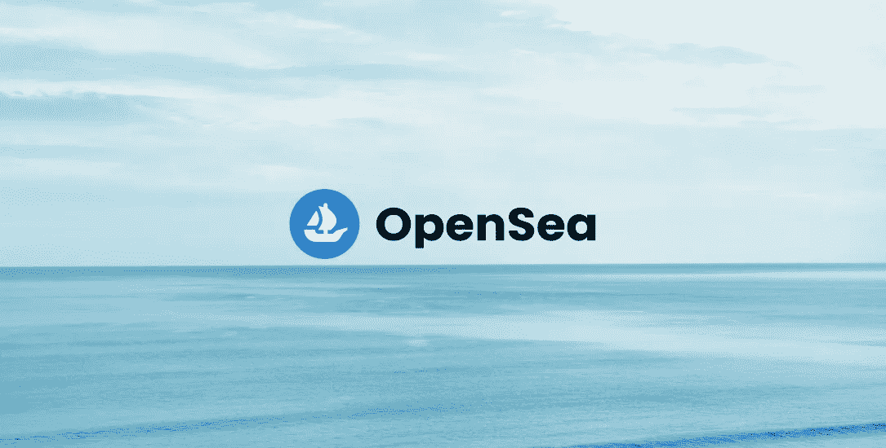

# DYOR——我应该从二级市场购买吗？

> 原文：<https://medium.com/coinmonks/dyor-participating-in-secondary-sales-like-the-rich-kids-330fc7e51f25?source=collection_archive---------59----------------------->

如果你一直在关注这个系列，并且已经阅读了[这个](/@lazymori.eth/dyor-ready-hustle-mint-i-2819ab1aa3df)和[那个](/@lazymori.eth/dyor-ready-hustle-mint-ii-5eea730a4379)，那么你可能会理解为什么刚开始进入 NFTs 的人不参与二次销售，而是只关注通过白名单造币。

造币和获得白名单是目前在 NFT 赚钱的最简单和无风险的方法，只要造币和白名单存在，它将继续存在。更不用说，这是一种了解市场运作的安全方式。然而，如果你有一个初始金额，想跳过赚取白名单的喧嚣，不想在公共铸造阶段战斗，那么你就会像'富家子弟'一样试图参与二次销售。

简单回顾一下，从技术上讲，二级销售是在有人将 NFT 在二级市场上市后立即开始的(在撰写本文时，OpenSea 是 NFT 最大的二级市场)。虽然教科书告诉我们，在二级市场发生的任何销售都被称为二级销售，但所有参与过二级销售和交易的人都知道，对于任何特定的 NFT 项目，二级销售只有在项目完全成型后才开始获得牵引力。

参与二次销售完全是另一回事，因为你受制于 NFT 项目的底价，你必须仔细权衡它的潜力。这有点像[这篇文章](/@lazymori.eth/dyor-spotting-potentially-successful-nft-projects-ii-d4c149c186b9)，我在那里谈到了一个项目的长期成功，但是今天，我们将探讨其中涉及的风险以及我们如何规避它。

# 风险:钱，很多钱

考虑铸造 0.05 eth 的 NFT。

聪明的 NFT 交易者认为这是一个会飞的正常项目，他/她可能会通过白名单和公共造币厂尽可能多地造币——假设交易者购买了 5 个。等到艺术品揭示之前，以 0.5eth 的价格卖出，然后一旦价格下跌，以 0.4eth 的价格从底价回购，直到它充分发挥潜力。

长期持有参考岗位:[此处](/coinmonks/dyor-to-hold-or-not-to-hold-i-227a985964fb)和[此处](/coinmonks/dyor-to-hold-or-not-to-hold-ii-a4e627d9f64c)。

此外，快速切换到底价。底价是 NFT 收藏目前最便宜的价格。大多数 NFT 都有某种基于设计的稀有性，或它提供的实用性，和/或因为它是一个自由市场，二级市场上通常有一个价格范围。大多数 NFT 交易者只会在场内交易。

在这里，我们将做一些计算:

成本价:0.05eth * 5 NFTs = 0.25eth，您持有 5 NFT
初始利润:0.5 eth * 5 NFT = 2.5 eth
回购后利润:2.5 eth-(0.4 eth * 5 NFT)= 0.5 eth，您持有 5 NFT

给这个项目 1 个月的时间，它确实飞了。底价是 1 英镑。但你仍然相信它还会继续下去，所以你坚持住了。

现在，介绍有钱的孩子。该项目在第一个月完成后，引起了富家子弟的注意，他们也想进入，并决定在第一个月从二级市场购买 5 个。

成本价:1eth * 5 NFTs = 5eth，富家子弟持有 5 NFT。

这个项目在这 1 个月后会进展顺利吗？只有团队、社区和公众才能做出决定。

鉴于它表现良好，底价将继续飙升，比如说它将升至 4eth。造币者会获利 20.5 先令，而交易者会获利 15 先令。你可能会认为这对在二级市场购买的富家子弟来说可能不太好，但这是富人进来的地方。

在这个例子中，有钱的孩子只买了 5 个。如果他买了 20 个呢？

成本价:1eth * 20 NFTs = 20eth，富家子弟持有 20 NFT。
4 eth 底价利润:(20 NFT * 4 eth)-(20 eth)= 60 eth 利润。

这是一个简单的计算，但你可以明白为什么在二级市场做出正确选择的有钱人很容易从游戏中获得意外之财。有了这个，你也可以更好地理解为什么更少的资本会鼓励更安全的游戏，比如白名单铸造和公开铸造，因为如果你的资本不够大，不足以在二级市场上制造更大的游戏，对于几乎相似的利润来说，这确实是不必要的风险。

这些都很好，令人兴奋，但事实恰恰相反。如果项目最终回归到零，造币工只可能为 5 个 NFT 损失 0.25eth，但是富有的孩子会为 5 个 NFT 损失 5eth。高风险、高回报——但你需要高资本才能开始梦想。

那么，初露头角的富家子弟如何规避这些高风险呢？

## 观察信息如何在几个周期内影响价格

并非所有信息都相同，也并非所有相同的信息都会产生相同的效果。这里有很多东西在发挥作用，包括总体市场表现、社区对项目的信任以及炒作。但观察影响价格的信息发布的频率以及它对市场的影响程度可能是件好事。

获得这种感觉的最好方法是来自项目社区本身——不和谐。听听开发商在说什么，营销人员是如何向公众传递信息的，创始人是如何参与进来的。然后，还要留意外界对它的反应，否则它会变成一个回声室。这里是那些没有铸造或持有 NFT 的人感知到的信息，并观察它是如何运作的。

## 追求短期低利润率，阿尔法

有了这些信息，我也会鼓励短期利润的买卖。不要拿着你的 NFT 袋子，除非你像我一样是一个懒惰的交易者。

利用因市场表现不佳而出现在看涨或既定项目上的下跌。当市场表现不佳，价格下跌时，总会有人从流动性差的 NFT 转向更稳定的投资，如硬币。这些低点很适合进场，当整体市场表现改善时出场。

此外，留意阿尔法，我们称之为独家信息。有时，所有者喜欢就即将公开的功能或更新发布公告，但不和谐的声音最先出现。如果你认为这个信息是看涨的，你可以买入并等待加油。但很快退出，因为信息泵通常会在几个小时/几天的非活动通信和更新后逐渐停止。

## 你可能会损失的钱，准备好止损

像任何 NFT 交易/投资一样，只花你能承受损失的钱。特别是在二级市场上，你必须准备好你的信息和预期会让你失败，并且有一个你想止损的限度。

有两种常见的思路。第一，你已经准备好失去你投入的钱，所以如果价值继续下跌也没关系，你会坚持到奇迹出现。另一个方法是对你开始出售你的 NFT 设定一个限制，即使这意味着你将会亏本出售。

只用你能承受损失的钱来交易。

DYOR 系列到此结束。在下一个系列中，我们将花 3 周的时间来聚焦于高级 NFT 主题，如合同、交易和天然气。

> 加入 Coinmonks [电报频道](https://t.me/coincodecap)和 [Youtube 频道](https://www.youtube.com/c/coinmonks/videos)了解加密交易和投资

# 另外，阅读

*   [Bookmap 点评](https://coincodecap.com/bookmap-review-2021-best-trading-software) | [美国 5 大最佳加密交易所](https://coincodecap.com/crypto-exchange-usa)
*   [如何在 FTX 交易所交易期货](https://coincodecap.com/ftx-futures-trading) | [OKEx vs 币安](https://coincodecap.com/okex-vs-binance)
*   [CoinLoan 评论](https://coincodecap.com/coinloan-review) | [YouHodler 评论](/coinmonks/youhodler-4-easy-ways-to-make-money-98969b9689f2) | [BlockFi 评论](https://coincodecap.com/blockfi-review)
*   [XT.COM 评论](https://coincodecap.com/profittradingapp-for-binance) | [币安评论](https://coincodecap.com/xt-com-review)
*   [SmithBot 评论](https://coincodecap.com/smithbot-review) | [4 款最佳免费开源交易机器人](https://coincodecap.com/free-open-source-trading-bots)