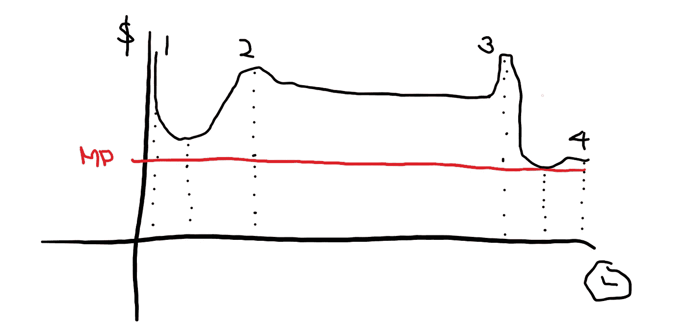

# DYOR——抱还是不抱我

> 原文：<https://medium.com/coinmonks/dyor-to-hold-or-not-to-hold-i-227a985964fb?source=collection_archive---------23----------------------->

一旦你铸造了，游戏就变了。到目前为止，除了时间，你不需要投资任何有形资产。但是，铸造意味着你必须投入一定数量的钱，因此，所有的计算都在你的头脑中开始。

每个人都会试图“在最高点卖出”,这意味着在二级市场上以最高价格出售他们的非金融资产。今天，我将分享是什么帮助我决定是否举办某个 NFT 以及举办多长时间。

# 你会赢得一些，你会学到一些

为了做好准备，在与“在最高点卖出”的想法搏斗的过程中学习是非常重要的，肯定会有我们失去机会的时候，在最坏的情况下会损失一些钱。

这是因为非金融资产变得缺乏流动性，而且很可能会长期如此。也需要一些经验来弄清楚并确定市场中的人类行为。

我也有过很多失策的时候，就当是学习的学费吧。正是所有这些教训塑造了我思考和看待这些 NFT 项目的方式。

第一课是知道你什么时候想退出。这来自你自己的研究，从你第一次发现这个项目到现在你已经创造了。

快速评估并确定你想从哪一点退出。有几个重要的退出周期你必须注意。

原谅我难看的画，正如你看到的，这不是我最擅长的。

40%成功的项目会遵循这个图表。会有一些项目落在其他图表中，我会在另一篇文章中解释。

## #1.初始价格发现阶段

他们会以全新的价格开始，然后在第一个时间点被称为初始价格发现，人们会试图以更高的价格列出它们，希望其他人会购买它们，因为价格尚未确定。

这是退出的第一个周期。当我认为接下来的局部下跌会跌破铸币价或者没有强劲反弹的炒作时，我通常会退出。这些想法应该在铸造开始之前就在我的脑海中出现，所以我知道当我已经决定在这个时候卖出时，我会立即铸造，并在它的第一个价格发现时立即卖出。

通常，人们不会在最初的价格发现阶段出售，因为他们知道一旦价格足够低，感兴趣的买家就会开始购买，这将创造反弹。

要问的问题是这样的，你相信有买家在等价格降下来吗？

## #2.局部反弹阶段

价格反弹后，下一个最好的卖出时机是在反弹期间。通常价格不会反弹到比最初价格发现更高的水平，这就是为什么在最初的价格发现阶段会有人想卖出。

而且这个时候也很难卖出因为一旦反弹停止，成交量就开始变味，成交量为王。许多人在这一点上不会“在峰值时卖出”，因为这需要一些数据和统计数据来衡量上市和转让的速度，以了解交易量是否很快就会变得过时。

在我看来，如果透露是很快，这将创造炒作，并鉴于我不急需的流动性，我会等到接近透露，这可能是最好的时机出售。

## #3.显示阶段

揭示之前的时刻可能是一个项目在短期内的最高峰值。我通常会试着不让情绪影响我，在这个时候卖掉它们以获得最大收益。

你甚至应该出售你会长期相信的项目，因为一旦披露结束，价格很可能会下跌。这种心理的发生是因为每个人都在想，如果他们在 reveal 之前购买的设计在 reveal 之后会成为稀有的设计，它会卖更高的价格。的确，一个罕见的设计或我们所说的 1/1 NFT 通常可以卖到底价的 20 到 50 倍，这取决于设计的精美程度。这就是为什么在揭示之前，价格会得到一个很好的泵，因为有人想打赌。事实是，这是富人的游戏，因为在一个系列中没有很多罕见的设计。如果你计算了多次购买的机会，并且知道从那么多次购买中得到一个稀有的会弥补你的成本，那就一定要去买。对于临时工来说，这是让富人变得更富，而你得到面包屑的最佳时机。

## #4.公用事业交付

如果你错过了预披露，不仅要担心项目是否有计划，是否有一个称职的团队能很好地沟通他们的交付。因为你将不再玩短期的持有游戏，而是长期的。

有一些项目的价格在此后很长一段时间内都超过了其披露前的最高价格，因为他们继续向 NFT 和社区提供公用事业服务。但是为了确保它能长期运行，你需要回头看看它是否具备做好的条件。

这是 40%的项目的表现，其中有一小部分不符合这种图表，要么是因为他们马上失败，要么是他们被夸大了。我们将在接下来的几周一起关注这些！

> 加入 Coinmonks [电报频道](https://t.me/coincodecap)和 [Youtube 频道](https://www.youtube.com/c/coinmonks/videos)了解加密交易和投资

# 另外，阅读

*   最佳[区块链分析](https://bitquery.io/blog/best-blockchain-analysis-tools-and-software)工具| [赚比特币](/coinmonks/earn-bitcoin-6e8bd3c592d9)
*   [Cloudbet 赌场评论](https://coincodecap.com/cloudbet-casino-review) | [点火赌场评论](https://coincodecap.com/ignition-casino-review)
*   [加密套利](/coinmonks/crypto-arbitrage-guide-how-to-make-money-as-a-beginner-62bfe5c868f6)指南| [如何做空比特币](/coinmonks/how-to-short-bitcoin-568a2d0b4ae5)
*   [如何在加拿大购买加密货币？](https://coincodecap.com/how-to-buy-cryptocurrency-in-canada)
*   [无聊猿游艇俱乐部(BAYC)回顾](https://coincodecap.com/bored-ape-yacht-club-bayc-review) | [拜比特 vs 比特币基地](https://coincodecap.com/bybit-vs-coinbase)
*   [5 款最佳加密交易终端](https://coincodecap.com/crypto-trading-terminals) | [最佳 DeFi 应用](https://coincodecap.com/best-defi-apps)