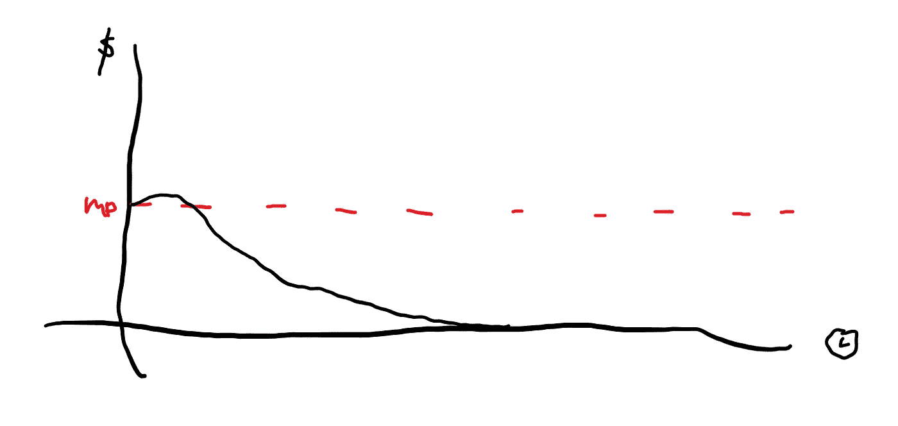
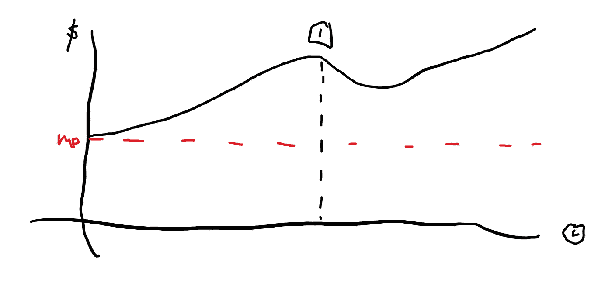

# DYOR——坚持还是不坚持 II

> 原文：<https://medium.com/coinmonks/dyor-to-hold-or-not-to-hold-ii-a4e627d9f64c?source=collection_archive---------66----------------------->

在[的上一篇文章](/coinmonks/dyor-to-hold-or-not-to-hold-i-227a985964fb)中，我回顾了第一次也是最常见的成功的 NFT 发射。今天，我再研究两个。

第一个是通常不成功的 NFT 发射。不出所料，它占了该领域 NFT 项目的 50%,因为有很多成功的项目，也有更多不成功的项目。原因可能是因为团队完全想要地毯，或者艺术和实用程序没有太多的价值来支撑信心，或者只是在社区内没有足够的宣传。因此，项目通常会遵循如下图表:

这看起来很简单，事实也确实如此，因为 NFTs 的性质和项目的不成功启动很可能会使其归零。然而，请注意，在上市后，它的价格在跌至零之前有一个小的峰值。

如果一个项目卖不出去，这个图表就不会存在，因为当公共造币厂仍然可用时，进行任何二次销售都没有意义。但如果它真的卖完了，投机者可能会有一点点交易量，这是退出市场的好时机。

有时，当你听说 NFT 有影响力的人打电话给“免费薄荷糖”时，这也是我们所说的退化游戏，最初的峰值可能会变得巨大。如果你够敏捷，你可以加入呼叫并迅速退出。

然而，也有真正的项目属于这一类，这就是为什么不是所有的白名单造币厂或公共造币厂都需要你的参与。到目前为止，你应该能够自己做足够多的研究，知道一个项目是否会朝着这个方向发展。

所以对于最后的 10% —它属于这个领域的传奇。它不会总是发生，当它发生的时候会让你大吃一惊。这些项目是如此成功，一旦他们造币厂出来，你永远不会看到他们在任何地方接近其造币价格。事实上，价格将继续飙升，新玩家已经以高价买入。当足够多的人这样做的时候，一个新的底线将被建立。给它足够的时间和动力，新的地板将不断得到重置，直到炒作结束。价格会被夸大吗？最有可能，但降不降取决于团队的一致性和交付。

如果你真的以极低的价格进入了这些项目中的一个，你唯一关心的是在你认为它被夸大到难以置信的时候卖掉它们，并且价格最终会很快自我修正。

然而，如果你没有机会去创造它，并且想要进入，只有一个时期:后揭露时期。大多数项目在 reveal 期间会下降，并将继续下降，但这些传奇项目最终会反弹。如果你真的相信这个项目，这是你最好的购买机会。

要小心，因为有些项目一开始可能看起来像这样，但是在揭露之后会陷入无人区。你只有真正知道这些项目在展示后是否会成为 10%的项目。不过不要被愚弄了，虽然这可能是艺术的问题，因为这是一个艺术展示，但这通常与团队有关——缺乏沟通、交付等。

这是我如何看待 NFT 项目并决定是否应该持有它们的三张图表。我希望它也能对你有所帮助。

> 加入 Coinmonks [电报频道](https://t.me/coincodecap)和 [Youtube 频道](https://www.youtube.com/c/coinmonks/videos)了解加密交易和投资

# 另外，阅读

*   [币安 vs FTX](https://coincodecap.com/binance-vs-ftx) | [最佳(SOL)索拉纳钱包](https://coincodecap.com/solana-wallets)
*   [如何在 Uniswap 上交换加密？](https://coincodecap.com/swap-crypto-on-uniswap) | [A-Ads 评论](https://coincodecap.com/a-ads-review)
*   [加密货币储蓄账户](/coinmonks/cryptocurrency-savings-accounts-be3bc0feffbf) | [YoBit 审核](/coinmonks/yobit-review-175464162c62)
*   [Botsfolio vs nap bots vs Mudrex](/coinmonks/botsfolio-vs-napbots-vs-mudrex-c81344970c02)|[gate . io 交流回顾](/coinmonks/gate-io-exchange-review-61bf87b7078f)
*   [CoinFLEX 评论](https://coincodecap.com/coinflex-review) | [AEX 交易所评论](https://coincodecap.com/aex-exchange-review) | [UPbit 评论](https://coincodecap.com/upbit-review)