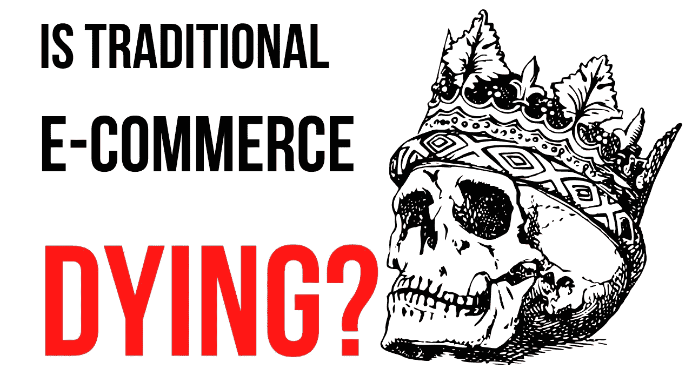
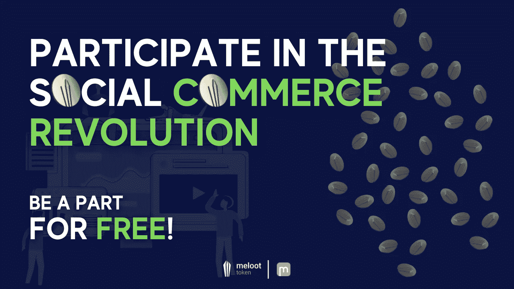
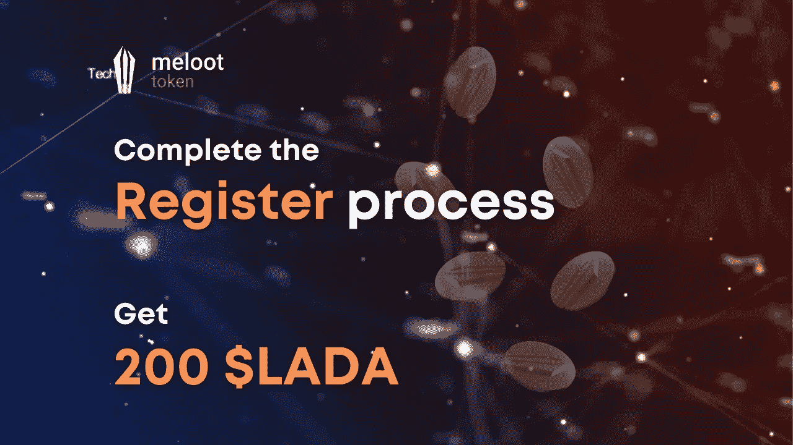

# 电子商务正在消亡。

> 原文：<https://medium.com/coinmonks/e-commerce-is-fully-moving-into-crypto-8e52ca19a3d3?source=collection_archive---------43----------------------->

当我们说**“革命”是什么意思**会点燃它的火花？**社交商务**。需求市场要求应用程序具有集成的解决方案。

> 这很简单，就在眼前，这个想法将彻底改变商业 meloot token。

## 📍什么是 meloot token？

Meloot token 功能齐全，是有史以来第一个使用社交商务平台。

## 📍什么是 meloot？

Meloot 是一个**社交商务平台**。我们是一个**视频**和**现场商务**平台，比其他任何电子商务平台更有效地将访问者转化为买家。你可以把我们看作是抖音和亚马逊的组合，将抖音的用户界面和亚马逊的电子商务能力结合起来——通过视频和直播将人们与他们喜欢的产品联系起来。

🔷 ***在我们继续如何支持免费项目*** *之前，有几个主题和概念我们想向您介绍一下:*

1.  [当前的联盟营销模式](/@meloot_token/whats-wrong-with-affiliate-marketing-98d496ae7115)📢
2.  [创作者经济是什么？](/@meloot_token/the-creators-economy-ca9ccedbdbb3)📢

🔷关于主题的更多信息/深度:

1.  [基本常见问题解答](/@meloot_token/meloot-token-faq-answers-f45e90255c7d)📢
2.  [meloot 项目白皮书](https://token.meloot.com/assets/pdf/meloot-whitepaper-6b21b89678e30d0d855174a225dfdecfd03694f5478f299a57a31932a861d518.pdf)📢

**📍*如果你对所展示的一些概念不感兴趣，只想赚点钱，*** *我们鼓励你继续阅读，或者直接向下滚动到****📍*如何支持项目段？”****

## *📍在 meloot 平台的最初想法上，我们加入了一些 web 3.0🔥香料🔥方程式。*

*Meloot token (LADA)为 Cardano 上的第一个社交电子商务生态系统提供动力。它可以用来购买实物产品、购买数字产品、获得现金返还和折扣、推广内容、赌博和管理。它可以通过**在现场销售产品**或通过**联盟营销**在现场和场外销售产品来获得。允许人们在没有昂贵的信用卡和支付网关费用的情况下进行交易是 meloot 令牌的主要优势之一。它还让您能够与其他用户联系、互动和互动，同时为您提供购物的机会。*

***📍我们在创新什么？***

*meloot 应用程序具有创新性，因为它的主要功能是创作者市场、商家市场、在线直播购物、基于视频的界面(即视频商务)和集成的会员系统——目前，市场上没有一个平台集成了广告和购买流程。*

***📍关键特性？***

*除了基于视频的界面之外，网站的主要特色是市场。平台上有两个市场:创造者市场和商人市场。创造者的市场将使任何用户成为有影响力的人，并访问他们否则无法与之合作的产品。我们正在改变它，为什么公司会找到有影响力的人，为什么不让市场为你销售你的产品！奖赏是以象征性的方式给予的。商业市场使任何人都可以把他们的产品放在网站上，并通过视频销售。唯一的区别是，现在他们有未来的销售力量，创造者的市场免费为他们销售产品，一个自我维持的系统，供应和需求都明智！*

***📍令牌组学是如何工作的？***

*LADA 是通过创造者的市场给予创造者的。创作者通过视频销售的每件产品都会获得奖励。奖励金额由 LADA 币决定。有影响力的人将通过他们的内容获得一定比例的总销售额。收到的百分比将因七个不同的变量而异，我们将使用这些变量来衡量视频和影响者的成功率。*

*我们用来确定联盟视频成功的变量是观看次数、参与率、增长率、商家缺陷、产品缺陷、观看时长和转换率。*

*最棒的是，我们把这一切都建立在卡尔达诺上！*

**

# *📍如何支持项目？*

*🔥🔷 [**深度讲解**](/@meloot_token/new-meloot-token-website-a02b516733df) 🔷🔥*

****简短解释？继续读就好。****

*📍我们鼓励您完成注册过程，以便您可以申领您的🔥200 LADA 或 10 美元，所以更准确🔥并参与 meloot token 公开发售。*

*📍要完成注册过程，您需要:*

*🔷确认您的电子邮件地址，*

*🔷提供您的卡达诺本地令牌钱包地址，*

*🔷完成 KYC 进程。*

## *📍如果您完成了上述步骤，并且喜欢该项目，您可以参与公开销售。*

*🔥🔷 [**深度解说**](/@meloot_token/meloot-token-public-sales-how-to-invest-b03136908586) 🔷🔥*

****简短解释？继续读就好。****

*📍要购买代币，请前往 [meloot 代币网站](http://www.token.meloot.com)。*

*📍如果你运气好的话，你很快就明白了这篇文章，并设法以⭐️ **溢价** ⭐️买到了 meloot token*

*📍我们期待着与您见面，有关此次销售的更多信息，请加入 meloot token 官方社交媒体渠道:*

*🌐网站—[https://token.meloot.com/](https://token.meloot.com/)*

*📃白皮书— [meloot 令牌白皮书](https://token.meloot.com/assets/pdf/meloot-whitepaper-6b21b89678e30d0d855174a225dfdecfd03694f5478f299a57a31932a861d518.pdf)*

*📢电报通知—[https://t.me/meloot_token](https://t.me/meloot_token)*

*https://t.me/meloot_token1🗣电报讨论组—*

*https://twitter.com/meloot_token🕊推特*

*🚀不和谐—[https://discord.gg/TxmBPaHKqE](https://discord.gg/TxmBPaHKqE)*

*📎中等—[https://medium.com/@meloot_token](/@meloot_token)*