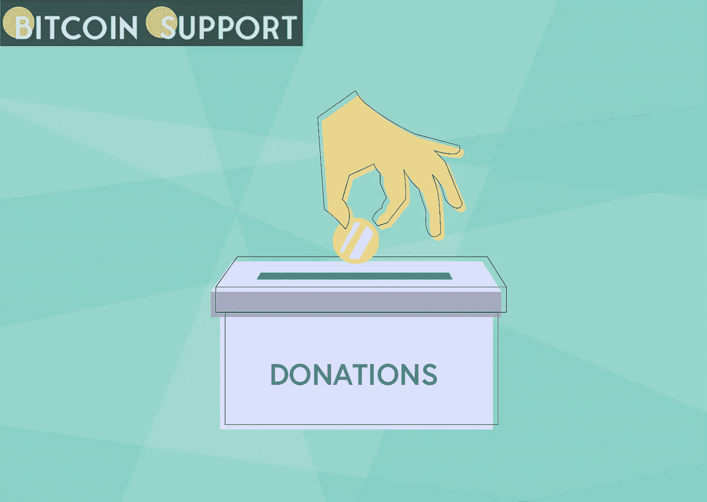

# 每个比特币都有贡献:乌克兰的人道主义援助将由加密货币资助

> 原文：<https://medium.com/coinmonks/each-bitcoin-contributes-ukraines-humanitarian-assistance-will-be-funded-by-cryptocurrency-43cbc644cc48?source=collection_archive---------49----------------------->

**Visit our website:-** [**https://bitcoinsupports.com/**](https://bitcoinsupports.com/)

捐赠的每一点加密货币都有助于乌克兰人，明确表明加密是金融捐赠的未来。乌克兰人民比以往任何时候都更需要国际社会的援助。随着俄罗斯和乌克兰之间的对抗加剧，国际社会必须团结在乌克兰政府身后，以恢复这个东欧国家的和平与稳定。
令人惊讶的是，加密货币社区如此迅速地团结在乌克兰人民的身后。俄罗斯军队进入乌克兰领土两天后，乌克兰政府通过推特请求加密货币捐赠，给出比特币和以太坊钱包地址。乌克兰副总理米哈伊洛·费多罗夫在他的推特账户上证实了捐款请求是真实的，并敦促人们团结起来支持乌克兰。

[https://Twitter . com/FedorovMykhailo/status/1497549813205848068](https://twitter.com/FedorovMykhailo/status/1497549813205848068)

**在乌克兰副总理公布政府的加密地址后不久，加密货币就开始以前所未闻的速度涌入乌克兰政府的钱包。事实上，乌克兰在 Chainalysis 的全球加密采用指数中排名第四，该指数预测每年约有价值 80 亿美元的比特币进出该国。据《纽约时报》报道，加密货币的日交易量超过了银行间格里夫纳的交易量。**

**Visit our website:-** [**https://bitcoinsupports.com/**](https://bitcoinsupports.com/)

乌克兰政府最初筹集了 400 万美元，然后是 1300 万美元，最后在 3 月份筹集了 3700 万美元。几天后，乌克兰政府筹集了总额超过 5500 万美元的加密货币。此外，根据乌克兰数字转型部副部长、该国事实上的加密货币发言人亚历克斯·博尔尼亚科夫(Alex Bornyakov)的说法，最近，乌克兰政府表示，它已经收到了“近 1 亿美元”的加密捐款。乌克兰的国债在一周前达到了 1.08 亿美元。这清楚地表明，加密社区正在实现他们从一开始就设定的目标——在不使用中介的情况下即时、无缝、廉价地转移现金，因为他们的用户认为这是正确的做法。世界各地的加密社区已经通过其大量捐款表明，它支持和平、稳定，老实说，也支持乌克兰人民。

在经济上，捐赠给乌克兰政府的价值数百万美元的加密货币可能会改变游戏规则。这是公众支持乌克兰总统弗拉基米尔·泽伦斯基的明确证据。Crypto 能够突破官僚主义的繁文缛节，这是向比以往任何时候都更需要援助的乌克兰人民提供即时援助的最有效方式之一。这就是比特币被创造出来的原因——让资本在需要的地方自由流动。

NFT 平台、Dao 和其他创建 Web3 的参与者通过向乌克兰政府捐赠从加密到非功能性传输系统的一切，展示了他们的价值观。无聊猿游艇俱乐部(BAYC)的创始人在 ETH 向乌克兰政府捐赠了 100 万美元。BAYC 团队提供的资金与 BAYC 社区成员筹集的资金相当，他们为乌克兰集体筹集了近 100 万美元。此外，总部设在乌克兰的分散式标桩提供商 Everstake 向乌克兰提供了第一笔金额为 100 万美元的财政援助，这笔援助是由更广泛的 Solana 社区提供的。

https://twitter.com/BoredApeYC/status/1501333629804244993

有许多例子可以说明 NFT 和 DAO 是如何响应乌克兰政府的号召的，从有人将价值超过 20 万美元的 5364 号密码朋克发送到乌克兰的以太坊钱包，到乌克兰 Dao 通过在 NFT 的销售获得超过 600 万美元的收益，以造福乌克兰平民。道斯和 NFT 公司已经非常明确地表示，他们反对战争，并希望俄罗斯入侵尽快停止。

**加密货币:事业支撑的未来？在这场可怕的欧洲危机中，我们见证了区块链如何让我们以以前不可能的方式扩展我们的努力。传统的筹款方式缓慢、昂贵，而且经常充斥着欺诈和腐败。金钱的无国界性改变了人们为他们关心的事业捐款的方式。当捐赠者使用比特币或另一种加密货币时，他们可以百分之百地保证他们的钱会到达预期的目标和活动。他们只需要钱包的地址，并会将硬币交付给它。他们可以在以太扫描等区块链上查看自己的捐赠，让所有捐赠人放心，他们的现金已经用于让接受者受益。

比特币和其他加密货币已经成为全球范围内最便宜、最快、最安全的金融交易方式。乌克兰政府可以安全地持有加密货币，而不用担心入侵部队夺取它，或者他们的金融系统因战争而崩溃。需要说明的是，在乌克兰，数字硬币的确名副其实地促进了跨境资金转移。

**访问我们的网站:-**[**https://bitcoinsupports.com/**](https://bitcoinsupports.com/)

**免责声明:以上为作者观点，不应视为投资建议。读者应该自己做研究。****

> 加入 Coinmonks [电报频道](https://t.me/coincodecap)和 [Youtube 频道](https://www.youtube.com/c/coinmonks/videos)了解加密交易和投资

# 另外，阅读

*   [比特币基地 vs 瓦济克斯](https://coincodecap.com/coinbase-vs-wazirx) | [比特鲁点评](https://coincodecap.com/bitrue-review) | [波洛涅克斯 vs 比特鲁](https://coincodecap.com/poloniex-vs-bittrex)
*   [德国最佳加密交易所](https://coincodecap.com/crypto-exchanges-in-germany) | [Arbitrum:第二层解决方案](https://coincodecap.com/arbitrum)
*   [币安交易机器人](/coinmonks/binance-trading-bots-d0d57bb62c4c) | [OKEx 评论](/coinmonks/okex-review-6b369304110f) | [Atani 评论](https://coincodecap.com/atani-review)
*   [最佳加密交易信号电报](/coinmonks/best-crypto-signals-telegram-5785cdbc4b2b) | [MoonXBT 评论](/coinmonks/moonxbt-review-6e4ab26d037)
*   [如何在 Bitbns 上购买柴犬(SHIB)币？](https://coincodecap.com/buy-shiba-bitbns) | [买弗洛基](https://coincodecap.com/buy-floki-inu-token)
*   [CoinFLEX 评论](https://coincodecap.com/coinflex-review) | [AEX 交易所评论](https://coincodecap.com/aex-exchange-review) | [UPbit 评论](https://coincodecap.com/upbit-review)