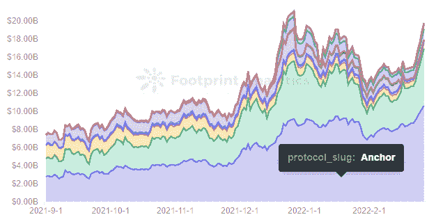
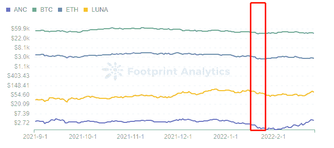
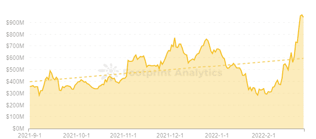
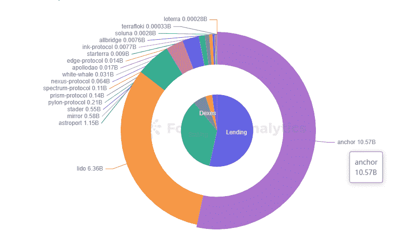

# 在稳定的收入上赚取 20%的 APY？这就是锚协议所承诺的

> 原文：<https://medium.com/coinmonks/earn-20-apy-on-stablecoins-thats-what-anchor-protocol-promises-64e40e1a24e6?source=collection_archive---------71----------------------->

脆弱但坚定的锚协议，该如何成长。

2022 年 2 月，格蕾丝

数据来源:足迹分析[锚协议仪表板](https://www.footprint.network/guest/dashboard/anchor-protocol-dashbord-fp-5a781905-2fef-43fa-b1aa-99d18815f173?channel=u-DnmMUY#secret=74D09497B2B8522F289714E29509E2FF)

2 月 10 日，Terra 在推特上表示，将向其官方 DeFi 平台 Anchor Protocol 注入 4.5 亿美元。自从 Terraform 实验室基金会向该项目注入大约 7000 万美元以来，该声明已经发布了将近一年。

虽然 Anchor 看起来与大多数其他贷款协议相似，但 stablecoins 的高 APY(总是在 20%左右)使其脱颖而出。在本文中，我们将了解锚协议是如何工作的，以及它是如何实现如此高的回报的。

# 锚协议是如何工作的

锚协议有三个主要优点:

*   **简朴。**将 UST 存入 Anchor 协议，获得固定的高利率。
*   **稳定。**通过多个 PoS 区块链的奖励实现稳定的利率。
*   **高 APY。** APY 在 19%-21%之间波动，基本保持在 20%。

锚协议定义了借贷双方之间的货币市场。这个市场的年化不是由传统的供求关系决定的，而是由多个 PoS 区块链之间的协调奖励决定的，稳定在 20%左右。

**借贷**

贷方将 aTerra 存入锚货币市场，并收到铸造产生的 aTerra 作为收据。这可用于赎回、按比例计息和贷款人补贴。

按比例分配的利息通常从借款人收到的收益准备金或 ANC(锚协议的治理令牌)中支付。

贷款人存放在货币市场上，经汇总后贷给借款人的款项。

**借款**

借款人提供 bAssets(货币市场上的贷款抵押品)进行存款，以建立贷款头寸，获得借款和流动性。贷款头寸的 LTV(贷款价值比)需要低于货币市场设定的最大值，否则，资产将被清算。

流动性的提供可以用 ANC 来回报，ANC 可以用来偿还借入资金的利息。bAssetas 应该在货币市场白名单之内，现在只有 LUNA 和 ETH 可用。

**清算**

清算人专注于高风险贷款。如果 LTV 高于最大值，清算人将对被清算的合同进行投标。它提出以折扣率购买被清算(借款人)的资产，在 UST 支付。

# 锚协议的统计数据

**TVL:**

查看过去 180 天的 [Footprint Analytics](https://www.footprint.network/) 数据，Anchor 的 TVL 在 1 月 17 日达到 94.6 亿美元的历史高点，在 9 月 21 日达到 25.1 亿美元的低点。

[*Footprint Analytics — TVL of Terra*](https://www.footprint.network/guest/chart/tvl-of-anchor-protocol-fp-f28cac73-a656-4f68-a7d9-7b2c19fdf573?channel=u-DnmMUY#secret=D937092B6C1BB7166DDA3606558B6EC6)

**代币价格:**

结合 LUNA 唯一的白名单 bAssets，可以推断 ANC 的价格多少受到了 LUNA 的影响。总的来说，ANC 继续受到加密货币大趋势的影响。

[*Footprint Analytics — Price of ANC, BTC, ETH & LUNA*](https://www.footprint.network/guest/chart/price-of-anc-btc-eth-luna-fp-258fe243-4834-4793-a1b6-e91e744669b7?channel=u-DnmMUY#secret=E24892A76EDAD69DD2267A659AAAD764)

**市值:**

ANC 的市值在过去 180 天里保持相对稳定，在 4.5 亿美元左右上下波动，最高时达到 7.73 亿美元。总的趋势是稳步增长。

[*Footprint Analytics — Market Cap of ANC*](https://www.footprint.network/guest/chart/market-cap-of-anc-fp-6b343612-a374-4984-aac7-30031c38c1ba?channel=u-DnmMUY#secret=9C6B6713176EE57CE8F1063E6744560B)

锚协议对 Terra 有多重要？

从 Anchor 协议的统计可以看出，Anchor 上线不到一年，却已经取得了不错的成绩。

Anchor 通过提供 APY 20%的稳定存款，寻求成为 DeFi 的基准，这高于大多数项目提供的平均稳定存款利率。

**市场份额**:

锚为 Terra 提供了 71.07%的 TVL

如果锚崩溃，那么等价的 TVL 将为零。Terra 可能会跌出前 10 大公共连锁店。毕竟，Anchor 87.1 亿美元的 TVL 代表了 Terra 71.07%的 TVL。

[*Footprint Analytics — TVL of Terra by Protocol*](https://www.footprint.network/guest/chart/tvl-of-terra-by-protocol-fp-d3be96e0-e5e5-4138-bc9b-205b6950e88d?channel=u-DnmMUY#secret=2DB0294DF322AA4613270DCA3447601D)

因此，锚对 Terra 生态系统至关重要。

Anchor 中最常用的抵押品是 UST，由 LUNA 铸造，与美元挂钩，汇率为 1 美元兑 1 欧元。如果 UST 短缺或供应过剩，露娜的价格将受到影响，从而进一步影响 Terra 生态系统。

这样，Anchor 就重要到足以扰乱 Terra，这也是 Terra 官方多次注入资金的原因。

# 关于锚协议的几点思考

外部资本注入不是一条长期可持续的道路。一旦熊市到来，Terra 的官方注资将无法继续覆盖锚。最终，Anchor 项目需要改进其当前的模型，并增强其对抗加密货币下行风险的能力。主播可以关注以下 3 个要点。

*   **添加 bAssets 白名单。**目前白名单只支持 LUNA 和 ETH，比较同质化。有太少的抵押品来创造短腿。
*   **保持 UST 与美元挂钩，或加强土地生态系统。**提高 LUNA 的稳定性，减少 aUST 的大规模套利机会，维护主播生态系统的稳定。
*   **完善模型。**增加借款激励，提高借款人质押资产的意愿，保持锚定盈亏平衡。或者储备基金的收益可以是开源的。

Anchor 还面临一些风险，如可能的黑客攻击和 UST 与美元脱钩。用户在投资前要仔细考虑自己是否能承担投资的风险。

***此片由*** [***足迹分析***](https://www.footprint.network) ***社区供稿。***

> 加入 Coinmonks [电报频道](https://t.me/coincodecap)和 [Youtube 频道](https://www.youtube.com/c/coinmonks/videos)了解加密交易和投资

# 另外，阅读

*   [有哪些交易信号？](https://coincodecap.com/trading-signal) | [比特斯坦普 vs 比特币基地](https://coincodecap.com/bitstamp-coinbase)
*   [ProfitFarmers 回顾](https://coincodecap.com/profitfarmers-review) | [如何使用 Cornix Trading Bot](https://coincodecap.com/cornix-trading-bot)
*   [如何在势不可挡的域名上购买域名？](https://coincodecap.com/buy-domain-on-unstoppable-domains)
*   [印度的秘密税](https://coincodecap.com/crypto-tax-india) | [altFINS 审查](https://coincodecap.com/altfins-review) | [Prokey 审查](/coinmonks/prokey-review-26611173c13c)
*   [赢取注册奖金——10 大最佳加密平台](https://coincodecap.com/earn-sign-up-bonus)