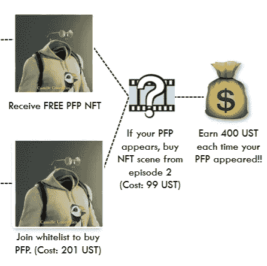

# 从日常活动中赚取密码？

> 原文：<https://medium.com/coinmonks/earn-crypto-from-everyday-activities-af342af1e642?source=collection_archive---------10----------------------->

*出现 2 赚，玩 2 赚，移动 2 赚，学习 2 赚。这一切意味着什么？*

对于 TL/DR:阅读我这篇文章的 twitter 帖子[这里](https://twitter.com/TokenMotion_/status/1520537187414323200?s=20&t=JQX56vmdGyWPSGKy3uOPEg)。

[**https://www.freepik.com/vectors/ico**](https://www.freepik.com/vectors/ico)**. Ico vector created by macrovector — www.freepik.com.**

传统经济通常由工作挣钱模式驱动。另一方面，加密空间为商业化打开了全新的大门，为人们的努力提供了更公平的激励机会。

***这样的例子包括:***

1.  ***出现 2 赚***
2.  ***玩 2 赚***
3.  ***移动 2 赚***
4.  ***学二赚***

让我们更详细地探究一下。在本文中，我们将探索这些模型是如何工作的，并提供一些很好的例子来帮助您开始。

# **出现 2 赚(A2E)**

蒂姆·隐形人作品集由一系列的动画短片组成，这些短片将在区块链土地上制作。蒂姆背后的创作者开创了“出现 2 赚”的概念，PFP 的持有者每次在蒂姆旅程的未来动画场景中出现时可以获得 400 UST。

Tim on the train: Spot the HellCat poster tucked away on the wall of the train carriage.

几乎和任何电影一样，你需要一个场景或场景，以及一些不同的角色。如果没有场景和角色，就不会有太多值得你看的东西。同样，蒂姆 NFTs 系列也可以分为两大类:

*   场景——蒂姆的旅程将被记录在包含一系列动画场景的四集里。
*   **隐形人 PFP 角色**——隐形人 PFP 将于 5 月 10 日在 [OnePlanet](https://www.oneplanetnft.io/) 上线。

这些隐形人 PFP 将在由 [NFWorks](https://twitter.com/TheinvisibleTim) 团队开发的 Appear 2 Earn 概念中发挥关键作用。

Example of how an Invisible People PFPs might appear in the Tim: The Invisible Man storyline.

在某种意义上，你的隐形人 PFP 是演员，你是经理，获得所有的回报！这并不像音乐产业中一些引人注目的案例那样，不敲任何人的竹杠。杰瑞·海勒。

那么《显现 2》是如何挣钱的呢？

*   加入白名单，铸造一个隐形人。查看蒂姆·隐形人推特上的白名单。
*   为 201 UST 铸造你的亲民党角色。
*   如果你的 PFP 出现在蒂姆之旅的未来场景中，买一个你的 PFP 出现的 NFT 场景。
*   每次您的 PFP 出现在未来场景中，您都可以获得 400 UST！

请参见下面的信息图了解更多详情:

Appear 2 Earn with Invisible People PFPs.

蒂姆·NFT 收藏的 201 个亲民党角色中的每一个都有不同的稀有性。

每个角色的稀有性对应于他们与蒂姆的关系有多密切，这将影响每个角色出现在蒂姆的旅程中的可能性——这反过来决定了你在你的 PFP 出现时获得 400 UST 的可能性！

Tim Invisible People PFP rarity chart (left). Bar graph (right) displays the likelihood of each PFP appearing in the storyline and earning you UST.

但是请记住，稀有性并不是决定你的 PFP 出现几率的唯一因素。Tim 动画 NFT 遵循一个由社区主导的故事情节，Tim NFT 的持有者将可以访问 [Tim discord](https://discord.gg/jw5jPUzeQV) 上的独家频道，在那里他们可以对 Tim 旅程的下一步进行投票，从而让 Tim NFT 的持有者有机会影响他们的 NFT 出现的可能性。

# **玩 2 赚(P2E)**

全球博彩业价值现已超过 3000 亿美元。目前，大部分游戏空间采用付费游戏模式，用户将把辛苦赚来的钱用于地图包、玩家和武器升级，甚至是定制玩家美学的皮肤。

另一方面，Play 2 Earn (P2E)帮助用户从游戏行业创造的惊人收入中分得一杯羹，用户在游戏时可以获得加密货币奖励。毕竟，是游戏玩家花了一天中的所有时间来磨练他们的技能和推广游戏，为什么他们不应该得到奖励？

在过去的一年里,“赢得空间”这出戏的活动激增。Axie Infinity 可能是最著名的 P2E 游戏，玩家收集和战斗数字宠物。仅这款游戏就吸引了令人垂涎的 20 亿美元总销售额。还有很多 P2E 游戏，多得数不过来！

因此，在这篇文章中，我们将对 Terra 区块链上的一系列游戏进行高度介绍，包括

*   *德比球星*
*   *可播放的*
*   *第 77 部*

***德比群星***

[德比群星](https://derbystars.com/#section1)是一款备受期待的元宇宙赛马游戏，在区块链上进行。玩家将能够训练、升级、繁殖和交易马匹，同时也能够欣赏德比之星令人印象深刻的卡通渲染图形。

Derby Stars Official Teaser Trailer.

要了解更多关于德比球星的信息，我强烈推荐阅读 Speicherx 的这篇精彩综述。

*Playible 是一款赚取梦幻体育游戏的游戏，在该游戏中，运动员被描绘成 NFT。玩家进入他们的梦幻团队，参加永久免费的竞赛，他们可以以$UST 的形式获得被动收入。Playible 平台目前专注于 MLB，作为他们的第一个梦幻联盟，但计划在不久的将来也为 NBA，NFL 和 NHL 建立联盟。*

*考虑到 Terra Labs 已经与华盛顿州国民 MLB 合作，Playible 很好地定位于实现一些主要的采用。*

*Playible fantasy sports on Terra.*

*要了解更多关于 Playible 的信息，请阅读 OnePlanet [的这篇精彩综述。](/@oneplanet.nft/inside-look-at-playible-bringing-nft-fantasy-sports-to-terra-99975c2d278d)*

****部门 77****

*《第 77 部》是一款关于区块链的 web3 科幻策略游戏。以 2322 年为基础，玩家将沉浸在一个故事驱动的宇宙中，在这个宇宙中，人类正在为控制分散在太阳系中的铱矿而斗争。*

*玩家可以从六个收藏中的一个中铸造赏金猎人 NFT，可以通过训练来提高他们的统计数据，然后派出去执行赏金任务，其中可能包括破坏、黑客攻击、勘测、暗杀等等。*

**

*Department 77 Bounty Hunter NFTs.*

*通过在任务中发送赏金猎人 NFT，玩家将能够获得 77 部门的本地游戏内令牌$KILO。为了增加成功完成任务并获得$KILO 的可能性，玩家可以用附件来训练或修改他们的赏金猎人，使他们更好地为这项工作做好准备——如果你的赏金猎人没有准备好完成任务，你将不会得到任何$KILO。*

*P2E 77 部门设计的美妙之处在于，玩家可以随心所欲地动手动脚——但仍能赚到 1000 美元。玩家可能会选择一种相对“一劳永逸”的方式，他们可以训练他们的赏金猎人，或者点击一个按钮就把它派出去执行任务——在这种情况下，训练可能需要更长的时间，任务可能会降低成功率。*

*另一方面，希望采取更具战略性的方法的玩家将能够修改他们的赏金猎人，以便它可以更快地训练，在任务中表现更好，赚更多的$ KILO——但这显然需要更多的工作和研究来优化。*

*如果你想了解更多关于第 77 部门的信息，他们的文档有你需要的一切[这里](https://docs.department77.com/department-77/guides/the-main-pillars)非常值得一看！*

# ***移动 2 赚(M2E)***

*顾名思义，Move 2 Earn 让用户在做运动的同时也能挣钱。目前， [Stepn](https://stepn.com/) 和 [Sweatcoin](https://sweatco.in/i/mathewarand) 在赢得空间的行动中处于领先地位。*

****汗币****

*Sweatcoin 是 Move 2 Earn space 中的 OG，成立于 2018 年，目标是通过激励人们多走路，让地球成为一个更健康的地方。*

*他们通过将智能手机或智能手表上记录的步骤转换为货币来实现这一点，这些货币可以在 Sweatcoin 的市场中购买参与合作伙伴的产品，目前该市场包含一系列产品，如亚马逊代金券、苹果航空标签等。*

*在这个阶段，用 Sweatcoin 步行赚取的货币只能在应用内市场使用，这意味着它不能提取到外部加密钱包或兑换现金。然而，这将在不久的将来改变，因为 Sweatcoin 最近宣布与 near Foundation 合作，他们将在 Near 区块链发布他们的$SWEAT token。*

**

*Sweatcoin will be releasing their $SWEAT token on the Near blockchain. (From: [https://latsan04.medium.com/sweatcoin-partners-with-near-protocol-b1caae3f31cf](https://latsan04.medium.com/sweatcoin-partners-with-near-protocol-b1caae3f31cf))*

***Stepn***

*当谈到移动赚钱时，Stepn 已经席卷了市场——特别是当一些用户据报道仅仅通过散步、慢跑或跑步每天就能赚到超过 300 美元的时候！*

**

*Stepn is a move 2 earn app on the Solana blockchain. (From: [https://stepn.com/](https://stepn.com/))*

*Stepn 是在索拉纳网络上赢得游戏的一步棋。在一个高层次上，要开始在 Stepn 上赚钱，用户必须购买虚拟运动鞋 NFTs，目前价格约为 15.15 索尔(1，512 美元)。虽然运动鞋的成本可能是许多用户的进入障碍，但 Stepn 计划让用户能够将他们的运动鞋出租给其他人，这些人希望在没有高额前期成本的情况下测试这一举动以获得经验。*

*一旦配备了运动鞋，用户就可以开始使用 Stepn 应用程序记录他们的锻炼，该应用程序可以记录距离、速度和用户活动的地图，就像其他知名的应用程序一样，如 Strava。在 Stepn 应用程序上记录他们的锻炼后，用户会获得$GST 奖励，这是一种高度通胀的令牌，可以在 Huobi 等集中交易所或 Raydium 等 Solana 的分散交易所交易。*

**

*My first run on Stepn! Was just testing so didn’t go very far…*

*每款运动鞋都根据不同的锻炼速度级别量身定制，用户只能在他们选择的运动鞋的指定速度范围内获得代币。训练员提供最灵活的速度范围 1-20 公里/小时，但如果你只是想带着狗在街区里轻松散步，你可能会选择步行鞋，它的速度范围是 1-6 公里/小时*

**

*Stepn Virtual sneaker types ([https://whitepaper.stepn.com/](https://whitepaper.stepn.com/))*

*每双运动鞋都有一系列不同的属性，可以升级以赚取更多的商品及服务税。然而，有更多的东西已经在许多优秀的文章中得到了很好的解释。*

*要了解关于 Stepn 的更多信息，请阅读 Route2Fi 的这篇简短的 Twitter 帖子。*

*Route 2 FI provides a quick and easy to read thread on Stepn.*

*对于更详细的深度潜水，Nat Eliason 提供了 Stepn [这里](https://cryptonat.substack.com/p/stepn?s=r)的精彩概述，所以拿起咖啡开始吧！*

# ***学 2 赚(L2E)***

*教育本身就是打破障碍和创造机会的最有力工具之一。但是，教育加上正确的激励是一股不可阻挡的力量，个人和社会成功的潜力实际上是无限的。*

*Youtube、Khan Academy、Coursera 等平台上免费或低成本教育内容的兴起彻底改变了 21 世纪人们的学习方式。许多常春藤联盟的大学，如哈佛大学、耶鲁大学、剑桥大学迅速抓住这一趋势，提供短期在线课程。通过 Covid，许多其他传统教育机构也被迫向在线转型。因此，全球在线学习市场在 2021 年达到了惊人的[2698.7 亿美元。](https://www.globenewswire.com/news-release/2022/02/03/2378224/28124/en/Global-Online-Education-Market-2022-to-2027-by-User-type-Provider-Technology-and-Region.html)*

*但是，当完成在线学习的动机不够强烈时，学习者可能很难保持完成课程所需的动力。生活挡了我们的路，突然没有足够的时间来完成学习编程的课程，或者在 Duolingo 上学习西班牙语。这就是学会赚钱的原因！*

*Loop Learn 是学习在区块链土地上赚取空间的先驱。通过 Loop Learn，用户只需在他们的平台上观看视频和参与学习内容，就可以获得加密货币。*

**

*Loop Learn Roadmap. (From [https://www.loop.markets/loop-learn-roadmap/](https://www.loop.markets/loop-learn-roadmap/))*

*关于 Loop Learn 的教育主题将涵盖从加密货币基础到高级分散金融概念的各种内容。为了吸引更多的用户并打破进入加密空间的障碍，Loop Learn 专注于通过以简短的动画视频格式呈现内容来使学习变得有趣——这非常容易观看！*

*点击查看循环学习平台[了解更多信息！](https://learn-staging.loop.markets/)*

# ***结论***

*未来的工作将不会以传统的工作赚钱模式为中心。许多公司已经开始摆脱僵化的朝九晚五的固定工作时间和每周 40 小时的工作制。令许多人惊讶的是，增加的灵活性实际上有助于提高生产率。*

*考虑到这一点，试想一下，当任何个人都可以因日常事务(如学习和锻炼)而获得加密货币奖励时，整个社会的生产力会提高多少。在那之后，当人们放松下来看电视或玩电子游戏时，他们可以开始赚更多的钱！*

*显然，这引发了一些哲学问题，围绕个人将如何应对这种货币激励。此外,“X to Earn”模式将需要一些调整才能在财务上可持续——但我们正在朝着正确的方向前进。*

*通过努力赚钱的能力不仅有助于我们走上通往财务自由的正确道路，还提供了健康的游戏化——以及大量的乐趣！*

# ***参考文献:***

*【https://www.positivefitnessblog.com/post/sweatcoin-review/ 号*

*[https://timtheinvisibleman . medium . com/our-PFP-characters-how-do-they-work-427 f 4c 15 Bab](https://timtheinvisibleman.medium.com/our-pfp-characters-how-do-they-work-427f4c15bab)*

*[https://twitter.com/h_bitcoiner/status/1516860642858209282](https://twitter.com/h_bitcoiner/status/1516860642858209282)*

*[https://medium . com/cornertechandmarketing/I-tryed-sweat coin-the-app-that-pay-you-to-walk-and-this-that ' s-what ' s-happed-2 E3 f 61 ebb 8 a 3](/cornertechandmarketing/i-tried-sweatcoin-the-app-that-pays-you-to-walk-and-this-is-what-happened-2e3f61ebb8a3)*

*[https://lats an 04 . medium . com/sweat coin-partners-with-near-protocol-B1 caae 3 f 31 cf](https://latsan04.medium.com/sweatcoin-partners-with-near-protocol-b1caae3f31cf)*

*[https://news room . Accenture . com/news/global-gaming-industry-value-now-excess-3000 亿-new-Accenture-report-finds . htm](https://newsroom.accenture.com/news/global-gaming-industry-value-now-exceeds-300-billion-new-accenture-report-finds.htm)*

*[https://medium . com/blind-box/top-play-to-earn-games-to-get-you-through-lockdown-88be 767d 11 a 7](/blind-boxes/top-play-to-earn-games-to-get-you-through-lockdown-88be767d11a7)*

*[https://medium . com/@ galacticpuksdigest/derby-stars-mania-9 AE 1 f 7d 51 a 25](/@galacticpunksdigest/derby-stars-mania-9ae1f7d51a25)*

*[https://medium . com/@ one planet . NFT/inside-look-department-77-d 92477 e 7724 c](/@oneplanet.nft/inside-look-at-department-77-d92477e7724c)*

*https://www . globe news wire . com/news-release/2022/02/03/2378224/28124/en/Global-Online-Education-Market-2022-to-2027-by-User-type-Provider-Technology-and-region . html*

*[https://www . weforum . org/agenda/2020/04/冠状病毒-教育-全球-covid 19-在线-数字-学习/](https://www.weforum.org/agenda/2020/04/coronavirus-education-global-covid19-online-digital-learning/)*

**免责声明:本文没有任何金融建议。总是 DYOR。**

> *加入 Coinmonks [电报频道](https://t.me/coincodecap)和 [Youtube 频道](https://www.youtube.com/c/coinmonks/videos)了解加密交易和投资*

# *另外，阅读*

*   *[最佳加密交换平台](https://coincodecap.com/best-crypto-swap-platforms) | [最佳加密交易所](https://coincodecap.com/crypto-exchange)*
*   *[购买比特币印度](/coinmonks/buy-bitcoin-in-india-feb50ddfef94) | [Pionex 评论](/coinmonks/pionex-review-exchange-with-crypto-trading-bot-1e459d0191ea) | [加密交易机器人](/coinmonks/crypto-trading-bot-c2ffce8acb2a)*
*   *[n ave 零点回顾](/coinmonks/ngrave-zero-review-c465cf8307fc) | [Phemex 回顾](/coinmonks/phemex-review-4cfba0b49e28) | [PrimeXBT 回顾](/coinmonks/primexbt-review-88e0815be858)*
*   *最佳[区块链分析](https://bitquery.io/blog/best-blockchain-analysis-tools-and-software)工具| [赚比特币](/coinmonks/earn-bitcoin-6e8bd3c592d9)*
*   *[Cloudbet 赌场评论](https://coincodecap.com/cloudbet-casino-review) | [点火赌场评论](https://coincodecap.com/ignition-casino-review)*