# 用蛋糕 DeFi 赚取美味的被动现金流！

> 原文：<https://medium.com/coinmonks/earn-delicious-passive-cash-flow-with-cake-defi-f01fce47e4c6?source=collection_archive---------6----------------------->

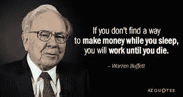

沃伦·巴菲特曾经说过‘如果你在睡觉的时候没有找到赚钱的方法，你会一直工作到死。“的确，当你的被动收入超过你的支出时，你就变得财务自由了；只有到那时，你才能真正坐下来享受生活的诸多好处，同时拥有大量的被动现金流。加密货币是一种非常可行的投资和通胀对冲手段；然而，面对各种各样的投资平台，包括精心包装和伪装的诈骗，我们如何做出明智和明智的投资决定？

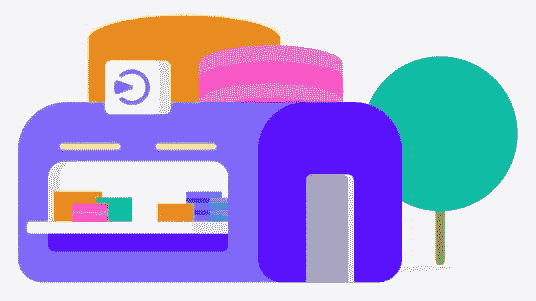

介绍 [Cake DeFi](https://cakedefi.com/?ref=677920) ，这是一家可靠的投资公司，总部设在新加坡，在过去的两年里，它一直在为我可靠地产生被动现金流。Cake DeFi 的重点是简单的用户体验，以及为用户创造高回报。在这篇文章中，我想简单地分享一下 Cake DeFi 的许多产品及其潜在收益。

# 菲亚特服务:直接用欧元/美元购买比特币、以太坊或 DFI (defichain)

用户可以通过 SEPA 或信用卡在平台本身轻松购买加密货币，由 BANXA 和 Transak 处理。现在你已经有了一些加密货币，比如 BTC、瑞士联邦理工学院或 DFI，你可以开始使用 Cake DeFi 提供的许多令人兴奋的产品，如下所示。

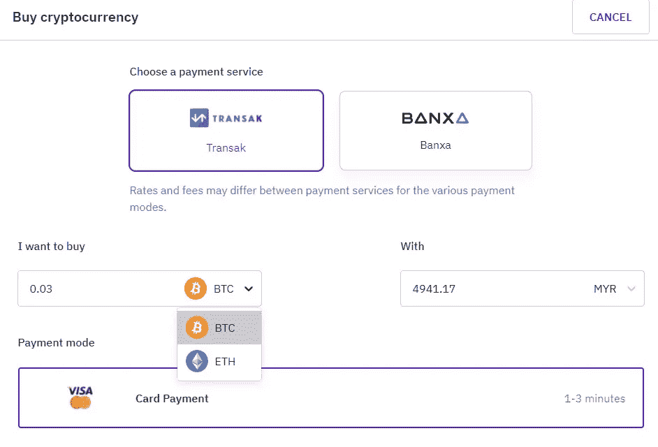

# 立桩标界

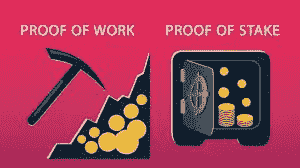

在区块链上建立共识有两种形式，即工作证明(PoW)和利益证明(PoS)。区块链是一种更有效的交易验证方法，因为它不需要安装昂贵的计算机硬件。

赌注是一种赚取可观利息的方式，通过在赌注池中持有您的加密资产，这与您的储蓄账户类似，但利率高达 100% APY！在蛋糕 DeFi 赌注可以用 DFI，DeFiChain 的本地硬币；以及 DASH，虽然比例较低，为 5%。区块链将赌注下的加密资产投入使用，进而提供回报。这是通过一个称为“共识机制”的流程完成的，通常称为“利益证明”。通过这一过程，确保了所有交易的验证。因此，它可以作为抵押品，同时帮助区块链网络利用“利益证明”算法。通过该过程产生的新代币被分发作为验证每个块的奖励。

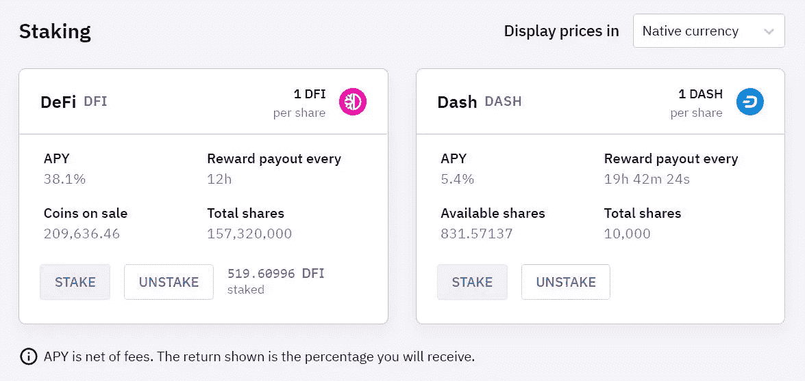

对于赌注，没有最短期限。您可以随时参与，甚至可以在您选择时将您的硬币从赌注服务中取出。根据硬币的不同，您的奖励将每天直接存入两次。

# 流动性挖掘

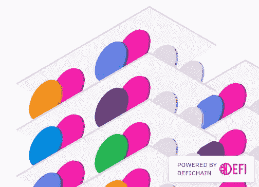

流动性挖掘是大多数 DeFi(分散融资)项目的关键要素。在此过程中，参与者将其加密货币资产贡献给流动性池，促进成对加密交易，并为希望在分散交易所(如 BTC/DFI)进行加密货币互换的用户提供流动性。这意味着，你首先需要相同数量的两种硬币，在这个例子中是比特币和 DFI。这些不用于借贷目的，可以随时提取(没有锁定期)。由于它是分散的，价格发现机制完全取决于供给和需求。一旦交易或加密交换完成，交易费和大宗奖励将在所有流动性提供者之间分配。在 DeFiChain 的案例中，奖励是用当地货币 DFI 支付的。

有许多流动性池可以参与蛋糕定义

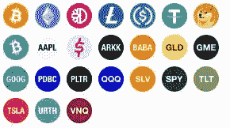

这个列表中一个令人兴奋的新成员是分散资产，如特斯拉、苹果和谷歌，我将在未来的帖子中更详细地介绍这些资产，所以请务必保持关注！

# 放款

贷款允许你在你的比特币、以太币、美元系绳以及美元币上赚取被动收入。你的资本和回报是完全有保障的，没有风险，如果资产的现货价格超过一定数额，还可能有奖金。每批贷款运行 28 天，在周五开始和结束。一旦你选择参与，你的 BTC /瑞士联邦理工学院/ USDT / USDC 将在接下来的 4 周内锁定期权合约。在这一批 4 周后，您可以选择自动进入下一批(生成自动复利)，只提取您的回报，或者将您的全部本金和回报提取回您的账户。

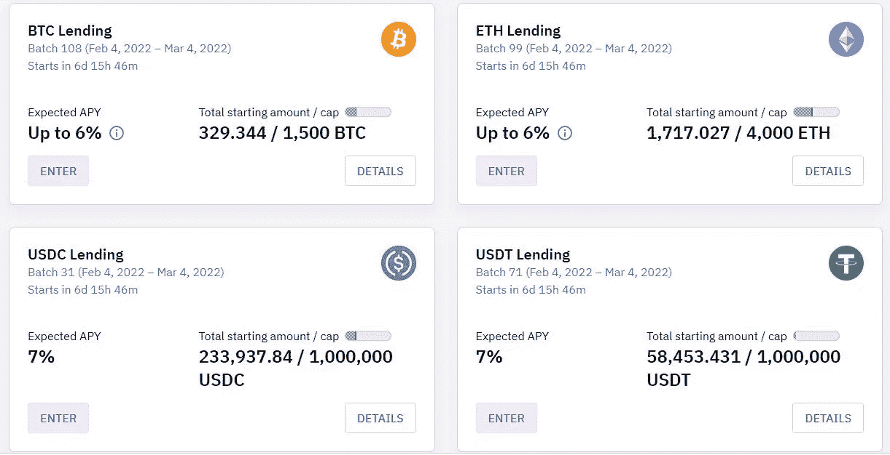

# **冰柜**

冰柜是一个忠诚度计划，奖励用户在一定时间内向 Cake DeFi 投入资金，时间从 1 个月到 10 年不等。它可用于分配给赌注和流动性挖掘产品的基金。

普通冰箱给你高达 85%的蛋糕费回扣。另一方面，5 年和 10 年 DFI 赌注将资金锁定在 DeFiChain 区块链本身，根据任期给予用户高达 2 倍的定期赌注回报，转换为 10 年赌注期高达 100%的令人印象深刻的 APY！

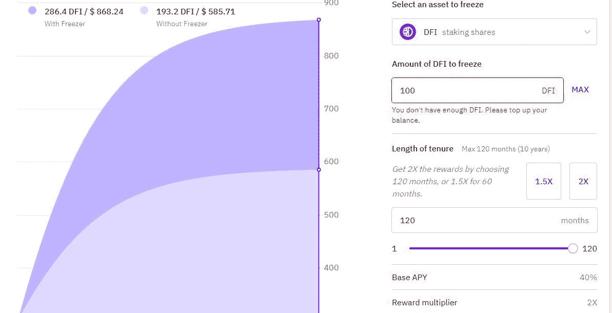

# 一眼

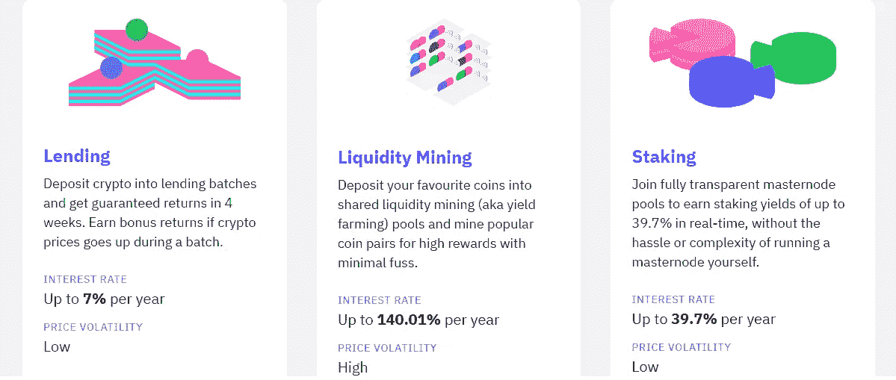

# 最后的想法

[Cake DeFi](https://cakedefi.com/?ref=677920) 是一个值得信赖和可靠的一站式平台，在这里您可以管理您所有的金融资产并产生被动现金流。流动性挖掘和赌注都提供高收益和灵活的任期，允许资产的流动性。通过下注你的加密货币，你加入了一个特定网络的验证团队。作为回报，你将获得代币或奖励。投资于贷款服务的资金是完全有保障的，无风险的，尽管收益率较低，并锁定在每月固定的期限内。冰柜通过锁定长达 10 年的资产期限，将您的收入提高一倍，从而将它提升到一个全新的水平！

你准备好踏上赚取被动收入的旅程了吗？

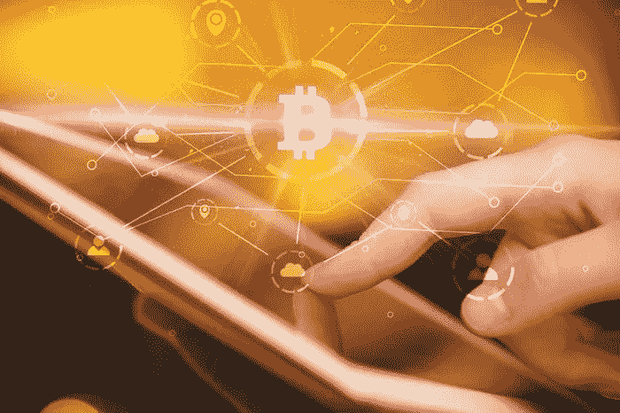

[**今天注册**](https://cakedefi.com/?ref=677920) **并赢取 30 美元的注册奖金+10 美元的学习奖金&使用我的链接** [**此处**](https://cakedefi.com/?ref=677920) 获得额外的独家奖金，您的第一笔合格投资 50 美元及以上，可选择一批贷款服务/冻结 1 个月的股份/冻结 1 个月的流动性采矿股份。

或者，扫描以下二维码报名。

附:这不是财务建议；在任何投资平台投资前，请做好自己的调研！蛋糕 DeFi 在我看来是值得投资的；你对此有什么想法？欢迎在下面发表评论，并关注我更多关于值得关注和可靠的投资项目的帖子。保重，注意安全！

*一如既往，这不是财务建议！而只是我投资过的，觉得值得分享的投资平台。在投资前做好自己的研究，不要存你输不起的钱。下面有什么问题可以随时问我。*

*如果你喜欢这篇文章，* [*关注&订阅*](/@cybery) *！*

查看以下值得信赖的平台！

*🎁*[*honey gain*](https://r.honeygain.me/CYBER577DD)*一款被动收入 app，从你未使用的互联网带宽中赚钱。* [*免费获得 5 美元*](https://r.honeygain.me/CYBER577DD) *，无需投资。*

*🎁* [*蛋糕 Defi*](https://cakedefi.com/?ref=677920) *一站式投资平台，以高达 200%的 APYs 烘焙被动现金流！* [*在 DFI 用 50 美元存款获得 30 美元*](https://cakedefi.com/?ref=677920) *。*

*🎁*[*Nexo*](https://nexo.io/ref/hce5cfdt5o?src=web-link)*全球最先进、受监管的数字资产机构，在 200 多个司法管辖区提供 40 多种法定货币的即时加密贷款、每日资产收益、交换和服务。* [*用 100 美元存款得到 25 美元*](https://nexo.io/ref/hce5cfdt5o?src=web-link) *。*

*🎁* [*摄氏度*](https://celsiusnetwork.app.link/174094633e) *一个金融科技平台，提供带息储蓄账户、借贷以及用数字和法定资产进行支付。* [*在 BTC 拿 50 美元*](https://celsiusnetwork.app.link/174094633e) *拿 400 美元存款。*

*🎁*[*Hodlnaut*](https://www.hodlnaut.com/join/RTbHxuJMX)*一个稳健的新加坡加密借贷平台，成立于 2019 年，从你闲置的加密货币中产生被动现金流。* [*拿 30 美元*](https://www.hodlnaut.com/join/RTbHxuJMX) *在 USDC 存 1000 美元。*

*🎁*[*BlockFi*](https://blockfi.com/?ref=a16e37fd)*一种加密货币交易所和钱包。* [*用 100 美元存款得到 10 美元*](https://blockfi.com/?ref=a16e37fd) *。*

*🎁* [*库币*](https://www.kucoin.com/land/register/r/rJH29LZ) *最大的加密货币交易所之一。*

*🎁***最大的加密货币交易所之一。**

**🎁* [*MEXC*](https://m.mexc.com/auth/signup?inviteCode=1NAJC) *最大的加密货币交易所之一。**

**🎁*[*Crypto.com*](https://read.cash/@TraderFX/10-tips-to-maximize-earnings-on-honeygain-an-effortless-free-passive-income-app-68535728#bad-link)*一款基于新加坡的加密货币兑换 app。* [*获得 25 美元*](https://crypto.com/app/fcbsjmf5pb) *在 CRO 赌赢一张红宝石牌。**

**针对马来西亚投资者**

**🎁*[*Stashaway*](https://www.stashaway.my/referrals/kenleel9jx)*免费投资 6 个月！**

**🎁Wahed code 'KENLIE1' RM10 注册奖金**

**🎁Capbay P2P 代码' 8879c6' RM100 注册奖金**

**接我* [*中*](https://cybery.medium.com/)*|*[*read . cash*](https://read.cash/r/TraderFX)*|*[*Youtube*](https://www.youtube.com/c/SmartInvestingChannel)|[*电报*](https://t.me/kkkk289)|*|*[*推特*](https://twitter.com/cybertraderfx)*|**

> **加入 Coinmonks [电报频道](https://t.me/coincodecap)和 [Youtube 频道](https://www.youtube.com/c/coinmonks/videos)了解加密交易和投资**

# **另外，阅读**

*   **[如何在 FTX 交易所交易期货](https://coincodecap.com/ftx-futures-trading) | [OKEx vs 币安](https://coincodecap.com/okex-vs-binance)**
*   **[CoinLoan 评论](https://coincodecap.com/coinloan-review) | [YouHodler 评论](/coinmonks/youhodler-4-easy-ways-to-make-money-98969b9689f2) | [BlockFi 评论](https://coincodecap.com/blockfi-review)**
*   **[XT.COM 评论](https://coincodecap.com/profittradingapp-for-binance) | [币安评论](https://coincodecap.com/xt-com-review)**
*   **[SmithBot 评论](https://coincodecap.com/smithbot-review) | [4 款最佳免费开源交易机器人](https://coincodecap.com/free-open-source-trading-bots)**
*   **[比特币基地僵尸工具](/coinmonks/coinbase-bots-ac6359e897f3) | [AscendEX 审查](/coinmonks/ascendex-review-53e829cf75fa) | [OKEx 交易僵尸工具](/coinmonks/okex-trading-bots-234920f61e60)**
*   **[如何在印度购买比特币？](/coinmonks/buy-bitcoin-in-india-feb50ddfef94) | [瓦济克斯评论](/coinmonks/wazirx-review-5c811b074f5b)**