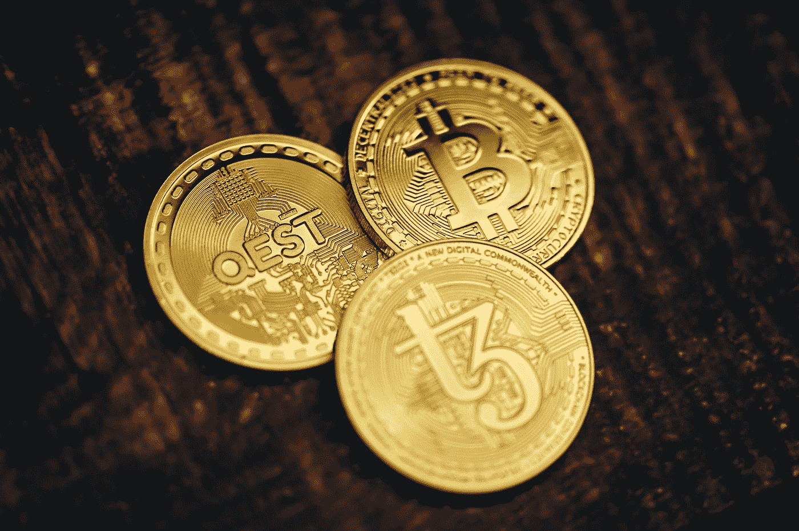

# 农场免费加密！

> 原文：<https://medium.com/coinmonks/earn-free-crypto-e63ce65a4c5?source=collection_archive---------7----------------------->

(更新日期:2022 年 3 月 4 日)

Photo by [Quantitatives](https://unsplash.com/@quantitatives?utm_source=medium&utm_medium=referral) on [Unsplash](https://unsplash.com?utm_source=medium&utm_medium=referral)

# 介绍

想要免费加密吗？你来对地方了。在这篇文章中，我将讲述你如何通过做一些任务来种植(或赚取)免费密码，也就是说，你不需要拥有任何密码(赌注)或购买硬件(采矿)来开始。有什么比免费加密更好的？

有两种类型的耕作:推广和替代。**推广**农业是你参与推广一个特定项目的地方，比如关注一个加密的社交媒体账户。**替换**农业就是用 crypto 项目的版本替换你日常活动中通常使用的东西(比如搜索、阅读或观看)。因此，你不必改变你通常做什么来农场加密。我们开始种田吧！

# 推广农业

Photo by [Merakist](https://unsplash.com/@merakist?utm_source=medium&utm_medium=referral) on [Unsplash](https://unsplash.com?utm_source=medium&utm_medium=referral)

# 比特币基地:学习和获得

在[比特币基地](https://coinbase.com/join/sung_w6)，你可以花一枚硬币浏览一些教程并回答一个问题来获得密码。截至 2022 年 2 月，您可以获得安培和恒星流明。比特币基地也有一个促销活动，如果你将比特币基地钱包应用程序连接到你的账户，他们会给你 4 美元的联邦理工学院。他们似乎有不同的促销活动，所以请定期查看。如果你没有帐户，请通过使用这个[比特币基地推荐链接](https://coinbase.com/join/sung_w6)注册来支持这种类型的文章。

你也可以查看 [coinmarketcap 的学习和收获列表](https://coinmarketcap.com/earn/)。你需要有一个 KYC 认证的币安账户，并在 coinmarketcap 的网站上注册以获得密码。

# 空投

空投被用来促进一个特定的项目。参与者完成一些任务并获得硬币、代币和 NFT。大多数任务要求你在不同的社交媒体上关注项目，发布一些帖子，并有一个能够接收硬币、代币或 NFT 的钱包。这里有一个简短的网站列表，列出了空投，让你开始:

*   [CoinMarketCap](https://coinmarketcap.com/airdrop/)
*   [空投. io](https://airdrops.io/)
*   [airdropking.io](https://airdropking.io/en/)

# 免费替换密码

Photo by [Eden Constantino](https://unsplash.com/@edenconstantin0?utm_source=medium&utm_medium=referral) on [Unsplash](https://unsplash.com?utm_source=medium&utm_medium=referral)

# 预搜索:搜索

[预搜索](https://presearch.org/signup?rid=3735534)是一个去中心化的搜索引擎。预令牌是 ERC-20 令牌，您可以在使用他们的搜索引擎搜索时获得。使用您的电子邮件地址创建一个新帐户并开始赚钱非常简单！您每天最多可以执行 30 次搜索(UTC ),每次搜索的价值取决于 PRE/USD 的最新价格。如果你突破了每日限额，你每天可以赚 0.60 美元。但是，您需要有 1k 的合格 PRE tokens 才能提取您的奖励。您可以使用[我的推荐链接](https://presearch.org/signup?rid=3735534)注册，在注册时获得 25 PRE。

# 勇敢:浏览

如果你正在读这篇文章，你可能正在用浏览器阅读。为什么不花钱浏览网页呢？[勇敢的浏览器](https://brave.com/)是一个基于 chromium 的浏览器，你可以在那里赚取 BAT，按月支付。很容易下载，安装，创建一个帐户，并开始赚取蝙蝠。大约一个月的浏览量，你可以赚取 1-3 蝙蝠/月或 0.80-2.40 美元/月。除了这些功能之外，它还可以屏蔽 cookies 以保护隐私，并可以从当前浏览器导入所有设置。因此，切换到勇敢是快速和容易的。

# 发布 0x:正在阅读

在 crypto 看文章拿报酬怎么样？如果你无论如何都要阅读一些文章，你可以在[出版 0x](https://www.publish0x.com/?a=jnegZvgldw) 时获得报酬。创建一个账户很容易，和其他网站一样。你也可以使用你的 twitter 或脸书账户登录。一旦你登录了，你就可以给文章的作者和你自己小费以及比例。你可以一天给一个作者一次小费，每 10 分钟给不同的作者一次小费，最多给 5 个？每天。你在一些密码中得到报酬，比如 AMP 和 FARM。这些文章告诉你人们给特定的文章付了多少小费。你可以转到你的帐户设置，并添加你的钱包地址，以获得支付。

你也可以尝试写作，并作为一名作家得到提示。也许，出版 0x 能激发出你心中的作家！

# 观看

有几个秘密项目正在分散在线视频行业。 [Theta](https://www.thetatoken.org/) (THETA)是一个视频流媒体项目，市值最高为 32 亿美元(截至 2022 年 3 月)。作为 [theta.tv](https://www.theta.tv/) 的用户，你可以观看视频，赚取 Theta Fuel (TFuel)。Theta fuel 是 Theta 网络中使用的 Theta 区块链上的效用令牌。用于支付观看者、创作者和交易。另一方面，θ币是一种治理币。对于大多数用户来说，他们会处理 TFuel。关于 Theta 最有趣的部分是信息流是 P2P 的，也就是说，当你观看的时候，你可以把信息流传给其他人。这就是你如何赚到 TFuel 的方法，通过向你的同伴流动。

# 高地:玩耍

有许多游戏，你可以赚取密码，又名玩赚(P2E)。一个这样的密码是 UPX，[高地](https://play.upland.me/)。在这个受大富翁启发的游戏中，你可以通过连续几天登录、拥有财产(带有世界地图)来获得 UPX，并且可以通过找到宝箱来获得更多。你也可以用法定货币购买 UPX 或房产。没有办法让你的 UPX 退出游戏，除非你以美元出售你的财产。还有许多其他的 P2E 游戏，你可以玩来赚取免费的密码，看看他们是否是你的那杯茶。

# 结论

随着加密变得流行，有很多方法可以免费获得加密。一些方法(如 Learn and Earn 和 Airdrops)是促销性的，而另一些方法(如 [Presearch](https://presearch.org/signup?rid=3735534) 和 [Publish0x](https://www.publish0x.com/?a=jnegZvgldw) )则取代了用户每天使用的方法。用这些方法，你每天赚的钱还不到一美元。看起来这些方法不值得，除非你相信这些密码会增加 10 倍甚至 100 倍。因此，你应该把你的时间投资到你喜欢的项目上，就像你如何投资你的钱一样。