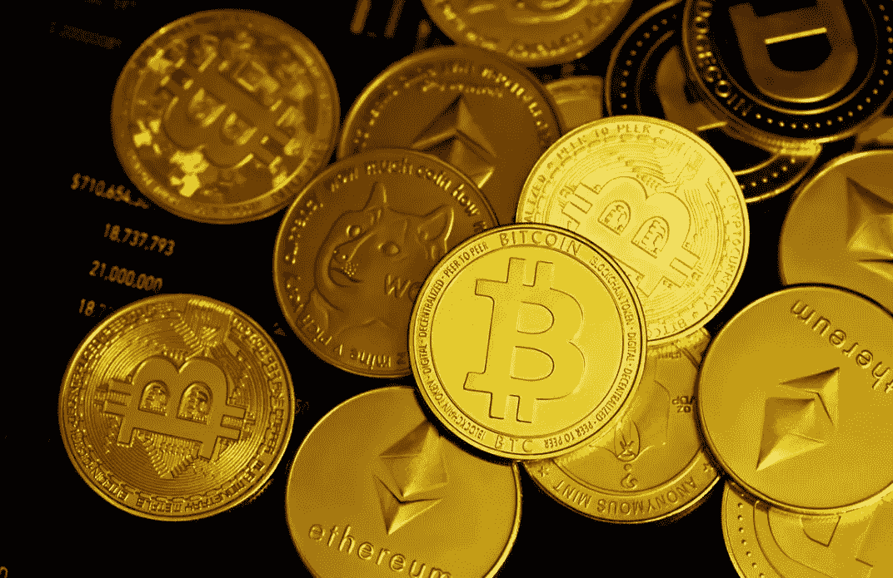

# 通过 NFT 游戏在加密中赚钱

> 原文：<https://medium.com/coinmonks/earn-money-in-crypto-through-nft-gaming-3e65132f5d45?source=collection_archive---------58----------------------->

在过去的两年里，加密货币的“玩到赚”(P2E)生态系统大受欢迎。两年内，它改变了关于“游戏”及其谋生潜力的先入为主的观念。以前，只有品牌和特定游戏本身赞助的“职业游戏玩家”才有机会通过玩他们喜欢的游戏过上体面的生活。

**对替代品的需求**

一个 NFT 区块链游戏， **Axie Infinity** ，一直处于新生态系统的最前沿和先锋。Axie Infinity 基于以太坊区块链。它颠覆了大多数视频游戏的收入模式。正常玩家可以边玩边赚，而不是向玩家收取游戏内商品的钱。该游戏通过游戏的商品——光滑的爱情药水(SLP)令牌来奖励玩家，当他们的三“轴”队赢得一场战斗时，玩家就可以获得该令牌。然后 SLP 可以被兑换成以太币，最终兑换成美元，从而为玩家提供了真正的收入。

这款游戏在新冠肺炎疫情流行起来，当时世界上大多数人都处于一级防范禁闭状态。结果，很大一部分人失业了，他们只有手机和电脑来联系他人和外部世界。因此，许多人，特别是发展中国家的人，被迫依赖他们的移动设备和电脑，因为这给他们带来了巨大的养家压力，因为他们要靠自己的收入来维持生活。

**发展中国家热**

这款游戏在发展中国家大受欢迎，包括人口超过 1 亿的菲律宾。时至今日，它仍然是游戏赚钱的最大市场。菲律宾很多玩家认为这是一份全职工作；在某些情况下，他们的月收入高于菲律宾的平均月工资。

在一部关于菲律宾“玩到赚”的纪录片中，一名男子分享了他的故事，在疫情引发的封锁期间，他是他所在街道上第一批玩 Axie Infinity 的人之一，“一开始我很难相信，这是一个让你赚钱的游戏。但我试过了。”他说。他买了组成一个首发队所需的三把斧子。很快，他住的那条街上就有一百多人在玩这个游戏。这部纪录片还介绍了一对靠小店收入生活的老年夫妇。在封锁期间，他们来自商店的收入大幅减少。因此，他们说他们开始玩游戏来补充他们的商业收入。这对夫妇还提到，玩游戏已经成为他们从疫情带来的残酷现实中转移注意力的方式。

**即玩即赚游戏的未来**

这一新兴行业的未来仍不稳定。尽管如此，它表明这是一个可行的经济模式；然而，作为一个新的和未经测试的系统，这种模式的可持续性必须经得起时间的考验，特别是在我们现在熊市的金融市场。最终，即使这一突破不能持续，它仍将成为游戏和加密货币行业前进的基准和实用手册。

> 加入 Coinmonks [电报频道](https://t.me/coincodecap)和 [Youtube 频道](https://www.youtube.com/c/coinmonks/videos)了解加密交易和投资

# 另外，阅读

*   [隐翅虫替代品](/coinmonks/cryptohopper-alternatives-d67287b16d27) | [HitBTC 审查](/coinmonks/hitbtc-review-c5143c5d53c2)
*   [CBET 评论](https://coincodecap.com/cbet-casino-review) | [库科恩 vs 比特币基地](https://coincodecap.com/kucoin-vs-coinbase)
*   [Fold App 审核](https://coincodecap.com/fold-app-review) | [Kucoin 交易机器人](/coinmonks/kucoin-trading-bot-automate-your-trades-8cf0ca2138e0) | [Probit 审核](https://coincodecap.com/probit-review)
*   [如何匿名购买比特币](https://coincodecap.com/buy-bitcoin-anonymously) | [比特币现金钱包](https://coincodecap.com/bitcoin-cash-wallets)
*   [币安 vs FTX](https://coincodecap.com/binance-vs-ftx) | [最佳(SOL)索拉纳钱包](https://coincodecap.com/solana-wallets)
*   [比诺莫评论](https://coincodecap.com/binomo-review) | [斯多葛派 vs 3Commas vs TradeSanta](https://coincodecap.com/stoic-vs-3commas-vs-tradesanta)