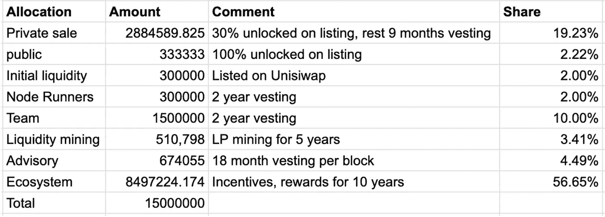
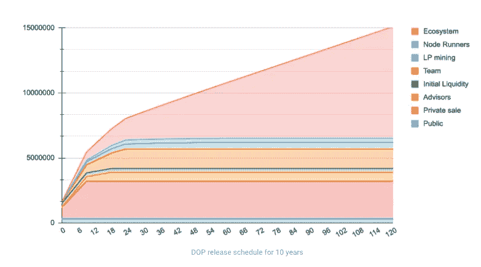

# 用掉落的刀在你的 NFTs 上赚取被动收入

> 原文：<https://medium.com/coinmonks/earn-passive-income-on-your-nfts-with-drops-dao-77429e02858b?source=collection_archive---------64----------------------->

**关键要点:**

*   [降刀](https://drops.co/)启用 NFT 和 DeFi 资产贷款。用户可以提供任何类型的 NFT 资产作为抵押品，以赚取收益或获得即时贷款。
*   滴血刀主网即将推出。在当前的熊市中，这可能会吸引很多关注，因为 NFT 持有者将能够从他们原本停滞不前的资产中获取更多价值。
*   $DOP 是 Drops DAO 治理令牌。虽然$DOP 目前仅用于投票和下注，但 Drops 团队正在努力在其 NFT 贷款池中使用令牌来激励流动性提供商。
*   3 月 1 日结束的 DOP 令牌的私人销售解锁。象征性的通货膨胀将在这个日期后急剧下降。

**概述/投资论文:**在 Messari Research 的《2022 年的加密论文》中，首席执行官瑞安·塞尔基斯写道，“可靠且无处不在的 NFT 工具仍然在很大程度上缺失……核心基础设施将是 2022 年最热门的投资领域之一。”滴滴道将成为第一个部署 NFT 贷款池的平台。NFT 市场价值数十亿美元，而道的下跌使 NFT 的所有者能够将效用最小的资产变成被动收益机器。这个平台的潜在 TVL 和整个 NFT 市场的价值一样大。

**DOP 代币经济:**

*   令牌分配:

Source: [https://docs.drops.co/governance/tokenomics](https://docs.drops.co/governance/tokenomics)

*   发布时间表(10 年):

Source: [https://docs.drops.co/governance/tokenomics](https://docs.drops.co/governance/tokenomics)

**$DOP 即将推出的催化剂:**

*   有史以来第一个贷款池的滴滴道主网即将推出。
*   从$DOP 令牌的原始私人销售解锁将于 3 月 1 日结束。这一日期后象征性的通货膨胀将是最小的。

**团队背景:** Drops DAO 由大流士·科兹洛夫斯基(Darius Kozlovskis)和尼基塔·乌菲姆切夫(Nikita Ufimcev)于 2021 年 2 月创立。Koslovskis 是一名经验丰富的开发人员和企业家，在加密领域创建了多个组织。Ufimcev 是摩根士丹利和高盛的前雇员，也有开发区块链游戏的经验。

**风险:**DOP 美元的投资者押注 NFT 贷款池一旦上线就会被采用。此外，Drops 团队需要继续寻找增加$DOP 令牌价值的方法。尽管他们正致力于允许代币被用来激励流动性，但目前的价值获取机制还不是特别强大。

**最后的想法:**对于希望进入最新、最令人兴奋的 NFT 工具市场的投资者来说，DAO 和 DOP token 是一个极具吸引力的赌注。凭借成功的主网推出和完善的 NFT 贷款池 UX，Drops DAO 有潜力为其平台带来巨大价值。

> 加入 Coinmonks [电报频道](https://t.me/coincodecap)和 [Youtube 频道](https://www.youtube.com/c/coinmonks/videos)了解加密交易和投资

# 另外，阅读

*   [加密货币储蓄账户](/coinmonks/cryptocurrency-savings-accounts-be3bc0feffbf) | [YoBit 审核](/coinmonks/yobit-review-175464162c62)
*   [Botsfolio vs nap bots vs Mudrex](/coinmonks/botsfolio-vs-napbots-vs-mudrex-c81344970c02)|[gate . io 交流回顾](/coinmonks/gate-io-exchange-review-61bf87b7078f)
*   [CoinFLEX 评论](https://coincodecap.com/coinflex-review) | [AEX 交易所评论](https://coincodecap.com/aex-exchange-review) | [UPbit 评论](https://coincodecap.com/upbit-review)
*   [AscendEx 保证金交易](https://coincodecap.com/ascendex-margin-trading) | [Bitfinex 赌注](https://coincodecap.com/bitfinex-staking) | [bitFlyer 点评](https://coincodecap.com/bitflyer-review)
*   [Bitget 回顾](https://coincodecap.com/bitget-review)|[Gemini vs block fi](https://coincodecap.com/gemini-vs-blockfi)cmd |[OKEx 期货交易](https://coincodecap.com/okex-futures-trading)