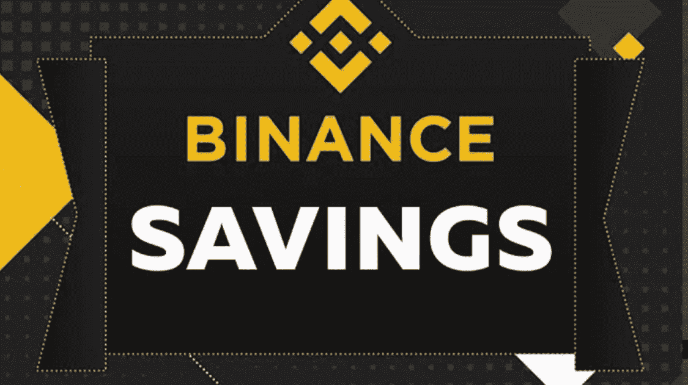

# 用币安的储蓄赚取被动收入

> 原文：<https://medium.com/coinmonks/earn-passive-income-with-savings-on-binance-17769f1c40d5?source=collection_archive---------28----------------------->

被动收入实际上是每个人最喜欢的收入形式。

银行总是承诺从我们的存款中获得高额利息，但这总是徒劳无功。我是说；你用 *0.06 APY 做什么？*悲右。

但这个问题仍然挥之不去；我们在哪里可以把我们的储蓄和赚取一个体面的 APY？

好吧，让我给你介绍一下*储蓄(币安赚)。*

**目录**

*[***究竟什么是储蓄？***](#bf99) ***∘***[***那么，储蓄是如何起作用的呢？***](#5ec1) ***∘***[***与传统银行相比，币安储蓄有什么好处？***](#7806) ***∘***[***灵活锁定储蓄上有什么特别高收益的优惠？*T47**](#3c75)*

## *储蓄到底是什么？*

*储蓄是币安收入的一部分，用户可以增加他们的密码持有量。*

*那么，你在币安的账户里有一些密码……为什么不把它用在工作上并赚取利息呢？*

*通过币安的储蓄，用户通常可以获得 0.5%- 15%的 APY。*

*还不算太寒酸吧。*

## *那么，储蓄是如何运作的呢？*

*币安储蓄的用户通过赌注赚取利息。*

**什么是打桩？简单来说，就是把你的密码放在一个密码钱包里，以支持区块链的操作。**

*然后你会因为借出密码而获得利息回报。*

*用户可以下注各种硬币，包括 BTC、BNB、瑞士联邦理工学院和 USDT。*

*同样地想一想:银行拿走你的存款，用它来赚更多的钱，只不过他们付给你的利息和花生一样多。*

**

****以下是币安的储蓄种类:****

****i)灵活储蓄***——通过灵活储蓄，用户最多可以下注 24 个代币，赚取利息和奖励。*

*这些类型的储蓄是灵活的，意味着用户可以在任何时候赎回他们的产品。这种产品不产生任何费用，而且用户有收益保证。*

*对于刚刚在币安储蓄试水的初学者来说，这将是一个理想的产品。*

****ii) BNB 金库-*** 这类储蓄产品只与 BNB 合作。用户因此能够从他们未使用的 BNB 中获利。*

*通过一个点击选项，以及 BNB 保险库聚合器，用户可以通过组合储蓄、启动池和 Defi staking 产品来获得奖励。*

****iii)launch pool-***launch pool 的独特之处在于，当用户下注他们的代币时，他们会被奖励以新进入币安的代币。*

*如果你想使用最新的 IEO 和 Defi 代币，这就是你想要的储蓄类型。凭借有保证的收益和充满活力的 APY，发行池符合许多投资者的利益。*

****iv)固定储蓄***——如果你想从你的储蓄中获得难以置信的高收益，固定储蓄将是你的理想选择。这里的最低投资额是 100 美元。*

*但是，用户需要将其令牌锁定 7–90 天才能获得奖励。如果您在锁定期结束前访问您的资产，您将无法兑换奖励。*

*想象一下债券是如何运作的。*

*有了 5-15%的 APY，固定储蓄会给你带来不错的回报。*

****v)锁定赌注-*** 锁定赌注是一种独特的高收益投资，允许用户以少至 10 USDT 的赌注获得高额回报。*

*用户可以在 30 个赌注凭证中进行选择，以尽可能低的风险赢得奖励。*

*APY 通常由总桩池容积决定。*

## *与传统银行相比，币安储蓄有什么好处？*

1.  *币安上的储蓄不产生任何费用，不像传统银行的储蓄有每月维护费和过多的取款费。*
2.  *储蓄上有各种各样的加密货币，让用户可以用他们理想的令牌自由投资。*
3.  *币安挣*(储蓄)*对任何拥有币安账户的人开放，不像银行会受到个人所在地的限制。*
4.  *币安赚功能字面上最简单的方式赚取被动收入*
5.  *币安储蓄产品零风险。*
6.  *通过锁定赌注和固定储蓄，用户可以获得极高的回报。*
7.  *灵活储蓄的即时赎回*
8.  *用户可以在币安获得大约 170 个代币。*

## *灵活锁定储蓄有哪些特别的高收益优惠？*

*币安提供大量具有灵活和锁定储蓄的代币的高收益。*

****其中包括:****

*AXS- 15% *(锁定)**

*ii)蛋糕-20% *(锁定)**

*三)DREP-35% *(锁定)**

*四)月神-6% *(灵活)**

*v) APE- 10% *(灵活)**

*六)MATIC- 6% *(灵活)**

*vii)波动-10% *(灵活)**

*八)停靠- 25% *(锁定)**

*九)BUSD- 10% *(灵活)**

***币安储蓄提供有限的欢迎红利:在 GMT 赚取 20%的 APY***

**如果你在币安还是个新手，还没有订阅币安储蓄，现在是探索币安储蓄的时候了，因为你可以通过 GMT 数字令牌获得 20%的 APY。**

*[***在此了解更多> >***](https://www.binance.com/en/support/announcement/05d6db5f931a485d91b2f3916cb1e322?ref=431277160)*

*探索 [***灵活***](https://www.binance.com/en/savings/#lending-demandDeposits?ref=431277160) 和 [***锁住***](https://www.binance.com/en/savings/?_dp=L21haW4vbGVuZGluZz9mcmFnbWVudEluZGV4PTE=&#lending-fixeddeposits?ref=431277160) 储蓄，赚钱如睡眠。*

*[***今日币安> >***](https://accounts.binance.com/en/register?ref=431277160)*

****关联披露:*** *本帖包含关联链接。如果您使用这些链接购买一些东西，我们可能会赚取佣金，对您没有额外的费用。感谢*。*