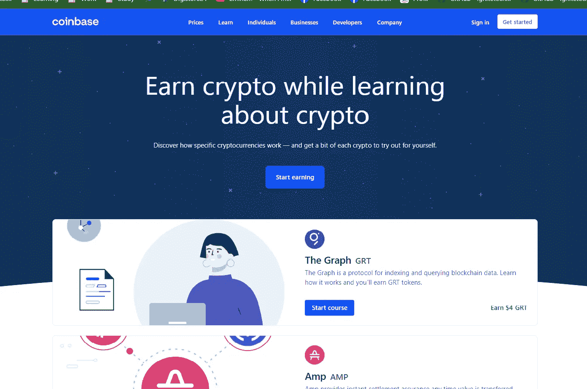
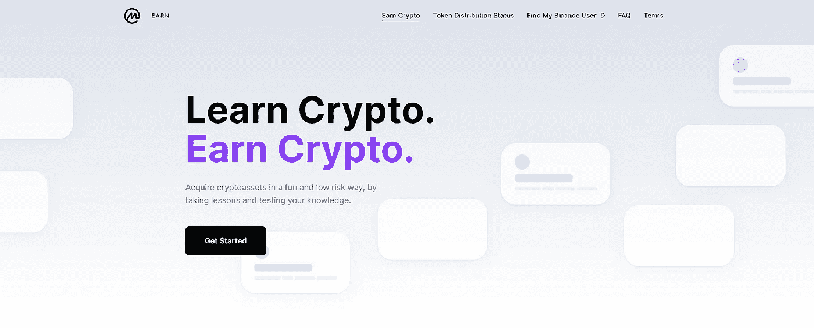
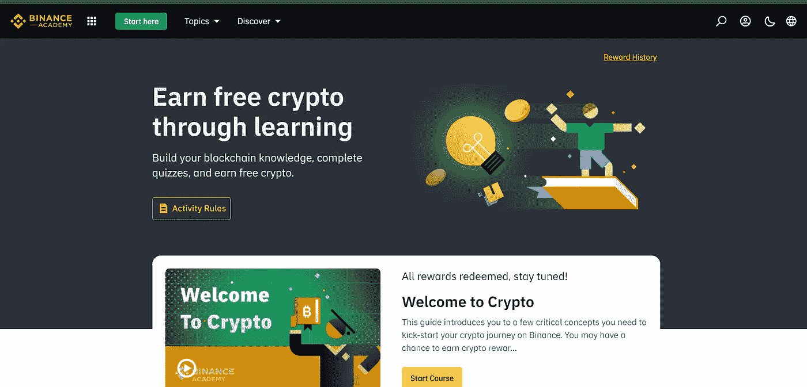
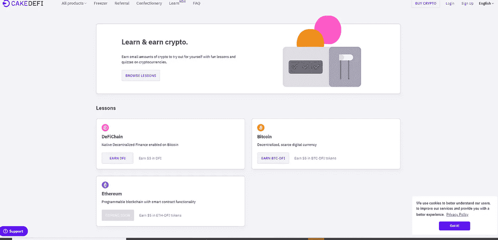
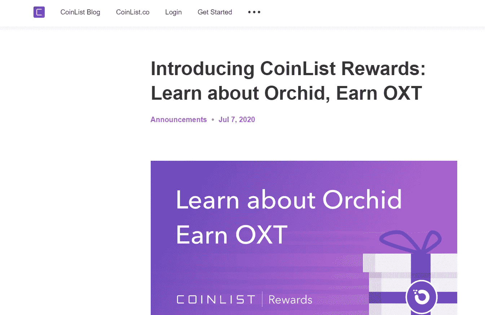
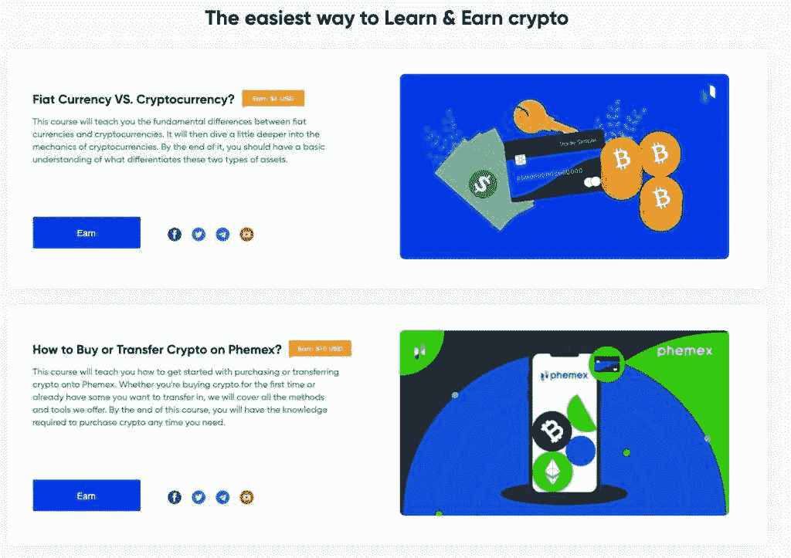

# 免费赚取密码！？还有可能吗？

> 原文：<https://medium.com/coinmonks/earning-cryptos-for-free-is-it-still-possible-58a4e854c270?source=collection_archive---------21----------------------->

## 第 1 部分:学习和赚取永不消逝

是的，在 2022 年仍然有可能在不投入任何资金的情况下获得一些密码。

TLDR:

*   需要注册
*   看视频/看文章，回答 MCQ
*   要快，大多数优惠仅限于一定数量的参与者

## 我的最爱。

这一切是如何开始的？如果我没有错，这一切都是从比特币基地开始的。但它正受到币安、Cake Defi、CoinList 等其他加密交易所的欢迎。趋势偏高。

1.  [**比特币基地**](https://www.coinbase.com/join/chaudh_qdw)

**可能最著名和最熟悉的方式赚取加密是与比特币基地的学习和赚取计划。**

*   **如何:观看视频或阅读故事**
*   **优点:非常容易得到，隐私**
*   **缺点:赚取数量有限(30 美元)。目前，6 种代币开放(FET、CLV、GRT、XLM、AMP、COMP)。这也可能因您所在的位置而异。**

****

**[PS:除此之外，如果你在任何密码上投资至少 100 美元，你将获得 10 美元的注册费用。](https://www.coinbase.com/join/chaudh_qdw)**

**[2。**coin market cap**](https://coinmarketcap.com/invite?ref=YF57QF68)**

**很难找到一个熟悉 cryptos，但不熟悉 CoinMarketCap 的人。不久前，他们开始了他们的学习和收入计划。**

*   **怎么做:看视频，回答与项目相关的选择题。**
*   **优点:没有限制你能挣多少钱。偶尔会添加新项目。**
*   **缺点:这个过程比比特币基地长一点。你不会确切知道你会从一个项目中赚多少钱。所以在我看来有点不透明。**

****

**[PS:你可以每天在 CoinMarketCap 上领取奖励，然后用它来获得非功能性食物和其他福利。你也可以参加空投。](https://coinmarketcap.com/invite?ref=YF57QF68//)**

**3. [**币安**](https://accounts.binance.com/en/register?ref=GMI4CCO6)**

**币安是著名的顶级加密交易所之一。这在币安是非常新的。与其他平台相比，他们的报价目前非常有限。我希望他们能够提高报价。**

****

**如果你决定在币安交易，你可以在这里获得高达 20%的交易费用减免。**

**4. [**蛋糕不值钱**](https://app.cakedefi.com?ref=135917)**

**Cake Defi 以其创新的高收益加密产品而闻名。目前，他们已经推出了他们的学习和收入计划。目前，他们只为新客户提供 10 美元。**

****

**如果你在 Cake Defi 上注册并存入 50 美元的密码，你将在 DFI 免费获得 30 美元。**

**5.[造币清单](https://coinlist.co/clt?referral_code=ZCFNAG)**

**因在其平台上列出具有高潜力的新令牌而闻名。除此之外，你可以在这里交易并获得收益。他们的学习项目仅仅是个开始。目前，这里只有 XTZ。他们的计划是在他们的程序中加入新的硬币/代币。**

****

**[PS:如果你想在 Coinlist 上投资，你可以在 BTC 通过投资至少 100 美元获得 10 美元。](https://coinlist.co/clt?referral_code=ZCFNAG)**

**6 [。**phe MEX**](https://phemex.com/register?referralCode=G5FA63)**

**比其他同行更独特一点。在这里，您将了解加密货币的基础知识。非常适合初学者。要知道他们为你的合约交易提供奖励，你可以用这些奖励来进行合约交易。**

*   **怎么做:看视频，回答与项目相关的选择题。**
*   **优点:**
*   **缺点:奖励不能立即转移到你的钱包里。只有在交易后才有可能。**

****

**PS:如果你在交易合同，你可以在这里得到 10%的折扣。**

****learn and earn** 的问题在于，优惠是有限的，大部分时间都是先到先得，或者对最活跃的会员开放。尽管如此，这是可行的。随着时间的推移，我会不断更新这个列表，并看看有没有更新。**

> **加入 Coinmonks [电报频道](https://t.me/coincodecap)和 [Youtube 频道](https://www.youtube.com/c/coinmonks/videos)了解加密交易和投资**

# **另外，阅读**

*   **[如何在 Uniswap 上交换加密？](https://coincodecap.com/swap-crypto-on-uniswap) | [A-Ads 评论](https://coincodecap.com/a-ads-review)**
*   **[加密货币储蓄账户](/coinmonks/cryptocurrency-savings-accounts-be3bc0feffbf) | [YoBit 评论](/coinmonks/yobit-review-175464162c62)**
*   **[Botsfolio vs nap bots vs Mudrex](/coinmonks/botsfolio-vs-napbots-vs-mudrex-c81344970c02)|[gate . io 交流回顾](/coinmonks/gate-io-exchange-review-61bf87b7078f)**
*   **[CoinFLEX 评论](https://coincodecap.com/coinflex-review) | [AEX 交易所评论](https://coincodecap.com/aex-exchange-review) | [UPbit 评论](https://coincodecap.com/upbit-review)**
*   **[AscendEx 保证金交易](https://coincodecap.com/ascendex-margin-trading) | [Bitfinex 赌注](https://coincodecap.com/bitfinex-staking) | [bitFlyer 审核](https://coincodecap.com/bitflyer-review)**