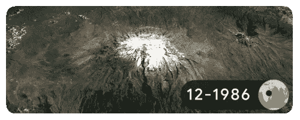
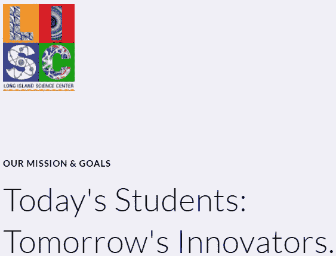

# 2022 年地球日| EQ Exchange 揭示了具有积极环境影响的 NFT。

> 原文：<https://medium.com/coinmonks/earth-day-2022-comes-as-eq-exchange-reveals-how-to-make-nfts-with-positive-environmental-impacts-on-2caec0203260?source=collection_archive---------21----------------------->

*Glacier retreat at the summit of Mt. Kilimanjaro in* Tanzania, Africa (Google credit).

# 情商交流改变了 Web3 和我们星球共存的方式。

EQ Exchange 目前正在与大型慈善机构合作，以产生积极的本地和全球影响。有了 EQ Exchange，艺术家的创造性产出现在将利用 Web3 技术，在社会和物理方面产生积极的*环境差异。作为音乐和艺术的收藏者和爱好者，我们对这些创作者的贡献已经不仅仅是每月的账单或订阅。*你的钱现在可以用来改善我们星球的生活质量。* [EQ Exchange](https://eq.exchange/) 是一种互助金融系统，它让消费者感到满意，因为他们知道交易是正确的。平等、公平和均衡。*

EQ Exchange 的使命是通过音乐 NFT 和智能合约，将权力重新放回到创作者手中，无论种族、文化和肤色如何。将我们的使命与他们的使命结合起来，以下是我们的音乐非盈利组织从中受益的一些慈善机构。虽然他们的任务很大，但也有很多障碍(向下滚动查看更多):

*   ***雨林基金会*** 。利用先进技术在全球范围内增强土著权利。
*   长岛科学中心正在用他们独特的方法让科学和艺术，蒸汽，接近当地社区和国际利益。
*   ***蝴蝶效应项目。***

EQ Exchange 使用**“MEGs”(礼物的相互交换)**将音乐 NFTs 中的代币带得更远。实际上，在一个需要全球化的时代。

情商交流已经为各种肤色的女性、黑人和土著人引领了潮流。EQ Exchange 是唯一一家由女性、加拿大企业家和了不起的人贾尼斯·泰勒创立的网络 3 技术公司。EQ Exchange 也创造了历史，在今年的科技、电影和音乐大会上，它宣布与 hip-hop/R & B 传奇偶像、歌手、歌曲作者和作家 [Ashanti](https://en.wikipedia.org/wiki/Ashanti_(singer)) 共同拥有所有权。现在 EQ Exchange 历史性地改变了 Web3 和我们的星球共存的方式。

> “这一切都起源于黑人文化，”贾尼斯说。“你必须拥有这片土地。我们的土壤是数字化的。”

EQ 引领着区块链和加密货币的正确使用，否则它们会对我们的星球造成毁灭性的影响。众所周知，比特币(BTC)和以太坊(区块链)使用破坏环境的 **PoW(工作证明)**来验证所有的加密交易。EQ Exchange 不仅使用破坏性较小的 **PoS (Power of Stake)** 来验证 Web3 交易，而且 CELO 区块链 EQ 更进一步，购买土地来重新种植我们的森林，并为粮食安全项目做出贡献，为发展中国家的儿童和饥饿人口提供食物。这使得 CELO 成为第一个碳负区块链。情商是建立在 CELO 的土壤上的，“这一切都起源于黑人文化，”贾尼斯说。“你必须拥有这片土地。我们的土壤是数字化的。他们告诉我们把我们所有的天赋都放在这里，但你不会拥有这片土地。我*不会*那样做，成为那些人的一员！当我见到阿散蒂时，我说‘好吧，我喜欢你的 NFT，我很乐意你这么做，但是你必须是一个所有者。我别无选择。“这是 Janice 和 EQ Exchange 致力于积极社会变革的有力证明。

# “如果钱很漂亮呢？”

有这么多有害的区块链，CELO 提出了一个简单的问题，“如果金钱是美丽的会怎样？”这个世界可能令人生畏。从交战的国家到我们自己街道上的危险；国际和地方事务可能会有压力。EQ Exchange 正在采取措施利用经济学。当通过 EQ Exchange 的音乐 NFTs 购买和支持您新的或喜爱的艺术家时，一部分资金将自动捐给艺术家选择的慈善机构。**每次购买。每次都是。为你的艺术和音乐买单而自豪。你不必怀疑资金的分配是正当的还是恶意的。如果“获得的收益”将捐给慈善机构，它将被直接写入 NFT 的智能合同，让所有人都能看到。随着交易的发生，慈善机构受益。 **这就是** [**情商交流**](https://eq.exchange/) **如何不同于你一般的音乐 NFT。MEGS，相互交换礼物。**有钱*才能*漂亮。艺术和创新来真正改善人类。现在，就像音乐一样，爱得到了回报，话语得到了传播，基金会受益于任何听到音乐的地方。**

[https://rainforestfoundation.org/](https://rainforestfoundation.org/)

[*雨林基金会*](https://rainforestfoundation.org/) *(RFUS)* 是一个环保组织，致力于应对气候变化和非法砍伐森林以获取利润。1988 年，[斯汀](https://en.wikipedia.org/wiki/Sting_(musician))和配偶，[楚蒂·斯泰勒](https://en.wikipedia.org/wiki/Trudie_Styler)，成立了雨林基金会。森林资源股的目的是与土著社区合作，确定土地所有权，建设森林保护者的能力和工具，以支持土地保护、监测和保护土地的协调。rfu 将人权放在第一位，作为用技术保护地球的途径。他们独特的视角允许与土著社区一起工作，并让他们要求、监测和保护其土地的生物多样性。凭借 30 年的经验，他们已经缩小了他们的方法，以获得立竿见影的效果，“我们正处于一个转折点，”RFUS 的战略影响总监 Kim Chaix 先生说。“这是我们必须扭转森林砍伐和森林保护趋势的十年。”rfu 必须建立并利用在地面和全球政治舞台上形成的信任、信誉和同盟。去年在格拉斯哥举行的联合国气候变化大会(COP26)上，rfu 发布的文件显示，世界上 80%的生物多样性都在由土著人管理和经营的土地上。其中一半土地上的土著人民没有保护这些土地的合法权利。“超过 2 亿美元用于全球森林保护。不到 1%用于土著社区和前线，”Kim 谈到 RFUS 目前和未来的资助时说。“这旨在彻底改变这种模式。”现在，在与 rfu 合作的 EQ 的帮助下，“资金直接到达社区。”

[https://www.sciencecenterli.org/](https://www.sciencecenterli.org/)

长岛科学中心**【LISC】*确实带来了 STEAM(科学、技术、工程、艺术和数学)。LISC 专注于边缘化社区及其家庭，以增强创造力和 21 世纪技术。让每个人都能接触到科技和艺术。孩子和父母都一样。他们的哲学将年轻的头脑融合在一起，以理解他们已经知道的东西，“艺术，以及你作为一名艺术家所使用的创造性思维过程，与你成为一名伟大的科学家、工程师或在科技行业工作的人所需要的东西非常相似，”LISC 的执行董事蔡林·卡勒说。“他们是同一类型的思维。可以一起开发。”提供多样化的综合发展服务，LISC 提供无家可归者外展倡议，他们提供“教老师”和“玩具物理学”计划，在线课程，夏令营，甚至在加拿大和扩大项目。LISC 最近宣布了一项令人印象深刻的扩张计划，将河源的空置商店改造成教室、技术和发明大厅、录音棚，以及令人印象深刻的屋顶生物花园、天文馆和活动空间。LISC 证明蒸汽适合每个人。*

**

*[https://www.bepgirls.org/](https://www.bepgirls.org/)*

*[*蝴蝶效应项目*](https://www.bepgirls.org/)*【BEP】*和其他很多节目一样，是一个包容所有年龄段的家庭节目。但是是女生才是会员卡。与大多数项目不同的是，“我们有一个更全面的方法。这是不同的，因为不是有人来告诉人们他们需要什么，我们的课程是由女孩们建立的，”创始人兼执行董事蒂华纳·富尔福德说。“我们提供他们关心的东西，而不是我们认为他们关心的东西。对我来说，这是一件大事，“在一个以男性为中心、男性主导的地区，这对女孩来说确实是一件大事。BEP 坚持自己的使命，一直在为女孩们创造安全的空间去梦想和成功。这种独特的方法提供的支持着眼于 BEP 女孩的整个人、精神和身体健康，以及情感、社会和精神健康。BEP 始终如一地为所有女孩营造一个安全的空间(不管她们来自哪里)，举行勇敢的对话，并教授责任。开放的机会，否则无法获得，BEP 女孩是 BEP 女孩的生活。*

*长岛科学中心和*蝴蝶效应项目*的聪明人已经在长岛河源建造了他们的土壤。这两个基金会都是通往富裕的汉普顿的门户，也是夏季旅行者的热点。他们也位于萨福克郡两个经济最不景气的社区之间。在这些地区，BEP 和 LISC 早在四年级就开始关注 STEM 的下降。EQ Exchange 新收购的合伙人阿散蒂也是长岛人，住在格伦科夫。*

*无论父母没有机会也不了解 STEAM，无论学校是否需要更好的书，更好的电脑(长岛的一些地方已经知道在壁橱里上课，鉴于目前的科维德·疫情，任何地方的学校都有问题……没有**适当的资金，这些令人自豪的基金会的努力都无法继续。雨林基金会正在使雨林保护成为应对气候变化的最有效的解决方案之一。长岛科学中心已经丰富了超过 325，000 名学生的生活，而且这个数字还在增加。蝴蝶效应项目始于八年前，有八个女孩，现在已经超过 500 人。要做到以上任何一点，都要从支持开始！(以上链接)。***

> *加入 Coinmonks [电报频道](https://t.me/coincodecap)和 [Youtube 频道](https://www.youtube.com/c/coinmonks/videos)了解加密交易和投资*

# *另外，阅读*

*   *[分散交易所](https://coincodecap.com/what-are-decentralized-exchanges) | [比特 FIP](https://coincodecap.com/bitbns-fip) | [宾邦评论](https://coincodecap.com/bingbon-review)*
*   *[用信用卡购买密码的 10 个最佳地点](https://coincodecap.com/buy-crypto-with-credit-card)*
*   *[加拿大最佳加密交易机器人](https://coincodecap.com/5-best-crypto-trading-bots-in-canada) | [Bybit vs 币安](https://coincodecap.com/bybit-binance-moonxbt)*
*   *[阿联酋 5 大最佳加密交易所](https://coincodecap.com/best-crypto-exchanges-in-uae) | [SimpleSwap 评论](https://coincodecap.com/simpleswap-review)*
*   *购买 Dogecoin 的 7 种最佳方式 | [ZebPay 评论](https://coincodecap.com/zebpay-review)*
*   *[最佳期货交易信号](https://coincodecap.com/futures-trading-signals) | [流动性交易回顾](https://coincodecap.com/liquid-exchange-review)*