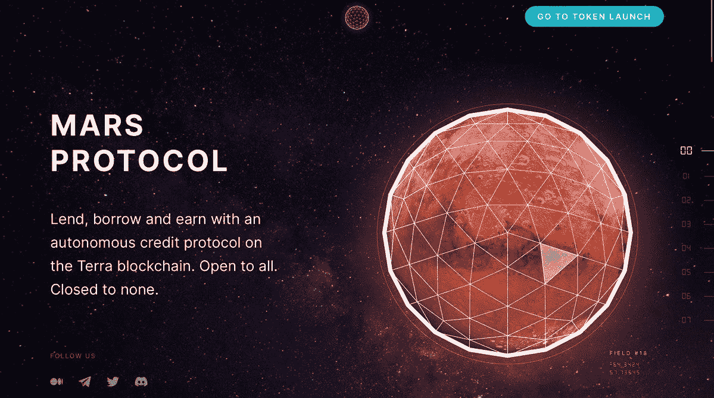
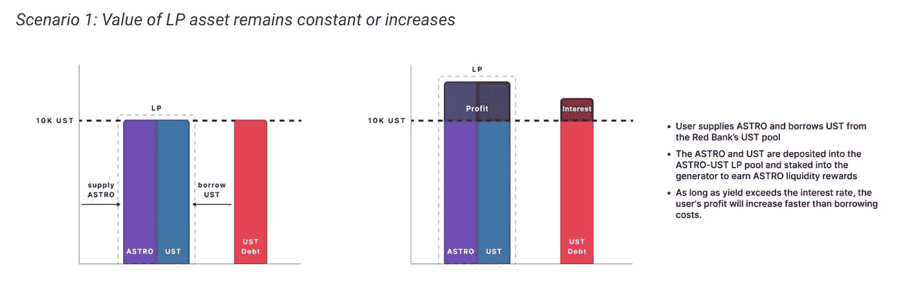
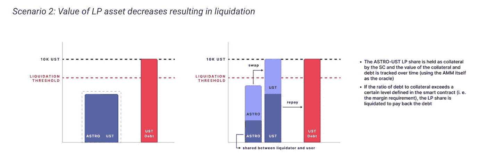

# 地球符合火星协议

> 原文：<https://medium.com/coinmonks/earth-meets-mars-protocol-9954fde404f?source=collection_archive---------36----------------------->

回到 2021 年 4 月，火星协议团队发布了一个关于区块链技术发布的预告，该技术代表了一个新的计算时代(纪元 5)。

火星协议是由德尔福实验室、T2 IDEO CoLab Ventures 和 Terraform 实验室的一家合资企业开发的。我们甚至看到了 Terra 的联合创始人 Do Kwon 公开在推特上谈论参与这次星际锁定。

# 现在你可能会问自己，火星协议到底是什么？

$MARS 是一个信用协议。它是非托管的、开源的、透明的、算法的和社区管理的。这是地球生态系统的借贷协议。

与银行一样，$ MARS 的目标是吸引存款并贷出这些资金，同时管理流动性不足和破产风险。与银行不同，$MARS 是完全自动化的链上信贷基础设施，由分散的社区通过透明的治理流程进行治理。所有的决定都是由火星理事会做出的，该理事会由$MARS stakers 组成，他们在游戏中加入皮肤来支持某些类型的协议风险，以换取一部分协议借用费。

# $MARS 与其他协议有何不同？

$MARS 提供两种不同类型的借款:

C2B =(合同借款人)

C2C =(合同对合同)

C2B 认为，在红色银行中，用户提供抵押品是为了借入资金。借入资金不能超过 LTV(贷款价值比)。这种模式可以在像[锚协议](https://twitter.com/anchor_protocol?s=20&t=PfuvQespU1OYHcQ_kc1S6Q)和 [Aave](https://twitter.com/AaveAave?s=20&t=PfuvQespU1OYHcQ_kc1S6Q) 上的协议中找到，其中德根存放令牌作为抵押品，以便从这些协议中借入资金。

## C2C 将是玛氏的主要特色和优势之一。

C2C 指的是发生在$MARS 和其他智能合同之间的借贷活动(合同对合同)，而不是$MARS 和个人用户之间的借贷活动(合同对借款人)。

这将有效地代表一个新的需求来源的协议，使其货币市场更有吸引力的存款人和整个协议更有用！

## 想象一下。

你从火星协议中借钱。使用这些资金为协议提供流动性(Lp)作为抵押品，而不是存放$LUNA 本身作为抵押品。那不会最大化你的代币吗？

## 嗯，这就是 DeFi 整体的问题。

你存放的抵押品被冻结，不能用于其他地方。使用(Lp)作为担保品提供了使用使用条款的可能性。

# 还在迷茫 C2C 吗？

把 C2C 想成抵押。

1.  你想买房子，你从银行贷款。
2.  你为**的房子**付了 20% **的首付**。
3.  **银行**给你八成**贷款**。
4.  你用贷款买了**房子**，房子现在是**抵押物**。

与过度抵押贷款相比，这是一种更有效的贷款形式。

$MARS 正在允许其他协议允许他们的智能合约被用作抵押，以换取信贷额度。

# 我将如何从中受益？

有了借来的资金，你就可以通过 C2C 杠杆化收益率农场。

## 你可能会问，什么是杠杆收益农业？

产出农业指的是锁定协议中的加密资产以换取费用或治理令牌的过程。对于杠杆收益率农民，用户借用资产来“利用”或增加他们在收益率农场中使用的代币数量。

$MARS 将推出 3 个概念验证的 C2C 贷款/产出农业战略:

1.  露娜 LUNA 唱片公司
2.  非洲国民大会——UST 自由党
3.  米尔-UST 唱片公司

这使得用户可以利用杠杆来增加收益，但如果(Lp)令牌的价值下降，则存在清算风险。下面一步一步地展示了这个过程。

在你开始对着月亮大喊大叫之前，这里有两个你需要注意的场景:

1.  **Lp 值升值。**

如果代币价格上涨，你的(Lp)值将会增加。只要它大于你贷款的利息，你就有利润。

2. **Lp 值贬值。**

如果代币价格下跌，您的(Lp)值将会减少。小心你的清算门槛，因为你可能会被清算。

*   **注意，你可能是用(债务)来提供(Lp)。**

# 如果你的(Lp)令牌开始跌价怎么办？

1.  存款更多(Lp)以降低您的清算门槛。
2.  偿还债务以降低你的清算门槛。

# 清算事件中会发生什么？

1.  $UST 将被归还给火星计划，清算人将支付一笔费用。
2.  剩余的令牌将返还给提供商(您)。

火星协议现在正处于锁定阶段！安全交易和投资。