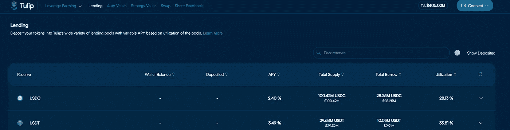

# 如何在市场行情不好的情况下也能获得高达 20%的稳定收益？

> 原文：<https://medium.com/coinmonks/easy-20-returns-how-is-it-possible-f1cbc471e172?source=collection_archive---------12----------------------->

在我们开始之前，我想提一下，以下不是财务建议。只是发表我的想法和我对锚协议的了解…

# 什么是锚协议？

Anchor 协议是一个平台，它在 DEFI 空间中提供借贷服务，并通过其治理令牌 ANC 投票参与。他们提供的贷款服务类似于你的银行储蓄账户。(再问一下我当地银行利率是多少？)

Anchor Protocol — Earn

一个非常稳定的接近 20%的利率，只需要用户将 user to 存入平台就可以开始获得收益。如果您的钱包中已经有一些 UST，整个过程非常简单，完成起来也很快，否则您可以随时从您正在使用的 exchange 中获得它，并将其发送到您的钱包中。虽然有几个钱包选项，但 Terra Station 钱包似乎更受欢迎，所以我选择了它。(因为谁会希望拥有 10 个不同的钱包，只是为了与同一个生态系统中的应用程序进行交互？)

# **那么 UST 呢？这是什么？**

这是一个分散的，算法稳定的区块链领地。虽然这并不是什么新鲜事，因为已经有很多稳定的版本了。有些仍然存活得很好，有些已经灭绝了。已经超过了像戴这样的当红明星，并且正在赶上像这样的明星。

有许多类型的稳定债券，最常见的类型是**抵押债券**。顾名思义，他们是菲亚特支持的。因此，最简单的类型的支持比率为 1:1。(1 USDC = 1 美元)
围绕马厩有更多榨汁机的故事，但那将是另一个时代的另一个故事。(看你系绳和奥林巴斯欧姆，而欧姆反而更像储备货币)

其他类型将是**商品支持的稳定资产**(由黄金、房地产等支持)**加密支持的稳定资产**(由 BTC 或 ETH 支持)，最后，我们讨论的主题是**算法稳定资产**。(无抵押，由其算法机制保护)

对于一种稳定的货币来说，它需要在动荡的市场环境中保持稳定。UST 通过铸造和焚烧机制使用 Terra 的本国货币(LUNA)来维持其与美元的联系。用户可以通过燃烧 1 美元的月神来铸造 1UST，或者燃烧 1UST 来铸造 1 美元的月神。因此，链上互换将始终是 1 UST 到 1 美元的 LUNA 值。(固定)

Terra’s Youtube channel

如果对 UST 的需求激增并超过 1 美元大关，套利者将进入并以 1 美元(链上)的价格燃烧 1 美元的 LUNA，然后在市场上(链下)出售他们新铸造的 1 美元以获利。这样，它将增加 UST 的总供应量，稀释供应量，降低价格，直到无利可图。

让我们暂时回到利率上来。为了比较(可能是偏见，哈哈)，下面是一些也提供借贷服务的其他 DeFi 平台的屏幕截图。因为 UST 是一个稳定的硬币，我们现在只看马厩。

Tulip Garden — Solana’s Yield Aggregator (lending page)

Alpaca Finance — Lending

Alpaca Finance — Stable farms with leverage

上图并不是真正的贷款，因为它实际上是向他们的流动性池提供流动性(存放 2 项资产),然后从中赚取收益
注意即使在利用杠杆时也会产生 APY…

Celsius Earn — In kind rewards rate

虽然不是一个完整的列表，因为在这个领域有如此多的项目，所以可能有其他地方提供更好的利率来存放你的马厩。如果你知道或发现类似的东西，请告诉我。我有兴趣了解更多关于他们的情况。

另一件需要注意的事情是，在这些平台上贷款时，他们的 APY 通常由利率曲线决定，因此利用率越高，他们可以给贷款人的 APY 就越多，因为对这种特定资产的需求会从借款人那里赚取更多的利息。这也意味着 APY 提供的利率会根据借款需求而不时波动。

Tulip Protocol gitbook [page](https://solfarm.gitbook.io/tulipprotocol/leveraged-yield-farming/lending-reserves)

鉴于锚定利率如此之高且相对稳定，这是不是像某种庞氏骗局一样，它将不得不依赖新参与者存入更多 UST，然后他们才能向现有储户支付利息？

遗憾的是没有，但是有一些关键的事情需要了解，这样我们才能理解 Anchor 是如何将收益支付给储户的。

1.  **借贷**

Anchor Protocol’s whitepaper

简而言之，借款人支付的 UST 贷款利息构成了我们看到的 19.38%利息的一部分。

2.**保税资产(巴塞特)**

目前，锚上只有两种短腿猎犬。
**bLUNA**&**webETH。通过这个结合的过程，你的 LUNA 或 ETH 将被沉积，而 bLUNA 或 webETH 将被铸造。请注意，露娜有一个 21 天的解封期，还有烧掉你的 bLUNA 以找回原来的露娜的各种费用。(烧伤/瞬间烧伤)**

有了这笔新资产，你可以用它来借 UST，但由于这是一笔超额抵押贷款，你无法以 1:1 的比例借到钱。现在，你可以随心所欲地使用这个 UST。你甚至可以把它存回 Anchor protocol 来再次赚取利息，或者用它来购买任何接受 UST 的东西。
*(或者你可以弄点地瓜片)*

Mmmm, smells like crypto

对于那些留在你钱包里的剩余的 bLUNA，你将有资格获得赌注奖励。

另一方面，Anchor 现在从这些借款人那里获得了 LUNA 和 ETH，并将对它们进行下注以获得下注回报。这些奖励将被兑换成 UST，并用于支付给储户。

3.**液化**

虽然你可以借到你的借款限额，限额取决于一些标准，如抵押品的类型，价格和存款金额。如果你的借款使用现在高于你的借款限额，你的贷款可以清算。

-您存入价值 100 美元的 ETH，并借入 80 美元
-糟糕的市场状况导致您的 ETH 价值低于 80 美元
-借款使用现在高于借款限额

当贷款被清算时，抵押品将被转换成 UST 来偿还贷款。这有助于保护储户的 UST 安全。(嗯，我们不能让这些储户悬着，对吗？)

所以总而言之，

借款利息(**流入** ) +利息(**流入**)用于支付存款利息(**流出** )
如果流入大于流出，余额转入收益准备金。

但是，如果有太多的储户，太少的借款人，太少的人把他们的资产放在锚上怎么办？产生的收益肯定不足以支付储户。接下来会发生什么？

[**产量储备**](https://mirrortracker.info/anchor) 将被激活。这将用于向存款人支付利息。是的，这是不可持续的，它最终会耗尽。已经进行了一些补充，最新一笔是 UST 向收益率储备注入 4.5 亿英镑。

即便如此，Anchor 现在给出稳定的 20% APY 的原因是因为 Anchor 的目标是为利率设定基准。这是为了克服其他平台面临的一个关键限制。(当 BTC 价格急剧下降/上升，由于借贷或供应需求的变化而影响利率时)
嗯，他们总是可以降低 APY%,但这将导致更多的事情需要考虑，如资金可能从锚中流出。因为 Anchor 就像是一个很好的营销工具，帮助他们达到未来更多增长所需的采用率。它充当了人们对 Terra 生态系统感兴趣和更多参与的“切入点”。

# **我喜欢主播的地方**

IstockPhoto

1.  使用 stablecoins 赚取收益，这类似于在其他链上下注并获得相同资产(UST)作为收益而不是另一个令牌的概念
2.  不像“投资”到那些流动资金池，我不必担心非永久性的损失。毕竟这是个马厩，所以可以忽略不计
3.  只要算法/套利机制成立，它将在不同的市场条件下保持抵押品的价值相当稳定
4.  点击，存款，忘记(或者直到我需要钱，哈哈哈)
5.  20%的 APY*在这一较长时期内是稳定的，但将来很可能会被修改
6.  每个区块都计算利息(大约。7 秒)。没有必要等一个月或一年才能得到你的收益
7.  不像传统的定期存款，你的资金会被锁定一段时间

# 要考虑的风险

1.  **智能合约风险**
    智能合约中存在漏洞或问题，有人可能会利用它来耗尽内部资金或进行恶意操作。
2.  有一天你醒来，却发现一切都没了？？它的 Dapp，社交媒体账户，都消失了，就像它从一开始就不存在一样
    这不太可能发生在 Anchor 身上，但我知道什么呢？(看着你 [**Luna Yield**](https://decrypt.co/79098/solana-defi-protocol-luna-yield-goes-dark-with-6-7-million-in-crypto) )
    注:Luna Yield 是**而非**与 Terra 有关，其建造于索拉纳的生态系统中，虽然名字相同，可令人混淆？
3.  **生态系统风险**
    从以上几点展开。看看 UST 现在的流通供应量，以及有多少是以锚定的方式存放的。然后，还有多少其他项目是在锚之上分层。如果一个事件发生并使 UST /月神失去平衡，它可能会引发影响整个生态系统的连锁效应

Source from CoinMarketCap

Accurate at time of writing — Anchor main page

4.**脱钩风险**

Chart from [CoinMarketCap](https://coinmarketcap.com/currencies/terrausd/)

我们可以看到，在 2020 年 12 月 30 日和 2021 年 5 月 23 日有两次大的下跌，前者更为严重。升级仍然可以进一步提高它的稳定性，所以这并不是说这个稳定币从一开始就是完美的。作为一家算法稳定的银行，人们从一开始就可以辩称，它没有任何真正的支持，而是依靠 LUNA 和套利者来帮助捍卫其盯住美元的政策。但鉴于它现在的寿命很短，我想说它目前做得相当不错。

# 那么下一步是什么？

为了让整个事情保持成功，我认为关键因素之一是卢娜或 UST 的需求/用例。如果它的效用很低，尤其是在糟糕的市场条件下，我认为当 LUNA 的价值同时下降时，UST 甚至不能维持它的联系汇率。燃烧 UST 使价格回到/接近 1 美元，这将增加露娜的供应量，降低价格，这将增加现有的销售压力，这将使露娜的价格更低。

Terra 建立了自己的生态系统，在那里它创造了对 UST 的需求。你可以和 UST 和露娜互动。这种合法平台越多，就越有助于 UST 和整个生态系统的稳定。LUNA 的另一个用途是它的链上赌注，验证者和委托者将锁定 LUNA 的数量以获得他们的赌注奖励。

**CHAI** ，韩国的一项移动支付服务，类似于借记卡，与他们的银行账户相关联。在后端，CHAI 会自动将韩元兑换成 KRT 进行交易。这有助于 Terra 稳定币的效用，因为 LUNA 将被焚烧以铸造那些 KRT。

最终，即使 Terra 的稳定币模型有效，或者它在现实世界或 DeFi 世界中是否有足够的效用，也只是等式的一部分。另一部分仍将在很大程度上取决于个人如何看待(重视)它。如果他们不相信或看不到其中的价值，无论机制有多好，都不会起作用。

如果你喜欢读这篇文章，并觉得你学到了一些东西，欣赏一个跟随，干杯！

如果你有任何其他感兴趣的话题或项目想在这个空间看到，请留下评论让我知道
直到下次…

> 加入 Coinmonks [电报频道](https://t.me/coincodecap)和 [Youtube 频道](https://www.youtube.com/c/coinmonks/videos)了解加密交易和投资

# 另外，阅读

*   [加拿大最佳加密交易机器人](https://coincodecap.com/5-best-crypto-trading-bots-in-canada) | [库币评论](https://coincodecap.com/kucoin-review)
*   [火币加密交易信号](https://coincodecap.com/huobi-crypto-trading-signals) | [HitBTC 审核](/coinmonks/hitbtc-review-c5143c5d53c2)
*   [如何在 FTX 交易所交易期货](https://coincodecap.com/ftx-futures-trading) | [OKEx vs 币安](https://coincodecap.com/okex-vs-binance)
*   [OKEx vs KuCoin](https://coincodecap.com/okex-kucoin) | [摄氏替代度](https://coincodecap.com/celsius-alternatives) | [如何购买 VeChain](https://coincodecap.com/buy-vechain)
*   [ProfitFarmers 回顾](https://coincodecap.com/profitfarmers-review) | [如何使用 Cornix 交易机器人](https://coincodecap.com/cornix-trading-bot)
*   [如何匿名购买比特币](https://coincodecap.com/buy-bitcoin-anonymously) | [比特币现金钱包](https://coincodecap.com/bitcoin-cash-wallets)