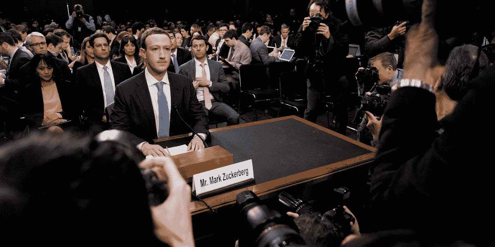
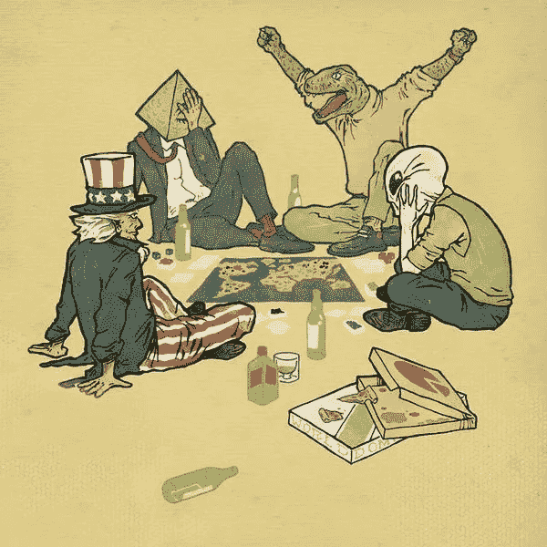
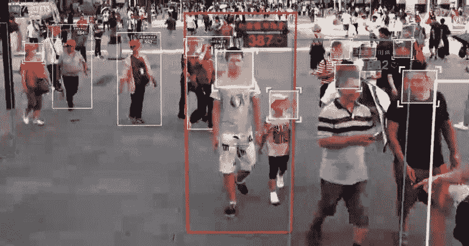
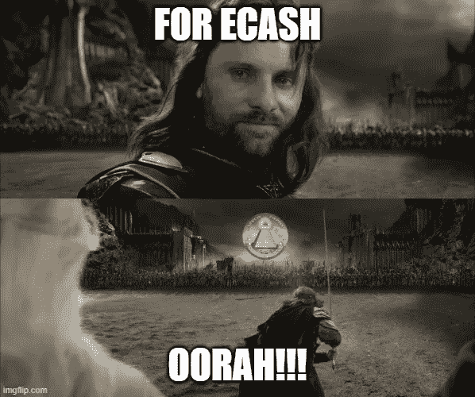

# 本周电子现金课#2

> 原文：<https://medium.com/coinmonks/ecash-lesson-of-the-week-2-9f91b2d41ce6?source=collection_archive---------24----------------------->

## *“他们对你的了解比你对自己的了解还要多”*

你可能已经知道了。大公司确实会收集你的数据。无论是像谷歌或脸书这样的社交媒体巨头，还是像万事达这样的金融服务提供商，等等。这只是交易的一部分，你可以获得各种公用事业和服务的便利套餐，这让你的生活在许多方面变得更轻松、更有趣——大多数情况下几乎没有成本——他们可以收集和利用你在他们的平台上进行的所有活动。

**你所有的活动都以这样或那样的方式被收集**，他们对数据的渴望似乎永无止境:你到底去过哪些地方，在什么时间点走了哪些路线？你关闭了你的定位功能？好吧，那你连接或经过了哪个本地无线网络？你用手机和谁通话或发信息？你上次买牙膏是什么时候？是的，他们甚至可以打听**你活动中最细微的细节。**

他们收集并储存关于你的细节，而这些细节你一周之内都不会记得，或者根本就没有考虑过。对许多人来说，这当然不是什么新鲜事；这就是我们这个时代的一些大型数字公司最初是如何变得如此庞大的，对大多数人来说，这还没有对他们的生活产生太大的负面影响。

Big Data is watching you…

这是真的，“大数据”收集他们可以从你的数字活动和身份中获得的任何东西的意图本身当然不是恶意的。大数据"*只有*"想要通过让您的日常活动变得更轻松来赚钱，同时尽一切努力遵守法律，尽可能保持您的数据安全甚至匿名。既然他们如此看重你的数据，他们甚至不会仅仅出售他们从你那里收集的数据。他们宁愿将这种能力出租给其他公司，让它们将算法认为“相关”的东西放到你的社交媒体中。这几乎是双赢。*几乎……*

## 权力越大，责任越大——但事实并非如此

事实上，这个问题对你我来说似乎太抽象了，以至于无法真正解决。但是考虑一下这个简单的事实:强大的巨型公司和他们的客户非常重视你的数据。仅仅这一点就应该让你考虑你愿意分享多少，尤其是当你得到的回报只有一点点的时候。

然而，最让我害怕的是——除了他们不给予任何回报，对你的数据收集过于不负责任和干涉之外——总有另一个巨大的，渴望权力的机构想要掌握你的数据。事实上，这个机构几乎依赖于控制和管理你的身份和所有活动。我说的是政府。

Facebook founder Mark Zuckerberg testifies in congress on the subject of misappropriation users’ profile data

由于对公民的控制是政府的生计，他们显然有巨大的动机对大公司收集和分享你的数据的能力有发言权。在这样做的时候，他们也把它包装成监管大公司和帮助你——小人物——的高尚行为。

但事实是，虽然大公司收集你的数据最终只是为了销售更相关的广告空间，但政府往往认为监管你的行为是他们的工作，因此对收集你的数据非常感兴趣，以便能够创建你和你互动的任何人的档案。这是他们向大公司施压的根本原因，就像我们在脸书看到的那样。

政府总是在早期利用科学技术的可能性来满足他们的需求。无论是 19 世纪 70 年代以来的摄影术还是 20 世纪初以来的指纹法。所有的取证方法都导致了列表和文件的创建，这些列表和文件很快被细分为特殊的文件。

历史本身就说明了这些文件的用途，以及有多少人因为他们的身份被存储在其中而遭受痛苦，即使这份名单原本是为了保护他们自己。在许多情况下，随着时间的推移，它只是落入了无情的统治者手中，他们对如何处理这些名单有着完全不同的意图。

请注意，曾经有一段时间，自由主义价值观在人们中间更为普遍。当政府存储他们的数据时，人们知道这可能意味着什么，无论是健康或身份通行证，还是他们拥有多少支枪。有时候，一个国家的公民会批判性地认为健康通行证和身份证之类的东西是不正当和不可思议的。推出这样的东西会成为反抗他们统治阶级的理由。

然而今天，政府只是在抗击疫情的借口下推出了“数字身份”。明天他们会把它和你的数字中央银行的钱联系起来，并通过他们的社交评分系统来管理你，关闭你更多的途径**真正地，自由地做一些事情** 而不用担心任何形式的报复，今天，明天或十年后。

## 遇见“联合收割机”

在数字时代，大公司控制着你的数据，国家声称拥有控制它们的合法性，我们正在恶化我们作为全球公民被迫喝下的已经相当反乌托邦的鸡尾酒:全球精英、试图保护自己免受政府机构伤害的公司和具有全球抱负的政府都有动力和倾向共同努力，相互洗手，沿着一条相当极权的道路前进。

提醒你，不需要邪恶的策划阴谋。这仅仅是对权力渴望的激励在起作用。他们总是在玩棋盘游戏，而你、你的家庭、你的房子、你的信用、你的数据和身份都是权力货币的一部分。今天，他们正在玩同样游戏的数字和改进版本。

我过去常把这种机器称为“联合收割机”。强大的公司和永远专制的政府的合并。你不必愤世嫉俗来定义这是什么。这是法西斯主义，至少在经济意义上是如此。但不管你想怎么称呼它，它基本上是我们文明所经历的“资本主义”和“社会主义”现实中最糟糕的一种，利用今天的技术实现了过去声名狼藉的统治者开始但未能实现的目标。如果联合收割机变得太强大，或者它的野心太大，我不想深入探究将会或可能会发生什么。只要看看过去两年的政策，想象一个世界，在那里电子枷锁和控制系统更加紧密地编织到你的日常生活中。我不会再深入那个了…

## 不要讨厌玩家，讨厌游戏

让我补充一句话，以便向你解释，问题不在于有“邪恶的精英”，我们只需要找到一些“好的”来帮助我们。另一种选择是，不要只是投票选出金字塔顶端的新玩家，然后认为一切都会改变:

> 徒有良好愿望而无行动

如果你把一个精英和另一个精英互换，这并不重要。这不会改变任何事情的大格局，比如“埃隆·马斯克收购 twitter”。你可能会比比尔·盖茨更喜欢他，他甚至可能会试图减少他的“灾难性慈善事业”的不正当性，但最终什么都不会改变，甚至可能变得更糟，因为你给他更多的信任和自由支配。这里的问题不是玩家，而是游戏。

## 有什么选择？

这就是为什么我们要建立一个去中心化的游戏来替代这个数字权力游戏。一个把中间的王座移走的人，作为一个和平的集合来一起战斗。我们去除了统治阶级和权力精英的概念，而没有在领导和优点的概念上妥协。

为了实现这一目标，我们设定了我们的首要目标，那就是创造一个替代物，来替代这个游戏中最基本的部分:金融体系。我们创建一个不试图对抗旧的，但为您提供一个新的选择，你可以选择加入。一个不会让你在“金融包容性”的幌子下被操纵和控制的机制。首先“解除”你的银行身份，这样银行就不得不重新努力工作以获得你的信任，而不是依赖于你依赖于他们这一事实。

一个高效、便捷、现代、安全的全球体系，不需要少数精英“慈善家”和“代表”掌舵，他们离作弊——或者更糟——一步之遥，因为不喜欢结果而破坏整个游戏，所以他们可以从头开始。这将是一个“大规模多人”在线游戏，每个人都可以加入游戏，没有人必须放弃他们的权利，他们的身份和灵魂给某人，谁认为他更清楚世界是如何运行的。

它是为您连接并使用它，以您认为合适的方式为您造福，无需征求任何人的同意。它应该是真正的公共产品，而不是被代表所操纵。一种没有监管者控制(即膨胀)货币供应以满足其巨大国际愿望(即领土统治和战争)的世界货币。一个比您现在使用的任何其他网络都方便、高效和可行的支付网络。它意味着一切，而您不必为此放弃您的数字身份、权利或灵魂。

我们不会就此打住。已经有[社交媒体协议](https://www.stampchat.io/)正在开发中，这些协议在创造一个安全便捷的数字环境、为您提供所有“相关”媒体和消除噪音方面同样有用，甚至更有用，而您不会失去对数据的控制。

通过使用 eCash 技术，所有这些都是可能的。如果我们从现在开始，并在很短的时间内收集到足够多支持和贡献的人，所有的一切都可以建立起来**。**

你可能会从我的话中感受到紧迫感，但我并不是想描绘一幅未来的可怕图景。我试着对房间里的巨大的粉红色的大象现实一点，这是大多数人太害怕看到或处理的。然而，我对我们如何解决这个问题非常乐观，并选择了另一种方式，这让我们两全其美，这也让我产生了紧迫感。

令我如释重负的是，这项技术在 2009 年以比特币的形式引入了我们，并且已经走了多远。随着 eCash 的开发不断进行，大使们聚集在世界各地，面向全世界的点对点现金系统的想法将会一直存在，而且只会越来越好。**在联合收割机吞噬掉我们的文明之前，让我们一起加速这个过程**。

感谢你的阅读，复活节快乐，直到下周，

*   Kousha

> 加入 Coinmonks [电报频道](https://t.me/coincodecap)和 [Youtube 频道](https://www.youtube.com/c/coinmonks/videos)了解密码交易和投资

# 此外，请阅读

*   [加密货币储蓄账户](/coinmonks/cryptocurrency-savings-accounts-be3bc0feffbf) | [加密交易机器人](https://coincodecap.com/best-crypto-trading-bots)
*   [BigONE 交易所评论](/coinmonks/bigone-exchange-review-64705d85a1d4) | [CEX。IO 审查](https://coincodecap.com/cex-io-review) | [交换区审查](/coinmonks/swapzone-review-crypto-exchange-data-aggregator-e0ad78e55ed7)
*   [最佳比特币保证金交易](/coinmonks/bitcoin-margin-trading-exchange-bcbfcbf7b8e3) | [比特币保证金交易](https://coincodecap.com/bityard-margin-trading)
*   [加密保证金交易交易所](/coinmonks/crypto-margin-trading-exchanges-428b1f7ad108) | [赚取比特币](/coinmonks/earn-bitcoin-6e8bd3c592d9)
*   [WazirX vs coin dcx vs bit bns](/coinmonks/wazirx-vs-coindcx-vs-bitbns-149f4f19a2f1)|[block fi vs coin loan vs Nexo](/coinmonks/blockfi-vs-coinloan-vs-nexo-cb624635230d)