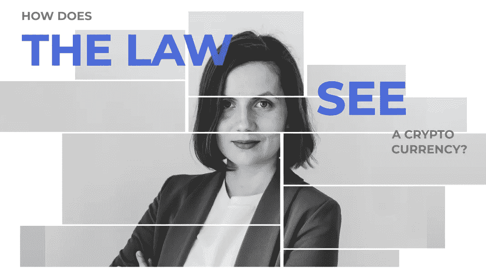

# 律师为 Crypton 工作室员工举办的教育聚会

> 原文：<https://medium.com/coinmonks/educational-meetup-for-crypton-studio-employees-by-lawyer-15e7c567a2f1?source=collection_archive---------57----------------------->

我们的律师 Ksenia 为 Crypton 工作室的员工举办了下一次教育聚会，主题是“法律如何看待加密货币？”

Ksenia 谈到了法律如何定义加密货币，加密货币所有者的责任是什么，以及数字资产和稳定货币之间法律部分的微妙之处。

## 会议的主要议题是:

–什么是加密货币:财产还是货币？

–数字资产和稳定的内容如何？

–加密货币持有者的权利、义务和责任是什么？

还有，Ksenia 比较了不同国家如何确定加密货币的地位，采矿，以及在加密货币的世界中存在什么样的责任。

## 员工感兴趣的是:

-司法实践中与加密货币的储存和使用有关的实际案例；

加密货币和采矿税收的细微差别。

每个人都非常喜欢克塞尼亚的报告。它既有趣又有知识性。期待下一次聚会！

[https://crypton . studio/blog/96 bfb 9 c 1-9 fcb-4389-9c 19-40743 c 75 D4 a 9](https://crypton.studio/blog/96bfb9c1-9fcb-4389-9c19-40743c75d4a9)

> 加入 Coinmonks [电报频道](https://t.me/coincodecap)和 [Youtube 频道](https://www.youtube.com/c/coinmonks/videos)了解加密交易和投资

# 另外，阅读

*   [BigONE 交易所评论](/coinmonks/bigone-exchange-review-64705d85a1d4) | [电网交易机器人](https://coincodecap.com/grid-trading)
*   [氹欞侊贸易评论](https://coincodecap.com/anny-trade-review) | [CoinSpot 评论](https://coincodecap.com/coinspot-review)
*   [新加坡十大最佳加密交易所](https://coincodecap.com/crypto-exchange-in-singapore) | [购买 AXS](https://coincodecap.com/buy-axs-token)
*   [投资印度的最佳加密软件](https://coincodecap.com/best-crypto-to-invest-in-india-in-2021) | [WazirX P2P](https://coincodecap.com/wazirx-p2p)
*   [西班牙 5 大最佳文案交易平台](https://coincodecap.com/copy-trading-spain)
*   [Pionex 双投](https://coincodecap.com/pionex-dual-investment) | [AdvCash 审核](https://coincodecap.com/advcash-review) | [秉持审核](https://coincodecap.com/uphold-review)