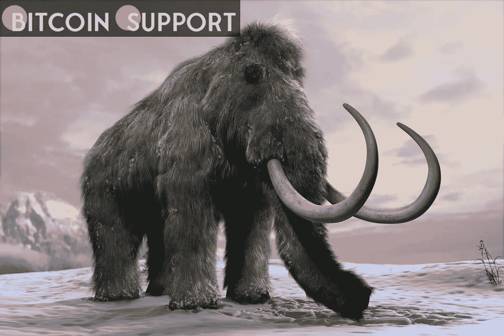
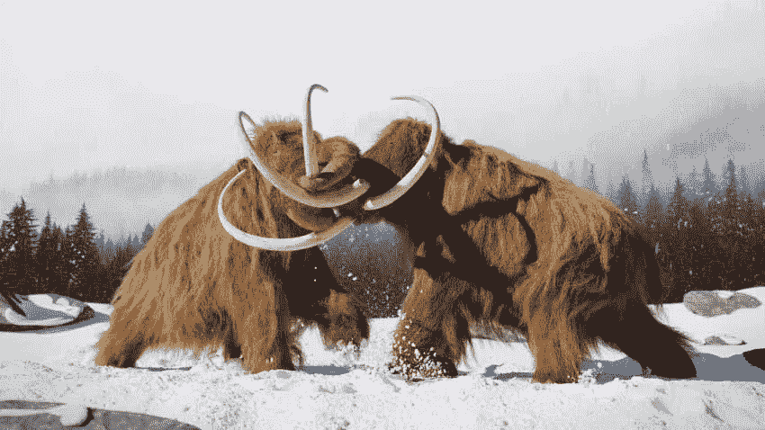

# 复活猛犸象的努力得到了帕丽斯·希尔顿和卡尔达诺创始人的资助

> 原文：<https://medium.com/coinmonks/efforts-to-resurrect-mammoths-are-being-funded-by-paris-hilton-and-cardano-founder-7c5787d7490?source=collection_archive---------78----------------------->

**Visit our website:-** [**https://bitcoinsupports.com/**](https://bitcoinsupports.com/)

庞氏公司得到了帕丽斯希尔顿(Paris Hilton)和卡尔达诺公司(Cardano)创始人兼首席执行官查尔斯霍斯金森(Charles Hoskinson)的支持。这是一家想让猛犸象起死回生的公司。虽然这个史前怪物已经死去很久了，但是 DNA 仍然存在，这使得让这个巨大的生物复活的想法很有吸引力。

**霍斯金森、帕丽斯·希尔顿和猛犸象**

庞氏是一家生物技术初创公司，由哈佛医学院教授乔治·丘克和商人本·拉姆于 2021 年创立，目标是复活猛犸象这种最后已知的猛犸象物种。除了试图复活这种大约在公元前 10，000 年灭绝的动物之外，该公司还参与了白犀牛等濒危动物的保护工作。

 **猛犸象最早可能在 2027 年出现在我们的星球上，据庞称。这是可以实现的，因为丘奇花了十年时间研究如何让动物起死回生。该公司正在利用从化石中收集的 DNA 样本培育猛犸象胚胎。这样，由于基因医学和技术的进步，一个灭绝了几千年的物种可能会复活。**

****

****Visit our website:-** [**https://bitcoinsupports.com/**](https://bitcoinsupports.com/)**

**Charles Hoskinson 是这项投资的支持者

Cardano 的创始人参与了由传奇娱乐公司 CEO 托马斯·图尔领导的一轮大规模融资。其他投资者和股票公司，以及社交名媛帕丽斯·希尔顿也出席了。希尔顿是一系列密码相关计划的幕后推手。该公司筹集了总计 6000 万美元的资金，用于研究和运营，包括努力复活猛犸象。霍斯金森没有透露他选择投入多少个人财富，但他暗示区块链可能会帮助公司实现目标。根据他的说法，这项技术可能使公司能够利用更多的资源，并作为正在营销的倡议的知识产权注册来源。霍斯金森是一个密码狂热者，他因抓住任何机会推广卡尔达诺而臭名昭著。

**访问我们的网站:-**[**https://bitcoinsupports.com/**](https://bitcoinsupports.com/)

**免责声明:以上为作者观点，不应视为投资建议。读者应该自己做研究。****

> **加入 Coinmonks [电报频道](https://t.me/coincodecap)和 [Youtube 频道](https://www.youtube.com/c/coinmonks/videos)了解加密交易和投资**

# **另外，阅读**

*   **[7 大最佳零费用密码交易平台](https://coincodecap.com/zero-fee-crypto-exchanges)**
*   **[氹欞侊贸易评论](https://coincodecap.com/anny-trade-review) | [霍比保证金交易](/coinmonks/huobi-margin-trading-b3b06cdc1519)**
*   **[分散交易所](https://coincodecap.com/what-are-decentralized-exchanges) | [比特 FIP](https://coincodecap.com/bitbns-fip) | [Pionex 评论](https://coincodecap.com/pionex-review-exchange-with-crypto-trading-bot)**
*   **[用信用卡购买密码的 10 个最佳地点](https://coincodecap.com/buy-crypto-with-credit-card)**
*   **[最好的卡达诺钱包](https://coincodecap.com/best-cardano-wallets) | [Bingbon 副本交易](https://coincodecap.com/bingbon-copy-trading)**
*   **[印度最佳 P2P 加密交易所](https://coincodecap.com/p2p-crypto-exchanges-in-india) | [柴犬钱包](https://coincodecap.com/baby-shiba-inu-wallets)**
*   **[八大加密附属计划](https://coincodecap.com/crypto-affiliate-programs) | [eToro vs 比特币基地](https://coincodecap.com/etoro-vs-coinbase)**