# EIP-1559 燃气费市场变化分析(EDA):以太坊区块链

> 原文：<https://medium.com/coinmonks/eip-1559-gas-fee-market-change-analysis-eda-ethereum-blockchain-66c498dc9f26?source=collection_archive---------58----------------------->

*EIP 1559 早在 2019 年 4 月就已提出，并于 2021 年 8 月与相关 EIP 一起实施，以改变网络交易定价和动态块大小持久性。*

Photo by [Michael Förtsch](https://unsplash.com/@michael_f?utm_source=medium&utm_medium=referral) on [Unsplash](https://unsplash.com?utm_source=medium&utm_medium=referral)

更新提案引入了类似 ***base_fee_per_gas*** 和***priority _ fee _ per _ gas***的新参数，在钱包层面进行估算和设置，以激励矿工，烧掉剩余的基本费。其他常见参数包括块大小、气体限制、使用的气体、时间戳和块号。

数据是从 2021 年 8 月更新后的前几个块采样的，即从伦敦的 Hard fork 升级块 [12，965，000](https://etherscan.io/block/12965000) 和 2022 年的几个块，到目前的一个 [14，822，767](https://etherscan.io/block/14822767) 块:在编写时。

> 对区块链节点数据执行的三个主要探索性分析:
> 1 .个人特征统计
> 2。特征相关性
> 3。时间序列—比较趋势

> 特征统计

出现的频率表明，大多数特征值都集中在特定值周围或在区块链协议级别设置的区块生产计算的限制范围内。

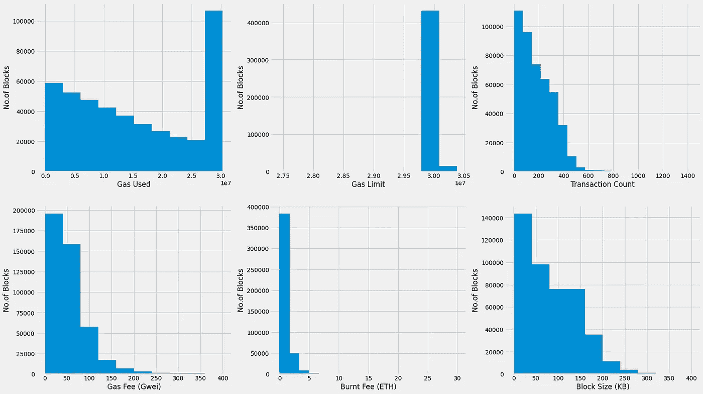

Histograms of all block parameters after data transformation

大多数区块的估价交易数量大多在 0-200 左右，各区块大小为 0-100 kb，天然气费为 0-50 Gwei。这解释了所用天然气的变化(基于交易类型——智能合同/P2P/DX/CX ),取决于区块开采时包括的交易。

根据 2022 年 5 月的 polygon 报告(Crypto research)，利用 Blocks Gas 限制的大多数交易往往是分散的交易所，如 Uniswap、NFT 巨头 OpenSea 和一些 stablecoin AMM 流动性池，每天近 30%。

数据还显示，开采的区块交易量和天然气量为零。这在 EIP 1559 的潜在安全问题中提到，矿工可能正在开采空的区块。下图显示了一段时间内开采空区块的频率，到 2022 年，这些频率基本上翻了一番。

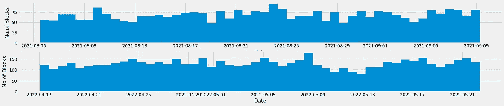

Histogram of Empty Blocks mined each day

基本数据评估函数(如 IQR、标准差、范围和有无空块数据的平均值)的比较如下所示:

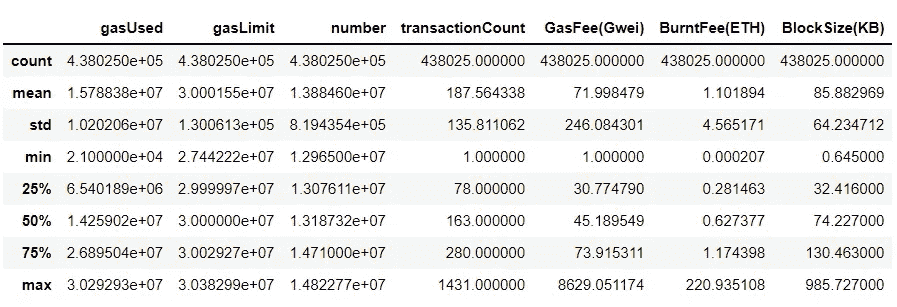

Non-empty Blocks statistics

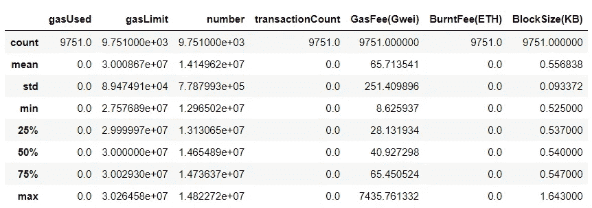

Empty Blocks statistics

虽然从 2021 年和 2022 年收集的采样数据来看，有 2.1%的空区块被开采，但其对天然气费用的影响是相当大的，因为天然气费用是根据根据母区块每种天然气的基本费用、使用的天然气和影响下一个待开采区块的目标而设计的协议计算的。非空区块的标准差显示了气费的分散集合。块大小意味着挖掘中包含的额外数据对于没有事务的空块最多为 1KB。

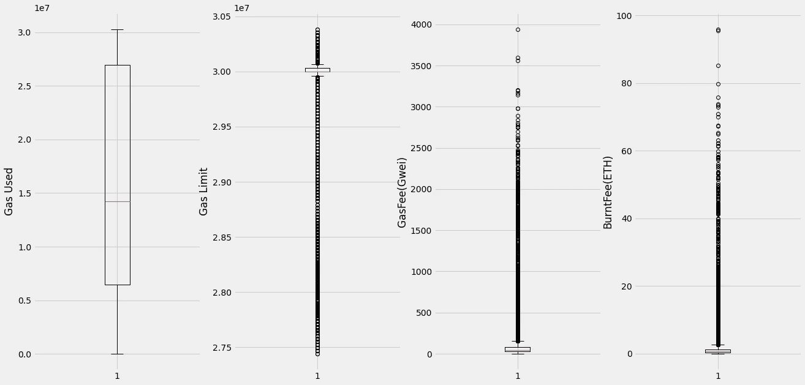

Dispersion of Non-zero block’s Gas Usage, Limit, Fee and burnt.

上述离差信息图显示，对于气体极限和气体费用，偏离异常值的变化大于采样数据的范围(第三个四分位数范围 1.5IQR)，但所用气体仍在预期范围内。

> 特征相关性

让我们来看看这些特性是如何相互对齐或关联的。
皮尔逊相关系数表明两个连续参数以线性方式相关的程度，前提是采样数据具有明确的间隔，而不是有序的。另一方面，Spearman 系数说明了两个变量的单调性质。
比较两者并得出结论总是一个最佳实践。

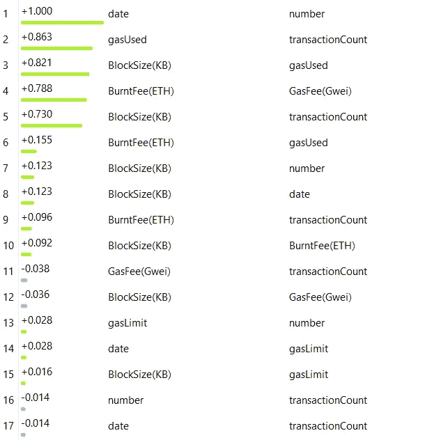

Pearson Correlation coefficients — Linear

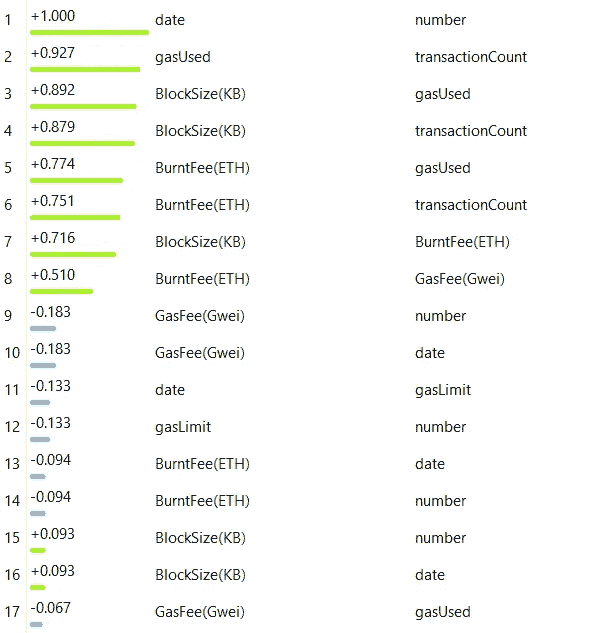

Spearman Correlation coefficients — Monotonic

正如所预期的，具有更正关系的高系数的参数是具有事务计数和块大小的 gas 项(已使用、限制和已消耗)。这些特征在区块如何制造/开采的核心基本概念以及设计区块链共识所涉及的计算方面都是相互关联的。我们可以忽略日期和块号，因为默认情况下它们是递增的，是常量。

以下块数据的散点图矩阵显示了参数之间的视觉相关性。
尽管有相当大的偏差或异常值，但这些都是明显的线性。

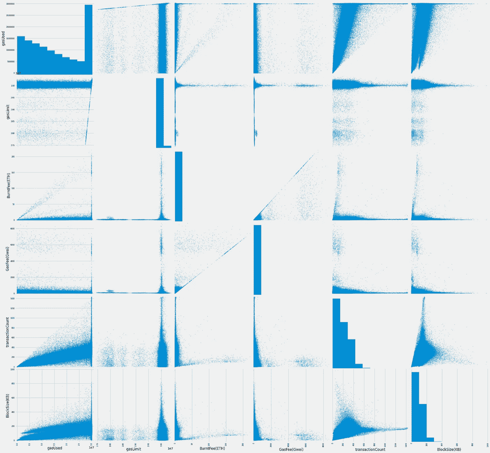

6x6 Scatter Plot Matrix

根据区块链的设计协议，天然气限额集中在某个点上，偏差解释了由于前一母区块的天然气费用以及如何/何种交易被合并而导致的限额变化。所使用的气体也倾向于底部，对于相同的一组块尺寸变化很大，这可能是由于用户定义的最大气体，其可以被消耗以得到优先化，尽管那些 Gwei 会被烧掉。

> 时间序列—比较趋势

燃烧费计算为转换成 Gwei (1e9 wei，其中 wei 是 ETH 的最小单位)的每种气体的基本费，它只不过是气体费(Gwei)乘以用于开采区块的气体。
`GasFee(Gwei) = [BaseFeePerGas/1e9]
BurntFee(ETH)=[GasFee(Gwei)*GasUsed]/1e9`

这是为了平衡经济价值和抵御以太坊的通货膨胀而每块燃烧的实际 ETH。这种计算是在块 POV 中完成的，因为用户为优先处理交易而设置的最大天然气费和授予矿工的最低奖励不被视为已消耗的费用。

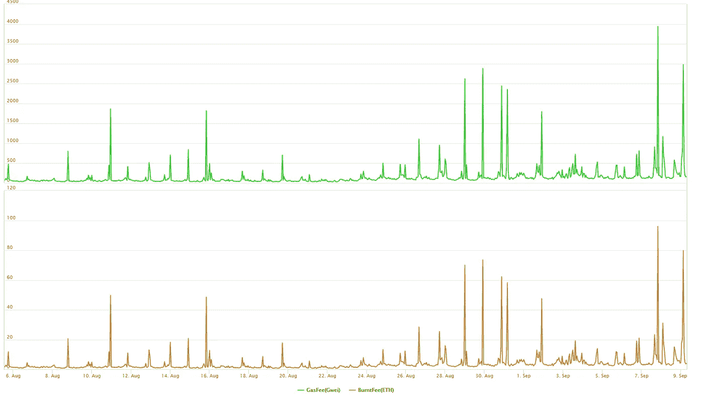

Time series of GasFee(Gwei) and BurntFee(ETH) — 2021 sampled data

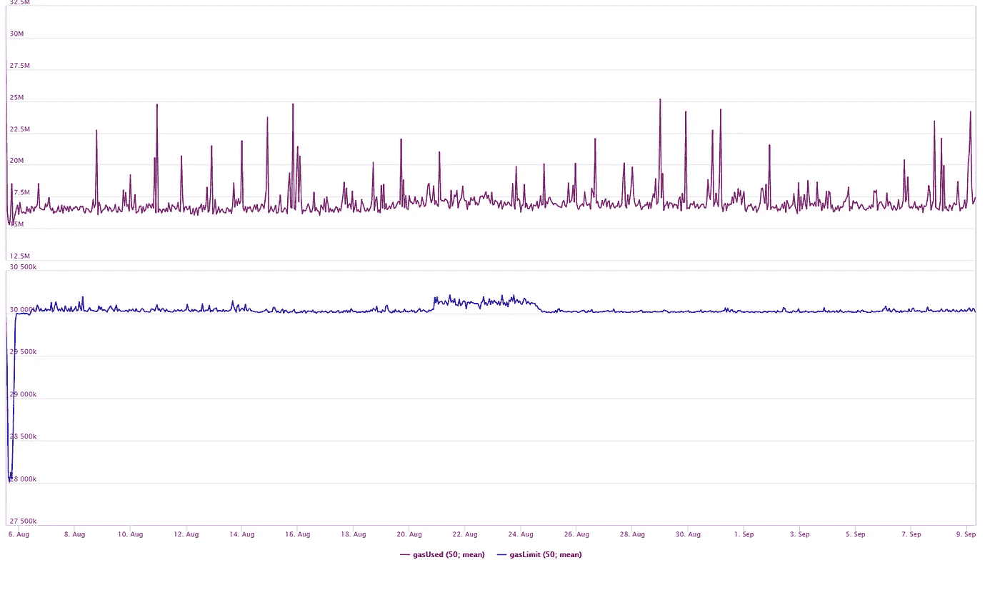

Time series of Gas Used and Gas Limit (rolling window 50) — 2021 sampled data

对于 2021 年的上述图表，峰值与燃气费、燃烧和使用同步，这是首先形成计算的一组东西，因此平衡显然是预期的。影响气体限值的后效可在 8 月 20 日至 24 日左右观察到，数值逐渐升高，因为方案考虑了之前母块的数值来调整限值。这是早期，事情正在适应实施的变化。

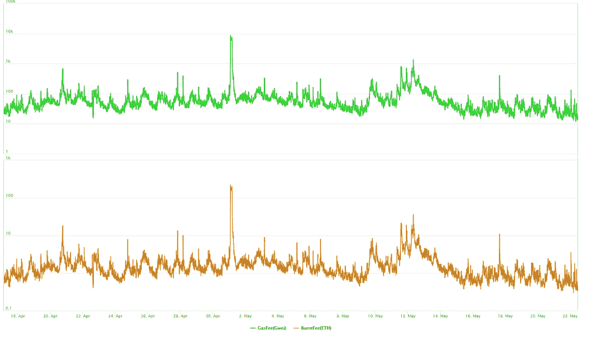

Time series of GasFee(Gwei) and BurntFee(ETH) in Logarithmic scale — 2022 sampled data

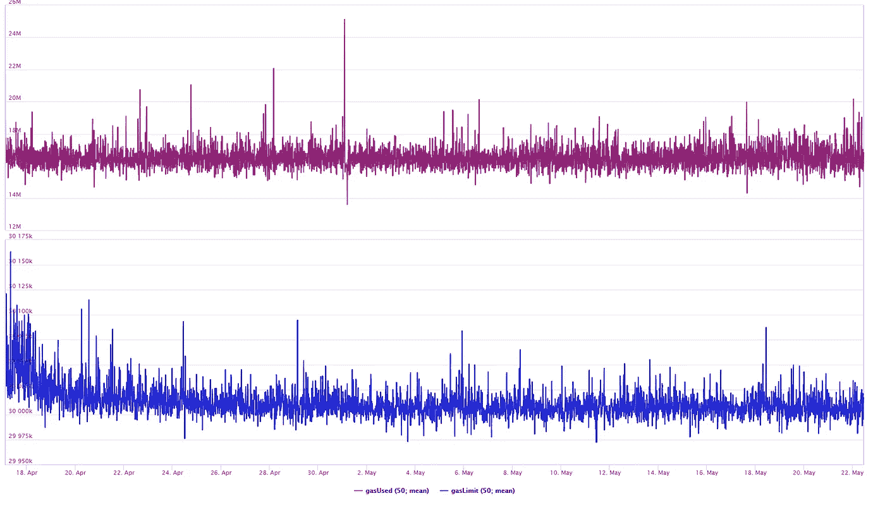

Time series of Gas Used and Gas Limit (rolling window 50) — 2022 sampled data

在 2022 个采样数据中，我们可以看到变化很大的气体参数。不得不使用对数标度来显示低水平变化和极端值。变化非常密集，但集中在所用气体的 16–20e 6 范围内。

此处显示的所有数据代表一个已开采区块的一些分析参数的汇总值。每个块由打包、赋值和散列的优先事务组成。有许多外部因素，如将验证/检查点推到以太坊上的侧链、二级链卷起下一批 Tx、集中式交换和 DeFi 应用等。影响交易，因此整个块参数会变化。
这纯粹是探索性分析，没有任何需要验证的深度评估，也没有任何建议。

***参考文献:***

 [## EIP-1559:ETH 1.0 链的费用市场变化

### 一种交易定价机制，包括固定的每块网络费用，这是烧毁和动态…

eips.ethereum.org](https://eips.ethereum.org/EIPS/eip-1559)  [## 首页| ethereum.org

### 以太坊是数字货币、全球支付和应用的发源地。社区建立了一个…

web.archive.org](https://web.archive.org/web/20210805124609/https://ethereum.org/en/) 

谢谢你

> 加入 Coinmonks [电报频道](https://t.me/coincodecap)和 [Youtube 频道](https://www.youtube.com/c/coinmonks/videos)了解加密交易和投资

# 另外，阅读

*   [WazirX vs coin dcx vs bit bns](/coinmonks/wazirx-vs-coindcx-vs-bitbns-149f4f19a2f1)|[block fi vs coin loan vs Nexo](/coinmonks/blockfi-vs-coinloan-vs-nexo-cb624635230d)
*   [本地比特币审核](/coinmonks/localbitcoins-review-6cc001c6ed56) | [加密货币储蓄账户](https://coincodecap.com/cryptocurrency-savings-accounts)
*   [什么是融资融券交易](https://coincodecap.com/margin-trading) | [美元成本平均法](https://coincodecap.com/dca)
*   [维护卡审核](https://coincodecap.com/uphold-card-review) | [信任钱包 vs MetaMask](https://coincodecap.com/trust-wallet-vs-metamask)
*   [Exness 点评](https://coincodecap.com/exness-review)|[moon xbt Vs bit get Vs Bingbon](https://coincodecap.com/bingbon-vs-bitget-vs-moonxbt)
*   [如何开始通过加密贷款赚取被动收入](https://coincodecap.com/passive-income-crypto-lending)