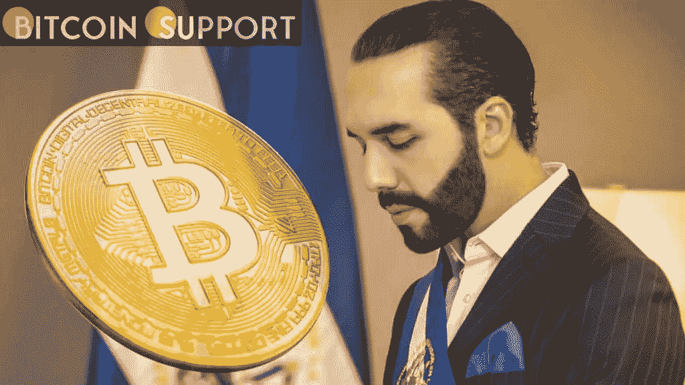

# 萨尔瓦多推出了新的比特币钱包

> 原文：<https://medium.com/coinmonks/el-salvador-has-introduced-a-new-bitcoin-wallet-47d9d9f42b2?source=collection_archive---------74----------------------->

**Visit our website:-** [**https://bitcoinsupports.com/**](https://bitcoinsupports.com/)

萨尔瓦多总统纳伊布·布克勒(Nayib Bukele)通过推特宣布，在比特币海滩安装一台新的 Chivo 比特币 ATM 机，用户从 Chivo 钱包中提取现金时将不再被收取费用，从任何比特币钱包中提取现金时仅被收取比特币网络费。这个新钱包的安装是由比特币海滩居民的几次请求促成的。

比特币海滩(Bitcoin Beach)是萨尔瓦多海滨小镇埃尔宗特(El Zonte)的一个热门度假目的地，该地区的许多商店在成为比特币海滩的几年前就接受了比特币。

**萨尔瓦多通过 Chivo 钱包的比特币承诺**

萨尔瓦多于 9 月成为首个采用比特币作为法定货币的国家，允许客户在未来的任何金融交易中使用该加密货币。这一行动引起了政府的广泛关注，国际货币基金组织(货币基金组织)敦促政府重新考虑其决定。

萨尔瓦多已经开始推动比特币的使用，在全国安装了数百台 Chivo 比特币自动取款机。作为该计划的一部分，Chivo 在美国的 10 个站点安装了 50 台免手续费的 Chivo ATMs，使向家人和朋友转账更加实惠和方便。除了比特币的购买和销售操作，自动取款机还支持零佣金交易，这是一种经济高效的跨境汇款方式。

萨尔瓦多目前在其国库中持有 1120 枚比特币，数百万萨尔瓦多人使用 Chivo 应用程序。

**访问我们的网站:-**[**https://bitcoinsupports.com/**](https://bitcoinsupports.com/)

**免责声明:以上为作者观点，不应视为投资建议。读者应该自己做研究。**