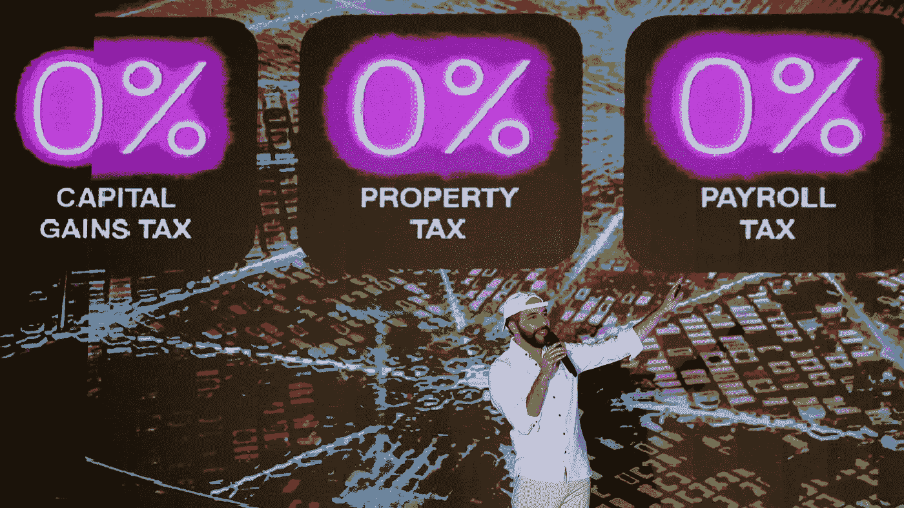
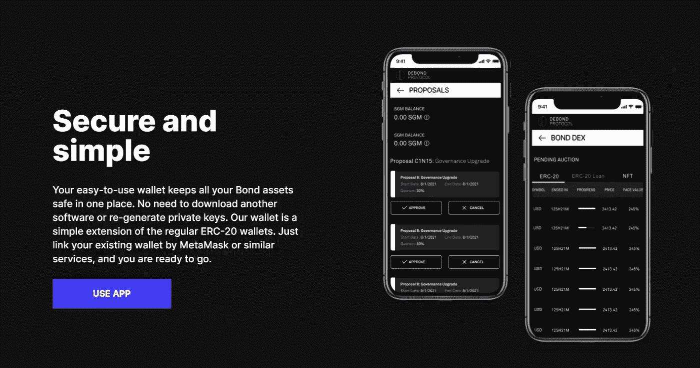

# 萨尔瓦多的加密债券、DeFi 和主流金融系统

> 原文：<https://medium.com/coinmonks/el-salvadors-crypto-bonds-defi-and-mainstream-financial-system-29fa138ef134?source=collection_archive---------10----------------------->

El Salvador gears for Bitcoin bonds sales (Photo credit: WSJ)

前几周，有关加密支持债券的讨论达到了又一个趋势性里程碑。随着萨尔瓦多[敲定](https://www.reuters.com/technology/el-salvador-says-could-launch-bitcoin-sovereign-bond-between-march-15-20-2022-03-11/)发行有史以来第一笔 10 亿美元比特币支持债券的计划，网上搜索指向了该国。这个 10 年期债券暂定于 3 月 20 日发售，票面利率为 6.5%。这个中美洲小国于去年 6 月将比特币作为 T2 的法定货币。这将标志着区块链社区继续努力在[传统金融(TradFi)和分散金融(DeFi)](https://tyler-d-warner.medium.com/the-future-of-crypto-banking-tradfi-vs-blockfi-vs-defi-5d1d37296098) 空间之间搭建桥梁的又一壮举。

**DeFi 成长为主流**

新兴的 DeFi 生态系统已经融入了不同的世界——加密货币、不可替代代币(NFT)、[元对](https://www.polygon.com/22959860/metaverse-explained-video-games)、银行、保险等的碎片化世界——到 2021 年 11 月中旬，它将达到 1740 亿美元的历史最高水平[。加上其与不断增长的 Web 3.0 去中心化互联网的互联性，DeFi 市场在未来几年的价值将达到数千亿美元。](https://consensys.net/blog/cryptoeconomic-research/defi-market-commentary-january-2022/)

市场内部人士将巨大的亏空部分归因于许多因素。其中最重要的是它的效率、公开性和透明度。Comdex 的 Abhishek Singh 在与 Fool.com 的一次谈话中建议,[从无法跟踪银行存款到经纪欺诈，TradFi 缺乏透明度使得 DeFi 行业的发展势在必行。](https://www.fool.com/investing/2022/03/05/defi-ceo-how-decentralized-synthetics-could-democr/%20https://www.fool.com/investing/2022/03/05/defi-ceo-how-decentralized-synthetics-could-democr/)

DeFi 也是一个增长型行业，产量显著提高。因此，这个领域正在吸引新一波认真的加密投资者，比如法国银行集团兴业银行的子公司 Forge，该公司去年 10 月[提出了](/coinmonks/société-générale-makerdao-banking-refinancing-as-the-first-collaboration-between-tradfi-and-defi-6fa633831734)一种债券代币，用于 MakerDAO，这是 TradFi 和 DeFi 互动的首批案例之一。

**萨尔瓦多加密债券销售亮点**

这些观点使得萨尔瓦多正在进行的债券销售计划变得更加重要。以 100 美元一批的结构出售的[萨尔瓦多债券](https://www.ft.com/content/5972099a-8a8c-4a85-8216-912cd78b710b)，不仅旨在实现准入民主化，允许机构和散户投资者参与比特币以及其他加密资产的另一个发展趋势和使用案例。这也增加了人们对这些(资产)如何真正脱颖而出的信心——尽管困难重重——作为一个类别逐渐成为主流金融体系的一部分。

尽管国土面积不大，但萨尔瓦多是一个主权国家，有能力与包括金融部门在内的所有国际文书进行互动。虽然它对加密支持债券的推动可能不会在国家间流行，并且这种趋势会在多大程度上被其他国家或组织所效仿也还不确定，但这种方法本身的主流性是值得认可的。除其他外，拟议中的债券发售将为寻求增加市场价值的举措打开大门，在分散的环境下扩大公众对衍生品的接触，并促成建立更复杂的奖励和赎回逻辑。

D/Bond brings derivatives to DeFi

**将分散债券纳入 DeFi**

寻求将任何形式的数字债务或资产证券化的金融工具纳入债券类别，并从萨尔瓦多带来的敞口变动中受益的创新系统之一是 [D/Bond](http://debond.net) 。该项目是一个分散的债券系统，基于无信任的智能合约，以及可用于对冲违约风险的衍生品——作为传统银行业务的一种新的替代选择——它是最不稳定的市场之一。

D/Bond 率先将 EIP-3475 作为合同的标准接口，通过提供独立的功能来读取、转移和允许在满足特定条件的情况下从发行人处赎回任何债券集合，来管理多个可赎回债券。该项目现在[估值](https://debond-protocol.medium.com/debond-is-now-valued-at-12-5-million-following-500-000-seed-funding-round-f998586ec90b)为 1250 万美元，迄今为止已经获得了投资者的支持和赞扬——如 [Bixin Ventures](https://bixinvc.com/) 、 [Exnetwork](https://exnetworkcapital.com/) 、Wave Capital、Crypto Dorm Fund、F12 Capital、Collinstar Capital 等——以及顾问。

除了令牌标准之外，D/Bond 在设计上也是一个开放式平台。它将作为一家分散化的投资银行，为客户发行债券，并提供定制的衍生品来对冲风险。这家总部位于巴黎的初创公司提供 D/Bond wallet、分散式债券交易所和开放的功能性证券市场，作为其生态系统的一部分。

**顾问采用新的定义/债券系统**

“通过提出并专注于新的 ERC 3475 标准，我相信 D/Bond 的创始人已经找到了一种方法，来改善目前依赖于未经审计或测试的智能合同的许多不同类型的气体低效交易的 UX 和安全性，”Rasheed Saleuddin[说，他是一位加密天使投资者和学者，他对去中心化债券市场系统(使用 ERC 3475 实施)的及时进入和重要性感兴趣，该系统是去中心化互联网的 Web 3.0 时代以及不断增长的 DeFi 生态系统。](https://www.linkedin.com/in/rasheed-saleuddin-26919016/)

“我经常寻找创始人开发出未经加工的钻石的协议，无论多么天才，都需要大量的抛光才能为 MVP 和更高的价值做好准备，”萨勒丁说，并提到在他们的最终产品之旅中与“超级大脑跨国团队”合作的快乐。他补充道:

“尽管经历了 2008 年至 2009 年的全球金融危机，但作为一名前证券化产品对冲基金经理，我知道资产支持债券有许多合法的使用案例，我期待着看到这些案例付诸实践。例如，集中资产以获得杠杆作用通常比逐个资产的方式更安全。我看不出有什么理由不将复杂的令牌现金流作为一个令牌按照 ERC 3475 标准定期执行。多方借贷和联合抵押贷款是一个用例，我希望 D/Bond 占主导地位。更少的汽油，更多的安全，更多的流动性。”

对于国际共识协会(T3)的联合创始人兼分散债券项目顾问 Jason Hung(T1)来说，D/Bond 专注于债券，而债券“总是金融领域的投资工具之一”，这是其最独特的特点。Hung 认为，该项目将成为加密领域金融科技的一部分，因为其团队、产品、机构支持和活跃的社区在提供服务方面具有“成熟的能力”。

邮箱:【info@debond.org 

推特: [@DebondProtocol](https://twitter.com/DebondProtocol)

网址:[https://debond.net/](http://www.debond.net/)

球场甲板:[shorturl.at/ozBT1](https://github.com/DeBond-Protocol/DOC/blob/main/DEBOND_PITCH_DECK_v2.01.pdf)

白皮书:[shorturl.at/yWZ03](https://github.com/DeBond-Protocol/DOC/blob/main/DEBOND_Whitepaper_v1.pdf)

> *加入 Coinmonks* [*电报频道*](https://t.me/coincodecap) *和* [*Youtube 频道*](https://www.youtube.com/c/coinmonks/videos) *了解加密交易和投资*

# 另外，阅读

*   [有哪些交易信号？](https://coincodecap.com/trading-signal) | [Bitstamp vs 比特币基地](https://coincodecap.com/bitstamp-coinbase) | [买索拉纳](https://coincodecap.com/buy-solana)
*   [ProfitFarmers 回顾](https://coincodecap.com/profitfarmers-review) | [如何使用 Cornix Trading Bot](https://coincodecap.com/cornix-trading-bot)
*   [十大最佳加密货币博客](https://coincodecap.com/best-cryptocurrency-blogs) | [YouHodler 评论](https://coincodecap.com/youhodler-review)
*   [MyConstant Review](https://coincodecap.com/myconstant-review) | [8 款最佳摇摆交易机器人](https://coincodecap.com/best-swing-trading-bots)
*   [MXC 交易所评论](/coinmonks/mxc-exchange-review-3af0ec1cba8c) | [Pionex vs 币安](https://coincodecap.com/pionex-vs-binance) | [Pionex 套利机器人](https://coincodecap.com/pionex-arbitrage-bot)