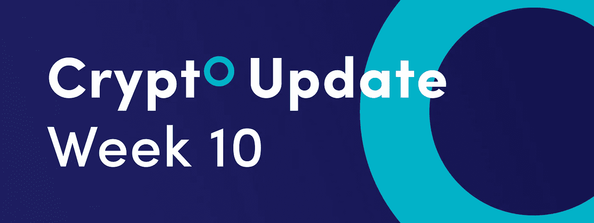
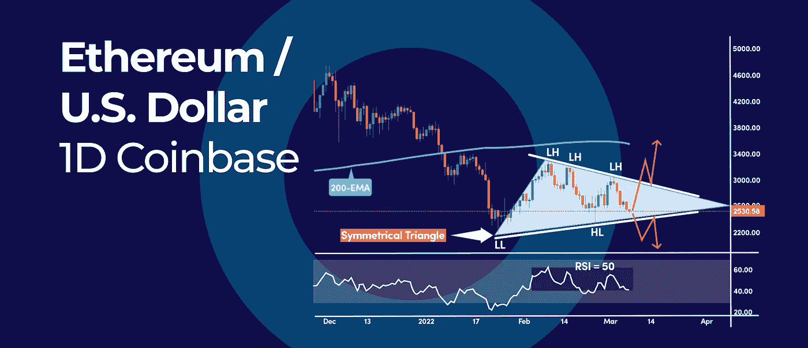
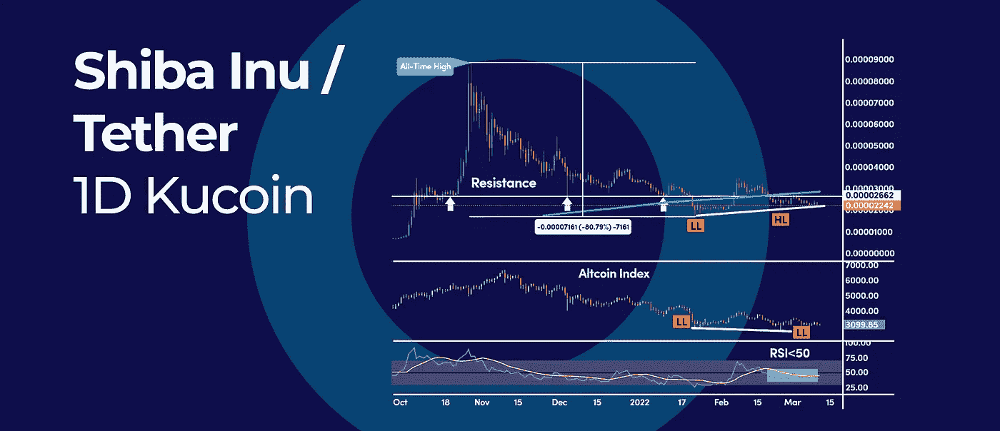

# 萨尔瓦多的比特币总持有量跃升至 1,801 BTCs。

> 原文：<https://medium.com/coinmonks/el-salvadors-total-bitcoin-holdings-jump-to-1-801-btcs-5c9de826d9f9?source=collection_archive---------45----------------------->

*   以太坊 2 个月对称三角形信号即将突破
*   柴犬智能资金背离呼吁潜在的底部
*   萨尔瓦多比特币总持有量跃升至 1，1,801 BTCs

# 以太坊 2 个月对称三角形信号即将突破

Ethereum 2-Month Symmetrical Triangle Signal an Impending Breakout

以太坊(ETH)的价格在日线图上已经形成了一个 2 个月的对称三角形，这警告了即将向两个方向突破。对称三角形是一种经典的图表模式，但也是一种中性的图表形式。在这方面，突破可能发生在短边或长边。

# 对称三角形

从 2159 美元的低点开始，ETH 的价格形成了一系列较低的高点，随后是一系列较高的低点，这些低点可以分别与下降趋势线和上升趋势线相连。

对称三角形形态的中性也在 RSI 震荡指标中凸显，在 50 中级上下徘徊。这表明多头和空头都没有完全控制局面，我们在 3300 美元高点和 2159 美元低点之间有一个均衡价格。

向上突破将使关键的 200 天简单移动平均线重新成为焦点。多头需要确保突破，并收于 200 天简单移动平均线之上，以将趋势转为上行。另一方面，跌势的突破将使焦点回到当前的底部 2159 美元。

**展望:** ETH 价格有望在对称格局的上下限内进一步盘整。

# 柴犬智能资金背离呼吁潜在的底部

SHIBA Inu Smart Money Divergence Calls for a Potential Bottom

柴犬(SHIB)从 0.00008864 美元的历史高点大幅回调了约 80%。然而，最近的价格走势显示了潜在的底部和趋势反转。通常，当一项资产偏离跟踪市场整体表现的基准指数时，就会出现大幅波动(高点或低点)——用技术术语来说，这称为相对强弱。

# 相对强度信号

如果我们将 SHIB 的价格与跟踪 altcoin 平均市场表现的 altcoin 指数 ALTPERP 进行比较，我们可以观察到柴犬表现出相对强势。要衡量相对实力，我们只需比较这两种资产的高低。

一方面，SHIB 的价格印出了一个更高的低点，这表明价格结构的转变，而与此同时，altcoin 指数印出了一个更低的低点。

这告诉我们，柴犬在替代硬币市场的表现优于同行。

我们不能仅凭相对强弱信号就马上认为已经见底，因为目前的反弹缺乏动力。然而，如果我们研究 RSI 振荡器，我们可以知道大多数 RSI 读数都低于 50 的中等水平。所以看跌的势头依然存在。

要实现逆转，需要做两件大事:

1.  RSI 需要突破 50 中级以上
2.  SHIB 价格需要突破 200 天简单移动平均线

第一个主要阻力位出现在 0.00002662 美元左右。另一方面，支撑位大约在 0.00002000 美元左右。

# 萨尔瓦多持有的比特币总量跃升至 1，801 个比特币

El Salvador Total Bitcoin Holdings Jumps to 1,801 BTCs

中美洲国家萨尔瓦多把它在 BTC 的比特币持有量提高到了 1，801 枚，截止 3 月 7 日，这些比特币的价值已经超过了 6，800 万美元。在世界上所有国家中，萨尔瓦多总统纳依布·布凯勒使该国成为资产负债表上最大的比特币持有者。

# 萨尔瓦多先例

萨尔瓦多在采用比特币作为法定货币后受益。因此，中国的 GDP 历史上首次出现两位数增长。2021 年第三季度，萨尔瓦多的经济增长了 11.69%，紧随其后的是 2021 年 Q2 的 24.1%的增长。

从比特币的最大企业持有者来看，MicroStrategy (MSTR)是目前为止比特币持有量最大的公司。MicroStrategy 的董事长兼首席执行官迈克尔·赛勒总共购买了 125，051 枚比特币，大约是第二大竞争对手特斯拉的 2.5 倍。

以目前 3.82 万美元的价格，MicroStrategy 的比特币现在价值约 47 亿美元。相比之下，特斯拉只拥有 4.32 万枚比特币，价值约 16.5 亿美元。

比特币在全球的普及程度在全球范围内持续提升。结果，区块链比特币上使用的唯一地址总数超过了 701k，达到了 2021 年年中以来的最高水平。

数字加密货币的总市值在 1 月底下降到 1.56 万亿美元后，又上升到 1.8 万亿美元。与此同时，截至 2022 年 3 月 7 日，比特币的市场支配地位已降至 42.33%。

订阅我们的媒体每周博客和更新。
在 [Twitter](https://twitter.com/cryptohopper) | [脸书](https://www.facebook.com/cryptohopper)|[Reddit](https://www.reddit.com/r/CryptoHopper/)|[insta gram](https://www.instagram.com/cryptohopper/?hl=nl)

从[数字加密货币](https://www.cryptohopper.com/)开始交易！