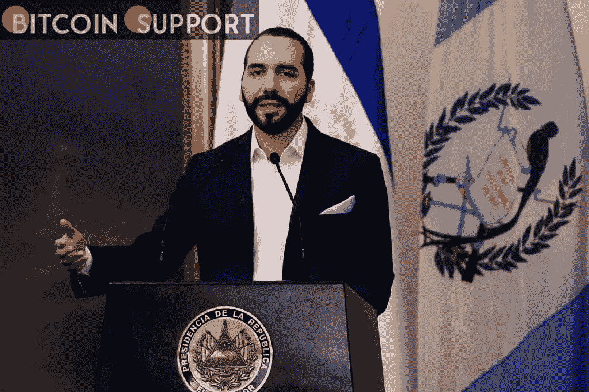

# 部长:自比特币被接受以来，萨尔瓦多的旅游业增长了 30%

> 原文：<https://medium.com/coinmonks/el-salvadors-tourism-has-increased-by-30-since-bitcoin-s-acceptance-minister-88ad8f910636?source=collection_archive---------32----------------------->

[**https://bitcoinsupports.com/**](https://bitcoinsupports.com/)

据总统 Nayib Bukele 称，萨尔瓦多的国内生产总值预计将在 2021 年增长 10%以上。

萨尔瓦多于 2021 年 9 月采用比特币(BTC)作为法定现金，使得国家 GDP 和当地旅游业发展均大幅增长。

据萨尔瓦多旅游部长莫雷纳·瓦尔迪兹(Morena Valdez)称，自 2021 年 9 月批准比特币法律以来，该国旅游业增长了 30%以上。

“我们进行了一项民意调查，比较比特币推出前后的活动。11 月和 12 月，旅游业增长。瓦尔迪兹在周一接受当地新闻机构萨尔瓦多新闻英语采访时表示，这一数字已经攀升了 30%以上。

[https://twitter.com/monicataher/status/1495973994306367490](https://twitter.com/monicataher/status/1495973994306367490)

据瓦尔迪兹称，萨尔瓦多接受比特币对旅游流量产生了影响，来自美国的游客数量不断增加。在比特币合法化之前，大多数游客来自中美洲地峡的接壤国家。她估计现在 60%的游客来自美国。据该部称，萨尔瓦多旅游业的繁荣已经超过了政府的预测，达到了 140 万游客，而不是 110 万。

**“我们原本预计 80 万美元的外汇，结果却是 14 亿多美元的国际货币，”瓦尔迪兹说。**

萨尔瓦多总统纳伊布·布克勒日前宣布，2021 年该国国内生产总值将增长 10.3%。2022 年 1 月，作为经济增长主要引擎的中国出口同比增长 13%。
https://twitter.com/nayibbukele/status/1495126452030914562
T22

**访问我们的网站:-**[**https://bitcoinsupports.com/**](https://bitcoinsupports.com/)

**免责声明:以上为作者观点，不应视为投资建议。读者应该自己做研究。**

> 加入 Coinmonks [电报频道](https://t.me/coincodecap)和 [Youtube 频道](https://www.youtube.com/c/coinmonks/videos)了解加密交易和投资

# 另外，阅读

*   [WazirX vs coin dcx vs bit bns](/coinmonks/wazirx-vs-coindcx-vs-bitbns-149f4f19a2f1)|[block fi vs coin loan vs Nexo](/coinmonks/blockfi-vs-coinloan-vs-nexo-cb624635230d)
*   [BlockFi 信用卡](https://coincodecap.com/blockfi-credit-card) | [如何在币安购买比特币](https://coincodecap.com/buy-bitcoin-binance)
*   [火币交易机器人](https://coincodecap.com/huobi-trading-bot) | [如何购买 ADA](https://coincodecap.com/buy-ada-cardano) | [Geco。一次审查](https://coincodecap.com/geco-one-review)
*   [加密副本交易平台](/coinmonks/top-10-crypto-copy-trading-platforms-for-beginners-d0c37c7d698c) | [五大 BlockFi 替代方案](https://coincodecap.com/blockfi-alternatives)
*   [CoinLoan 点评](https://coincodecap.com/coinloan-review)|[Crypto.com 点评](/coinmonks/crypto-com-review-f143dca1f74c) | [火币保证金交易](/coinmonks/huobi-margin-trading-b3b06cdc1519)
*   [Bybit vs 币安](https://coincodecap.com/bybit-binance-moonxbt)|[stealth x 回顾](/coinmonks/stealthex-review-396c67309988) | [Probit 回顾](https://coincodecap.com/probit-review)
*   [顶级付费加密货币和区块链课程](https://coincodecap.com/blockchain-courses)