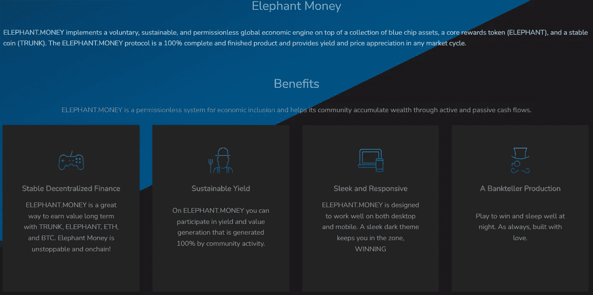

# 大象钱、象鼻和踩踏将成为 DeFi 和被动收入之王。你参加聚会还不算晚——还没有。

> 原文：<https://medium.com/coinmonks/elephant-money-trunk-and-stampede-will-be-the-king-of-defi-youre-not-late-to-the-party-yet-e7e08d4a3cc8?source=collection_archive---------3----------------------->

参加派对时迟到过吗？也许是想给某人留下深刻印象，好让所有的注意力都集中在你身上？是的——我八年级的时候和一群朋友一起做过，当时我们试图帮助我们的一个朋友打动一个女孩。一群 14 岁的孩子在中学玩心理战——可能当时不知道这意味着什么。

就 DeFi 而言，参加聚会迟到了，至少还有机会把钱赚回来，这不是很好吗？如果你有机会在未来三个月、六个月或十二个月获得被动收入，会怎么样？

在过去的六个月里，我在 DeFi 投入了大量资金，我已经看到了太多的模仿和假冒项目，这些项目“承诺这个”、“承诺那个”、“保证投资回报率”——你能想到的，不胜枚举。这些项目不值得一提，但它是重复的泵和转储，坏 tokenomic 项目的相同结果。

# **他们如何在**引诱你

做“早期”投资者的预售炒作？检查。

申请他们的 Certik 审计？检查。

Telegram 中活跃的 Dev+营销团队，不和谐？检查。

专业的网站+白皮书？检查。

㈩已经筹集的美元数额？检查。

YouTubers 花钱买来“炒作”协议？检查。

检查。伙计。

大多数人不理解象征经济学——他们也不关心。总的来说，Crypto 教会了人们“跟风”成为早期投资者——即使这意味着失去你的屁股。更糟糕的是，人们并不在乎，还会继续追逐下一个“早期”项目。我看到私人电报小组的同一批人一次又一次地被同样的项目所迷惑，我想知道为什么他们总是失败。

让我告诉你第一周是怎么过的。

Token launches，认为“他们早”的人购买向上到右边的图表，因为 FOMO(害怕错过)。真正的早期投资者——机器人、预售人员、鲸鱼——在每一个新令牌发布时都在等待，并在最初几天到一周之后继续抨击协议。你被发现拿着包，没有机会拿回你的钱。大多数这些“游戏”或“项目”都隐藏着通货膨胀，从数学上讲是不可能盈利的。

钩，线，下沉物。每一个。该死的。时间。

# **你迟到了，但很难不赌上一大笔钱**

有什么事情是确定无疑的吗？如果是这样，让我告诉你这个新的矿工 DeFi 项目…

..开玩笑的。

如果我告诉你这个开发者是一个麻省理工学院的毕业生，完全 doxxed，字面上是一个 OG 的密码？不够？别担心。

富达前副总裁？检查。多年 DevOps 咨询经验？检查。参与了几个创业公司？检查。樱井真子实验室现任创始人兼首席执行官？是的——是 dev BankTeller，或“BT”。虽然对你们中的一些人来说，拥有令人印象深刻的简历或多年的经验可能不是一个完整的卖点，但制定一个像资金/流量这样的协议并让某个开发人员改进一些元素并创建滴滴生态系统足以吸引任何人的注意。

英国电信设计了一个分散化的银行系统，该系统建立在三个基础上——本地令牌“大象”,稳定的硬币“象鼻”,以及通过赌注和踩踏(永久债券)在“象鼻”上赚取收益的方式。

让我们看看大象金钱的三个领域，然后我会告诉你为什么我要全押。

# **行李箱**

以下是白皮书的摘录:

> 大象。Money Network 在币安智能链(BSC)上的部分抵押稳定硬币(BEP-20 ),通过由资产储备支持来获取价值，资产储备保证以 1 美元等值的金额赎回(减去 1%的赎回费),并可以下注以获得高收益。TRUNK 的储备 75%由币安美元(BUSD)支持，25%由大象支持。除了能够锁定你的加密收益，TRUNK 还允许玩家通过下注 TRUNK 从 1%的滴滴红利池中赚取被动奖励(基础 APR 从 30%开始)来增加他们的收入。奖励积分在铸造和赎回时产生，分别为铸造/赎回量的 11%和 4%。这些奖励分配给象鼻赌注池(8%造币/ 1%赎回)，大象。货币 V2 保险库池(2%新币/1%赎回)和性能池(1%新币/赎回)。所有的资金池都按每日余额的 1%发放奖励。象鼻也有利于大象的持有者，因为用于铸造象鼻的 BUSD 的 25%被用于回购大象，这意味着支撑象鼻的潜在抵押品随着大象的生长而变硬。金钱生态系统成长。

# **大象令牌**

以下是白皮书的摘录:

> 大象。Money Network 在币安智能链(BSC)上的储值令牌(BEP-20 ),通过最公平的分配、自动平衡燃烧机制以及提供终身无摩擦的被动奖励来获取价值。大象的主人只需将代币放在钱包里就可以获得被动奖励，因为每笔交易(购买、出售和转移)都有 10%的费用；5%,平均分配给所有现有代币持有人，另外 5%用于锁定流动性。此外，大象还被用作币安美元(BUSD)铸造的象鼻币的部分赎回抵押品。将有一千万亿个大象代币的初始供应，分配如下:49%发送到墓地(带有自动平衡燃烧机制的燃烧地址)，1%用于营销/开发，25%用于合同拥有的锁定流动性，25%用于流动性驱动活动期间的社区参与者。与其他反射令牌平台相比，ELEPHANT 的一个独特之处在于，通常这些平台将其烧录地址设置为另一个令牌持有者，该令牌持有者会随着时间的推移被动地变得越来越大。虽然这在理论上听起来不错，但最终的效果是 burn 地址会吃掉其余令牌持有者的所有奖励。然而，在大象，墓地是一个聪明的合同，重新平衡其供应的 50%的所有权(如果认为有必要)。这可以防止持有人得到稀释加班，获得更多的奖励和激励长期战略！

# **踩踏(粘合)**

以下是白皮书的摘录:

> 大象。Money Network 的本地绑定系统，允许玩家存放他们的行李箱，并从部分抵押的稳定硬币中赚取 205%的 APR (672% APY)。通过参与，玩家债券(燃烧)他们的鼻子，并在大象国库和大象/BUSD 潘切克互换流动资金池之间平分。粘合干线确保系统作为一个整体，无论市场状况如何，都能长期盈利。债券与你的钱包紧密相连，可以随时增值(或复利)。在 365 天内，您将获得总存款额的 2.05 倍的固定收益，利率为每天 0.56%(总存款额)。此外，踩踏事件中锁定的总价值(TVL)的增加提高了本地主干桩的 APR。Stampede 是您加密投资组合的一个很好的补充，因为它允许您以低风险赚取固定收益，以换取强化大象金库。或者，由于奖励是作为稳定的硬币支付的，所以不管市场情况如何，你都能够获得稳定的收益。Stampede 也是 Herd 合作伙伴网络的所在地，这是其首个同类入职系统，在参与时平等奖励推荐人和被推荐人(有关更多信息，请参见标题为“Herd(合作伙伴计划网络)”的部分)。铸造债券是一个伟大的对冲，有利于整个大象。金钱生态系统，包括大象和象鼻持有人一样！

这就是为什么我要全押，如果这是你的 TL:DR——没有价格波动。

我相信你们大多数人都是滴滴的投资者，都在想为什么滴滴在几个月内就从 200 美元/股涨到了 33 美元/股。滴滴的问题远比“抽水转储”复杂得多——因为存钱罐的推出被机器人拦截，整个系统通过从滴滴→动物农场/存钱罐抽走资金而自相矛盾。但是让我们以滴滴为例。价格波动将永远是阻碍滴滴协议长期可持续发展的因素。在某个时候，新的投资者将会枯竭，用例将会受到限制，而外汇鲨鱼将会转向更大更好的东西。

当我把我的行李箱锁进“踩踏”模式时，(就像水龙头一样，本金被锁住了)我把价格波动从我的每日回报中剔除了。象鼻与美元挂钩，并由 75%的 BUSD 和 25%的大象令牌共同支持。感觉很好的人，特别是在通货膨胀上升和总体波动的情况下。

# 那么，我该如何进入后备箱并逃离呢？

很简单——一旦你使用 PancakeSwap、Bogged Finance 或[象钱](https://elephant.money/trunk.html)将你的 BUSD/BNB 转换为 Trunk，你可以选择下注或狂奔(债券)。你可以用你的箱子做赌注，赚取 64%的箱子年利率——你可以随时提取你的箱子存款。

对更高的收益感兴趣？利用踩踏的优势(像滴水的水龙头)。你的本金被锁定，你赚取 205%的年利率，每天支付 0.56%。你的奖励也是用树干支付的，不用担心价格波动。你唯一需要记录的是你的“最大”支出是你存款额的两倍——不像滴滴是无限的。

# **逐步指南**

1.  前往 [Elephant.money](https://elephant.money/trunk.html) ，通过币安智能链连接您的钱包
2.  去铸币区铸造所需数量的 BUSD。你必须首先启用 BUSD。或者，您可以使用中继令牌地址:
    0x DD 325 c38 b 12903 b 727d 16961 e 61333 f 4871 a 70 e 0 到 PancakeSwap 进行中继交易
3.  向下滚动到“群体:合作伙伴网络”
4.  命中:合作伙伴
5.  如果你想用我作为推荐人，在债券和卷(化合物)上获得 0.5%的空投，请复制并粘贴我的钱包地址(如果你这样做，谢谢！):
    0x cf 95 a 7d 2 b 19746 b 3782d 36 ef 5d 32433 b8e 3232 a 8
6.  点击:更新
7.  向上滚动以抢购永久债券
8.  击中:邦德
9.  输入需要焊接的干线数量，然后点击焊接

# **与滴滴不同的转诊制度**

像你们大多数人一样，我在很多地方推托过我的点滴推荐。这个转诊制度是不同的。

你和你的搭档会得到奖励。你们两个都将获得任何主干债券或滚动 0.5%的空投。没有更多的滴灌 maxis 兜售他们的推荐链接，并获得庞氏丰富。

如果您有兴趣将我作为合作伙伴—您可以使用我的推荐代码—0x cf 95 a 7 D2 b 19746 b 3782d 36 ef 5d 32433 b 8 e 3232 a 8

作为感谢——给我发关于我的[不和谐](https://discord.gg/CZjT6FAQ)的信息，并获得免费的行李箱奖励！

让我们来看看大象金钱网站上的部分——按照上面的步骤指南来做吧！

> 加入 Coinmonks [电报频道](https://t.me/coincodecap)和 [Youtube 频道](https://www.youtube.com/c/coinmonks/videos)了解加密交易和投资

# 另外，阅读

*   [印度的加密交易所](/coinmonks/bitcoin-exchange-in-india-7f1fe79715c9) | [比特币储蓄账户](/coinmonks/bitcoin-savings-account-e65b13f92451)
*   [OKEx vs KuCoin](https://coincodecap.com/okex-kucoin) | [摄氏替代品](https://coincodecap.com/celsius-alternatives) | [如何购买 VeChain](https://coincodecap.com/buy-vechain)
*   [币安期货交易](https://coincodecap.com/binance-futures-trading)|[3 commas vs Mudrex vs eToro](https://coincodecap.com/mudrex-3commas-etoro)
*   [如何购买 Monero](https://coincodecap.com/buy-monero) | [IDEX 评论](https://coincodecap.com/idex-review) | [BitKan 交易机器人](https://coincodecap.com/bitkan-trading-bot)
*   [CoinDCX 评论](/coinmonks/coindcx-review-8444db3621a2) | [加密保证金交易交易所](https://coincodecap.com/crypto-margin-trading-exchanges)