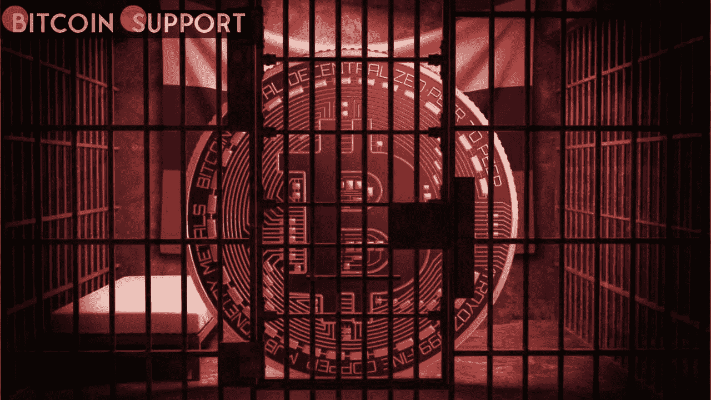

# 椭圆声称在追捕俄罗斯加密制裁逃避者方面取得了突破

> 原文：<https://medium.com/coinmonks/elliptic-claims-to-have-made-a-breakthrough-in-the-hunt-for-russian-crypto-sanctions-evaders-ac227c7287e8?source=collection_archive---------88----------------------->

**Visit our website:-** [**https://bitcoinsupports.com/**](https://bitcoinsupports.com/)

3 月 12 日，由于俄罗斯军队的炮击，布罗瓦里地区 Kvitneve 村的一个冷冻食品仓库着火。Elliptic 和 chain analysis 等“加密取证组织”似乎正在获得国际媒体的关注，据称他们的区块链分析工具使他们能够在追捕使用加密技术的俄罗斯制裁规避者方面取得重大进展。

椭圆联合创始人汤姆·罗宾逊告诉彭博，该公司已向西方官员提供了一个加密货币钱包的信息，“可能与受制裁的俄罗斯官员和亿万富翁有关”该组织和 Chainalysis 据说正在与许多政府机构和部门合作，主要是在美国。根据罗宾逊的说法，这个有问题的钱包包括“大量的加密资产”

Elliptic 则表示，这个钱包只是一个开始，声称正在“积极审查”与“受到制裁的俄罗斯当局和亿万富翁”有关的钱包。

该公司声明:

**“我们正在与政府当局和其他团体合作，以确保那些野蛮和非法入侵乌克兰的个人无法使用加密资产隐藏他们的财富。”Elliptic 首席执行官 Simone Maini 也在博客中写道，该公司已经“确定了超过 400 家虚拟资产服务提供商(VASPs)，主要是交易所，在那里可以使用卢布购买加密货币。”她接着说，该公司已经“链接了数百万个加密资产地址”到 VASPs，尽管事实上其中大多数都是不受监管的，并允许消费者匿名访问他们的服务。“超过 1500 万个比特币地址被明确与俄罗斯的非法活动有关联，”该公司表示。根据 Elliptic 的说法，这将使加密提供商能够“过滤暴露在这种活动中的交易和钱包，并确保收益不会被清洗”。此外，Maini 写道，她的公司已经“确定了几十万个与以俄罗斯为基地的受制裁行为者有关的加密地址”，并指出这些地址“超出了制裁名单中的范围”，还包括“我们通过自己的分析已经能够与这些行为者联系起来的其他地址”

通过开发“加密资产制裁合规性的最佳实践”，该公司期望成为该领域的领导者。罗宾逊还表示，与 2 月下旬冲突爆发前的一周相比，上周卢布交易市场的活动增加了两倍。

据报道，他说:

**“亿万富翁可以通过将其所有资产转移到 crypto 来完全规避制裁，这被证明是不可行的。”密码术极具可追踪性。加密可能会被用来逃避制裁，但它不是万灵药。他接着说，“总体而言，加密服务提供商的‘制裁合规度’非常高。”Chainalysis 之前声称已经建立了消除 CoinJoin 交易匿名化的能力，本月早些时候宣布，它将向寻求遵守制裁要求的加密平台免费提供一系列分析工具。****

**访问我们的网站:-**[**【https://bitcoinsupports.com/】**](https://bitcoinsupports.com/)

**免责声明:这些是作者的观点，不应被视为投资建议。读者应该自己做研究。**

> 加入 Coinmonks [电报频道](https://t.me/coincodecap)和 [Youtube 频道](https://www.youtube.com/c/coinmonks/videos)了解加密交易和投资

# 另外，阅读

*   [如何在 FTX 交易所交易期货](https://coincodecap.com/ftx-futures-trading) | [OKEx vs 币安](https://coincodecap.com/okex-vs-binance)
*   [OKEx vs KuCoin](https://coincodecap.com/okex-kucoin) | [摄氏替代品](https://coincodecap.com/celsius-alternatives) | [如何购买 VeChain](https://coincodecap.com/buy-vechain)
*   [ProfitFarmers 回顾](https://coincodecap.com/profitfarmers-review) | [如何使用 Cornix Trading Bot](https://coincodecap.com/cornix-trading-bot)
*   [如何匿名购买比特币](https://coincodecap.com/buy-bitcoin-anonymously) | [比特币现金钱包](https://coincodecap.com/bitcoin-cash-wallets)
*   [瓦济里克斯 NFT 评论](https://coincodecap.com/wazirx-nft-review)|[Bitsgap vs Pionex](https://coincodecap.com/bitsgap-vs-pionex)|[坦吉姆评论](https://coincodecap.com/tangem-wallet-review)