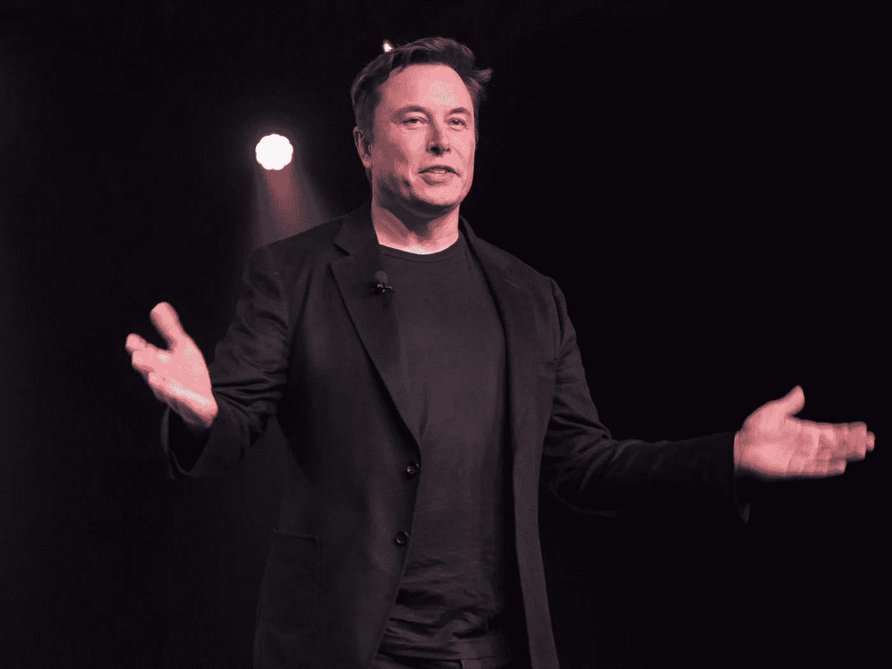
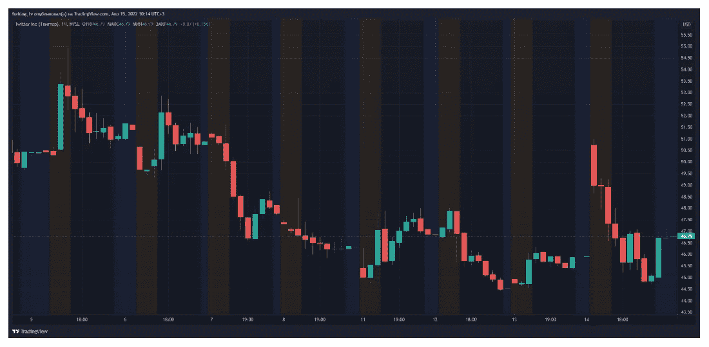

# 埃隆·马斯克解释了他想要收购 Twitter 的原因

> 原文：<https://medium.com/coinmonks/elon-musk-explains-why-he-wants-to-buy-twitter-bbe47c7a43ee?source=collection_archive---------4----------------------->

收购 Twitter 的动机是为了创造一个“自由言论的包容性舞台”，而不是为了赚钱。这是埃隆·马斯克在 ted 大会上说的。

> “推特已经成为一个事实上的城市广场，非常重要的是，人们有这样的理解和观点，他们可以在法律范围内自由言论，”他补充道。

4 月 13 日，这位亿万富翁向 SEC 提交了一份声明，根据该声明，他准备以每股 54.2 美元的价格收购一家社交网络，考虑到公司证券的数量，这几乎是 430 亿美元。Twitter 报价对特斯拉创始人的报价做出了 11%的回应。

第二天，沙特王子阿尔瓦利德·本·塔拉勒·沙特拒绝了马斯克的提议。通过控股公司王国控股公司，他控制着平台约 5%的股份。

> “鉴于(该公司)的增长前景，我不认为马斯克 54.2 美元的出价反映了 Twitter 的真正价值。作为 Twitter 最大和最长期的股东之一，王国控股公司和我拒绝了这一提议，”他写道。

针对普林斯的话，马斯克问推特直接和间接拥有[王国控股公司](https://kingdom.com.sa/)多少，以及该公司如何看待“新闻言论自由”

在 TED 大会上，马斯克指出，他有一个“B 计划”，以防 Twitter 股东拒绝这一提议。这位亿万富翁没有透露细节。

按照特斯拉负责人的说法，他不打算“垄断”社交平台，但他有足够的资本收购它。

> “从技术上讲，我买得起。但那不是赚钱的方式[……]。我根本不关心这个问题的经济方面，”他解释道。

马斯克强调，Twitter 应该使用开源算法来排除任何“幕后操纵”。他认为，应该允许用户编辑帖子，以及积极打击平台上的欺诈和垃圾邮件。

社区对马斯克的提议意见不一。一些人认为这位亿万富翁真的能够为 Twitter 做很多好事，而另一些人则称这一举措为“敌意收购”。特别是，这一立场是由 Dogecoin (DOGE)的创始人杰克逊·帕尔默提出的。

> “要把任何一种‘自由’与世界首富发起的敌意收购联系起来，迫使最大的公共社交平台之一私有化，需要很大的脑力体操，”他写道。

根据[的消息](https://www.theinformation.com/articles/twitter-board-expected-to-fight-musk-offer)，Twitter 的董事会也不同意马斯克的乐观态度，并打算反对收购。据该出版物称，经理们认为这一提议“不可取”。

在金融环境中，对这位亿万富翁的倡议的态度也是模棱两可的。据美国消费者新闻与商业频道报道，投资银行 Stifel 降低了 Twitter 的股票评级，解释说该公司正走向“埃隆马戏团”

> “根据马斯克的建议，我们正在下调 Twitter 的销售评级[…]。我们认为，在短期内，该倡议为股票设定了上限，使报价脱离基本面，如果马斯克先生撤回要约或出售股份，将产生重大的下行风险，”分析师解释道。

Twitter 股价在 4 月 14 日收盘时为 45.08 美元。盘前，证券价格上涨——在撰写本文时，其交易价格接近 46.79 美元。

Hourly chart of Twitter quotes on the NYSE. Data: Trading View.

2022 年 4 月，马斯克成为 Twitter 的最大股东，以 28.9 亿美元购买了该公司 9.2%的证券。此前，这位亿万富翁批评了社交网络的言论自由政策。

 [## 罕见的漏洞可能会剥夺用户的所有 NFT

### Check Point Research (CPR)在稀有的 NFT 市场中发现了一个漏洞。该漏洞将允许…

medium.com](/@unclefibonacci/rarible-vulnerability-could-deprive-users-of-all-nfts-89fc4691a47d)  [## 尽管加密货币崩溃了，比特币网络的哈希值仍在继续增长…

### 尽管最近几天比特币的价值有所下降，但主要加密货币的网络哈希拉特…

medium.com](/@unclefibonacci/the-hashrate-of-the-bitcoin-network-continues-to-grow-despite-the-collapse-of-the-cryptocurrency-1f983107e8d0)  [## 分类帐硬件加密钱包集成税务解决方案以简化报告

### 主要的加密货币硬件钱包提供商 Ledger 正在帮助加密投资者通过引入一种新的…

medium.com](/@unclefibonacci/ledger-hardware-crypto-wallet-integrates-tax-solution-to-simplify-reporting-37850867e846) 

> 加入 Coinmonks [电报频道](https://t.me/coincodecap)和 [Youtube 频道](https://www.youtube.com/c/coinmonks/videos)了解加密交易和投资

# 另外，阅读

*   [有哪些交易信号？](https://coincodecap.com/trading-signal) | [Bitstamp vs 比特币基地](https://coincodecap.com/bitstamp-coinbase) | [买索拉纳](https://coincodecap.com/buy-solana)
*   [ProfitFarmers 回顾](https://coincodecap.com/profitfarmers-review) | [如何使用 Cornix Trading Bot](https://coincodecap.com/cornix-trading-bot)
*   [十大最佳加密货币博客](https://coincodecap.com/best-cryptocurrency-blogs) | [YouHodler 评论](https://coincodecap.com/youhodler-review)
*   [MyConstant Review](https://coincodecap.com/myconstant-review) | [8 款最佳摇摆交易机器人](https://coincodecap.com/best-swing-trading-bots)
*   [MXC 交易所评论](/coinmonks/mxc-exchange-review-3af0ec1cba8c) | [Pionex vs 币安](https://coincodecap.com/pionex-vs-binance) | [Pionex 套利机器人](https://coincodecap.com/pionex-arbitrage-bot)