# 埃隆·马斯克:从国王的策略到棋子的最后阶段

> 原文：<https://medium.com/coinmonks/elon-musk-from-the-kings-gambit-to-the-pawn-s-endgame-c934884b9255?source=collection_archive---------59----------------------->

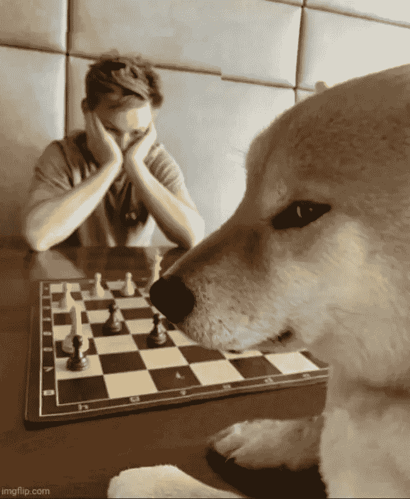

我不是一个“爱隆主义者”那是什么？好吧，如果我们为埃隆·马斯克的名言和智慧之言起了一个特殊的名字(术语)——埃隆主义，为什么我们不能为他的铁杆粉丝、崇拜者和追随者起一个名字呢？很有道理，不是吗？

我不是左派。我没有被整个推特收购“传奇”吓到。我不是阴谋论者。我不喜欢埃隆·马斯克和《世界》的比赛。最重要的是，我不是一个实用主义者，这意味着我没有利用这个故事中的“elonmania”现象。

哦，让我写一些关于埃隆的事情。那总是一个安全的赌注。出于这样或那样的原因，每个人都在做这件事。我为什么要成为一个“例外？”

你可能会感到惊讶，但实际上，我只有两个简单的问题要问。

# 我们是怎么走到这一步的？

你可能会说，*冷静点哥们儿*，*这只是个玩笑*。是吗？我给我的一些朋友看了这条推文，他们不仅喜欢它，还认为它是 100%合法的。

我是那种互相宽容的人。你永远不会对埃隆·马斯克的一言一行感到满意。好的。伙计，只要你开心就好。你认为他的每条推文都有“更深”的含义。好的。继续找。

我们已经达到了将任何与埃隆·马斯克有一点点关联的事情都超现实化的地步。这就是我在 Quora 上偶然发现这个惊人问题的原因:

> 为什么埃隆·马斯克要雇佣贾斯汀比伯来帮助他收购 Twitter？

你自己也看到了，这个问题还在等待它的第一个答案。我想知道，为什么会这样？你怎么想呢?

我的第二个问题是，别担心，我不会问“埃隆·马斯克会游泳吗？”是的，有人真的问过这个问题。是的，这很重要。你知道，火星上有水之类的东西。你永远不知道它什么时候会派上用场。

**那么，埃隆，这一切，无论是什么，无论是出于什么原因，过去/现在/将来都值得你花费时间、金钱、精力和遗产吗？**

# 从火星到闹剧

如果你认为特朗普是美国现代史上最两极分化的人，那么，你显然错了。世界首富([查过](https://www.forbes.com/real-time-billionaires/?ref=hackernoon.com#792489c43d78))和最聪明的(没查过，但你要变得聪明才能有钱，我猜)只用一条推特(不止一次)就能让地球静止。

去中心化是埃隆最喜欢的一句话，但不是在互联网上。

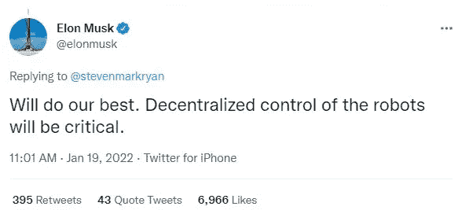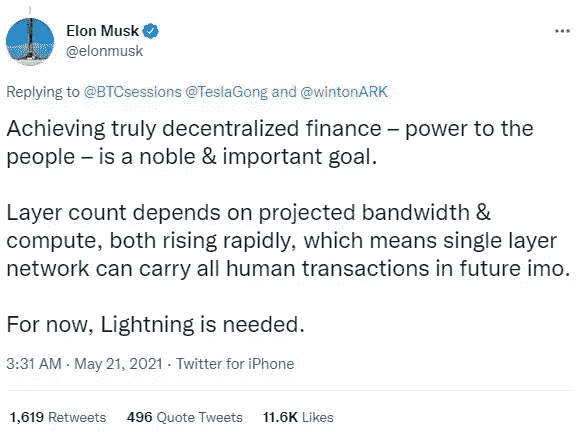

分散式机器人？！好的。终结者坏了。伊隆很好。

分散的财政。很好。但是…

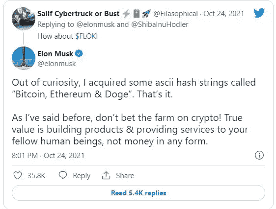

我明白了，言出必行。

> *“我在特斯拉的生产线上或在 SpaceX 自己的 Doge 建造火箭时交谈过的很多人，”* [*马斯克说*](https://www.cnbc.com/2021/10/25/elon-musk-on-his-crypto-portfolio-and-why-he-supports-dogecoin.html?ref=hackernoon.com) *。“他们不是金融专家或硅谷技术专家。这就是我决定支持 Doge 的原因——它就像是人民的密码。”*

我明白了。特斯拉和 SpaceX 的员工。他们中的一些人是火箭科学家，但不是“金融专家或硅谷技术专家”，他们愿意并自由地“支持 Doge”。这就是你如何制作“人民的密码”埃隆的人，巫毒教的人(那是神童永恒的经典，我没有不敬的意思)。

以防万一，你一直生活在一块岩石下(再次，没有不尊重，但来吧的人，不一定是巫毒教的人)[这里有一篇文章](https://economictimes.indiatimes.com/markets/cryptocurrency/elon-musk-takes-a-dig-at-twitter-web3-and-nfts-on-twitter/articleshow/90663043.cms?ref=hackernoon.com)“马斯克在 Twitter，Web3，NFTs 和言论自由上的推文和评论列表。”用“elonisms”把自己打晕。

# 有争议和不一致是(不)一样的

首先这个…

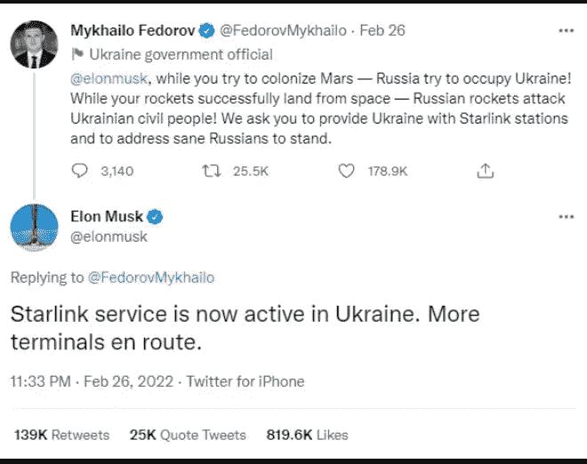

然后这个…

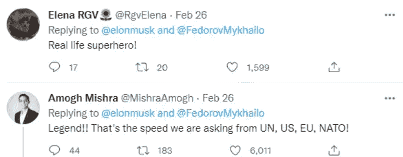

但是，然后这个…

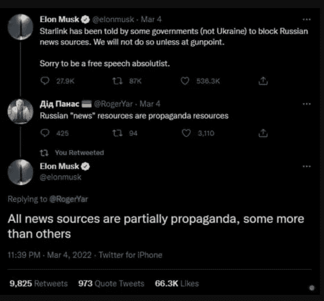

那么，你对此有什么看法？啊，我知道。

埃隆是“言论自由的绝对主义者”他不愿意在这件事上妥协。他是一个有原则的人。好的。尊重。

但是，有一个词——绝对主义者。这让你不舒服吗？绝对主义者。它敲响(警钟)了吗？

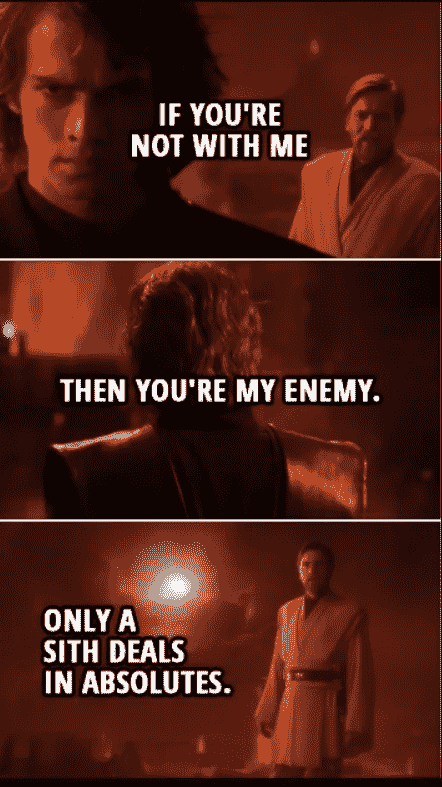

不，伊隆是一个穿着闪亮的新特斯拉模型或 SpaceX 盔甲的绝地武士。

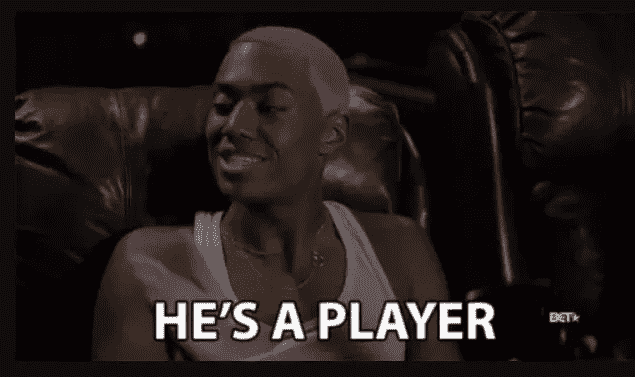

根据特斯拉发给当地官员并被路透社看到的一封信，上海当局帮助特斯拉运送了 6000 多名工人，并进行必要的消毒工作，以便在上海封锁期间重新开放工厂。

那是一封特别的感谢信，它“概述了这座城市为帮助特斯拉所做的努力。”

> 他们连续奋战了三天，夜以继日地工作，以保证我们公司的工人能够返回工厂。

这一定是一场史诗般的三天战斗，同时“根据 CNN 上周的最新计算，至少有 27 个中国城市处于某种程度的封锁状态，影响了大约 1.8 亿居民，[”](https://edition.cnn.com/2022/05/04/business/byd-china-ev-boom-covid-lockdowns-intl-hnk/index.html?ref=hackernoon.com)

根据记者无国界(RSF) 及其年度世界新闻自由指数，一个言论自由的绝对主义者与 2019 年、2020 年和 2021 年在 180 个国家中排名第 177 位的国家的官员并肩战斗。

> *你们要防备假先知，他们到你们这里来，外面披着羊皮，里面却是贪婪的狼。你可以通过他们的果实来认识他们。*

推特的果实？！我有点糊涂了。

# 记住，记住，11 月 8 日

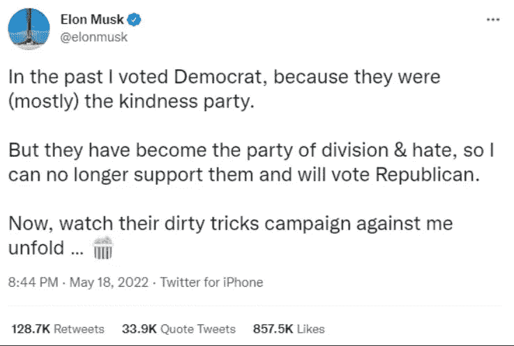

埃隆知道一些我们不知道的事吗？例如，谁将在今年的中期选举中“突袭”国会大厦，但用选票而不是旗帜和令人难忘的服装。

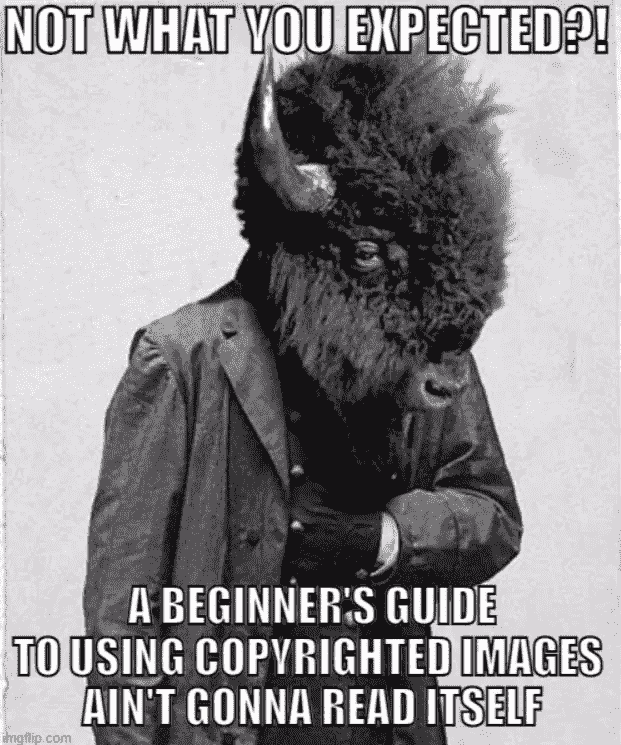

兹比格涅夫·布热津斯基的《大棋盘》出版 25 年后是否已经过时？我不知道。我没看过。你能用 440 万美元在火星上建一个殖民地吗？我不知道。我不是火箭科学家。

埃隆·马斯克到底是王者还是只是自己棋局中的一枚棋子？他是一个绝对主义者还是一个魔术师或者两者都是？我不知道。我所知道的是，这些是要问的问题，而不是关于他的游泳技术或与贾斯汀比伯合作的问题。

我也知道[我的一个故事](https://hackernoon.com/social-media-taboo-twitter-followers-vs-following-ratio?ref=hackernoon.com)没有很好地老化。上帝不再在推特上关注贾斯汀比伯。这是一个令人震惊的发现。

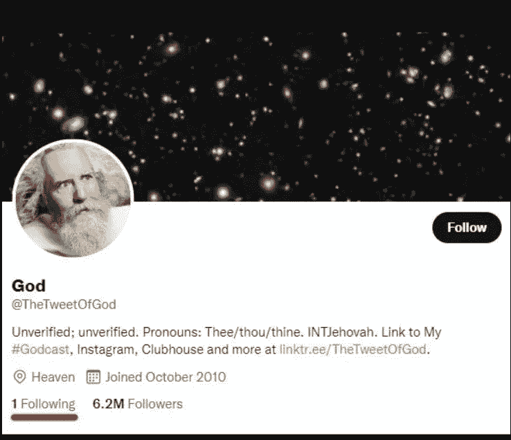

埃隆·马斯克能悬浮上帝吗，在推特上？我是说。

我“借用”了一个神秘的“elonisms”，以防万一，你知道。

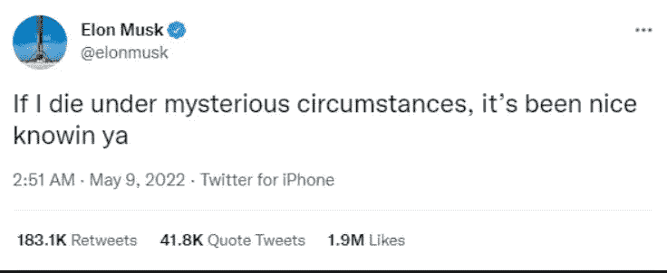

> 中国有句古话，叫做“愿他生活在有趣的时代”不管喜欢与否，我们生活在有趣的时代。(来源:quoteinvestigator)

我们不是生活在有趣，而是绝望的时代。他们说非常时期需要非常手段。绝望的时代需要英雄吗？那是英雄埃隆·马斯克吗？“埃隆派”把他塑造成英雄了吗？一个“绝对主义者”同时也是一家企业，而且可能是一个政治机会主义者，怎么可能成为英雄？

埃隆·马斯克(字面上)将世界踩在脚下，我们关心的只是——他的下一条推特。

*原载于 2022 年 6 月 2 日 https://hackernoon.com**的* [*。*](https://hackernoon.com/elon-musk-from-the-kings-gambit-to-the-pawns-endgame)

> 加入 coin monks[Telegram group](https://t.me/joinchat/Trz8jaxd6xEsBI4p)学习加密交易和投资