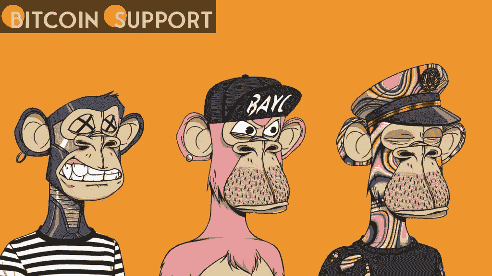

# 据说，埃隆·马斯克以大约 600 ETH 的价格购买了无聊的猿 NFT

> 原文：<https://medium.com/coinmonks/elon-musk-is-said-to-have-purchased-bored-ape-nft-for-about-600-eth-3601f91c5fe6?source=collection_archive---------7----------------------->

**Visit our website:-** [**https://bitcoinsupports.com/**](https://bitcoinsupports.com/)

特斯拉和 SpaceX 首席执行官埃隆·马斯克(Elon Musk)可能会成为 NFT 这块顶级资产的买家。据 NFT 收藏家 Derek.eth 在推特上称，这件编号为 1837 的顶级无聊猿 NFT 藏品已经被一位身份不明的竞标者以近 600 ETH 的价格购得。

迪帕克(德里克)之前以 690.420 ETH 的价格出售这件作品，这是马斯克在他的推文中经常使用的著名的“模因数”。然而，他最终将雕塑的价格降至 569 美元，以便更快出售。https://twitter.com/WuBlockchain/status/1497091539826208768 区块链内部人士科林·吴(Colin Wu)也在他的推特账户上发表了这一理论。马斯克与推特上 NFT 个人资料照片的关系以及整个 NFT 产业是唯一与这一观点相矛盾的项目。特斯拉和 SpaceX 首席执行官埃隆·马斯克(Elon Musk)已经指责 Twitter 的管理团队在每条关于 NFT 和加密货币的推文下潜伏着大量的机器人和骗子。与马斯克一起，Dogecoin 的开发者和联合创始人抨击 Twitter 没有采取行动保护社交媒体网络免受骗子和机器人的攻击。

**NFT 对加密市场的大屠杀视而不见。**

尽管加密市场急剧下滑，NFT 的业务似乎并没有受到大规模资金外流的影响。几个顶级收藏的底价与几个月前相比没有变化。OpenSea 平台上的 NFT 抢劫案是该行业最近的一次颠覆性事件，在该案中，一名黑客窃取了价值近 300 万美元的 NFT，包括 Bored Ape 游艇俱乐部的部分物品，并在 OpenSea 的竞争对手平台 LooksRare 上出售。

**访问我们的网站:-**[**https://bitcoinsupports.com/**](https://bitcoinsupports.com/)

**免责声明:以上为作者观点，不应视为投资建议。读者应该自己做研究。**

> 加入 Coinmonks [电报频道](https://t.me/coincodecap)和 [Youtube 频道](https://www.youtube.com/c/coinmonks/videos)了解加密交易和投资

# 另外，阅读

*   [CBET 回顾](https://coincodecap.com/cbet-casino-review) | [库科恩 vs 比特币基地](https://coincodecap.com/kucoin-vs-coinbase)
*   [折叠 App 审核](https://coincodecap.com/fold-app-review) | [Kucoin 交易机器人](/coinmonks/kucoin-trading-bot-automate-your-trades-8cf0ca2138e0) | [Probit 审核](https://coincodecap.com/probit-review)
*   [如何匿名购买比特币](https://coincodecap.com/buy-bitcoin-anonymously) | [比特币现金钱包](https://coincodecap.com/bitcoin-cash-wallets)
*   [币安 vs FTX](https://coincodecap.com/binance-vs-ftx) | [最佳(SOL)索拉纳钱包](https://coincodecap.com/solana-wallets)
*   [比诺莫评论](https://coincodecap.com/binomo-review) | [斯多葛派 vs 3Commas vs TradeSanta](https://coincodecap.com/stoic-vs-3commas-vs-tradesanta)
*   [Capital.com 评论](https://coincodecap.com/capital-com-review) | [香港的加密借贷平台](https://coincodecap.com/crypto-lending-hong-kong)
*   [如何在 Uniswap 上交换加密？](https://coincodecap.com/swap-crypto-on-uniswap) | [A-Ads 评论](https://coincodecap.com/a-ads-review)
*   [WazirX vs coin dcx vs bit bns](/coinmonks/wazirx-vs-coindcx-vs-bitbns-149f4f19a2f1)|[block fi vs coin loan vs Nexo](/coinmonks/blockfi-vs-coinloan-vs-nexo-cb624635230d)