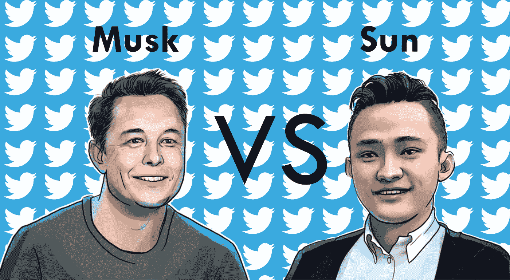

# 埃隆·马斯克或贾斯汀·孙。哪个会真的买 Twitter？

> 原文：<https://medium.com/coinmonks/elon-musk-or-justin-sun-which-one-will-actually-buy-twitter-af51d276b2ce?source=collection_archive---------8----------------------->

这重要吗？🤔

```
Thank you for your interest in this article, if you like the content feel free to [**Subscribe**](https://untilwefall.medium.com/membership), clap and share it.
```



最近几天，他在社交网络 Twitter 上疯了，特斯拉首席执行官埃隆·马斯克(Elon Musk)提出以每股 54.20 美元(₹4137 254 雷亚尔，€50 美元)的价格收购“蓝鸟”公司 100%的股份。