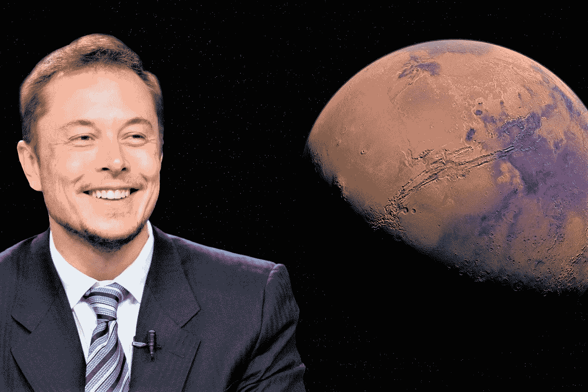

# 埃隆·马斯克在推特上透露中本聪的身份

> 原文：<https://medium.com/coinmonks/elon-musk-reveals-satoshi-nakamoto-identity-on-twitter-b2b3f367b02a?source=collection_archive---------31----------------------->

## #比特币上涨了 8%

[Pixabay](https://pixabay.com/photos/elon-musk-mars-space-exploration-6083103/)

随着埃隆·马斯克的一条推文，[比特币的价值上涨了 8%](https://medium.datadriveninvestor.com/bitcoin-could-become-worthless-9b6fad8d0ff9) 。截至本文写作时，比特币价值[**$ 42314.04**](https://www.coindesk.com/price/bitcoin/)**。**

## 埃隆·马斯克发了什么推特？