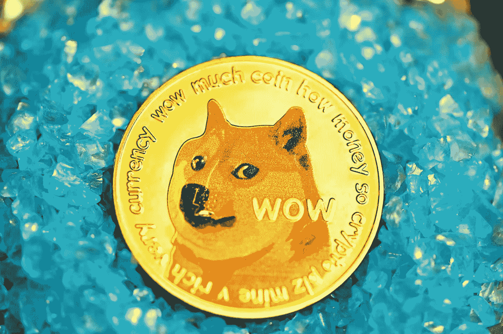

# 埃隆·马斯克建议用 Dogecoin 来代表 Twitter Blue

> 原文：<https://medium.com/coinmonks/elon-musk-suggest-using-dogecoin-for-twitter-blue-95ce0586fd2a?source=collection_archive---------64----------------------->

特斯拉和 SpaceX 首席执行官埃隆·马斯克(Elon Musk)提议将 DOGE coin(DOGE)加密货币 meme 作为支付 Twitter 蓝色订阅服务的一种方式，这是社交媒体平台改革建议的一部分。

Elon Musk 最近被宣布为该平台的董事会成员，在后来拒绝该席位之前，他提出了一些对…