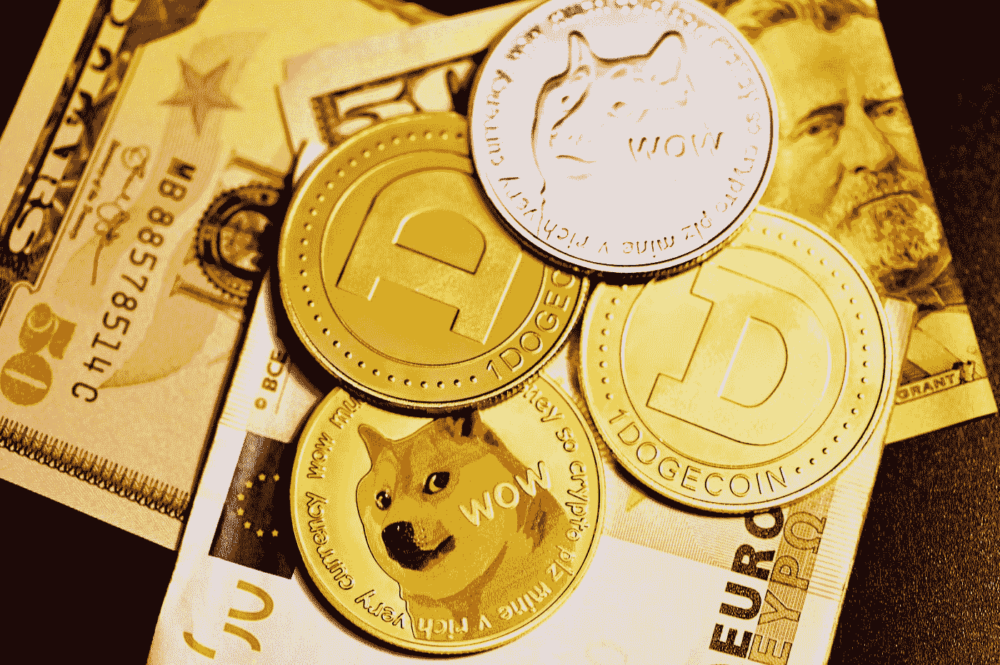

# 埃隆·马斯克希望降低 Twitter 的订阅价格，并允许 Dogecoin 支付

> 原文：<https://medium.com/coinmonks/elon-musk-wants-to-cut-twitters-subscription-price-and-allow-dogecoin-payment-1872592230c?source=collection_archive---------27----------------------->

4 月 4 日，特斯拉和 SpaceX 的创始人、美国亿万富翁埃隆·马斯克收购了美国微博公司 Twitter 9.2%的股份。

埃隆·马斯克提出了一些改变 Twitter 的想法，他最近购买了 Twitter 的大量股份。这位亿万富翁提议允许用户编辑出版物，用 dogecoin 加密货币支付，Twitter Blue 订阅应该更便宜。

他认为 Twitter 蓝色订阅费应该与可用性成比例——目前为 3.00 美元。他还暗示，未来可能会用 Dogecoin 加密货币支付。

Photo by [Kanchanara](https://unsplash.com/@kanchanara?utm_source=medium&utm_medium=referral) on [Unsplash](https://unsplash.com?utm_source=medium&utm_medium=referral)

> 马斯克在推特上写道:“价格可能应该[低于]2 美元/月，但提前 12 个月支付&账户在 60 天内没有选中标记(注意信用卡拒付)，如果用于诈骗/垃圾邮件，将被暂停，没有退款。”。

Twitter Blue 是 Twitter 的付费订阅，于 2021 年推出。在它的帮助下，用户可以在没有广告的情况下快速阅读社交网络和平台上许多媒体的文章。

还有，马斯克建议验证所有 Twitter Blue 用户的账户。

4 月 5 日，首席执行官帕拉格·阿格拉瓦尔表示，Twitter 已经任命埃隆·马斯克进入公司董事会。

在此之前，美国证券交易委员会表示，特斯拉和 SpaceX 的创始人已经收购了微博公司 Twitter 的 **9.2%** 的股份。

这篇文章发表后，Twitter 的股价在周一的盘前交易时段上涨了 **28%** 。

> 加入 Coinmonks [电报频道](https://t.me/coincodecap)和 [Youtube 频道](https://www.youtube.com/c/coinmonks/videos)了解加密交易和投资

# 另外，阅读

*   [如何在 FTX 交易所交易期货](https://coincodecap.com/ftx-futures-trading) | [OKEx vs 币安](https://coincodecap.com/okex-vs-binance)
*   [OKEx vs KuCoin](https://coincodecap.com/okex-kucoin) | [摄氏替代品](https://coincodecap.com/celsius-alternatives) | [如何购买 VeChain](https://coincodecap.com/buy-vechain)
*   [ProfitFarmers 点评](https://coincodecap.com/profitfarmers-review) | [如何使用 Cornix 交易机器人](https://coincodecap.com/cornix-trading-bot)
*   [如何匿名购买比特币](https://coincodecap.com/buy-bitcoin-anonymously) | [比特币现金钱包](https://coincodecap.com/bitcoin-cash-wallets)
*   [瓦济里克斯 NFT 评论](https://coincodecap.com/wazirx-nft-review)|[Bitsgap vs Pionex](https://coincodecap.com/bitsgap-vs-pionex)|[Tangem 评论](https://coincodecap.com/tangem-wallet-review)