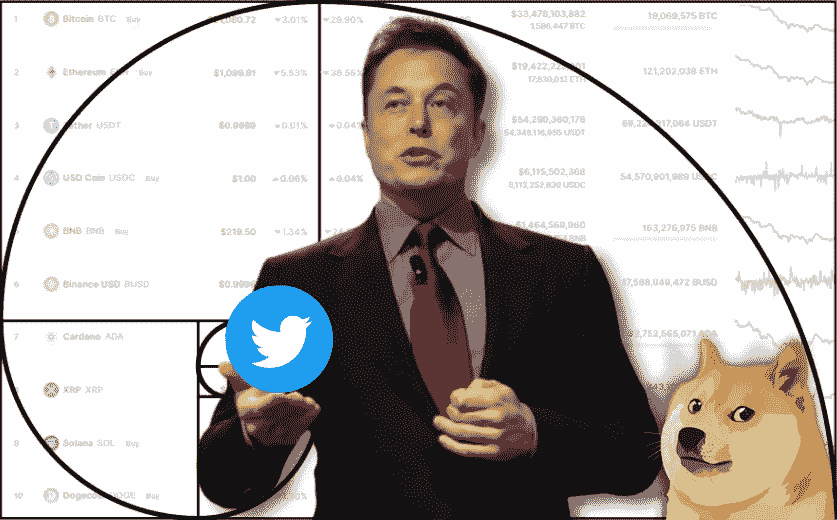

# 埃隆·马斯克:我们需要将加密支付整合到 Twitter 中

> 原文：<https://medium.com/coinmonks/elon-musk-we-need-to-integrate-crypto-payments-into-twitter-16f67780afaf?source=collection_archive---------8----------------------->

## 将数字支付整合到 Twitter 是有意义的，埃隆马斯克在社交网络员工的一般虚拟会议上说。

This preview will be included in the NFT collection called “[Uncle Fibonacci News](https://opensea.io/collection/uncle-fibonacci-news)”

> “目前，货币在很大程度上是数字化的，而且已经有一段时间了。这位亿万富翁说:“将支付整合到 Twitter 中，让来回汇款变得更容易，这将是有意义的。”

4 月底，特斯拉和 SpaceX 的创始人同意以 440 亿美元收购 Twitter。马斯克在本月中旬向公司管理层提出了收购要约。

这位企业家解释说，他的意图是希望创造一个“包容性的言论自由舞台”，而不是为了赚钱。

最初，Twitter 董事会对马斯克的提议持负面看法，但后来修改了立场。

今年 5 月，由于有报道称社交媒体观众人数膨胀，这位亿万富翁暂停了购买过程。在演讲中，他表示推特的日活跃用户数应该达到每天 100 万。在第一季度，他们的人数是 2.29 亿。

2021 年 9 月，社交网络增加了用比特币发送捐款的功能。今年 2 月，以太坊实现了这一选项。

今年 4 月，马斯克提议允许用户用 Dogecoin 支付 Twitter Blue 订阅费，doge coin 是一种迷因加密货币。

📰 ***订阅*** [***斐波那契***](/@unclefibonacci) ***我来保持最新***

> 加入 Coinmonks [电报频道](https://t.me/coincodecap)和 [Youtube 频道](https://www.youtube.com/c/coinmonks/videos)了解加密交易和投资

# 另外，阅读

*   [Bookmap 评论](https://coincodecap.com/bookmap-review-2021-best-trading-software) | [美国 5 大最佳加密交易所](https://coincodecap.com/crypto-exchange-usa)
*   最佳加密[硬件钱包](/coinmonks/hardware-wallets-dfa1211730c6) | [Bitbns 评论](/coinmonks/bitbns-review-38256a07e161)
*   [新加坡十大最佳加密交易所](https://coincodecap.com/crypto-exchange-in-singapore) | [购买 AXS](https://coincodecap.com/buy-axs-token)
*   [红狗赌场评论](https://coincodecap.com/red-dog-casino-review) | [Swyftx 评论](https://coincodecap.com/swyftx-review) | [造币厂评论](https://coincodecap.com/coingate-review)
*   [投资印度的最佳密码](https://coincodecap.com/best-crypto-to-invest-in-india-in-2021)|[WazirX P2P](https://coincodecap.com/wazirx-p2p)|[Hi Dollar Review](https://coincodecap.com/hi-dollar-review)