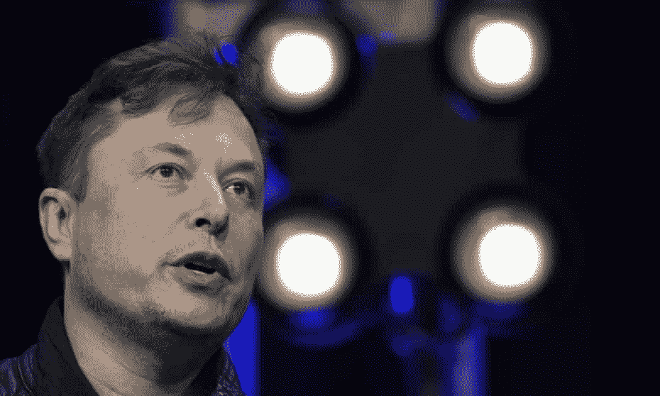
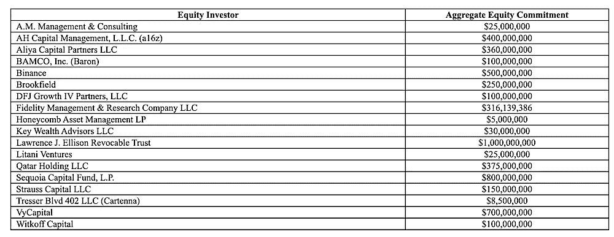
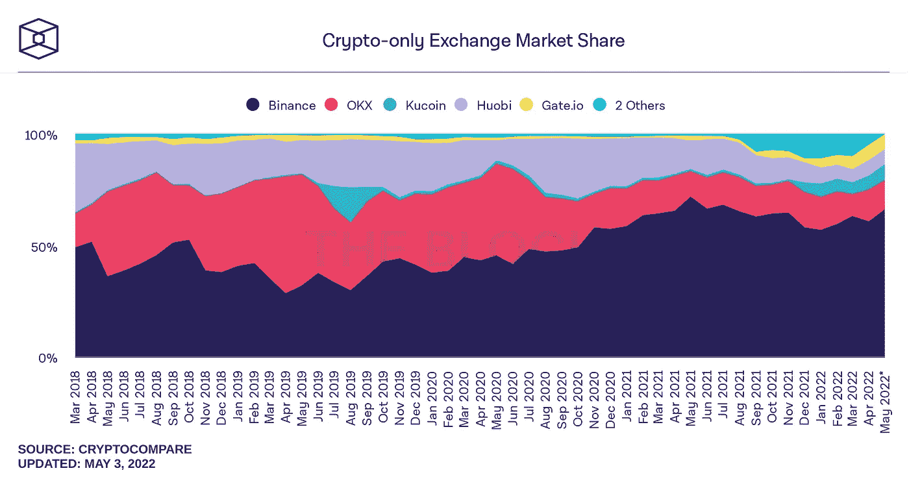
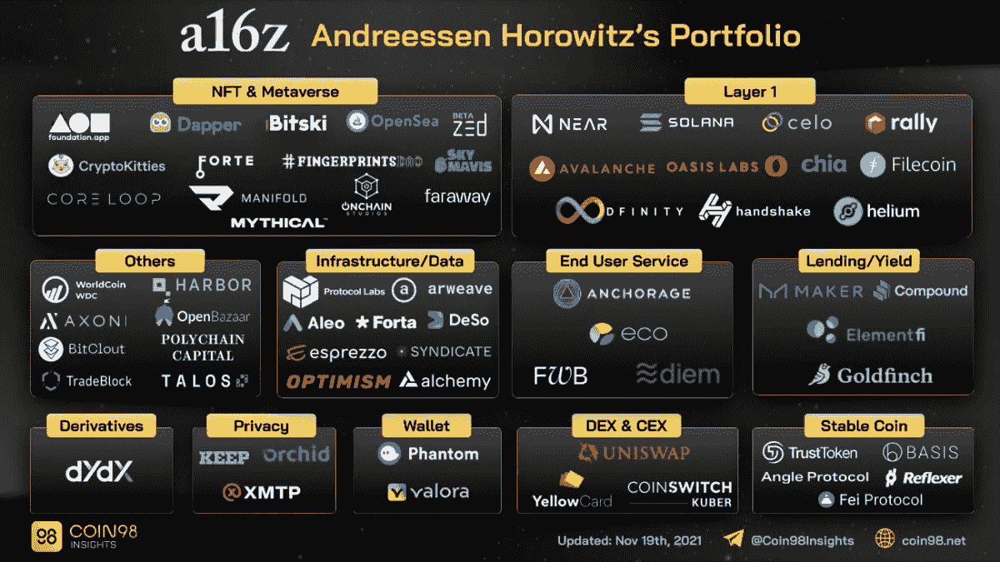
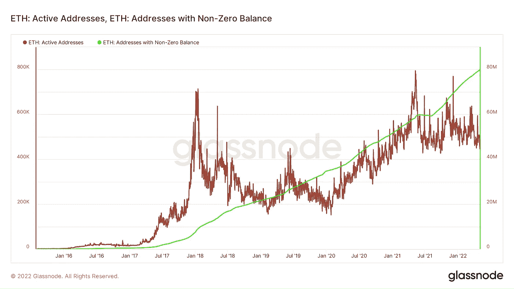

# 埃隆·马斯克对 Twitter 的收购应该会加速加密和 Web3 的采用

> 原文：<https://medium.com/coinmonks/elon-musks-twitter-acquisition-should-accelerate-crypto-and-web3-adoption-f4ad15841680?source=collection_archive---------58----------------------->

著名的前加密亿万富翁 Elon Musk 计划以 440 亿美元收购 Twitter。根据最新的 SEC 文件，币安(5 亿美元)和 a16z(4 亿美元)是支持马斯克收购 Twitter 的投资者之一。

币安是全球最大的密码交易所，占总密码交易量的 50%以上，也是其他密码项目的积极投资者。a16z 是一家专注于区块链/密码的 VC，成功投资了比特币基地、dydx、Avalanche 等多家知名密码公司和协议。

对许多人来说，区块链和加密已经变得如此普遍。但事实是 web3 的采用率仍然很低。鉴于用户需要钱包来与 web3 应用程序进行交互，唯一的地址可以被视为用户的数量。根据 Glassnode 的数据，活跃的 ETH 地址数量只有 50 万左右，非零余额账户的数量为 8000 万，这意味着实际使用 web3 应用的用户非常少。想想脸书和 YouTube 上的活跃用户数量就知道了。

目前主流采用 crypto 的主要障碍是使用区块链/web3 应用程序的复杂性和围绕自我保管的安全问题。收购 Twitter 后，马斯克可能会在社交媒体平台上添加更多的加密和 web3 功能。它可能会与币安和 a16z 投资的加密公司建立合作伙伴关系，共同构建 web3 生态系统。其中一些功能可能有助于简化普通用户开始使用 crypto 和 web3 应用程序的过程。

此举对 Twitter 投资者和马斯克来说都是互利的。Web3 互联网公司正在明显放缓(看看 NFLX、FB、HOOD 等公司最近的收益就知道了。！)，投资者正在拼命寻找能够证明更高估值合理性的新商业模式。增加更多的 web3 和加密功能应该有助于 Twitter 在几年后再次上市时获得更好的估值，这就是为什么我相信 Twitter 会在这条道路上走下去。

总之，我对 Twitter 的收购及其对整个加密/区块链/web3 行业的影响持乐观态度。让我们看看这将在未来几年如何发展。

> 加入 Coinmonks [电报频道](https://t.me/coincodecap)和 [Youtube 频道](https://www.youtube.com/c/coinmonks/videos)了解加密交易和投资

# 另外，阅读

*   [什么是保证金交易](https://coincodecap.com/margin-trading) | [美元成本平均法](https://coincodecap.com/dca)
*   [维护卡审核](https://coincodecap.com/uphold-card-review) | [信任钱包 vs MetaMask](https://coincodecap.com/trust-wallet-vs-metamask)
*   [Exness 点评](https://coincodecap.com/exness-review)|[moon xbt Vs bit get Vs Bingbon](https://coincodecap.com/bingbon-vs-bitget-vs-moonxbt)
*   [如何开始通过加密贷款赚取被动收入](https://coincodecap.com/passive-income-crypto-lending)
*   [BigONE 交易所评论](/coinmonks/bigone-exchange-review-64705d85a1d4) | [电网交易机器人](https://coincodecap.com/grid-trading)