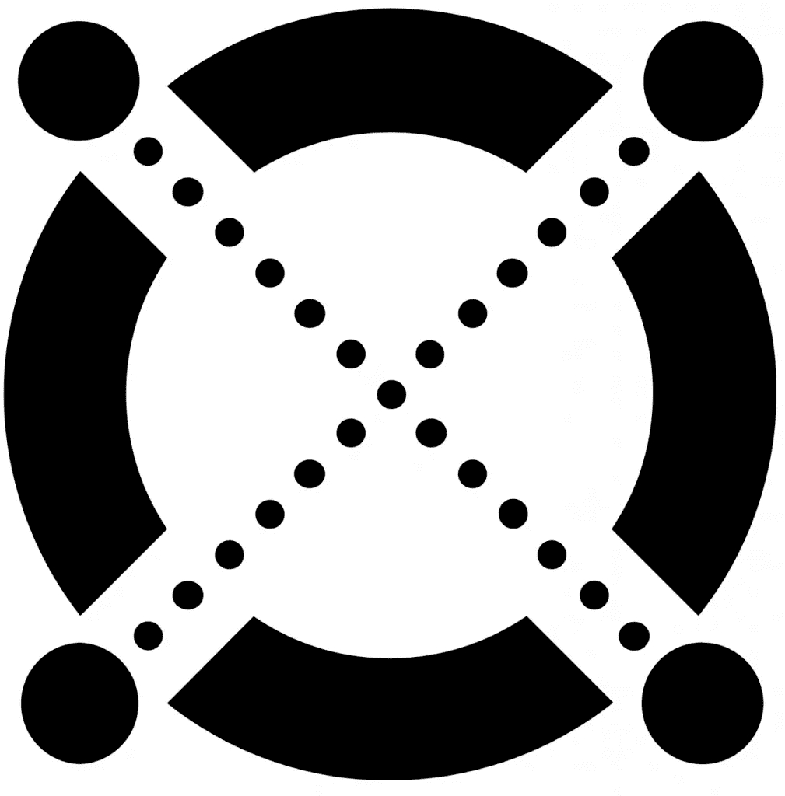

# 埃尔隆德·布洛克链。世界第二大股权证明网络？

> 原文：<https://medium.com/coinmonks/elrond-blockchain-second-largest-proof-of-stake-network-in-the-world-ad45a04252b3?source=collection_archive---------85----------------------->

Blockchain 技术以其在密码货币中的应用而闻名，在密码货币中，它被用来创建安全和分散的货币，比如比特币。

然而，区块链是一个强大的工具，它的应用范围远远超出了金融系统，在过去的几年里，区块链的采用已经发展到了一系列的用例。

组织现在正在利用区块链安全地存储各种类型的数据，从医疗数据到与食品和矿物等关键商品相关的供应链信息。

Blockchain 技术已经被许多企业组织使用，并且每年都有更多的初创公司利用区块链技术来满足 2021 年第二季度特定行业的需求。

CB Insights 报告称，区块链初创公司筹集了超过 40 亿美元的资金，这是有史以来的最大金额。

据 DigitalOcean 称，这是一种受欢迎的云服务解决方案，配备了强大的基础架构，并提供虚拟机、负载平衡器、数据库、开发工具等多种服务。

埃尔隆德·区块链是世界上仅次于 Ethereum 2.0 的第二大 Stake 证明网络，有 3，200 个验证器节点支持其地理位置分散的主网络。如果算上主节点和备用节点，以及几个公共测试网络和辅助系统，埃尔隆德基础设施涵盖了近 10，000 台服务器。

“埃尔隆德是第一个实现所有三种类型的碎片化的股份证明网络:国家、网络和交易。在高达每秒 15，000 个事务的高吞吐量环境中维护这种体系结构需要可靠的网络连接和动态资源调配能力，而数字海洋能够可靠地提供这些能力来支持我们的任务，”埃尔隆德网络 said Lucian Mincu 说。

这意味着埃尔隆德是分布式计算的主要参与者，主要的云提供商都很乐意支持。