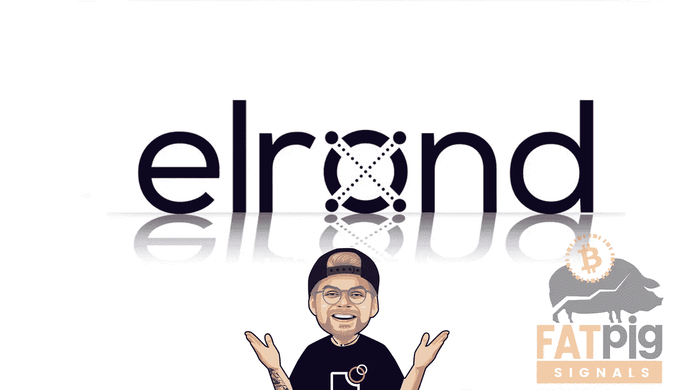

# 埃尔隆德买下了 Utrust！未来会怎样？

> 原文：<https://medium.com/coinmonks/elrond-buys-utrust-what-will-happen-in-the-future-6419c985bf48?source=collection_archive---------4----------------------->

埃尔隆德(EGLD)是一个高通量的区块链平台，在 2021 年取得了巨大成功，今年的 altcoin 项目似乎也同样雄心勃勃。至少，最新的埃尔隆德新闻给人这样的印象。

也就是说，建立在分割状态架构和利益相关者共识机制上的区块链项目宣布它已经收购了全球…