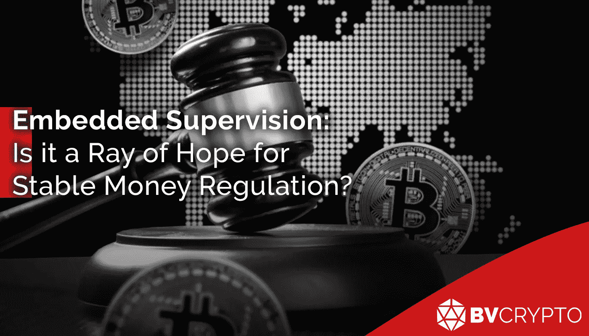
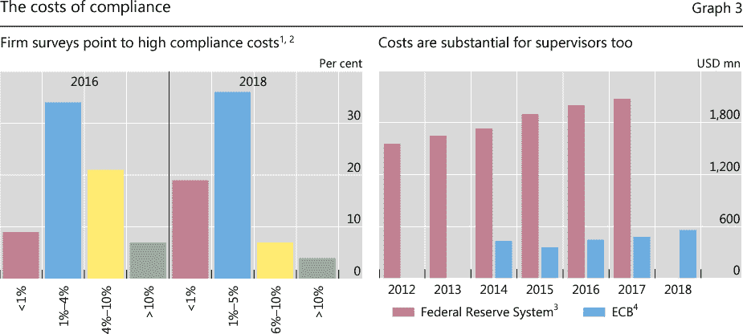
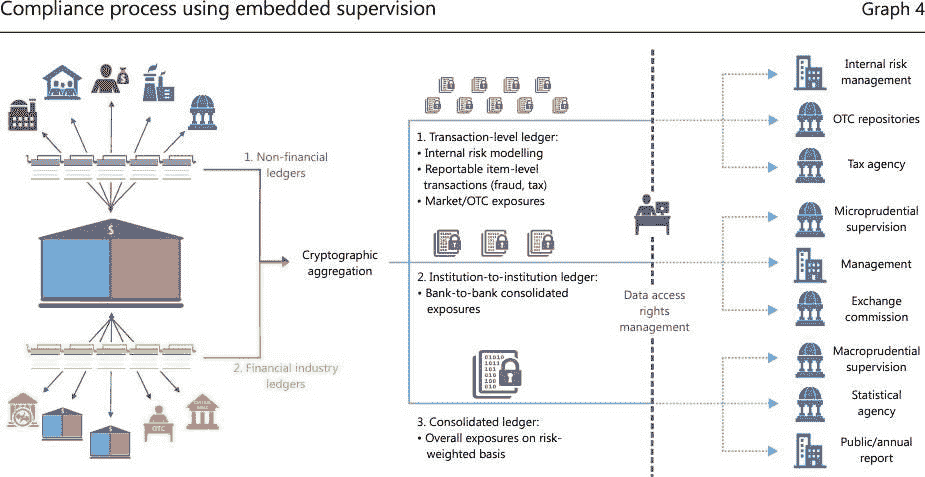
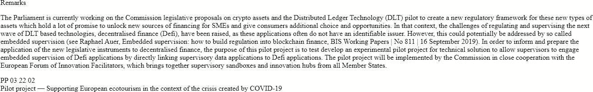
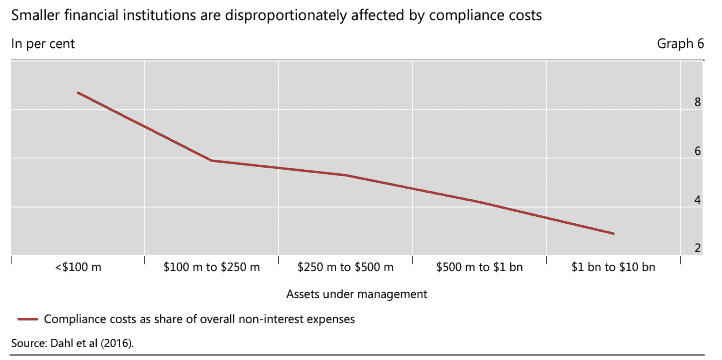

# 嵌入式监管:是稳定货币监管的一线希望吗？

> 原文：<https://medium.com/coinmonks/embedded-supervision-is-it-a-ray-of-hope-for-stable-money-regulation-196c903706de?source=collection_archive---------18----------------------->

Terra 网络的危机对大多数人都有负面影响，不管他们是否投资了它。这种大规模不满的发生自然带来了大量的抱怨。

公共机构和国际独立组织的设立是为了确保金融领域的投诉能够送达其主管部门并找到解决办法，在此期间，这些机构和组织受到了相当大的关注。由于受害的严重性，这些机构提供适当的答案至关重要，因为要求立即解决和处罚的客户投诉可能会很激烈。然而，没有得到答复的投诉和在很长一段时间内得到答复的投诉之间几乎没有区别。因为如果当时补救了当前的问题，吃过苦头的用户会高度欣慰。因此，相关组织以这种方式获得信心的事实增加了政治家获得选票的机会。

由 Terra 网络制造的这场危机已经制造了许多受害者，就像上面描述的那样，这是一场重大危机。在加密货币成为热门话题的几乎每个国家，监管机构和政治家都开始相继发表关于稳定货币和/或 DeFi 部门监管的声明。因为经济规模和发展指数位居前列的美国和欧盟的发展以及这些国家政治家的言论如此重要，质疑这些论断是否基于认真的研究是至关重要的。因此，在本文中，我们将分析监管领域的国际研究，尤其是欧盟的研究。给一点提示，鉴于发达国家，除了美国，很难说欧盟和国际组织已经达到了一个值得注意的点稳定的货币和领域的定义。特别是关于 DeFi 条例的解释，可以说是为了安慰受害者。

# 责任已被委托给金融稳定委员会

要求国际社会接受特别是关于加密货币监管的法规是各国当局的共同要求。否则，人们认为基于国家的决定不会影响一般部门，这将使违反和遵守规定变得困难。德国中央银行主管之一 Joachim Wuermeling 表示，就 DeFi 而言,“数字无国界”,他非常强调不能使用传统方法。

G7 经济部长和央行行长去年 5 月齐聚德国，任命金融稳定委员会(FSB)监管加密货币，特别是稳定货币的监管。毫无疑问，金融稳定委员会发布的监管将得到广泛认可，因为它包括所有 G20 国家、欧盟委员会和 FSF 成员。此外，金融稳定委员会已经发布了关于稳定货币和 DeFi 行业可能危及全球稳定的担忧的报告，并在 2021 年 10 月承担了类似的监管职责。所以这个过程实际上在 G7 会议之前就开始了。

那么，金融稳定委员会目前在监管方面的重点工作是什么？拉斐尔·奥尔(Raphael Auer)也是国际清算银行(BIS)创新部门的主席，BIS 是一家总部位于巴塞尔的组织，负责制定国际银行标准，他专注于基础设施系统和由另一家总部位于巴塞尔的组织 FSB 称为嵌入式监管的相关原则。让我们来看看这项研究与国际清算银行和金融稳定委员会合作的细节和可能的正面和负面回报。

# 嵌入式监控

## 接近差异

在深入系统细节之前，重要的是要记住，这项研究对监管问题有一个相当有利的前景。首先，这项研究基于“技术中立”的概念，这在管理一个技术领域时尤其重要。换句话说，它依赖于这样一个原则:没有一个技术领域比另一个技术领域更容易受到法规的鼓励或阻碍。

虽然监管机构努力使加密货币适应现有的原则，但这项研究认为，应该使用像区块链和 DLT 这样因加密货币而变得流行的技术，并且可以根据使用这些技术的部门进行监管。由于这项研究属于金融稳定委员会(FSB)和国际清算银行(BIS)等组织，因此对加密货币采用这种方法是非常积极的。

## 原则

通过对 DeFi 平台使用的分布式账本系统(DLT)进行代码更新，该系统意味着嵌入网络的自动控制机制，包括自动记录网络中的每笔交易、分类以及当局随时访问该信息。换句话说，可以说系统将充当监视器。

该系统将持续监控网络和平台，确保监管机构与区块链和 DLT 系统密切合作。为了使官方组织直接与这些基础设施连接，通过这一机制获得的数据的准确性应得到法律认可。为此，为该系统确定了 3 个主要原则。

1.  基于 DLT 的 DeFi 平台中使用的加密数据验证算法本身是不够的。为了将系统集成到平台中，必须将平台定位在合法的基础上。
2.  为了将系统集成到网络中，所讨论的网络中的安全级别必须很高。据称，挖掘者或节点无法从其恶意行为中获利的构造(如比特币、以太坊)将尤其受到青睐。
3.  由于企业执行法规的费用有时会非常高，因此这项技术旨在实现流程自动化并降低费用。

让我们来看看这些原则意味着什么…

1.  第一个条款规定，只有在与合法的基础设施相结合时，加密批准机制才能被系统接受。例如，基于资产的令牌被认为符合该定义。换句话说，因为它代表实物资产，所以代表股票的合成代币或为不动产设计的另一代币都可以根据法律要求定制，并通过加密验证进行交易。很明显，尤其是在这篇文章中，FSB 的工作不能应用于整个 DeFi 部门。因为众所周知，像 BTC 和 ETH 这样的加密货币不是基于真实资产，而是专门通过加密验证来创造自己的价值，因此不适合嵌入式监管系统。可以说，这项研究更适合于 DeFi 平台，在这些平台上，被称为合成代币的加密货币被交易，这些代币代表一种资产的价格。
2.  假设提供了合法的基础设施，另一个主要标准是挖掘者/节点不能从网络攻击中获利。比特币和以太坊等网络长期以来一直将它们成功运营的能力归功于经济激励机制。对这些网络的任何恶意尝试都会导致巨大的开支而不是收入，这是没有意义的。在本研究中，提到了支持网络的重要性，在网络中，系统将与强有力的经济激励机制相结合。
3.  由于监管决定，企业有义务建立必要的基础设施。否则，他们就有被惩罚的危险。这些基础设施的建立也意味着一个新的、持续的成本项目被丢给了企业。由于嵌入式监管将独立工作，如智能合同，其目的是每个企业将通过少量准备来适应监管，因此，其目的是降低成本。

左边的图表描述了 2016 年至 2018 年监管费用与公司总成本之比的变化。尽管监管成本在 4%或以上的企业数量在过去两年有所减少，但仍有 1-4%的稳定总量。

当研究右边的图表时，可以看到监管成本不仅限于公司，美联储和欧洲央行也有类似的问题。美联储每年在监管基础设施上的支出超过 18 亿美元，而欧洲央行的支出约为 5 亿美元。

## 运行机制

以下方案对于总结该系统的操作非常有用。

*   在图像的左侧，表示了标记化过程的集合。与 BTC 和 ETH 等加密货币不同，代币应该被视为代表真实资产的代币，如前所述。
*   左侧类别中的交易在图像的中间部分分为 3 个主要类别。
*   这里的数据通过操作类聚集在一起，经过我们用紫色虚线看到的控制器。这里的审计员就是嵌入式监管系统本身。换句话说，每一笔交易在最终确定之前都被主管明确记录下来，并被分成更详细的类别。
*   最右边的类别包括各种组织，如税务代理、统计代理和交易委员会。这些组织可以通过数字签名和时间戳来批准网络上的交易，从而完成整个过程。
*   因为公开交易中的所有信息并不安全，所以交易信息是保密的，只有相关组织才能访问交易细节。换句话说，嵌入式监管使用一种基础设施，其中交易的实质是隐藏的，但数据的准确性可以通过使用类似于零知识(ZK)协议的框架来验证，该协议广泛用于以太网。
*   例如，关于银行贷款的信息应该在客户和银行之间保密。因此，最右边显示的各种组织都不能看到事务的内容。只有银行拥有的数字密钥才能看到数据中的信息。

这个系统最大的优点是它允许官方组织直接参与一个共同的 DLT 基础设施。即使令牌是基于已经使用过的资产，它也会被官僚程序卡住。例如，当出售代表房屋的代币时，必须遵循在地契中进行正式变更的传统程序。由于缺乏法律和技术基础设施，官方债权人不接受加密数据传输。如果是这样的话，那么一旦代币被转让，该房屋的地契就会被转让给新的代币持有者。嵌入式监控是解决这一问题的唯一选择。官方组织可以直接参与网络的事实确保了网络中的数据直接来自官方组织，即数据的来源，并允许官方组织识别网络上的数据。通过符号化快速克服官僚程序，可以以这种方式开发生态系统。

## **概念的区分**

去中心化的概念几乎完全等同于加密货币市场。在嵌入式监管研究中，没有反对分散化的负面意见。然而，在这一点上，原则中的第一条款表明，金融稳定委员会所指的分散化与加密货币市场中的分散化之间存在差异。

鉴于一个必要的前提条件是系统要合法地安置到一个明确的基础设施上，嵌入式监管所指的去中心化只是指技术上的去中心化。换句话说，网络中的矿工/节点的数量可能很高，并且它们可能被分散在整个区域中，从而确保网络在不依赖于任何人的情况下运行。然而，为了不存在法律空白，这些挖掘器/节点不能是匿名的。在这种情况下，去中心化只是在技术上提供，而不是像加密货币市场那样匿名。在这种情况下，嵌入式监管系统管理在以太坊等分散区块链上工作的 DeFi 平台的可能性大大降低。因此，这份报告，政治家或当局在讨论 DeFi 立法时所指的，实际上并不是 DeFi 法规。由于流行的 DeFi 平台是基于匿名的，如何鼓励它们与嵌入式监管连接是一个大问号。

## 稳定的货币

虽然由于所需的法律框架，匿名区块链的嵌入式监管似乎会有困难，但稳定的货币似乎不会出现这种情况。如果法律需要，稳定的货币发行者，如 Tether 和 Circle，已经集中运营并努力遵守各种法规，可以集成到嵌入式监管系统中。在这种情况下，USDT 和 USDC 等稳定货币的交易及其储备金额可以被监管机构即时查看。

考虑到 UST 后公众对稳定货币的看法，有理由假设这种方法将主要用于稳定货币而不是 DeFi。就监管的适用性而言，稳定的货币似乎更适合嵌入式监管。

## 试点项目

日期为 2022 年 2 月 24 日的欧盟官方公报称，已经对嵌入式监管进行了试点研究。

与其他地区相比，欧盟可能更需要 DeFi 和稳定的货币法规。支持创新部门对欧盟来说至关重要，因为欧盟拥有发达、熟练的劳动力，但也有老龄人口。随着金融科技允许年轻和有才华的人来到欧盟，保护目前的金融科技行业，同时引入加密货币等新的创新领域非常重要。

再次回到监管成本的问题，根据上图，管理 1 亿美元或以下资产的公司的监管成本约为 8%，而 10 亿和 100 亿美元的公司的监管成本约为 2%。因此，如果对小企业来说成本高得多的监管项目可以通过嵌入式监管等系统降低成本，就可以为欧盟的经济可持续性提供重要支持。

— — — — — — —

因此，还没有一个合适的研究来使国际监管充分发挥作用，特别是在 DeFi 领域。然而，由于嵌入式监管适用于稳定的货币，这一领域的监管决策可以更快做出。这一系统的最大成就是将官方组织纳入了以 DLT 为基地的网络。如果采用这种解决方案，将在标记化领域取得实质性进展。

**编制人:贝尔凯·艾比**

*此处表达的观点和评论归 BV Crypto 所有。BV Crypto 不能对基于此帖子的任何金融交易负责。每一次投资和交易都有风险。当你做决定时，你应该做自己的研究。*

> 加入 Coinmonks [电报频道](https://t.me/coincodecap)和 [Youtube 频道](https://www.youtube.com/c/coinmonks/videos)了解加密交易和投资

# 另外，阅读

*   [分散交易所](https://coincodecap.com/what-are-decentralized-exchanges) | [比特 FIP](https://coincodecap.com/bitbns-fip) | [Pionex 评论](https://coincodecap.com/pionex-review-exchange-with-crypto-trading-bot)
*   [用信用卡购买密码的 10 个最佳地点](https://coincodecap.com/buy-crypto-with-credit-card)
*   [最佳卡达诺钱包](https://coincodecap.com/best-cardano-wallets) | [Bingbon 副本交易](https://coincodecap.com/bingbon-copy-trading)
*   [印度最佳 P2P 加密交易所](https://coincodecap.com/p2p-crypto-exchanges-in-india) | [柴犬钱包](https://coincodecap.com/baby-shiba-inu-wallets)
*   [八大加密附属计划](https://coincodecap.com/crypto-affiliate-programs) | [eToro vs 比特币基地](https://coincodecap.com/etoro-vs-coinbase)