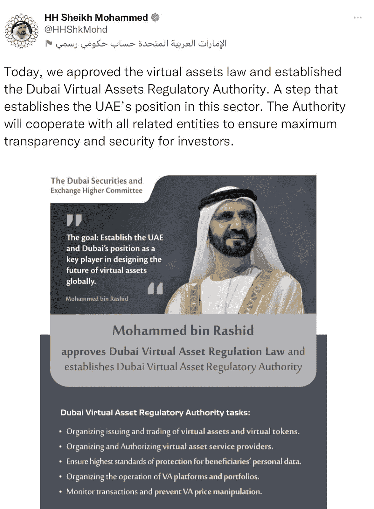

# 阿联酋航空公司接受比特币作为支付方式

> 原文：<https://medium.com/coinmonks/emirate-airlines-to-accept-bitcoin-as-a-payment-method-a81ef4073eae?source=collection_archive---------47----------------------->

## *阿拉伯联合酋长国的国家航空公司，采用数字技术作为改善客户体验的手段。*

Source: emirates.com

简短的

1.  阿联酋航空公司将很快开始接受比特币作为支付手段，以换取机票和网站上的其他活动。
2.  首席运营官·阿德尔·艾哈迈德·艾尔·雷德哈宣布，该航空公司将雇佣工人为公司生产区块链产品。
3.  阿联酋航空寻求进入区块链、元宇宙和 NFTs 生态系统。
4.  阿联酋向 NFTs 和元宇宙的发展符合阿联酋对数字经济的愿景。

## **阿联酋航空走比特币之路**

阿拉伯联合酋长国(UAE)的国有航空公司阿联酋航空(Emirates)透露，打算在短期内开始接受比特币作为支付手段。尽管该航空公司尚未宣布该服务何时可用，但这一宣布被视为朝着该国在数字经济方面的愿景迈出了重要一步。该航空公司在宣布其 NFT 和元宇宙计划几周后，决定采用比特币。

首席运营官(首席运营官)Adel Ahmed Al-Redha 上周在阿拉伯旅游市场举行的新闻发布会上表示，该公司不仅将比特币作为一种支付方式，还将在其网站上推出不可替代的令牌(NFT)交易平台，主要用于交易目的。阿联酋航空认为，这些进步是其更快速、更灵活地与客户联系的努力的一部分。

## **走向区块链生态系统**

阿联酋航空公司在采用区块链技术和数字产品方面迈出了巨大的步伐。据 Al-Redha 称，该航空公司正在考虑采用区块链跟踪飞机记录。他还提到，阿联酋航空正试图利用元宇宙对活动进行数字化转型，包括运营、培训、网站销售和其他与航空公司相关的体验。

在新闻发布会上，Al-Redha 进一步指出，NFTs 和元宇宙是航空公司用来提高消费者参与度的两种不同的应用程序和方法。他在发言中评论说

“非功能性测试和元宇宙是两种不同的应用和方法。有了元宇宙，你将能够把你的整个流程——无论是运营、培训、网站销售，还是完整的体验——转变成一个元宇宙类型的应用程序，但更重要的是，让它具有交互性。”

由于这一发展，该航空公司将全面聘用区块链人才来开发支持元宇宙和 NFTs 的产品和应用程序，并能监控客户需求。

## **迪拜的加密货币法规**

迪拜酋长国通过了第一部加密法，并成立了虚拟资产监管机构。该法规生效之际，阿联酋正努力将自己打造成比特币和区块链等创新技术的全球领导者。迪拜虚拟资产监管局已在阿拉伯联合酋长国(UAE)成立。它将与所有相关组织合作，为加密投资者提高安全性和透明度。

迪拜虚拟资产监管局(VARA)将负责监督虚拟资产和代币的销售，并监管和授权虚拟资产服务提供商。

副总统兼迪拜统治者谢赫·穆罕默德·本·拉希德·阿勒马克图姆于 2022 年 2 月 28 日通过了关于迪拜酋长国虚拟资产监管的 2022 年第 4 号法律(简称“虚拟资产法”)。

这位领导人于 2022 年 3 月 9 日在推特上发布了一条推文，进一步宣布了国家对虚拟资产的决定

“今天，我们批准了虚拟资产法，并成立了迪拜虚拟资产监管局。这一举措确立了阿联酋在这一领域的地位。管理局将与所有相关实体合作，确保投资者的最大透明度和安全。”

Source: Twitter

阿联酋航空公司最近在数字资产生态系统方面的发展符合阿联酋的愿景，即通过成为世界数字经济的摇篮来支持比特币和区块链事业。

阿联酋航空公司董事长兼首席执行官 Sheikh Ahmed bin Saeed Al Maktoum 表示，该公司正在采用新技术来改善业务运营，改善客户体验，并增加员工接触新技能和体验的机会。他表示

“我们对未来数字空间的机遇感到兴奋，并承诺在财务和资源方面进行重大投资，利用先进技术开发产品和服务，从而带来收入、品牌体验和业务效率。”

阿联酋计划通过全面过渡到 web3 新兴技术来支持和遵循阿联酋的数字经济愿景。

## **结论**

这一新的采用对阿联酋航空公司和阿联酋作为一个国家来说是一个巨大的变化，因为客户在航空公司网站上用比特币支付的能力可以扩大航空公司的市场，并吸引更广泛的潜在客户群。

> 加入 Coinmonks [电报频道](https://t.me/coincodecap)和 [Youtube 频道](https://www.youtube.com/c/coinmonks/videos)了解加密交易和投资

# 另外，阅读

*   [如何匿名购买比特币](https://coincodecap.com/buy-bitcoin-anonymously) | [比特币现金钱包](https://coincodecap.com/bitcoin-cash-wallets)
*   [币安 vs FTX](https://coincodecap.com/binance-vs-ftx) | [最佳(SOL)索拉纳钱包](https://coincodecap.com/solana-wallets)
*   [比诺莫评论](https://coincodecap.com/binomo-review) | [斯多葛派 vs 3Commas vs TradeSanta](https://coincodecap.com/stoic-vs-3commas-vs-tradesanta)
*   [Capital.com 评论](https://coincodecap.com/capital-com-review) | [香港的加密借贷平台](https://coincodecap.com/crypto-lending-hong-kong)
*   [如何在 Uniswap 上交换加密？](https://coincodecap.com/swap-crypto-on-uniswap) | [A-Ads 审查](https://coincodecap.com/a-ads-review)
*   [WazirX vs coin dcx vs bit bns](/coinmonks/wazirx-vs-coindcx-vs-bitbns-149f4f19a2f1)|[block fi vs coin loan vs Nexo](/coinmonks/blockfi-vs-coinloan-vs-nexo-cb624635230d)