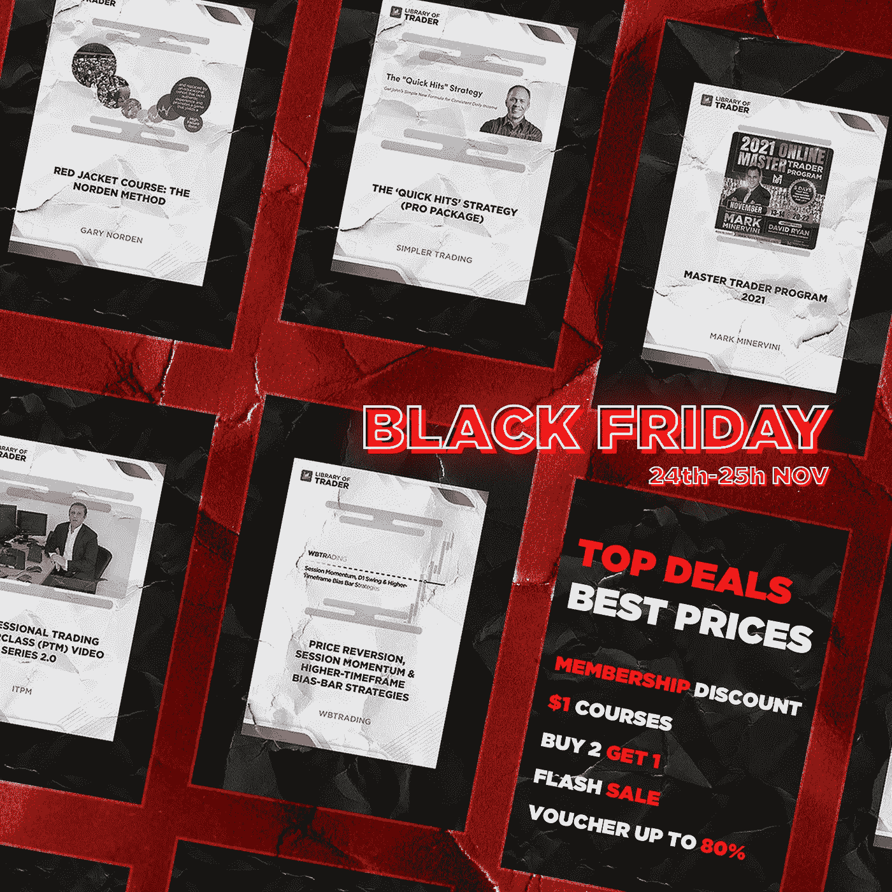

# 情绪交易与情绪获胜:它们是一样的吗？

> 原文：<https://medium.com/coinmonks/emotional-trading-vs-emotional-winning-are-they-the-same-f3b9f770d10b?source=collection_archive---------51----------------------->

Trading Psychology and Trading Strategies: Which is more essential for beginners?

**新手交易心理**是否必不可少？我们同意，关于我们思想的知识不会产生可见的价值，但它会深刻地影响交易利润。为什么

这篇文章涵盖了你的头脑的存在和你的交易收入之间的相互关系。还有，你可以学会在交易过程中尽量减少情绪的干扰！

# 情绪交易会导致盈利交易吗？

不幸的是，情绪交易导致的情绪损失多于收益。为什么？

当你赢得高额利润时，快乐就会到来。而你会在一段时间的亏损压力下患上抑郁症。这些例子表明我们对事物的感觉是多么自然！

然而，如果**的感觉主导了你的交易决策**，那么影响将超出情绪的范围。具体来说，如果金融市场被搅乱了，你立刻惊慌失措地买卖证券，希望损失最小化，那么你的一切努力都将化为乌有！

交易市场不是静止的摄影，指的是不断的变化。如果你 [**日内交易**](/@libraryoftrader/it-is-not-necessary-to-be-stressed-out-while-day-trading-ed31ce821727) ，价格的起伏波动就是赚取高额利润的机会！

 [## 日间交易时没有必要紧张！

### 日内交易是指在一个交易日内买卖资产的行为。所以，这一定是压力很大的一天…

medium.com](/@libraryoftrader/it-is-not-necessary-to-be-stressed-out-while-day-trading-ed31ce821727) 

同时，[**投资**](/@libraryoftrader/day-trading-vs-investing-which-is-better-ef7556195df2) 需要长远的眼光和对证券内在价值的分析。如果你决定买入、卖出或持仓是因为价格的及时涨跌所引起的情绪，那么亏损或错过获胜的机会是最常见的情况。

 [## 日内交易和投资:哪个更好？

### 日内交易和投资是一个让很多人犹豫是否开始他们的职业生涯的话题

medium.com](/@libraryoftrader/day-trading-vs-investing-which-is-better-ef7556195df2) 

那么，我们是否应该在没有高成本的情况下期待高回报呢？高回报伴随着高风险，这肯定是无稽之谈。为冷汗时刻做好准备！然而，区分赢家和其他人的东西是他们在混乱中让自己冷静下来的能力！

[**沃伦巴菲特**](/@libraryoftrader/warren-buffett-does-he-just-stay-still-or-have-skills-d6f94ec55375) 有一句名言，*“在别人贪婪的时候恐惧，在别人恐惧的时候贪婪。”*信不信由你，正是这句格言为他的账户带来了高额利润！

 [## 沃伦·巴菲特:他只是静止不动还是有技巧？

### 没有人不知道沃伦·巴菲特！

medium.com](/@libraryoftrader/warren-buffett-does-he-just-stay-still-or-have-skills-d6f94ec55375) 

然而，盲目追随这句话可能会让你破产。突出的教训是，只要你有深刻的分析来支持你，并意识到你的风险承受能力，那么逆潮流而动是可以的！

贪婪和恐惧是交易者常见的交易情绪。当事情按计划进行甚至更好的时候，你获得了高利润，还想要更多。相反的情况是，市场的放缓可能会阻止你采取大胆的行动，因为害怕损失！

价格波动不会造成金融市场的混乱。交易者和投资者的反应确实如此！

*“我们不是因为生活中的事件而痛苦，而是因为我们对这些事件的判断。”，爱比克泰德曾经说过。*

[**现在的股灾**](/@libraryoftrader/why-does-crashing-stock-markets-happen-6f25eb648f9a) 就是证明这样一个事实的最新例子。恐慌交易是股价下跌的结果，但如果我们说这是由于沮丧的情况下失去理智的结果，这是正确的！

 [## 为什么股市会崩盘？

### 崩溃的股票市场是一个吸引热烈讨论的话题，因为它深刻地影响了许多…

medium.com](/@libraryoftrader/why-does-crashing-stock-markets-happen-6f25eb648f9a) 

对每个人来说，股市现在似乎都很悲观，但你确定吗？有输家，那就一定有赢家！一些投资者在混乱的市场中不仅遭受了一些损失，还获得了高额利润！想要证据？看看这篇关于沃伦·巴菲特和他在伯克希尔·哈撒韦公司的团队如何在股市低迷时期胜出的文章！

关键是尽量减少情绪对交易决策表的影响。它不同于像机器人一样交易，好像你知道正确的方法，情绪可以成为你成功的杠杆！向下滚动到下一节，寻找关于**新手交易心理的一些建议！**

# 交易时如何控制情绪？

# 和你的情感做一个亲密的朋友！

了解你对某些情况的感受和反应有助于你更好地控制情绪。由于帐户不断增加，一些人往往会失去抑制自己下大注的能力。与此同时，一些交易者和投资者似乎在事情出错时陷入了沮丧之中！

以上情景不仅是新手的常识，也是有经验的人的常识。 [**你可能有不同的触发因素和反应**](/@libraryoftrader/the-stock-market-there-is-an-emotional-trap-you-shouldnt-go-in-c5dac3838dfa?source=list-73ca52144b7b--------8-------ed8c1be7d217---------------------) ，但我们都在一定程度上受到情绪的影响！

 [## 交易心理学:你可能不知道…

### 交易心理学顾名思义，心理学或思维在交易中的工作方式。你可能会发现…

medium.com](/@libraryoftrader/trading-psychology-you-might-not-know-a5288f05c1cd) 

如上所述，恐惧和贪婪是交易者最主要的情绪。

当有关于金融市场或相关事件的坏消息时，人们往往会反应过度，并发现这是一种清算他们持有的股票的冲动！所以，如果你在现实生活中知道自己会如何反应，你就可以事先想好合适的策略和战术。关键是在坏消息之前思考框架，而不是等待它发生！

贪婪的投资者需要知道华尔街的名言，“猪被宰”！它表明，当你进行看似有利可图的交易，而没有注意到隐藏的反转信号时。简单地说，如果你在盈利的位置上停留太久，期望赚得更多，上涨趋势的反转会让你得到一切！

因此，**写日记**不是作家或多愁善感者的爱好，而是给交易者和投资者的一个好建议。

你的情绪波动你自己最能解释，所以你是唯一能控制自己情绪的人。记录下你的交易日和你的想法，这样就有机会进行有效的调整。

# 以数据驱动的分析为基础

一旦你通过简单的问题了解了自己的情绪，比如你害怕什么，为什么会有那样的反应等等。，是时候磨砺一下[的技能了**技术分析**T5！](/@libraryoftrader/what-is-technical-analysis-9fccbfc73e9b)

如果你问我们如何控制交易心理，我们的回答是依靠技术分析来洞察当前的市场状态和市场周期。如果你能达到技术分析的精通水平，就有可能预测接下来的市场走势！

 [## 定量和定性分析:主要区别是什么？

### 对许多人来说，交易或投资可能是一种游戏，但这不是一种完全靠运气就能赢的游戏。它需要…

medium.com](/coinmonks/quantitative-and-qualitative-analysis-what-are-the-main-differences-1e50ec1db209) 

数据驱动的分析不是依赖于你的情绪波动，而是一种从过程中消除情绪的可靠方法。不断提高你的分析技术，你会发现你花更少的时间和精力来消除交易决策中的情绪！

# 锻炼严格的纪律，同时保持灵活性

当提到纪律时，我们指的是遵循你制定的规则。应该有基于你的风险回报容忍度的交易规则指南。它帮助你决定何时进入或退出交易市场！

此外，你可以设定一个利润目标和你能承受的潜在损失。因此，你将能够阻止自己在一个赢的位置上停留太久，或者比你的风险承受能力下更大的赌注。

然而，灵活是成功的交易者和投资者最重要的技能之一。严格的纪律有助于你控制贪婪和恐惧，而灵活性可以让你避免错过成功的机会！

如果对市场趋势的分析显示了上升趋势的信号，你可以采取一些大胆的行动，但要保持在你的风险回报承受范围内。此外，你可以使用 [**期权**](/@libraryoftrader/easy-but-powerful-ways-to-limit-risk-when-trading-options-75e888ed6dc3) 来降低可能失败的成本，以防市场改变趋势！

[**股市**](/@libraryoftrader/what-are-the-lessons-we-learned-from-past-crashing-stock-markets-268ae4ad3c96) 和 [**股市**](/@libraryoftrader/64f169e881e0) 的低迷现在给交易员和投资者带来了很多噩梦。除了学会拥有最好的出路，你思想的力量似乎也成为了焦点。

 [## 如何度过难熬的密码寒冬？

### 加密市场就像过山车。它用许多巨大的胜利吸引和愉悦人们，尽管他们可能会遭受…

medium.com](/@libraryoftrader/how-to-get-through-the-tough-cryptos-winter-4b047aba4196) 

**情绪交易**不会导致**情绪获胜**，因为你的清醒头脑不在决策过程中。因此，当你掌握如何控制自己的情绪时，你只能珍惜和欣赏赚取第一笔利润的感人时刻！

你同意我们的观点吗？如果你已经应用了不同的方法来控制你的情绪，请在下面的评论区分享你的想法。如果您发现我们的内容对您的交易有帮助，请关注我们的中型博客页面！

为了庆祝黑色星期五和感恩节，Trader library 现在在 T21 提供很多优惠，交易课程涉及很多方面，从交易心理到技术和策略。

Find the best trading courses at the best prices! Source: [Library of Trader](https://libraryoftrader.net/)

你可能有兴趣阅读的其他文章👇

 [## 印度股票市场:你知道什么？—第一部分

### 那些不了解印度股票市场的人可能已经错过了许多从这样的股票市场获利的机会

medium.com](/@libraryoftrader/the-indian-stock-market-what-do-you-know-part-i-966c439b917b)  [## 印度股票市场:你知道什么？第二部分

### 在之前关于印度股票市场概况的文章中，我们分享了两家印度股票交易所(BSE…

medium.com](/@libraryoftrader/the-indian-stock-market-what-do-you-know-part-ii-6c1a66cf0fa3)  [## 印度股票投资者必须知道的五大网上资源

### 如果你是印度股市的新手，你可能会发现自己对更新哪些网上资源感到困惑…

medium.com](/coinmonks/top-5-online-sources-that-indian-stock-market-investors-must-know-34560186a109)  [## 周四的股市:你应该知道什么？

### 在交易之前，你应该从可靠的来源收集信息，做好充分的准备。事情可能会出错…

medium.com](/@libraryoftrader/the-stock-market-on-thursday-what-should-you-know-before-it-opens-2d61a955be4c)  [## FTX 灾难:为什么它会深刻影响加密市场？

### FTX 的惨败严重影响了许多公司，甚至整个加密行业。因此，许多人把……

medium.com](/coinmonks/the-ftx-disaster-why-does-it-profoundly-impact-the-crypto-market-f738a1cc7735) 

**你也可以找到我们👇**

*   交易员库:【https://libraryoftrader.net 
*   https://www.facebook.com/libraryoftrader[脸书](https://www.facebook.com/libraryoftrader)
*   推特:[https://twitter.com/libraryoftrader](https://twitter.com/libraryoftrader)
*   领英:[https://www.linkedin.com/company/library-of-trader/](https://www.linkedin.com/company/library-of-trader/)
*   https://www.reddit.com/user/Library_Of_Trader
*   quora:[https://www.quora.com/profile/Library-of-Trader](https://www.quora.com/profile/Library-of-Trader)
*   https://www.tiktok.com/@libraryoftrader.net

> *交易新手？试试* [*密码交易机器人*](/coinmonks/crypto-trading-bot-c2ffce8acb2a) *或* [*复制交易*](/coinmonks/top-10-crypto-copy-trading-platforms-for-beginners-d0c37c7d698c) *上* [*最好的密码交易*](/coinmonks/crypto-exchange-dd2f9d6f3769)

> 加入 Coinmonks [电报频道](https://t.me/coincodecap)和 [Youtube 频道](https://www.youtube.com/c/coinmonks/videos)获取每日[加密新闻](http://coincodecap.com/)

# 另外，阅读

*   [免费加密信号](/coinmonks/free-crypto-signals-48b25e61a8da) | [加密交易机器人](/coinmonks/crypto-trading-bot-c2ffce8acb2a)
*   [杠杆代币](/coinmonks/leveraged-token-3f5257808b22)终极指南
*   [16 款最佳折叠电动自行车](/coinmonks/top-17-folding-electric-bikes-5e296f0918cb)
*   [28 款最佳电动自行车点评](/coinmonks/the-28-best-electric-bikes-review-and-buying-guide-in-2023-7bb3146cb403)
*   前三名[币安期货交易机器人](/coinmonks/top-3-binance-futures-trading-bots-e6031f84b3f9)